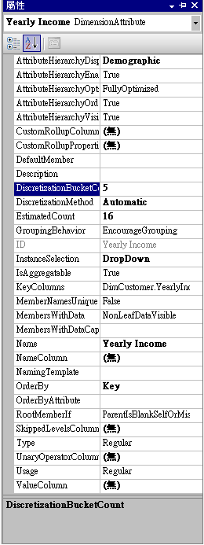
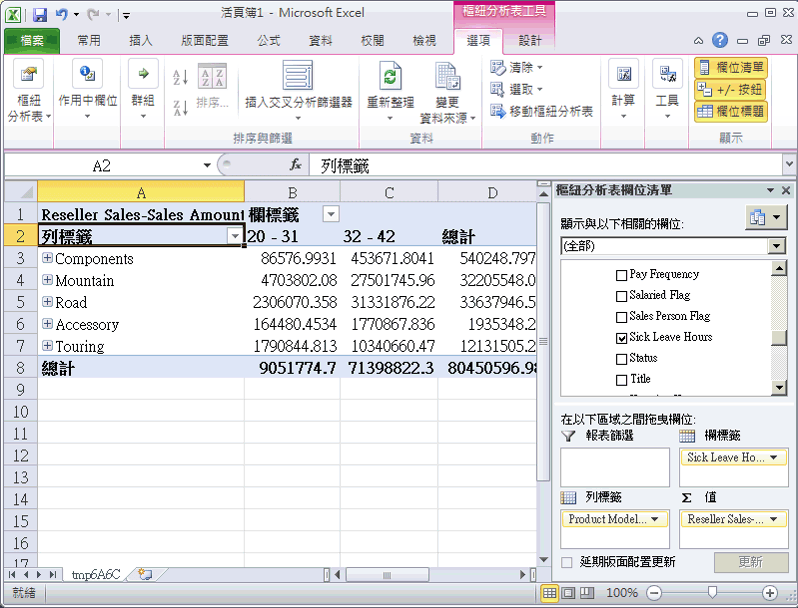

# 自動分組屬性成員
當您瀏覽 Cube 時，通常會按另一個屬性階層的成員建立一個屬性階層成員的維度。 例如，您可以按縣 (市)、按購買的產品或按性別將客戶銷售加以分組。 不過，對於特定類型的屬性，讓 [!INCLUDE[msCoName](../includes/msconame-md.md)] [!INCLUDE[ssASnoversion](../includes/ssasnoversion-md.md)] 依據屬性階層內成員的散發情形自動建立屬性成員的群組，很有幫助。 例如，您可以讓 [!INCLUDE[ssASnoversion](../includes/ssasnoversion-md.md)] 為客戶建立年收入值的群組。 如此一來，瀏覽這個屬性階層的使用者會看到群組的名稱和值而不是成員本身。 這樣可限制使用者看到的層級數，對於分析更有幫助。  
  
[DiscretizationMethod] 屬性會決定 [!INCLUDE[ssASnoversion](../includes/ssasnoversion-md.md)] 是否建立分組，並決定執行的分組類型。 依預設，[!INCLUDE[ssASnoversion](../includes/ssasnoversion-md.md)] 不會執行任何分組。 當您啟用自動分組時，可以讓 [!INCLUDE[ssASnoversion](../includes/ssasnoversion-md.md)] 依據屬性的結構自動決定最佳群組方法，或是從下列清單中選擇其中一種群組演算法來指定群組方法：  
  
**EqualAreas**  
[!INCLUDE[ssASnoversion](../includes/ssasnoversion-md.md)] 建立群組範圍，使維度成員的總母體擴展平均散發在群組間。  
  
**群集**  
[!INCLUDE[ssASnoversion](../includes/ssasnoversion-md.md)] 使用具有高斯散發的 K-Means 群集方法對輸入值執行單一維度群集，來建立群組。 這個選項只對數值資料行有效。  
  
在指定群組方法之後，您必須使用 [DiscretizationBucketCount] 屬性來指定群組數目。 如需詳細資訊，請參閱[群組屬性成員 &#40;分隔&#41;](../analysis-services/multidimensional-models/group-attribute-members-discretization.md)。  
  
在這個主題的工作中，您將針對下列各項啟用不同群組類型：[客戶] 維度中的年收入值、[員工(多數)] 維度中的員工病假時數以及 [員工(多數)] 維度中的員工休假時數。 然後您會處理及瀏覽 [!INCLUDE[ssASnoversion](../includes/ssasnoversion-md.md)] 教學課程 Cube 來檢視成員群組的效果。 最後，您會修改成員群組屬性來查看這個變更對群組類型的影響。  
  
## 將 [客戶] 維度中的屬性階層成員分組  
  
1.  在方案總管中，按兩下 [維度] 資料夾中的 [客戶]，來針對 [客戶] 維度開啟 [維度設計師]。  
  
2.  在 [資料來源檢視] 窗格中，以滑鼠右鍵按一下 [客戶] 資料表，然後按一下 [瀏覽資料]。  
  
    請注意 **YearlyIncome** 資料行的值範圍。 除非您啟用成員群組，否則這些值會變成 [年收入] 屬性階層的成員。  
  
3.  關閉 [瀏覽 Customer 資料表] 索引標籤。  
  
4.  在 [屬性] 窗格中，選取 [年收入]。  
  
5.  在 [屬性] 視窗中，將 [DiscretizationMethod] 屬性的值變更為 [自動]，再將 [DiscretizationBucketCount] 屬性的值變更為 [5]。  
  
    下圖顯示 [年收入] 的已修改屬性。  
  
      
  
## 將 [員工] 維度中的屬性階層成員分組  
  
1.  針對 [員工] 維度，切換至維度設計師。  
  
2.  在 [資料來源檢視] 窗格中，以滑鼠右鍵按一下 [員工] 資料表，然後按一下 [瀏覽資料]。  
  
    請注意 **SickLeaveHours** 資料行和 **VacationHours** 資料行的值。  
  
3.  關閉 [瀏覽 Employee 資料表] 索引標籤。  
  
4.  在 [屬性] 窗格中，選取 [病假時數]。  
  
5.  在 [屬性] 視窗中，將 [DiscretizationMethod] 屬性的值變更為 [叢集]，再將 [DiscretizationBucketCount] 屬性的值變更為 [5]。  
  
6.  在 [屬性] 窗格中，選取 [假期時數]。  
  
7.  在 [屬性] 視窗中，將 [DiscretizationMethod] 屬性的值變更為 [Equal Areas]，再將 [DiscretizationBucketCount] 屬性的值變更為 [5]。  
  
## 瀏覽已修改的屬性階層  
  
1.  在 [!INCLUDE[ssBIDevStudioFull](../includes/ssbidevstudiofull-md.md)] 的 [建立] 功能表上，按一下 [部署 Analysis Services 教學課程]。  
  
2.  順利完成部署之後，針對 [!INCLUDE[ssASnoversion](../includes/ssasnoversion-md.md)] 教學課程 Cube，切換到 [Cube 設計師]，然後按一下 [瀏覽器] 索引標籤上的 [重新連接]。  
  
3.  按一下 Excel 圖示，然後按一下 [啟用]。  
  
4.  將 [網際網路銷售 - 銷售量] 量值拖曳至樞紐分析表欄位清單的 [值] 區域中。  
  
5.  在此欄位清單中，展開 [產品] 維度，然後將 [產品型號線] 使用者階層拖曳到欄位清單的 [資料列標籤] 區域。  
  
6.  在欄位清單中，依序展開 [客戶] 維度和 [人口統計] 顯示資料夾，然後將 [年收入] 屬性階層拖曳到 [資料行標籤] 區域。  
  
    [年收入] 屬性階層的成員現在分成六個值區，包括對於年收入不詳的客戶之銷售量的值區。 但是，並非所有值區都會顯示出來。  
  
7.  從資料行區域中移除 [年收入] 屬性階層，並移除 [值] 區域中的 [網際網路銷售 - 銷售量] 量值。  
  
8.  將 [轉售商銷售 - 銷售量] 量值新增至資料區域。  
  
9. 在此欄位清單中，依序展開 [員工] 維度和 [組織]，然後將 [病假時數] 拖曳至 [資料行標籤]。  
  
    請注意，所有銷售是由兩個群組的其中之一的員工所完成的。 另請注意，病假時數在 32 - 42 之間的員工比病假時數在 20 - 31 之間的員工有更多銷售。  
  
    下圖顯示按員工病假時數建立維度的銷售。  
  
      
  
10. 從 [資料] 窗格的資料行區域中移除 [病假時數] 屬性階層。  
  
11. 將 [假期時數] 新增至 [資料] 窗格的資料行區域中。  
  
    請注意，依據同等區域群組方法，會出現兩個群組。 其他 3 個群組會隱藏起來，因為它們不包含資料值。  
  
## 修改群組屬性及檢閱變更的效果  
  
1.  針對 [員工] 維度切換到 [維度設計師]，然後選取 [屬性] 窗格中的 [假期時數]。  
  
2.  在 [屬性] 視窗中，將 [DiscretizationBucketCount] 屬性的值變更為 [10]。  
  
3.  在 [!INCLUDE[ssBIDevStudio](../includes/ssbidevstudio-md.md)] 的 [建立] 功能表上，按一下 [部署 Analysis Services 教學課程]。  
  
4.  順利完成部署之後，針對 [!INCLUDE[ssASnoversion](../includes/ssasnoversion-md.md)] 教學課程 Cube，切換到 Cube 設計師。  
  
5.  選取 [瀏覽器] 索引標籤上的 [重新連接]、按一下 Excel 圖示，然後重新建構樞紐分析表，讓您可以檢視群組方法變更之後的效果：  
  
    1.  將 [轉售商銷售 - 銷售量] 拖曳至 [值]  
  
    2.  將 [假期時數] (在 [員工組織] 資料夾中) 拖曳至 [資料行]  
  
    3.  將 [產品型號線] 拖曳至 [資料列]  
  
    請注意，現在 [假期時數] 屬性有 3 個成員群組有產品的銷售值。 (其他七個群組包含沒有銷售資料的成員)。  
  
## 本課程的下一項工作  
[隱藏及停用屬性階層](../analysis-services/hiding-and-disabling-attribute-hierarchies.md)  
  
## 另請參閱  
[群組屬性成員 &#40;分隔&#41;](../analysis-services/multidimensional-models/group-attribute-members-discretization.md)  
  
  
  
