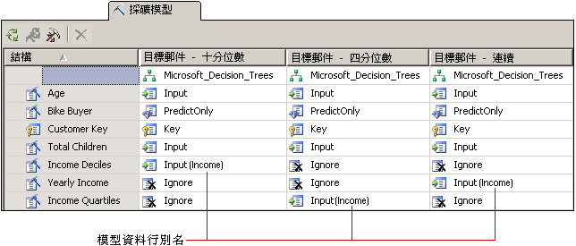

# 自訂採礦模型和結構
  當您選取符合商務需求的演算法之後，可以使用下列方式來自訂採礦模型，以便能夠得到更好的結果。  
  
-   使用模型中的不同資料行，或是變更資料行的使用方式、內容類型或分隔方法。  
  
-   在採礦模型中建立篩選，以限制用於定型此模型的資料。  
  
-   變更用來分析資料的演算法。  
  
-   設定演算法參數來控制臨界值、樹狀結構分岔之處或是其他重要條件。  
  
 本主題會描述這些選項。  
  
## 變更模型所用的資料  
 您所做的有關要將哪些資料行用於模型以及如何使用和處理該資料的決策，將會大大地影響分析的結果。 下列主題提供的資訊可幫助您了解這些選擇。  
  
### 使用特徵選取  
 [!INCLUDE[ssASnoversion](../../includes/ssasnoversion-md.md)] 中的大多數資料採礦演算法會使用稱為 *「特徵選取」* (Feature Selection) 的程序，只選取最有用的屬性來加入至模型。 減少資料行和屬性的數目可以改善效能和模型的品質。 可用的特徵選取方法會因為您選擇的演算法而有所差異。  
  
 [特徵選取 &#40;資料採礦&#41;](../../analysis-services/data-mining/feature-selection-data-mining.md)。  
  
### 變更使用方式  
 您可以變更哪些資料行會包含在採礦模型中以及使用每一個資料行的方式。 如果您未得到預期的結果，您應該將您使用的範例資料行當做輸入，並問自己這些資料行是否為好的選擇，以及您是否可以做任何事來改善資料的處理，其中包括：  
  
-   識別已被錯標為數字的類別變數。  
  
-   加入類別目錄來摺疊屬性數目，並讓您更輕鬆找到相互關聯性。  
  
-   變更數字分類收納或離散化的方式。  
  
-   移除擁有許多唯一值的資料行或者實際上是參考資料而且對分析無用處的資料行，例如地址或中間名。  
  
 您不需要實際從採礦結構中移除資料行，只需要將資料行標示為 **[忽略]**。 該資料行就會從採礦模型中移除，但是依然可由結構中的其他採礦模型所使用或是在鑽研查詢中參考。  
  
### 建立模型資料行的別名  
 當 [!INCLUDE[ssASnoversion](../../includes/ssasnoversion-md.md)] 建立採礦模型時，它會使用採礦結構中存在的相同資料行名稱。 您可以將別名加入至採礦模型中的任何資料行。 這樣做可能會讓人較容易了解資料行的內容或使用方式，或者縮短名稱以便建立查詢。 當您想要建立資料行複本，並將它命名為具描述性的名稱時，別名也會很有幫助。  
  
 您會藉由編輯採礦模型資料行的 **Name** 屬性來建立別名。 [!INCLUDE[ssASnoversion](../../includes/ssasnoversion-md.md)] 會繼續使用原始名稱當做資料行的識別碼，而您針對 **[Name]** 所輸入的新值則會成為資料行別名，而且會顯示在資料行使用方式旁的方格中 (用括號括住)。  
  
   
  
 此圖形會顯示相關的模型，這些模型具有採礦結構資料行的多個複本 (全都與收入相關)。 每個結構資料行複本都已經透過不同的方式離散化。 此圖表中的每個模型與採礦結構使用不同的資料行。不過，為了方便比較模型之間的資料行，每個模型中的資料行已經重新命名為 [**Income**]。  
  
### 加入篩選  
 您可以將篩選加入至採礦模型。 篩選是一組 WHERE 條件，而這些條件會將模型案例中的資料限制為某些子集。 篩選是在定型模型時使用的，不過當您測試模型或建立精確度圖表時，也可以選擇性地使用篩選。  
  
 藉由加入篩選，您可以重複使用採礦結構，但是建立以差異很大的資料子集為根據的模型。 或者您可以只使用篩選來移除某些資料列，並改善分析的品質。  
  
 如需詳細資訊，請參閱[採礦模型的篩選 &#40;Analysis Services - 資料採礦&#41;](../../analysis-services/data-mining/filters-for-mining-models-analysis-services-data-mining.md)。  
  
## 變更演算法  
 雖然您加入至採礦結構的新模型會共用相同的資料集，但是您可以使用不同的演算法 (如果資料支援的話) 或是變更演算法的參數來得到不同的結果。 您也可以設定模型旗標。  
  
 演算法的選擇會決定您將取得那些類型的結果。 如需特定演算法之運作方式的一般資訊，或是使用特定演算法可獲益的商務案例，請參閱 [資料採礦演算法 &#40;Analysis Services - 資料採礦&#41;](../../analysis-services/data-mining/data-mining-algorithms-analysis-services-data-mining.md)。  
  
 請參閱每一個演算法的技術參考主題，以取得需求和限制的描述，以及有關每一個演算法支援之自訂的詳細資訊。  
  
|||  
|-|-|  
|[Microsoft 決策樹演算法](../../analysis-services/data-mining/microsoft-decision-trees-algorithm.md)|[Microsoft 時間序列演算法](../../analysis-services/data-mining/microsoft-time-series-algorithm.md)|  
|[Microsoft 群集演算法](../../analysis-services/data-mining/microsoft-clustering-algorithm.md)|[Microsoft 類神經網路演算法](../../analysis-services/data-mining/microsoft-neural-network-algorithm.md)|  
|[Microsoft 貝氏機率分類演算法](../../analysis-services/data-mining/microsoft-naive-bayes-algorithm.md)|[Microsoft 羅吉斯迴歸演算法](../../analysis-services/data-mining/microsoft-logistic-regression-algorithm.md)|  
|[Microsoft 關聯分析演算法](../../analysis-services/data-mining/microsoft-association-algorithm.md)|[Microsoft 線性迴歸演算法](../../analysis-services/data-mining/microsoft-linear-regression-algorithm.md)|  
|[Microsoft 時序群集演算法](../../analysis-services/data-mining/microsoft-sequence-clustering-algorithm.md)||  
  
## 自訂演算法參數  
 每一個演算法都支援可用來自訂演算法行為及微調模型結果的參數。 如需如何使用每一個參數的描述，請參閱下列主題：  
  
 每一個演算法類型的主題也會列出可以搭配以該演算法為根據之模型一起使用的預測函數。  
  
|屬性名稱|適用對象|  
|-------------------|----------------|  
|AUTO_DETECT_PERIODICITY|[Microsoft 時間序列演算法技術參考](../../analysis-services/data-mining/microsoft-time-series-algorithm-technical-reference.md)|  
|CLUSTER_COUNT|[Microsoft 群集演算法技術參考](../../analysis-services/data-mining/microsoft-clustering-algorithm-technical-reference.md)   [Microsoft 時序群集演算法技術參考](../../analysis-services/data-mining/microsoft-sequence-clustering-algorithm-technical-reference.md)|  
|CLUSTER_SEED|[Microsoft 群集演算法技術參考](../../analysis-services/data-mining/microsoft-clustering-algorithm-technical-reference.md)|  
|CLUSTERING_METHOD|[Microsoft 群集演算法技術參考](../../analysis-services/data-mining/microsoft-clustering-algorithm-technical-reference.md)|  
|COMPLEXITY_PENALTY|[Microsoft 決策樹演算法技術參考](../../analysis-services/data-mining/microsoft-decision-trees-algorithm-technical-reference.md)   [Microsoft 時間序列演算法技術參考](../../analysis-services/data-mining/microsoft-time-series-algorithm-technical-reference.md)|  
|FORCE_REGRESSOR|[Microsoft 決策樹演算法技術參考](../../analysis-services/data-mining/microsoft-decision-trees-algorithm-technical-reference.md)   [Microsoft 線性迴歸演算法技術參考](../../analysis-services/data-mining/microsoft-linear-regression-algorithm-technical-reference.md)   [模型旗標 &#40;資料採礦&#41;](../../analysis-services/data-mining/modeling-flags-data-mining.md)|  
|FORECAST_METHOD|[Microsoft 時間序列演算法技術參考](../../analysis-services/data-mining/microsoft-time-series-algorithm-technical-reference.md)|  
|HIDDEN_NODE_RATIO|[Microsoft Neural Network Algorithm Technical Reference](../../analysis-services/data-mining/microsoft-neural-network-algorithm-technical-reference.md)|  
|HISTORIC_MODEL_COUNT|[Microsoft 時間序列演算法技術參考](../../analysis-services/data-mining/microsoft-time-series-algorithm-technical-reference.md)|  
|HISTORICAL_MODEL_GAP|[Microsoft 時間序列演算法技術參考](../../analysis-services/data-mining/microsoft-time-series-algorithm-technical-reference.md)|  
|HOLDOUT_PERCENTAGE|[Microsoft 羅吉斯迴歸演算法技術參考](../../analysis-services/data-mining/microsoft-logistic-regression-algorithm-technical-reference.md)   [Microsoft Neural Network Algorithm Technical Reference](../../analysis-services/data-mining/microsoft-neural-network-algorithm-technical-reference.md)   注意：這個參數與套用到採礦結構的鑑效組百分比值不同。|  
|HOLDOUT_SEED|[Microsoft 羅吉斯迴歸演算法技術參考](../../analysis-services/data-mining/microsoft-logistic-regression-algorithm-technical-reference.md)   [Microsoft Neural Network Algorithm Technical Reference](../../analysis-services/data-mining/microsoft-neural-network-algorithm-technical-reference.md)   注意：這個參數與套用到採礦結構的鑑效組種子值不同。|  
|INSTABILITY_SENSITIVITY|[Microsoft 時間序列演算法技術參考](../../analysis-services/data-mining/microsoft-time-series-algorithm-technical-reference.md)|  
|MAXIMUM_INPUT_ATTRIBUTES|[Microsoft 群集演算法技術參考](../../analysis-services/data-mining/microsoft-clustering-algorithm-technical-reference.md)   [Microsoft 決策樹演算法技術參考](../../analysis-services/data-mining/microsoft-decision-trees-algorithm-technical-reference.md)   [Microsoft 線性迴歸演算法技術參考](../../analysis-services/data-mining/microsoft-linear-regression-algorithm-technical-reference.md)   [Microsoft 貝氏機率分類演算法技術參考](../../analysis-services/data-mining/microsoft-naive-bayes-algorithm-technical-reference.md)   [Microsoft Neural Network Algorithm Technical Reference](../../analysis-services/data-mining/microsoft-neural-network-algorithm-technical-reference.md)   [Microsoft 羅吉斯迴歸演算法技術參考](../../analysis-services/data-mining/microsoft-logistic-regression-algorithm-technical-reference.md)|  
|MAXIMUM_ITEMSET_COUNT|[Microsoft 關聯分析演算法技術參考](../../analysis-services/data-mining/microsoft-association-algorithm-technical-reference.md)|  
|MAXIMUM_ITEMSET_SIZE|[Microsoft 關聯分析演算法技術參考](../../analysis-services/data-mining/microsoft-association-algorithm-technical-reference.md)|  
|MAXIMUM_OUTPUT_ATTRIBUTES|[Microsoft 決策樹演算法技術參考](../../analysis-services/data-mining/microsoft-decision-trees-algorithm-technical-reference.md)   [Microsoft 線性迴歸演算法技術參考](../../analysis-services/data-mining/microsoft-linear-regression-algorithm-technical-reference.md)   [Microsoft 羅吉斯迴歸演算法技術參考](../../analysis-services/data-mining/microsoft-logistic-regression-algorithm-technical-reference.md)   [Microsoft 貝氏機率分類演算法技術參考](../../analysis-services/data-mining/microsoft-naive-bayes-algorithm-technical-reference.md)   [Microsoft Neural Network Algorithm Technical Reference](../../analysis-services/data-mining/microsoft-neural-network-algorithm-technical-reference.md)|  
|MAXIMUM_SEQUENCE_STATES|[Microsoft 時序群集演算法技術參考](../../analysis-services/data-mining/microsoft-sequence-clustering-algorithm-technical-reference.md)|  
|MAXIMUM_SERIES_VALUE|[Microsoft 時間序列演算法技術參考](../../analysis-services/data-mining/microsoft-time-series-algorithm-technical-reference.md)|  
|MAXIMUM_STATES|[Microsoft 群集演算法技術參考](../../analysis-services/data-mining/microsoft-clustering-algorithm-technical-reference.md)   [Microsoft Neural Network Algorithm Technical Reference](../../analysis-services/data-mining/microsoft-neural-network-algorithm-technical-reference.md)   [Microsoft 時序群集演算法技術參考](../../analysis-services/data-mining/microsoft-sequence-clustering-algorithm-technical-reference.md)|  
|MAXIMUM_SUPPORT|[Microsoft 關聯分析演算法技術參考](../../analysis-services/data-mining/microsoft-association-algorithm-technical-reference.md)|  
|MINIMUM_IMPORTANCE|[Microsoft 關聯分析演算法技術參考](../../analysis-services/data-mining/microsoft-association-algorithm-technical-reference.md)|  
|MINIMUM_ITEMSET_SIZE|[Microsoft 關聯分析演算法技術參考](../../analysis-services/data-mining/microsoft-association-algorithm-technical-reference.md)|  
|MINIMUM_DEPENDENCY_PROBABILITY|[Microsoft 貝氏機率分類演算法技術參考](../../analysis-services/data-mining/microsoft-naive-bayes-algorithm-technical-reference.md)|  
|MINIMUM_PROBABILITY|[Microsoft 關聯分析演算法技術參考](../../analysis-services/data-mining/microsoft-association-algorithm-technical-reference.md)|  
|MINIMUM_SERIES_VALUE|[Microsoft 時間序列演算法技術參考](../../analysis-services/data-mining/microsoft-time-series-algorithm-technical-reference.md)|  
|MINIMUM_SUPPORT|[Microsoft 關聯分析演算法技術參考](../../analysis-services/data-mining/microsoft-association-algorithm-technical-reference.md)   [Microsoft 群集演算法技術參考](../../analysis-services/data-mining/microsoft-clustering-algorithm-technical-reference.md)   [Microsoft 決策樹演算法技術參考](../../analysis-services/data-mining/microsoft-decision-trees-algorithm-technical-reference.md)   [Microsoft 時序群集演算法技術參考](../../analysis-services/data-mining/microsoft-sequence-clustering-algorithm-technical-reference.md)   [Microsoft 時間序列演算法技術參考](../../analysis-services/data-mining/microsoft-time-series-algorithm-technical-reference.md)|  
|MISSING_VALUE_SUBSTITUTION|[Microsoft 時間序列演算法技術參考](../../analysis-services/data-mining/microsoft-time-series-algorithm-technical-reference.md)|  
|MODELLING_CARDINALITY|[Microsoft 群集演算法技術參考](../../analysis-services/data-mining/microsoft-clustering-algorithm-technical-reference.md)|  
|PERIODICITY_HINT|[Microsoft 時間序列演算法技術參考](../../analysis-services/data-mining/microsoft-time-series-algorithm-technical-reference.md)|  
|PREDICTION_SMOOTHING|[Microsoft 時間序列演算法技術參考](../../analysis-services/data-mining/microsoft-time-series-algorithm-technical-reference.md)|  
|SAMPLE_SIZE|[Microsoft 群集演算法技術參考](../../analysis-services/data-mining/microsoft-clustering-algorithm-technical-reference.md)   [Microsoft 羅吉斯迴歸演算法技術參考](../../analysis-services/data-mining/microsoft-logistic-regression-algorithm-technical-reference.md)   [Microsoft Neural Network Algorithm Technical Reference](../../analysis-services/data-mining/microsoft-neural-network-algorithm-technical-reference.md)|  
|SCORE_METHOD|[Microsoft 決策樹演算法技術參考](../../analysis-services/data-mining/microsoft-decision-trees-algorithm-technical-reference.md)|  
|SPLIT_METHOD|[Microsoft 決策樹演算法技術參考](../../analysis-services/data-mining/microsoft-decision-trees-algorithm-technical-reference.md)|  
|STOPPING_TOLERANCE|[Microsoft 群集演算法技術參考](../../analysis-services/data-mining/microsoft-clustering-algorithm-technical-reference.md)|  
  
## 請參閱＜  
 [資料採礦演算法 &#40;Analysis Services - 資料採礦&#41;](../../analysis-services/data-mining/data-mining-algorithms-analysis-services-data-mining.md)   
 [實體架構 &#40;Analysis Services – 資料採礦&#41;](../../analysis-services/data-mining/physical-architecture-analysis-services-data-mining.md)  
  
  
