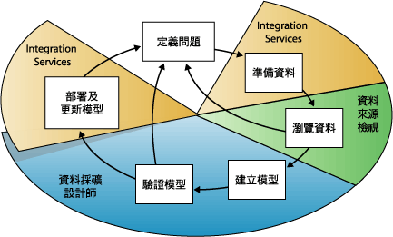
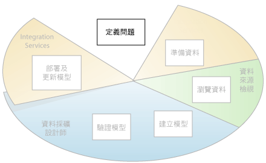
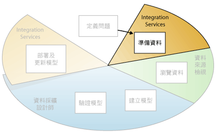
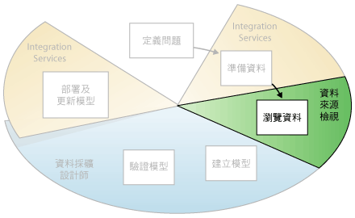
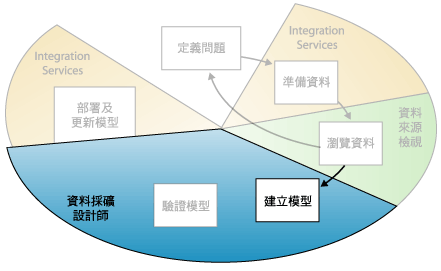
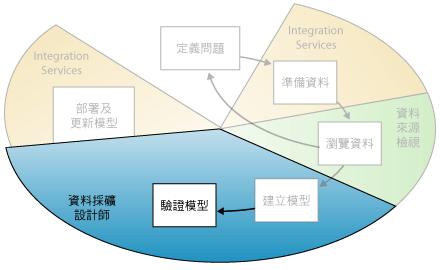
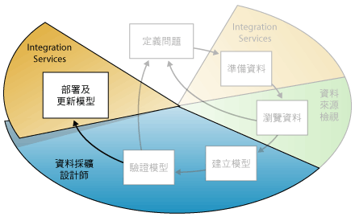

# 資料採礦概念
  資料採礦是從大型資料集探索可付諸行動之資訊的過程。 資料採礦使用數學分析衍生存在於資料中的模式和趨勢。 傳統資料瀏覽一般無法探索這些模式，因為這些關聯性太複雜或因為沒有太多資料。  
  
 這些模式和趨勢可收集在一起，並定義為 *「資料採礦模型」*(Data mining model)。 採礦模型可套用至特定案例，例如：  
  
-   **預測**：估計銷售、預測伺服器負載或伺服器停機時間  
  
-   **風險和機率**：選擇目標郵件的最佳客戶、為風險案例決定可能的損益平衡點、指派診斷或其他結果的機率  
  
-   **建議**：決定可能一起銷售的產品、產生建議  
  
-   **尋找順序**：分析客戶在購物車中的選擇、預測下一個可能的事件  
  
-   **群組**：將客戶或事件分成相關項目的叢集、分析及預測相似性  
  
 建立採礦模型是較大型程序的一部分，它包括從詢問資料相關問題與建立模型回答這些問題，到部署該模型到工作環境中的一切細節。 可以使用下列 6 個基本步驟來定義這個程序：  
  
1.  [定義問題](#DefiningTheProblem)  
  
2.  [準備資料](#PreparingData)  
  
3.  [瀏覽資料](#ExploringData)  
  
4.  [建立模型](#BuildingModels)  
  
5.  [瀏覽及驗證模型](#ValidatingModels)  
  
6.  [部署及更新模型](#DeployingandUpdatingModels)  
  
 下圖描述此程序中每一個步驟之間的關聯性，和 [!INCLUDE[msCoName](../../includes/msconame-md.md)] [!INCLUDE[ssNoVersion](../../includes/ssnoversion-md.md)] 中您可用於完成每一個步驟的技巧。  
  
   
  
 圖表中所描述的程序為循環程序，表示建立資料採礦模型是動態且反覆的程序。 在瀏覽資料之後，您可能會發現資料不夠用於建立適當的採礦模型，因此您必須尋找更多的資料。 或者，您可以建立數個模型，然後發現這些模型並沒有正確回答您定義的問題，因此您必須重新定義問題。 在部署模型之後，您必須更新模型，因為有更多的資料可用。 程序中的每個步驟可能都必須重複許多次，才能建立良好的模型。  
  
 Microsoft SQL Server 資料採礦提供一個用於建立和使用資料採礦模型的整合式環境。 此環境包含 SQL Server Development Studio 和 [!INCLUDE[ssManStudioFull](../../includes/ssmanstudiofull-md.md)]，前者含有資料採礦演算法和查詢工具，可讓您輕鬆建立各種專案的完整方案，後者含有用於瀏覽模型及管理資料採礦物件的工具。 如需詳細資訊，請參閱[使用 SQL Server 資料工具建立多維度模型 &#40;SSDT&#41;](../../analysis-services/multidimensional-models/creating-multidimensional-models-using-sql-server-data-tools-ssdt.md)。  
  
 如需如何將 [!INCLUDE[ssNoVersion](../../includes/ssnoversion-md.md)] 工具套用到商務案例的範例，請參閱 [資料採礦基本教學課程](http://msdn.microsoft.com/library/6602edb6-d160-43fb-83c8-9df5dddfeb9c)。  
  
##   定義問題  
 資料採礦程序中的第一個步驟 (在下圖中以反白顯示) 是要明確定義問題，並考慮利用資料以提供問題解答的方式。  
  
   
  
 此步驟包括分析商務需求、定義問題的範圍、定義評估模型的標準，以及定義資料採礦專案的特定目標。 這些工作翻譯成下列問題：  
  
-   您尋找的目標是什麼？ 您要尋找哪些關聯性類型？  
  
-   您嘗試解決的問題會反映商務的原則或流程嗎？  
  
-   您要從資料採礦模型建立預測，或只尋找感興趣的模式和關聯性？  
  
-   您要嘗試預測的結果或屬性是什麼？  
  
-   您擁有的資料類型為何，以及每個資料行中的資訊類型為何？ 如果有多個資料表，資料表之間如何產生關聯？ 您是否需要執行任何清理、彙總或處理，才可以使用資料？  
  
-   資料如何分佈？ 資料有季節性嗎？ 資料正確表示商務的流程嗎？  
  
 若要回答這些問題，您必須進行一項資料可用性研究，來調查商務使用者對於可用資料的需求。 如果資料不支援使用者的需求，您必須重新定義專案。  
  
 您也需要考慮如何將模型的結果加入測量商務進度所使用之關鍵效能指標 (KPI)。  
  
##   準備資料  
 資料採礦程序中的第個二步驟 (在下列圖表中以反白顯示) 是要合併及清理在 [定義問題](#DefiningTheProblem) 步驟中所識別的資料。  
  
   
  
 資料可能散佈於公司各處並以不同格式儲存，也可能會不一致，例如有不正確或遺漏的項目。 例如，資料可能會顯示某客戶在產品上市之前購買該產品，或該客戶定期購物的商店竟然距離她的家 2,000 英里。  
  
 資料清理不只是移除不正確的資料或插入遺漏的值，同時也是尋找資料中隱藏的關聯、識別最正確之資料的來源，以及判斷最適合用於分析的資料行。 例如，您應該使用送貨日期還是訂貨日期？ 最佳的銷售影響因素是數量、總價還是折扣價格？ 個別出現但實際上有強大關聯的不完整資料、錯誤資料以及輸入都可能會以您預期之外的方式影響模型的結果。  
  
 因此，在您開始建立採礦模型之前，應該識別這些問題，並決定修正這些問題的方式。 針對資料採礦，您通常使用很大的資料集，而無法檢查每一筆交易的資料品質；因此，您可能必須使用某種資料分析及自動資料清理和篩選工具 (例如，在 [!INCLUDE[ssISnoversion](../../includes/ssisnoversion-md.md)]、 [!INCLUDE[ssMDSlong](../../includes/ssmdslong-md.md)]或 [!INCLUDE[ssDQSnoversionLong](../../includes/ssdqsnoversionlong-md.md)] 中支援的工具)，以瀏覽資料並找出不一致的地方。 如需詳細資訊，請參閱下列資源：  
  
-   [Business Intelligence Development Studio 中的 Integration Services](https://technet.microsoft.com/library/ms174181\(v=sql.110\).aspx)  
  
-   [Master Data Services 概觀 &#40;MDS&#41;](../../master-data-services/master-data-services-overview-mds.md)  
  
-   [Data Quality Services](../../data-quality-services/data-quality-services.md)  
  
 請注意，用於資料採礦的資料不需要儲存在線上分析處理 (OLAP) Cube，甚至也不需要儲存在關聯式資料庫中，即使您可以同時將兩者當做資料來源使用也一樣。 您可以使用已定義為 [!INCLUDE[ssASnoversion](../../includes/ssasnoversion-md.md)] 資料來源之資料的任何來源，進行資料採礦。 這些可以包含文字檔、Excel 活頁簿，或來自其他外部提供者的資料。 如需詳細資訊，請參閱[支援的資料來源 &#40;SSAS - 多維度&#41;](../../analysis-services/multidimensional-models/supported-data-sources-ssas-multidimensional.md)。  
  
##   瀏覽資料  
 資料採礦程序中的第三個步驟 (在下列圖表中以反白顯示) 是要瀏覽已經準備好的資料。  
  
   
  
 當您建立採礦模型時，您必須了解資料才能做出適當的決策。 瀏覽技巧包括計算最小值和最大值、計算平均差和標準差，以及查看資料的散發。 例如，您可以會透過檢閱最大值、最小值和平均值來判定資料無法代表您的客戶或商務流程，因此，您必須取得更對稱的資料，或檢閱您期望基礎的假設。 標準差和其他散發值可以提供結果之穩定性和正確性的實用資訊。 標準差大表示加入更多資料可能有助於改良模型。 與標準散發強烈偏差的資料可能會扭曲，或者可能代表真實問題的正確圖片，但是會變成難以讓模型配合資料。  
  
 按照您自己對於商務問題的理解瀏覽資料，可以決定資料集是否包含有缺陷的資料，然後想出修正問題的策略，或對於企業典型的行為增加更深層的了解。  
  
 您可以使用 [!INCLUDE[ssMDSshort](../../includes/ssmdsshort-md.md)] 等工具審查可用的資料來源，並決定其是否可用於資料採礦。 您可以使用 [!INCLUDE[ssDQSnoversionLong](../../includes/ssdqsnoversionlong-md.md)]等工具，或 Integration Services 資料分析工具，分析資料的分佈並修復資料錯誤或遺失等問題。  
  
 定義來源之後，請使用 [!INCLUDE[ssBIDevStudio](../../includes/ssbidevstudio-md.md)]的資料來源檢視設計工具，將來源合併到資料來源檢視。 如需詳細資訊，請參閱 [多維度模型中的資料來源檢視](../../analysis-services/multidimensional-models/data-source-views-in-multidimensional-models.md)。 此設計師也包含數個工具，您可以用來瀏覽資料及確認資料可用於建立模型。 如需詳細資訊，請參閱[在資料來源檢視中瀏覽資料 &#40;Analysis Services&#41;](../../analysis-services/multidimensional-models/explore-data-in-a-data-source-view-analysis-services.md)。  
  
 請注意，當您建立模型時， [!INCLUDE[ssASnoversion](../../includes/ssasnoversion-md.md)] 會自動建立包含在模型中之資料的統計摘要，讓您可以進行查詢以便用於報表或進一步的分析。 如需詳細資訊，請參閱 [資料採礦查詢](../../analysis-services/data-mining/data-mining-queries.md)。  
  
##   建立模型  
 資料採礦程序中的第四個步驟 (在下列圖表中以反白顯示) 是建立一或多個採礦模型。 您將使用在 [瀏覽資料](#ExploringData) 步驟中所獲得的知識，來協助定義和建立模型。  
  
   
  
 您可以建立採礦結構以定義要使用的資料行。 採礦結構會連結至資料的來源，但是在處理資料前，不會真的包含任何資料。 當您處理採礦結構時， [!INCLUDE[ssASnoversion](../../includes/ssasnoversion-md.md)] 會產生可用於分析的彙總與其他統計資訊。 此資訊可根據結構，透過任何採礦模型使用。 如需採礦結構如何與採礦模型產生關聯的詳細資訊，請參閱[邏輯架構 &#40;Analysis Services - 資料採礦&#41;](../../analysis-services/data-mining/logical-architecture-analysis-services-data-mining.md)。  
  
 處理結構和模型之前，資料採礦模型也只是一個容器，可指定用於輸入的資料行、您要預測的屬性，以及告知演算法如何處理資料的參數。 處理模型通常稱為 *「定型」*(Training)。 定型指的是將特定數學演算法套用到結構中的資料以擷取模式的程序。 您在定型程序中找到的模式取決於選取的定型資料、選擇的演算法，以及設定演算法的方式。 [!INCLUDE[ssCurrent](../../includes/sscurrent-md.md)] 包含許多不同的演算法，每個演算法都適合不同類型的工作，而且每個演算法都會建立不同類型的模型。 如需 [!INCLUDE[ssCurrent](../../includes/sscurrent-md.md)] 中所提供的演算法清單，請參閱[資料採礦演算法 &#40;Analysis Services - 資料採礦&#41;](../../analysis-services/data-mining/data-mining-algorithms-analysis-services-data-mining.md)。  
  
 您也可以使用參數調整每個演算法，而且您可以將篩選套用到定型資料，只使用資料的子集以建立不同的結果。 將資料傳遞到模型之後，採礦模型物件就包含可以進行查詢或用於預測的摘要和模型。  
  
 您可以使用 [!INCLUDE[ssBIDevStudio](../../includes/ssbidevstudio-md.md)] 中的 [資料採礦精靈]，或使用資料採礦延伸模組 (DMX) 語言，定義新的模型。 如需如何使用資料採礦精靈的詳細資訊，請參閱[資料採礦精靈 &#40;Analysis Services - 資料採礦&#41;](../../analysis-services/data-mining/data-mining-wizard-analysis-services-data-mining.md)。 如需如何使用 DMX 的詳細資訊，請參閱[資料採礦延伸模組 &#40;DMX&#41; 參考](../../dmx/data-mining-extensions-dmx-reference.md)。  
  
 請記住，每當資料變更時，您必須同時更新採礦結構與採礦模型。 當您透過重新處理採礦結構來更新時， [!INCLUDE[ssASnoversion](../../includes/ssasnoversion-md.md)] 會從來源擷取資料，包括任何新資料 (如果來源是動態更新的)，並重新填入採礦結構。 如果您擁有以結構為基礎的模型，您可以選擇更新以結構為基礎的模型，也就是說，這些模型會在新資料上重新定型，或者您可以將模型保留原樣。 如需詳細資訊，請參閱[處理需求和考量 &#40;資料採礦&#41;](../../analysis-services/data-mining/processing-requirements-and-considerations-data-mining.md)。  
  
##   瀏覽及驗證模型  
 資料採礦程序中的第五個步驟 (在下列圖表中以反白顯示) 是瀏覽您所建立的採礦模型並測試其效能。  
  
   
  
 在您將模型部署到實際執行環境之前，您會想要先測試模型的執行效能。 同時，當您建立模型時，通常會建立包含不同組態的多個模型，然後測試所有模型以查看哪個模型會針對您的問題和資料產生最佳的效果。  
  
 [!INCLUDE[ssASnoversion](../../includes/ssasnoversion-md.md)] 提供的工具可協助您將資料分割為訓練資料集與測試資料集，讓您可以針對相同的資料，正確評估所有模型的效能。 您會使用訓練資料集來建立模型，並建立預測查詢，使用測試資料集來測試模型的精確度。 此資料分割，才可以建立採礦模型時自動。 如需詳細資訊，請參閱 [測試和驗證 &#40;資料採礦&#41;](../../analysis-services/data-mining/testing-and-validation-data-mining.md)。  
  
 您可以在 [!INCLUDE[ssBIDevStudio](../../includes/ssbidevstudio-md.md)]中使用資料採礦設計師的檢視器，來瀏覽演算法所探索的趨勢和模式。 如需詳細資訊，請參閱 [資料採礦模型檢視器](../../analysis-services/data-mining/data-mining-model-viewers.md)。 您也可以使用設計師中的工具 (例如增益圖和分類矩陣)，來測試模型建立預測的效能。 若要確認模型是否專屬於您的資料，或者模型是否可用於針對一般母體進行推斷，您可以使用稱為*「交叉驗證」*(Cross-Validation) 的統計技巧，自動建立資料的子集，並對照每個子集測試模型。 如需詳細資訊，請參閱[測試和驗證 &#40;資料採礦&#41;](../../analysis-services/data-mining/testing-and-validation-data-mining.md)。  
  
 如果您在 [建立模型](#BuildingModels) 步驟中所建立的模型沒有一個有好的執行效能，您可能必須要回到程序的上一個步驟，並重新定義問題或重新調查原始資料集內的資料。  
  
##   部署及更新模型  
 資料採礦程序中的最後一個步驟 (在下列圖表中以反白顯示) 是將執行效能最好的模型部署到實際執行環境。  
  
   
  
 當採礦模型存在於實際執行環境之後，您可以執行許多工作，視您自己的需要而定。 以下是您可以執行的一些工作：  
  
-   使用模型可建立預測，以供您接著用來制定企業決策。 [!INCLUDE[ssNoVersion](../../includes/ssnoversion-md.md)] 提供 DMX 語言，可讓您用來建立預測查詢；而預測查詢產生器則可以協助您建立查詢。 如需詳細資訊，請參閱[資料採礦延伸模組 &#40;DMX&#41; 參考](../../dmx/data-mining-extensions-dmx-reference.md)。  
  
-   建立內容查詢以便從模型擷取統計資料、規則或公式。 如需詳細資訊，請參閱 [資料採礦查詢](../../analysis-services/data-mining/data-mining-queries.md)。  
  
-   直接將資料採礦功能內嵌於應用程式中。 您可以包括分析管理物件 (AMO)，其中包含一組物件，可讓應用程式用於建立、改變、處理以及刪除採礦結構和採礦模型。 另外，您可以將 XML for Analysis (XMLA) 訊息直接傳送到 [!INCLUDE[ssASnoversion](../../includes/ssasnoversion-md.md)]的執行個體。 如需詳細資訊，請參閱 [開發 (Analysis Services - 資料採礦)](https://technet.microsoft.com/library/bb522473\(v=sql.110\).aspx)。  
  
-   使用 [!INCLUDE[ssISnoversion](../../includes/ssisnoversion-md.md)] 來建立封裝，其中會使用採礦模型，有智慧地將內送資料分成多個資料表。 例如，若資料庫因為潛在客戶而不斷更新，您可以同時使用採礦模型與 [!INCLUDE[ssISnoversion](../../includes/ssisnoversion-md.md)] ，將內送資料分成可能購買產品的客戶和可能不購買產品的客戶。 如需詳細資訊，請參閱 [Integration Services 的一般用途](http://msdn.microsoft.com/en-us/3b97897a-d418-4ef4-b5a4-5aabf4fa6bca)。  
  
-   建立可讓使用者直接查詢現有之採礦模型的報表。 如需詳細資訊，請參閱 [SQL Server 資料工具中的 Reporting Services &#40;SSDT&#41;](../../reporting-services/tools/reporting-services-in-sql-server-data-tools-ssdt.md)。  
  
-   在檢閱和分析之後更新模型。 所有更新都需要您重新處理模型。 如需詳細資訊，請參閱 [Processing Data Mining Objects](../../analysis-services/data-mining/processing-data-mining-objects.md)。  
  
-   動態更新模型，因為會有更多的資料進入組織，而不斷進行變更以增進方案的效能應該是部署策略的一部分。 如需詳細資訊，請參閱 [資料採礦方案與物件的管理](../../analysis-services/data-mining/management-of-data-mining-solutions-and-objects.md)  
  
## 請參閱＜  
 [資料採礦方案](../../analysis-services/data-mining/data-mining-solutions.md)   
 [資料採礦工具。](../../analysis-services/data-mining/data-mining-tools.md)  
  
  

