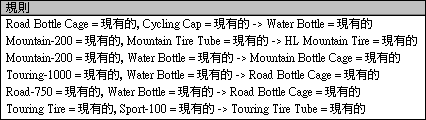

# Microsoft 關聯分析演算法
  [!INCLUDE[msCoName](../../includes/msconame-md.md)] 關聯分析演算法是常用於建議引擎的演算法。 建議引擎會依據客戶已購買或感興趣的項目向客戶建議項目。 [!INCLUDE[msCoName](../../includes/msconame-md.md)] 關聯分析演算法對於購物籃分析也很有用。   
  
 關聯模型是建立在包含個別案例和案例所含項目之識別碼的資料集上。 案例中的項目群組稱為 *「項目集」*(itemset)。 關聯模型是由一系列項目集和規則所組成，這些規則描述那些項目在案例內如何分組。 演算法識別的規則可依據客戶購物車已有的項目，來預測客戶未來可能購買的項目。 下列圖表顯示項目集內的一系列規則。  
  
   
  
 如圖表所示， [!INCLUDE[msCoName](../../includes/msconame-md.md)] 關聯分析演算法可能會在資料集內找到許多規則。 演算法使用兩個參數 (案例數和機率) 來描述它產生的項目集和規則。 例如，若 X 和 Y 代表可能存在於購物車內的兩個項目，則案例數參數就是指資料集內包含 X 和 Y 項目結合的案例數目。藉由使用案例數參數來結合使用者定義的 *MINIMUM_SUPPORT* 和 *MAXIMUM_SUPPORT* 參數，演算法可控制產生的項目集數目。 機率參數也稱為 *「信心」*(confidence)，它代表資料集內包含 X 也包含 Y 之案例的比例。將機率參數搭配 *MINIMUM_PROBABILITY* 參數使用時，此演算法就會控制所產生的規則數目。  
  
## 範例  
 [!INCLUDE[ssSampleDBCoShort](../../includes/sssampledbcoshort-md.md)] Cycle 公司正在重新設計其網站的功能。 重新設計的目標是要增加產品的實際銷售。 因為公司會在交易式資料庫中記錄每一筆銷售，所以他們可以使用 [!INCLUDE[msCoName](../../includes/msconame-md.md)] 關聯分析演算法來識別可能一起購買的產品集。 然後，他們可以依據客戶購物籃已有的項目，來預測客戶可能感興趣的其他項目。  
  
## 演算法的運作方式  
 [!INCLUDE[msCoName](../../includes/msconame-md.md)] 關聯分析演算法周遊資料集來尋找一起出現在案例中的項目。 接著，演算法就會將任何出現的相關聯項目分組為項目集，且至少會分成在 *MINIMUM_SUPPORT* 參數中指定的案例數目。 例如，項目集可能是 "Mountain 200=Existing, Sport 100=Existing"，且可能有 710 個案例數。 接著，演算法會從項目集產生規則。 依據演算法識別為重要的其他特定項目出現與否，這些規則將用來預測項目在資料庫出現與否。 例如，若規則是「if Touring 1000=existing and Road bottle cage=existing, then Water bottle=existing」，則機率為 0.812。 在這個範例中，演算法識別出由於購物籃內有 Touring 1000 輪胎和水壺架的存在，所以預測水壺也可能會出現在購物籃內。  
  
 如需更詳細的演算法說明，以及用來自訂演算法行為及控制採礦模型結果的參數清單，請參閱 [Microsoft 關聯分析演算法技術參考](../../analysis-services/data-mining/microsoft-association-algorithm-technical-reference.md)。  
  
## 關聯模型所需的資料  
 當您準備資料以供關聯規則模型使用時，應該要了解特定演算法的需求，包括所需的資料量及資料的使用方式等。  
  
 關聯規則模型的需求如下：  
  
-   **單一索引鍵資料行** ：每個模型都必須包含一個能唯一識別每一筆記錄的數值或文字資料行。 不允許複合的索引鍵。  
  
-   **單一的可預測資料行** ：關聯模型只能擁有一個可預測資料行。 一般而言，這是巢狀資料表的索引鍵資料行，例如列出已購買之產品的欄位。 值必須是不連續或分隔式。  
  
-   **輸入資料行** 。 輸入資料行必須是分隔的。 關聯模型的輸入資料通常包含在兩個資料表中。 例如，某一個資料表可能包含客戶資訊，而另一個資料表則包含客戶購買的項目。 您可以使用巢狀資料表，將此資料輸入模型中。 如需巢狀資料表的詳細資訊，請參閱[巢狀資料表 &#40;Analysis Services - 資料採礦&#41;](../../analysis-services/data-mining/nested-tables-analysis-services-data-mining.md)。  
  
 如需關聯模型所支援內容類型和資料類型的詳細資訊，請參閱 [Microsoft 關聯分析演算法技術參考](../../analysis-services/data-mining/microsoft-association-algorithm-technical-reference.md)的＜需求＞一節。  
  
## 檢視關聯模型  
 若要瀏覽此模型，您可以使用 [Microsoft 關聯檢視器]。 當您檢視關聯模型時，[!INCLUDE[ssASnoversion](../../includes/ssasnoversion-md.md)] 會從不同的角度展示關聯，使您可以更了解資料中的關聯性和規則。 檢視器中的 [項目集] 窗格會提供最常見組合或項目集的詳細細目。 [規則] 窗格可用來表示已從資料產生的規則清單、加入機率的計算，並依照相對重要性排列規則的次序。 相依性網路檢視器則可用來以視覺方式探索不同的個別項目的連接方式。 如需詳細資訊，請參閱 [使用 Microsoft 叢集檢視器瀏覽模型](../../analysis-services/data-mining/browse-a-model-using-the-microsoft-cluster-viewer.md)。  
  
 如果想要知道有關任何項目集和規則的詳細資訊，可以在 [Microsoft 一般內容樹狀檢視器](../../analysis-services/data-mining/browse-a-model-using-the-microsoft-generic-content-tree-viewer.md)中瀏覽此模型。 針對此模型所儲存的內容包括每個項目集的支援、每個規則的分數以及其他的統計資料。 如需詳細資訊，請參閱 [關聯模型的採礦模型內容 &#40;Analysis Services - 資料採礦&#41;](../../analysis-services/data-mining/mining-model-content-for-association-models-analysis-services-data-mining.md)(itemset)。  
  
## 建立預測  
 當模型經過處理之後，就可以使用規則和項目集來進行預測。 在關聯模型中，預測可告訴您在有指定的項目時可能會發生什麼項目，而該預測可能包含機率、支援或重要性之類的資訊。 如需如何根據關聯模型建立查詢的範例，請參閱 [關聯模型查詢範例](../../analysis-services/data-mining/association-model-query-examples.md)。  
  
 如需如何針對資料採礦模型建立查詢的一般資訊，請參閱 [資料採礦查詢](../../analysis-services/data-mining/data-mining-queries.md)。  
  
## 效能  
 建立項目集和計算關聯性的過程可能很耗費時間。 雖然 [!INCLUDE[msCoName](../../includes/msconame-md.md)] 關聯規則演算法會使用最佳化技巧來節省空間及加速處理，但您應該要知道在下列情況會發生效能問題：  
  
-   資料集很大且具有許多個別的項目。  
  
-   項目集大小的最小值設得太低。  
  
 若要將處理時間減至最少並降低項目集的複雜性，應該試著在分析資料之前依類別將相關項目分類。  
  
## 備註  
  
-   不支援使用預測模型標記語言 (PMML) 來建立採礦模型。  
  
-   支援鑽研。  
  
-   支援 OLAP 採礦模型的使用。  
  
-   支援建立資料採礦維度。  
  
## 請參閱＜  
 [資料採礦演算法 &#40;Analysis Services - 資料採礦&#41;](../../analysis-services/data-mining/data-mining-algorithms-analysis-services-data-mining.md)   
 [瀏覽模型，使用 Microsoft 關聯規則檢視器](../../analysis-services/data-mining/browse-a-model-using-the-microsoft-association-rules-viewer.md)   
 [關聯模型 &#40; 的採礦模型內容Analysis Services-資料採礦 &#41;](../../analysis-services/data-mining/mining-model-content-for-association-models-analysis-services-data-mining.md)   
 [Microsoft 關聯分析演算法技術參考](../../analysis-services/data-mining/microsoft-association-algorithm-technical-reference.md)   
 [關聯模型查詢範例](../../analysis-services/data-mining/association-model-query-examples.md)  
  
  

