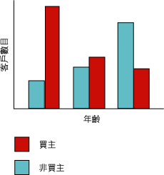
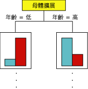
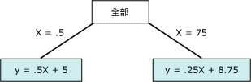

# Microsoft 決策樹演算法
  [!INCLUDE[msCoName](../../includes/msconame-md.md)] 決策樹演算法是一種分類和迴歸演算法，可用於離散和連續屬性的預測模型。  
  
 針對分隔屬性，此演算法依據資料集內的輸入資料行之間的關聯性來產生預測。 它會使用這些資料行的值 (稱為狀態) 來預測您指定為可預測之資料行的狀態。 尤其，此演算法會識別與可預測資料行相互關聯的輸入資料行。 例如，在預測哪些客戶可能購買腳踏車的狀況中，如果 10 個年輕客戶當中有 9 個購買腳踏車，但 10 個年紀較大的客戶當中只有 2 個人這麼做，則演算法會推斷年齡是腳踏車購買的理想預測器。 決策樹就是依據傾向於特定結果的趨勢來產生預測。  
  
 針對連續屬性，此演算法使用線性迴歸來決定決策樹分岔之處。  
  
 如果不止一個資料行設定為可預測，或輸入資料包含的巢狀資料表設定為可預測，則演算法會建立每一個可預測資料行的個別決策樹。  
  
## 範例  
 [!INCLUDE[ssSampleDBCoFull](../../includes/sssampledbcofull-md.md)] 公司的行銷部門想要識別舊客戶的特性，這些特性會指出那些客戶是否可能購買未來的產品。 [!INCLUDE[ssSampleDBnormal](../../includes/sssampledbnormal-md.md)] 資料庫會儲存描述舊客戶的人口統計資訊。 藉由使用 [!INCLUDE[msCoName](../../includes/msconame-md.md)] 決策樹演算法來分析此資訊，行銷部門可以建立模型，依據關於特定客戶之已知資料行的狀態 (例如人口統計或過去購買模式) 來預測該客戶是否會購買產品。  
  
## 演算法的運作方式  
 [!INCLUDE[msCoName](../../includes/msconame-md.md)] 決策樹演算法會在樹狀結構中建立一系列分割，藉以建立資料採礦模型。 然後，這些分割會表示成「節點」。 每次發現輸入資料行與可預測資料行有明顯地相互關聯時，此演算法就會在模型中加入一個節點。 演算法決定分岔的方式不同，視它預測連續資料行或分隔資料行而定。  
  
 [!INCLUDE[msCoName](../../includes/msconame-md.md)] 決策樹演算法會使用「特徵選取」來引導選取最有用的屬性。 所有 [!INCLUDE[ssNoVersion](../../includes/ssnoversion-md.md)] 資料採礦演算法都會使用特徵選取來改善分析的效能和品質。 若要防止不重要的屬性佔用處理器時間，特徵選取就很重要。 如果您在設計資料採礦模型時使用過多輸入或可預測的屬性，此模型可能會需要很長的時間才能處理完成，甚至用完記憶體。 用來判斷是否要分割樹狀結構的方法包括 *entropy* 和 Bayesian 網路的業界標準。 如需用來選取有意義屬性，然後針對這些屬性計分並排名之方法的詳細資訊，請參閱[特徵選取 &#40;資料採礦&#41;](../../analysis-services/data-mining/feature-selection-data-mining.md)。  
  
 資料採礦模型的常見問題是模型對於定型資料中的小型差異變得過度敏感，而這種情況就稱為「過度調整」或「過度定型」。 過度調整的模型無法一般化成為其他資料集。 為了避免過度調整任何特定資料集， [!INCLUDE[msCoName](../../includes/msconame-md.md)] 決策樹演算法會使用控制樹狀目錄成長的技術。 如需 [!INCLUDE[msCoName](../../includes/msconame-md.md)] 決策樹演算法如何運作的更深入說明，請參閱 [Microsoft 決策樹演算法技術參考](../../analysis-services/data-mining/microsoft-decision-trees-algorithm-technical-reference.md)。  
  
### 預測分隔資料行  
 [!INCLUDE[msCoName](../../includes/msconame-md.md)] 決策樹演算法為分隔可預測資料行建立樹狀結構的方式，可使用長條圖來示範。 下列圖表顯示一個長條圖，它繪製出可預測資料行 Bike Buyers 對照輸入資料行 Age。 長條圖顯示某人的年齡可協助區分此人是否會購買腳踏車。  
  
   
  
 圖表中所顯示的相互關聯會導致 [!INCLUDE[msCoName](../../includes/msconame-md.md)] 決策樹演算法在模型中建立新節點。  
  
   
  
 當演算法在模型中加入新節點時，就會形成樹狀結構。 樹狀的最上層節點描述客戶整體母體擴展之可預測資料行的細分。 當模型繼續成長時，演算法會考量所有資料行。  
  
### 預測連續資料行  
 當 [!INCLUDE[msCoName](../../includes/msconame-md.md)] 決策樹演算法依據連續可預測資料行建立樹狀結構時，每一個節點會包含一個迴歸公式。 分岔會出現在迴歸公式中的非線性點上。 例如，請看下列圖表。  
  
   
  
 在標準迴歸模型中，您會嘗試衍生單一公式，來表示整體資料的趨勢和關聯性。  不過，單一公式在擷取複雜資料中的不連續情況時的作業績效可能很差。 相反地， [!INCLUDE[msCoName](../../includes/msconame-md.md)] 決策樹演算法會尋找樹狀結構中主要為線性的線段，並為這些線段建立不同的公式。 藉由將資料分成不同線段，就可以改善模型在估計資料時的作業績效。  
  
 下圖表示以上散佈圖中模型的樹狀圖。  為了預測結果，此模型提供兩個不同的公式︰一個表示左分支，其公式為 y = .5x x 5；另一個表示右分支，其公式為 y = .25x + 8.75。 散佈圖中兩條線交叉的點就是非線性點，也是在決策樹模型中之節點會分岔的那個點。  
  
   
  
 這是一個只有兩個線性方程式的簡單模型；因此，在 **所有** 節點之後會立即分割樹狀結構。 不過，分割作業可以發生在樹狀結構的任何層級。 這表示，在包含多個層級和節點的樹狀結構中，每個節點的特性會由不同的屬性集合來設定，而公式可以在多個不同的節點之間共用，或只會套用至單一節點。 例如，您可能會收到一個節點公式定義為「超過特定年齡和收入的客戶」，另一個節點公式表示「遠距離通勤的客戶」。 若要查看個別節點或線段的公式，只要按一下該節點即可。  
  
## 決策樹模型所需的資料  
 當您準備資料以供決策樹模型使用時，應該要了解特定演算法的需求，包括所需的資料量及資料的使用方式等。  
  
 決策樹模型的需求如下：  
  
-   **單一索引鍵資料行** ：每個模型都必須包含一個能唯一識別每一筆記錄的數值或文字資料行。 不允許複合的索引鍵。  
  
-   **可預測資料行** ：至少需要一個可預測資料行。 您可以在模型中加入多個可預測的屬性，而且這些可預測的屬性可以屬於不同的類型：數值或離散。 不過，增加可預測屬性的數目可能會增加處理時間。  
  
-   **輸入資料行** ：需要可以是離散或連續的輸入資料行。 增加輸入屬性的數目會影響處理時間。  
  
 如需決策樹模型所支援之內容類型和資料類型的詳細資訊，請參閱 [Microsoft 決策樹演算法技術參考](../../analysis-services/data-mining/microsoft-decision-trees-algorithm-technical-reference.md)的＜需求＞一節。  
  
## 檢視決策樹模型  
 若要瀏覽此模型，您可以使用 [Microsoft 樹狀檢視器]。 如果模型產生了多個樹狀目錄，您就可以選取一個樹狀目錄，然後此檢視器會顯示這些案例如何針對每個可預測屬性分類的細目。 您也可以使用相依性網路檢視器來檢視樹狀目錄的互動。 如需詳細資訊，請參閱 [使用 Microsoft 樹狀檢視器瀏覽模型](../../analysis-services/data-mining/browse-a-model-using-the-microsoft-tree-viewer.md)。  
  
 如果您想要了解樹狀結構中任何分支或節點的詳細資料，也可以使用 [Microsoft 一般內容樹狀檢視器](../../analysis-services/data-mining/browse-a-model-using-the-microsoft-generic-content-tree-viewer.md)來瀏覽此模型。 針對此模型所儲存的內容包括每個節點中所有值的分佈、樹狀目錄之每個層級的機率，以及其連續屬性的迴歸公式。 如需詳細資訊，請參閱 [決策樹模型的採礦模型內容 &#40;Analysis Services - 資料採礦&#41;](../../analysis-services/data-mining/mining-model-content-for-decision-tree-models-analysis-services-data-mining.md)。  
  
## 建立預測  
 在此模型已處理之後，結果會儲存成一組模式和統計資料，供您瀏覽關聯性或進行預測。  
  
 如需要搭配決策樹模型使用之查詢的範例，請參閱 [決策樹模型查詢範例](../../analysis-services/data-mining/decision-trees-model-query-examples.md)。  
  
 如需如何針對採礦模型建立查詢的一般資訊，請參閱 [資料採礦查詢](../../analysis-services/data-mining/data-mining-queries.md)。  
  
## 備註  
  
-   支援使用預測模型標記語言 (PMML) 來建立採礦模型。  
  
-   支援鑽研。  
  
-   支援 OLAP 採礦模型的使用和資料採礦維度的建立。  
  
## 請參閱＜  
 [資料採礦演算法 &#40;Analysis Services - 資料採礦&#41;](../../analysis-services/data-mining/data-mining-algorithms-analysis-services-data-mining.md)   
 [Microsoft 決策樹演算法技術參考](../../analysis-services/data-mining/microsoft-decision-trees-algorithm-technical-reference.md)   
 [決策樹模型查詢範例](../../analysis-services/data-mining/decision-trees-model-query-examples.md)   
 [決策樹模型的採礦模型內容 &#40;Analysis Services - 資料採礦&#41;](../../analysis-services/data-mining/mining-model-content-for-decision-tree-models-analysis-services-data-mining.md)  
  
  

