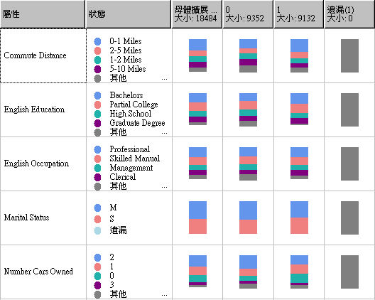

# Microsoft 貝氏機率分類演算法
[!INCLUDE[ssas-appliesto-sqlas](../../includes/ssas-appliesto-sqlas.md)]
  [!INCLUDE[msCoName](../../includes/msconame-md.md)] 貝氏機率分類演算法是可用於探勘和預測模型的分類演算法 (根據貝氏的定理)。 貝氏 (Naïve Bayes) 名稱中的 naïve 一字源自此演算法使用 Bayesian 技術但卻沒有考量可能存在的相依性。  
  
 此演算法比其他 [!INCLUDE[msCoName](../../includes/msconame-md.md)] 演算法更少計算，因此對於快速產生採礦模型來探索輸入資料行和可預測資料行之間的關聯性很有用。 您可以使用此演算法來執行資料的初始瀏覽，然後您可以套用其結果，以其他更多計算和更精確的演算法來建立其他採礦模型。  
  
## 範例  
 做為一項正在進行的促銷策略，Adventure Works Cycle 公司的行銷部門決定郵寄廣告傳單來鎖定目標潛在客戶。 為了減少成本，他們想要將廣告傳單只寄給那些有可能回應的客戶。 公司會將有關人口統計資料和舊郵件的回應等資訊儲存在資料庫中。 他們想要使用此資料來了解人口統計資料 (例如年齡和地點) 如何協助預測促銷的回應，藉由將潛在客戶與具有類似特性而且過去曾向公司購買產品的客戶做比較。 尤其，他們想要看看那些有購買腳踏車和沒有購買腳踏車的客戶之間的差異。  
  
 使用 [!INCLUDE[msCoName](../../includes/msconame-md.md)] 貝氏機率分類演算法，行銷部門可以快速預測特定客戶設定檔的結果，因此可以判斷哪些客戶最有可能對廣告傳單做出回應。 使用 [!INCLUDE[msCoName](../../includes/msconame-md.md)] 中的 [!INCLUDE[ssBIDevStudioFull](../../includes/ssbidevstudiofull-md.md)]貝氏機率分類檢視器，他們還可以利用視覺化方式來調查哪些輸入資料行促成廣告傳單的正面回應。  
  
## 演算法的運作方式  
 在提供了可預測資料行的每一個可能狀態之後， [!INCLUDE[msCoName](../../includes/msconame-md.md)] 貝氏機率分類演算法可計算出每一個輸入資料行的每一個狀態的機率。  
  
 若要了解其運作方式，請在 [!INCLUDE[msCoName](../../includes/msconame-md.md)] 中使用 [!INCLUDE[ssBIDevStudioFull](../../includes/ssbidevstudiofull-md.md)] 貝氏機率分類檢視器 (如下圖所示)，以視覺方式瀏覽此演算法如何分配狀態。  
  
   
  
 提供了可預測資料行的每一個狀態之後， [!INCLUDE[msCoName](../../includes/msconame-md.md)] 貝氏機率分類檢視器會在這裡列出資料集內的每一個輸入資料行，並顯示如何分配每一個資料行的狀態。  
  
 您會使用這個模型檢視來識別在區分可預測資料行的狀態時，非常重要的輸入資料行。  
  
 例如，這裡顯示的 [通勤距離] 資料列中，購買者與非購買者的輸入值分佈明顯不同。 這告訴我們，Commute Distance = 0-1 miles 輸入可能是預測指標。  
  
 該檢視器也提供了分佈的值，好讓您可以看到，對於通勤距離為一至二英里的客戶，其購買自行車的機率是 0.387，而不購買自行車的機率則是 0.287。 在此範例中，此演算法會使用從客戶特性衍生的數值資訊 (例如通勤距離) 來預測客戶是否會購買自行車。  
  
 如需使用 [!INCLUDE[msCoName](../../includes/msconame-md.md)] 貝氏機率分類檢視器的詳細資訊，請參閱 [使用 Microsoft 貝氏機率分類檢視器瀏覽模型](../../analysis-services/data-mining/browse-a-model-using-the-microsoft-naive-bayes-viewer.md)。  
  
## 貝氏機率分類模型所需的資料  
 當您準備資料以供貝氏機率分類模型定型使用時，應該要了解特定演算法的需求，包括所需的資料量及資料的使用方式等。  
  
 貝氏機率分類模型的需求如下：  
  
-   **單一索引鍵資料行** ：每個模型都必須包含一個能唯一識別每一筆記錄的數值或文字資料行。 不允許複合的索引鍵。  
  
-   **輸入資料行**：在貝氏機率分類模型中，所有的資料行都必須是離散的資料行，或其值必須已收納。 如需如何分隔 (收納) 資料行的資訊，請參閱[分隔方法 &#40;資料採礦&#41;](../../analysis-services/data-mining/discretization-methods-data-mining.md)。  
  
-   **變數必須是獨立的。** 對貝氏機率分類模型而言，確保輸入屬性彼此無關也很重要。 當您使用此模型進行預測時，這一點格外重要。 如果您使用已緊密相關的兩個資料行，則會導致這些資料行的影響倍增，從而遮蓋影響結果的其他因素。  
  
     相反地，當您瀏覽模型或資料集來辨識輸入之間的關聯性時，此演算法能夠識別變數之間關聯的功能會很有用。  
  
-   **至少有一個可預期的資料行** ：可預期的屬性必須包含離散或離散化的值。  
  
     可預期資料行的值可視為輸入。 當您瀏覽新的資料集來尋找資料行之間的關聯性時，這個作法很有用。  
  
## 檢視模型  
 若要瀏覽此模型，您可以使用 **[Microsoft 貝氏機率分類檢視器]**。 檢視器會顯示輸入屬性與可預測屬性間的關聯。 檢視器也會針對每個群集提供詳細的設定檔、區分各個群集的屬性清單以及整個訓練資料集的特性。 如需詳細資訊，請參閱[使用 Microsoft 貝氏機率分類檢視器瀏覽模型](../../analysis-services/data-mining/browse-a-model-using-the-microsoft-naive-bayes-viewer.md)。  
  
 如果您想要知道更多詳細資訊，您可以在 [Microsoft 一般內容樹狀檢視器 &#40;資料採礦&#41;](http://msdn.microsoft.com/library/751b4393-f6fd-48c1-bcef-bdca589ce34c) 中瀏覽此模型。 如需此模型所儲存之資訊類型的詳細資訊，請參閱[貝式機率分類模型的採礦模型內容 &#40;Analysis Services - 資料採礦&#41;](../../analysis-services/data-mining/mining-model-content-for-naive-bayes-models-analysis-services-data-mining.md)。  
  
## 進行預測  
 在此模型已培訓之後，結果會儲存成一組模式，供您瀏覽或用來做出預測。  
  
 您可以建立查詢來傳回新資料與可預測屬性的關聯方式，或者擷取描述有關群集的描述性統計資料。  
  
 如需如何針對資料採礦模型建立查詢的資訊，請參閱 [資料採礦查詢](../../analysis-services/data-mining/data-mining-queries.md)。 如需如何以貝氏機率分類模型使用查詢的範例，請參閱 [貝式機率分類模型查詢範例](../../analysis-services/data-mining/naive-bayes-model-query-examples.md)。  
  
## 備註  
  
-   支援使用預測模型標記語言 (PMML) 來建立採礦模型。  
  
-   支援鑽研。  
  
-   不支援建立資料採礦維度。  
  
-   支援 OLAP 採礦模型的使用。  
  
## 另請參閱  
 [資料採礦演算法 &#40;Analysis Services-資料採礦 &#41;](../../analysis-services/data-mining/data-mining-algorithms-analysis-services-data-mining.md)   
 [特徵選取 & #40; 資料採礦 & #41;](../../analysis-services/data-mining/feature-selection-data-mining.md)   
 [貝氏機率分類模型查詢範例](../../analysis-services/data-mining/naive-bayes-model-query-examples.md)   
 [貝氏機率分類模型 & #40; 的採礦模型內容Analysis Services-資料採礦 & #41;](../../analysis-services/data-mining/mining-model-content-for-naive-bayes-models-analysis-services-data-mining.md)   
 [Microsoft 貝氏機率分類演算法技術參考](../../analysis-services/data-mining/microsoft-naive-bayes-algorithm-technical-reference.md)  
  
  
