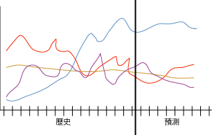

# Microsoft 時間序列演算法
  [!INCLUDE[msCoName](../../includes/msconame-md.md)] 時間序列演算法提供了多種演算法，針對連續數值的預測 (例如一段時間的產品銷售狀況) 提供了最佳化功能。 雖然其他 [!INCLUDE[msCoName](../../includes/msconame-md.md)] 演算法 (如決策樹) 需要含有新資訊的其他資料行當做輸入來預測趨勢，但是時間序列模型則不需要。 時間序列模型可以只根據用於建立此模型的原始資料集來預測趨勢。 當您做出預測並將新的資料自動納入趨勢分析時，也可以將新的資料加入此模型中。  
  
 下列圖表顯示一個典型模型，其中會預測一段時間內在四個不同銷售區域的產品銷售。 此圖表中顯示的模型會將每一個區域的銷售繪製成紅色、黃色、紫色和藍色的線條。 每個區域的線條有兩個部分：  
  
-   歷程記錄資訊會出現在垂直線的左方，並表示此演算法用於建立模型的資料。  
  
-   預測的資訊會出現在垂直線的右方，並表示此模型所做出的預測。  
  
 來源資料和預測資料的組合稱為「序列」。  
  
   
  
 [!INCLUDE[msCoName](../../includes/msconame-md.md)] 時間序列演算法的重要功能之一是可以執行交叉預測。 如果您以兩個分開但相關的序列來定型演算法，則可以使用產生的模型依據其他序列的行為來預測一個序列的結果。 例如，一個產品的已知銷售量會影響另一個產品的預測銷售量。  交叉預測對於建立可套用至多個序列的一般模型也很有用處。 例如，特定區域的預測會因為此序列缺少品質良好的資料而造成不穩定的情形。  您可以根據所有四個區域的平均值來定型一般模型，然後將此模型套用至個別序列，以針對每一個區域建立更穩定的預測。  
  
## 範例  
 [!INCLUDE[ssSampleDBCoFull](../../includes/sssampledbcofull-md.md)] 的管理團隊想要預測來年的每月腳踏車銷售量。 此公司特別想要知道某一款自行車的銷售是否可用於預測另一款的銷售。 公司針對過去這 3 年的記錄資料使用 [!INCLUDE[msCoName](../../includes/msconame-md.md)] 時間序列演算法，可以產生資料採礦模型來預測未來的腳踏車銷售量。 另外，公司可以執行交叉預測，以了解個別腳踏車款的銷售趨勢是否彼此相關。  
  
 此公司在每一季都打算以最近的銷售資料來更新此模型，並將其預測更新為模型的最近趨勢。 若要針對未能正確或一致更新銷售資料的商店做出更正，將會建立一般預測模型，並使用該模型來建立所有區域的預測。  
  
## 演算法的運作方式  
 在 [!INCLUDE[ssVersion2005](../../includes/ssversion2005-md.md)]中， [!INCLUDE[msCoName](../../includes/msconame-md.md)] 時間序列演算法過去使用的是名為 ARTXP 的單次自動迴歸時間序列方法。 ARTXP 演算法已針對短期預測最佳化，因此，在預測序列中下一個可能的值方面表現出色。 從 [!INCLUDE[ssKatmai](../../includes/sskatmai-md.md)]開始， [!INCLUDE[msCoName](../../includes/msconame-md.md)] 時間序列演算法加入了第二種演算法 ARIMA，已針對長期預測最佳化。 如需 ARTXP 和 ARIMA 演算法實作的詳細說明，請參閱 [Microsoft 時間序列演算法技術參考](../../analysis-services/data-mining/microsoft-time-series-algorithm-technical-reference.md)。  
  
 依預設， [!INCLUDE[msCoName](../../includes/msconame-md.md)] 時間序列演算法在分析模式及作出預測時，會混合使用這些演算法。 此演算法會在相同的資料上定型兩個不同的模型：一個模型使用 ARTXP 演算法，另一個模型則使用 ARIMA 演算法。 然後此演算法會混合這兩個模型的結果，以針對變動數目的時間配量產生最佳預測結果。 因為 ARTXP 最適合用於短期預測，所以在一系列預測的開始會有較重的加權。 不過，隨著預測的時間配量進入未來，ARIMA 會有更重的加權。  
  
 您也可以控制演算法的組合，以選擇偏好時間序列中的短期或長期預測。 從 [!INCLUDE[ssKatmai](../../includes/sskatmai-md.md)] Standard 開始，您可以指定要使用的演算法︰  
  
-   短期預測中只使用 ARTXP。  
  
-   長期預測中只使用 ARIMA。  
  
-   使用預設的兩種演算法混用。  
  
 從 [!INCLUDE[ssEnterpriseEd10](../../includes/ssenterpriseed10-md.md)]開始，您也可以自訂 [!INCLUDE[msCoName](../../includes/msconame-md.md)] 時間序列演算法要如何混合模型來進行預測。 當您使用混合模型時， [!INCLUDE[msCoName](../../includes/msconame-md.md)] 時間序列演算法會以下列方式來混合這兩種演算法：  
  
-   在做出最初的幾個預測時，一定只使用 ARTXP。  
  
-   在做出最初的幾個預測之後，會使用 ARIMA 和 ARTXP 的組合。  
  
-   當預測步驟的數目增加時，預測會更依賴 ARIMA，直到 ARTXP 不再使用為止。  
  
-   您可控制混合點 (也就是 ARTXP 加權減少的比率)，而且可設定 PREDICTION_SMOOTHING 參數來增加 ARIMA 的加權。  
  
 這兩個演算法都可以在多個層級上偵測資料中的季節性。 例如，您的資料可能包含年週期內的巢狀月週期。 若要偵測這些季節性週期，您可以提供週期提示，或是指定此演算法應該自動偵測週期。  
  
 除了週期以外，還有其他幾個參數可在 [!INCLUDE[msCoName](../../includes/msconame-md.md)] 時間序列演算法偵測週期、做出預測或分析案例時，控制此演算法的行為。 如需設定演算法參數的資訊，請參閱 [Microsoft 時間序列演算法技術參考](../../analysis-services/data-mining/microsoft-time-series-algorithm-technical-reference.md)。  
  
## 時間序列模型所需的資料  
 當您準備資料以供任何資料採礦模型的定型使用時，請務必了解特定模型的需求及資料的使用方式。  
  
 每一個預測模型都必須包含一個案例序列，它是用於指定發生變更之時間配量或其他序列的資料行。 例如，上述圖表中的資料會顯示幾個月的期間內，已發生和預測的腳踏車銷售量的序列 對於此模型而言，每一個區域都是一個序列，而且日期資料行會包含時間序列 (也是案例序列)。 在其他模型中，案例序列可以是文字欄位或某個識別碼，例如客戶識別碼或交易識別碼。 但是，時間序列模型一定必須在它的案例序列中使用日期、時間或某個其他唯一的數值。  
  
 時間序列模型的需求如下：  
  
-   **單一索引鍵時間資料行** ：每一個模型都必須包含一個數值或日期資料行來當做案例序列使用，此序列會定義此模型將使用的時間配量。 Key Time 資料行的資料類型可以是日期時間資料類型或數值資料類型。 但是，此資料行必須包含連續的值，而且每一個序列的值都必須是唯一的。 時間序列模型的案例序列無法儲存於兩個資料行中，例如 Year 資料行和 Month 資料行。  
  
-   **可預測資料行** ：每一個模型都至少必須包含一個可預測的資料行，演算法將在此資料行周圍建立時間序列模型。 可預測資料行的資料類型必須有連續的值。 例如，您可以預測數值屬性 (如收入、銷售或溫度) 會如何隨著時間而變化。 但是，您無法使用包含不連續值 (如購買狀態或教育程度) 的資料行當做可預測資料行。  
  
-   **選擇性序列索引鍵資料行** ：每一個模型都可以有其他的索引鍵資料行 (此資料行包含可識別序列的唯一值)。 選擇性序列索引鍵資料行必須包含唯一的值。 例如，單一模型可包含許多產品型號的銷售，只要每一個時間配量的每一個產品名稱都只有一筆記錄即可。  
  
 您可使用幾種不同的方式來定義 [!INCLUDE[msCoName](../../includes/msconame-md.md)] 時間序列模型的輸入資料。 但是，由於輸入案例的格式會影響採礦模型的定義，所以您必須考量業務需求，並據此來準備資料。 下列兩個範例將說明輸入資料如何影響此模型。 在這兩個範例中，完成的採礦模型包含四個相異序列的模式：  
  
-   產品 A 的銷售  
  
-   產品 B 的銷售  
  
-   產品 A 的數量  
  
-   產品 B 的數量  
  
 在這兩個範例中，您可以針對每一個產品預測新的未來銷售和數量。 您無法預測產品或時間的新值。  
  
### 範例 1：具有表示為資料行值的時間序列資料集  
 這個範例使用下列的輸入案例表：  
  
|TimeID|產品|Sales|數量|  
|------------|-------------|-----------|------------|  
|1/2001|A|1000|600|  
|2/2001|A|1100|500|  
|1/2001|B|500|900|  
|2/2001|B|300|890|  
  
 資料表中的 TimeID 資料表包含時間識別碼，且每一天有兩個項目。 TimeID 資料行會變成案例序列。 因此，您要將此資料行指定為時間序列模型的 Key Time 資料行。  
  
 Product 資料行定義資料庫中的產品。 這個資料行包含產品序列。 因此，您要將此資料行指定為時間序列模型的第二個索引鍵。  
  
 Sales 資料行描述所指定產品一天的毛利，而 Volume 資料行描述所指定產品在倉庫中剩餘的數量。 這兩個資料行都包含用於定型此模型的資料。 對於 Product 資料行中的每一個序列而言，Sales 和 Volume 都是可以預測的屬性。  
  
### 範例 2：時間序列資料集，其中的每一個序列都在個別資料行中  
 雖然這個範例基本上會使用與第一個範例相同的輸入資料，但是輸入資料的結構有所不同，如下表所示：  
  
|TimeID|A_Sales|A_Volume|B_Sales|B_Volume|  
|------------|--------------|---------------|--------------|---------------|  
|1/2001|1000|600|500|900|  
|2/2001|1100|500|300|890|  
  
 在此表格中，TimeID 資料行仍然包含時間序列模型的案例序列，您會將此資料行指定為 Key Time 資料行。 但是，之前的 Sales 和 Volume 資料行現在已分成兩個資料行，而且每一個資料行的前面都有產品名稱。 因此，TimeID 資料行中每一天只有單一項目存在。 這會建立一個包含 4 個可預測資料行的時間序列模型：A_Sales、A_Volume、B_Sales 和 B_Volume。  
  
 此外，由於您已經將產品分成不同的資料行，所以您不必指定其他的序列索引鍵資料行。 此模型中的所有資料行不是案例序列資料行，就是可預測資料行。  
  
## 檢視時間序列模型  
 在此模型已培訓之後，結果會儲存成一組模式，供您瀏覽或用來做出預測。  
  
 若要瀏覽此模型，您可以使用 [時間序列檢視器](../../analysis-services/data-mining/browse-a-model-using-the-microsoft-time-series-viewer.md)。 此檢視器包含一個圖表來顯示未來的預測，並包含樹狀檢視來顯示資料中的週期結構。  
  
 如果您想要知道如何計算預測結果的詳細資訊，您可以在 [Microsoft 一般內容樹狀檢視器](../../analysis-services/data-mining/browse-a-model-using-the-microsoft-generic-content-tree-viewer.md)中瀏覽此模型。 針對此模型儲存的內容包括類似以下的詳細資料：ARIMA 和 ARTXP 演算法所偵測的週期結構、用於混合演算法的方程式及其他統計資料。  
  
## 建立時間序列預測  
 依預設，當您檢視時間序列模型時， [!INCLUDE[ssASnoversion](../../includes/ssasnoversion-md.md)] 會為您顯示此序列的五個預測。 但是，您可以建立查詢來傳回變動數目的預測，而且可以將資料行擷取到預測中，以傳回描述性的統計資料。 如需如何針對時間序列模型建立查詢的詳細資訊，請參閱[時間序列模型查詢範例](../../analysis-services/data-mining/time-series-model-query-examples.md)。 如需如何使用資料採礦延伸模組 (DMX) 來做出時間序列預測的範例，請參閱 [PredictTimeSeries &#40;DMX&#41;](../../dmx/predicttimeseries-dmx.md)。  
  
 當使用 [!INCLUDE[msCoName](../../includes/msconame-md.md)] 時間序列演算法進行預測時，您應該考量下列其他的限制和需求：  
  
-   只有當您使用混合模型或使用僅以 ARTXP 演算法為基礎的模型時，才可使用交叉預測。 如果您使用只根據 ARIMA 演算法的模型，將無法使用交叉預測。  
  
-   時間序列模型可根據伺服器使用的 64 位元作業系統做出不同的預測 (有時可能會有很大的差異)。 發生這些差異的原因是因為 [!INCLUDE[vcpritanium](../../includes/vcpritanium-md.md)]架構系統表示及處理浮點算術之數字的方式，與 [!INCLUDE[vcprx64](../../includes/vcprx64-md.md)]架構系統的計算方式不同。 由於預測結果可能會是作業系統所特有，所以我們建議您在實際執行的相同作業系統上評估模型。  
  
## 備註  
  
-   不支援使用預測模型標記語言 (PMML) 來建立採礦模型。  
  
-   支援 OLAP 採礦模型的使用。  
  
-   不支援建立資料採礦維度。  
  
-   支援鑽研。  
  
## 請參閱＜  
 [資料採礦演算法 &#40;Analysis Services - 資料採礦&#41;](../../analysis-services/data-mining/data-mining-algorithms-analysis-services-data-mining.md)   
 [瀏覽模型，使用 Microsoft 時間序列檢視器](../../analysis-services/data-mining/browse-a-model-using-the-microsoft-time-series-viewer.md)   
 [Microsoft 時間序列演算法技術參考](../../analysis-services/data-mining/microsoft-time-series-algorithm-technical-reference.md)   
 [時間序列模型查詢範例](../../analysis-services/data-mining/time-series-model-query-examples.md)   
 [時間序列模型的採礦模型內容 &#40;Analysis Services - 資料採礦&#41;](../../analysis-services/data-mining/mining-model-content-for-time-series-models-analysis-services-data-mining.md)  
  
  
