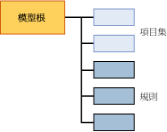

# 關聯模型的採礦模型內容 (Analysis Services - 資料採礦)
  本主題說明使用 [!INCLUDE[msCoName](../../includes/msconame-md.md)] 關聯規則演算法的模型專用的採礦模型內容。 如需與適用於所有模型類型採礦模型內容相關的一般及統計詞彙說明，請參閱 [採礦模型內容 &amp;#40;Analysis Services - 資料採礦&amp;#41;](../../analysis-services/data-mining/mining-model-content-analysis-services-data-mining.md)(採礦模型內容 &#40;Analysis Services - 資料採礦&#41;)。  
  
## 了解關聯模型的結構  
 關聯模型有簡單的結構。 每個模型都擁有代表模型及其中繼資料的單一父節點，而每個父節點則擁有項目集和規則的一般清單。 項目集和規則並非組織成樹狀結構，而是先以項目集排列，再以規則排列，如下列圖表所示。  
  
   
  
 每個項目集都是包含在其本身的節點中 (NODE_TYPE = 7)。 「節點」包含項目集的定義、包含此項目集的案例數以及其他資訊。  
  
 每個規則也會包含在其本身的節點中 (NODE_TYPE = 8)。 「規則」描述項目關聯方式的一般模式。 規則與 IF - THEN 陳述式類似。 規則的左側顯示現有的條件或條件集； 規則的右側則顯示資料集中通常與左側的條件相關聯的項目。  
  
 **注意** 如果想要擷取規則或項目集，您可以使用查詢僅傳回所要的節點類型。 如需詳細資訊，請參閱 [關聯模型查詢範例](../../analysis-services/data-mining/association-model-query-examples.md)。  
  
## 關聯模型的模型內容  
 本章節僅針對採礦模型內容中與關聯模型相關的資料行，提供詳細資料和範例。  
  
 如需結構描述資料列集 (例如，MODEL_CATALOG 和 MODEL_NAME) 中之一般用途資料行的詳細資訊，請參閱 [採礦模型內容 &amp;#40;Analysis Services - 資料採礦&amp;#41;](../../analysis-services/data-mining/mining-model-content-analysis-services-data-mining.md)(採礦模型內容 &#40;Analysis Services - 資料採礦&#41;)。  
  
 MODEL_CATALOG  
 模型儲存位置所在資料庫的名稱。  
  
 MODEL_NAME  
 模型的名稱。  
  
 ATTRIBUTE_NAME  
 對應至這個節點之屬性的名稱。  
  
 NODE_NAME  
 節點的名稱。 對於關聯模型而言，此資料行包含與 NODE_UNIQUE_NAME 相同的值。  
  
 NODE_UNIQUE_NAME  
 節點的唯一名稱。  
  
 NODE_TYPE  
 關聯模型僅輸出下列節點類型：  
  
|節點類型識別碼|型別|  
|------------------|----------|  
|1 (模型)|根目錄或父節點。|  
|7 (項目集)|項目集或屬性值組的集合。 範例:   `Product 1 = Existing, Product 2 = Existing`   或   `Gender = Male`(採礦模型內容 &#40;Analysis Services - 資料採礦&#41;)。|  
|8 (規則)|定義項目之間關聯方式的規則。   範例   `Product 1 = Existing, Product 2 = Existing -> Product 3 = Existing`(採礦模型內容 &#40;Analysis Services - 資料採礦&#41;)。|  
  
 NODE_CAPTION  
 與節點關聯的標籤或標題。  
  
 **項目集節點** 逗號分隔的項目清單。  
  
 **規則節點** 包含規則的左側和右側。  
  
 CHILDREN_CARDINALITY  
 指出目前節點的子系數目。  
  
 **父節點** 指出項目集加規則的總數。  
  
> [!NOTE]  
>  若要取得項目集和規則計數的細目，請參閱模型根節點的 NODE_DESCRIPTION。  
  
 **項目集或規則節點** 永遠為 0。  
  
 PARENT_UNIQUE_NAME  
 節點之父系的唯一名稱。  
  
 **父節點** 永遠為 NULL。  
  
 **項目集或規則節點** 永遠為 0。  
  
 NODE_DESCRIPTION  
 節點內容的易記描述。  
  
 **父節點** 包含下列模型相關資訊的逗號分隔清單：  
  
|項目|說明|  
|----------|-----------------|  
|ITEMSET_COUNT|模型中所有項目集的計數。|  
|RULE_COUNT|模型中所有規則的計數。|  
|MIN_SUPPORT|任何單一項目集可用的最小支援。   **注意** 此值可能與您為 *MINIMUM _SUPPORT* 參數設定的值不同。|  
|MAX_SUPPORT|任何單一項目集可用的最大支援。   **注意** 此值可能與您為 *MAXIMUM_SUPPORT* 參數設定的值不同。|  
|MIN_ITEMSET_SIZE|最小項目集的大小，由項目計數表示。   0 值表示會將 **Missing** 狀態視為獨立項目。   **注意** *MINIMUM_ITEMSET_SIZE* 參數的預設值為 1。|  
|MAX_ITEMSET_SIZE|指出找到的最大項目集大小。   **注意** 此值受限於您在建立模型時所設定的 *MAX_ITEMSET_SIZE* 參數值。 此值絕不能超出該值，但可以比該值小。 預設值是 3。|  
|MIN_PROBABILITY|針對模型中任何單一項目集或規則所偵測到的最小機率。   範例：0.400390625   **注意** 對項目集而言，此值一定會比您在建立模型時所設定的 *MINIMUM_PROBABILITY* 參數值大。|  
|MAX_PROBABILITY|針對模型中任何單一項目集或規則所偵測到的最大機率。   範例：1   **注意** 沒有參數可以限制項目集的最大機率。 如果想要排除太常出現的項目，請改用 *MAXIMUM_SUPPORT* 參數。|  
|MIN_LIFT|模型針對任何項目集所提供的最小增益量。   範例：0.14309369632511   注意：了解最小增益量有助於判斷任何項目集的增益是否重要。|  
|MAX_LIFT|模型針對任何項目集所提供的最大增益量。   範例：1.95758227647523 **注意** 了解最大增益量有助於判斷任何項目集的增益是否重要。|  
  
 **項目集節點** 項目集節點包含顯示為逗號分隔文字字串的項目清單。  
  
 範例  
  
 `Touring Tire = Existing, Water Bottle = Existing`  
  
 這表示休閒車輪胎和水壺是一起購買的。  
  
 **規則節點** 規則節點包含規則的左側和右側，並以箭頭分隔。  
  
 範例 `Touring Tire = Existing, Water Bottle = Existing -> Cycling cap = Existing`  
  
 這代表如果有人購買了休閒車輪胎和水壺，則可能也會購買腳踏車帽。  
  
 NODE_RULE  
 XML 片段，描述內嵌於節點中的規則或項目集。  
  
 **父節點** 空白。  
  
 **項目集節點** 空白。  
  
 **規則節點** XML 片段包含有關規則的其他有用資訊，例如支援、信心和項目數，以及代表規則左側之節點的識別碼。  
  
 MARGINAL_RULE  
 空白。  
  
 NODE_PROBABILITY  
 與項目集或規則相關聯的機率或信心分數。  
  
 **父節點** 永遠為 0。  
  
 **項目集節點** 項目集的機率。  
  
 **規則節點** 規則的信心值。  
  
 MARGINAL_PROBABILITY  
 與 NODE_PROBABILITY 相同。  
  
 NODE_DISTRIBUTION  
 根據節點是項目集或規則，資料表會包含非常不同的資訊。  
  
 **父節點** 空白。  
  
 **項目集節點** 列出項目集中的每個項目，並提供機率和支援值。 例如，如果項目集包含兩個產品，則會列出每個產品的名稱以及包含每個產品之案例的計數。  
  
 **規則節點** 包含兩個資料列。 第一個資料列顯示規則右側的屬性 (也就是預測的項目) 以及信心分數。  
  
 第二個資料列是關聯模型所特有；它包含規則右側項目集的指標。 在 ATTRIBUTE_VALUE 資料行中，該指標是表示為僅包含右側項目之項目集的識別碼。  
  
 例如，如果規則為 `If {A,B} Then {C}`，則資料表包含項目 `{C}`的名稱以及項目 C 之項目集的節點識別碼。  
  
 此指標很有用，因為您可以從項目集節點判斷出所有項目中有多少案例包含右側產品。 受規則 `If {A,B} Then {C}` 影響的案例是 `{C}`的項目集中所列案例的子集。  
  
 NODE_SUPPORT  
 支援這個節點的案例數目。  
  
 **父節點** 模型中的案例數。  
  
 **項目集節點** 包含項目集中所有項目之案例的數目。  
  
 **規則節點** 包含規則中所含全部項目之案例的數目。  
  
 MSOLAP_MODEL_COLUMN  
 根據節點是項目集或規則會包含非常不同的資訊。  
  
 **父節點** 空白。  
  
 **項目集節點** 空白。  
  
 **規則節點** 包含規則左側項目之項目集的識別碼。 例如，如果規則是 `If {A,B} Then {C}`，則此資料行會包含僅包含 `{A,B}`之項目集的識別碼。  
  
 MSOLAP_NODE_SCORE  
 **父節點** 空白。  
  
 **項目集節點** 項目集的重要性分數。  
  
 **規則節點** 規則的重要性分數。  
  
> [!NOTE]  
>  項目集和規則的重要性計算方式不同。 如需詳細資訊，請參閱 [Microsoft 關聯分析演算法技術參考](../../analysis-services/data-mining/microsoft-association-algorithm-technical-reference.md)。  
  
 MSOLAP_NODE_SHORT_CAPTION  
 空白。  
  
## 請參閱＜  
 [採礦模型內容 &#40;Analysis Services - 資料採礦&#41;](../../analysis-services/data-mining/mining-model-content-analysis-services-data-mining.md)   
 [Microsoft 關聯分析演算法](../../analysis-services/data-mining/microsoft-association-algorithm.md)   
 [關聯模型查詢範例](../../analysis-services/data-mining/association-model-query-examples.md)  
  
  
