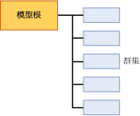

# 叢集模型的採礦模型內容 (Analysis Services - 資料採礦)
[!INCLUDE[ssas-appliesto-sqlas](../../includes/ssas-appliesto-sqlas.md)]
  本主題說明使用 Microsoft 叢集演算法的模型專用的採礦模型內容。 如需適用於所有模型類型的一般採礦模型內容說明，請參閱 [採礦模型內容 &#40;Analysis Services - 資料採礦&#41;](../../analysis-services/data-mining/mining-model-content-analysis-services-data-mining.md)。  
  
## 了解叢集模型的結構  
 叢集模型有簡單的結構。 每個模型都擁有代表模型及其中繼資料的單一父節點，而每個父節點則擁有群集的一般清單 (NODE_TYPE = 5)。 下列影像顯示這個組織。  
  
   
  
 每個子節點都代表單一群集，且包含有關該群集之案例屬性的詳細統計資料。 這包含群集中的案例計數，以及區分此群集與其他群集的值散發。  
  
> [!NOTE]  
>  您不需反覆運算節點來取得群集的計數或描述；模型的父節點也會計算及列出群集。  
  
 父節點包含有用的統計資料，可描述所有培訓案例的實際散發。 這些統計資料可在巢狀資料表資料行 NODE_DISTRIBUTION 中找到。 例如，下表顯示 NODE_DISTRIBUTION 資料表的數個資料列，描述叢集模型 `TM_Clustering`(您在 [資料採礦基本教學課程](http://msdn.microsoft.com/library/6602edb6-d160-43fb-83c8-9df5dddfeb9c)中建立) 的客戶人口統計分佈：  
  
|ATTRIBUTE_NAME|ATRIBUTE_VALUE|SUPPORT|PROBABILITY|VARIANCE|VALUE_TYPE|  
|---------------------|---------------------|-------------|-----------------|--------------|-----------------|  
|Age|遺漏|0|0|0|1 (遺漏)|  
|Age|44.9016152716593|12939|1|125.663453102554|3 (連續)|  
|Gender|遺漏|0|0|0|1 (遺漏)|  
|Gender|F|6350|0.490764355823479|0|4 (離散)|  
|Gender|M|6589|0.509235644176521|0|4 (離散)|  
  
 從這些結果可以看到建置模型時使用了 12939 個案例、男女比率約為 50-50，平均年齡則為 44。 描述性統計資料是根據報告的屬性是否為連續的數值資料類型 (例如 age) 或離散值類型 (例如 gender) 而定。 連續資料類型會計算統計量值「平均值」和「變異數」，離散資料類型則會計算「機率」和「支援」。  
  
> [!NOTE]  
>  變異數代表叢集的總變異數。 當變異數的值很小時，代表資料行中大多數的值都相當接近平均值。 若要取得標準差，請計算變異數的平方根。  
  
 請注意，每個屬性都有一個 **遺漏** 值類型，告訴您該屬性有多少沒有資料的案例。 遺漏的資料可能很多，而且視資料類型而會對計算造成不同的影響。 如需詳細資訊，請參閱[遺漏值 &#40;Analysis Services - 資料採礦&#41;](../../analysis-services/data-mining/missing-values-analysis-services-data-mining.md)。  
  
## 叢集模型的模型內容  
 本章節僅針對採礦模型內容中與叢集模型相關的資料行，提供詳細資料和範例。  
  
 如需結構描述資料列集 (例如，MODEL_CATALOG 和 MODEL_NAME) 中之一般用途資料行的資訊，請參閱 [採礦模型內容 &#40;Analysis Services - 資料採礦&#41;](../../analysis-services/data-mining/mining-model-content-analysis-services-data-mining.md)。  
  
 MODEL_CATALOG  
 模型儲存位置所在資料庫的名稱。  
  
 MODEL_NAME  
 模型的名稱。  
  
 ATTRIBUTE_NAME  
 在叢集模型中永遠為空白，因為模式中沒有可預測的屬性。  
  
 NODE_NAME  
 永遠與 NODE_UNIQUE_NAME 相同。  
  
 NODE_UNIQUE_NAME  
 節點在模型內的唯一識別項。 這項值不能被改變。  
  
 NODE_TYPE  
 叢集模型會輸出下列節點類型：  
  
|節點識別碼和名稱|Description|  
|----------------------|-----------------|  
|1 (模型)|模型的根節點。|  
|5 (群集)|包含群集中的案例計數、群集中的案例特性以及描述群集值的統計資料。|  
  
 NODE_CAPTION  
 提供顯示用途的好記名稱。 在建立模型時，NODE_UNIQUE_NAME 的值會自動用來當做標題。 不過，您可以用程式設計的方式或使用檢視器來變更 NODE_CAPTION 的值，以更新群集的顯示名稱。  
  
> [!NOTE]  
>  在重新處理模型時，所有的名稱變更都會由新值所覆寫。 您不能在模型中保存名稱，或者在不同版本的模型之間追蹤群集成員資格的變更。  
  
 CHILDREN_CARDINALITY  
 節點所擁有子系數目的估計。  
  
 **父節點** ：指出模型中的叢集數。  
  
 **分葉節點** ：永遠為 0。  
  
 PARENT_UNIQUE_NAME  
 節點之父系的唯一名稱。  
  
 **父節點** ：永遠為 NULL  
  
 **叢集節點** ：通常為 000。  
  
 NODE_DESCRIPTION  
 節點的描述。  
  
 **父節點** ：永遠為 **(All)**。  
  
 **叢集節點** ：將叢集與其他叢集加以區分之主要屬性的逗號分隔清單。  
  
 NODE_RULE  
 不用於叢集模型。  
  
 MARGINAL_RULE  
 不用於叢集模型。  
  
 NODE_PROBABILITY  
 與此節點關聯的機率。 **父節點** ：永遠為 1。  
  
 **叢集節點** ：機率代表屬性的複合機率，且依用來建立叢集模型的演算法不同而有一些調整。  
  
 MARGINAL_PROBABILITY  
 從父節點到達節點的機率。 在叢集模型中，臨界機率永遠與節點機率相同。  
  
 NODE_DISTRIBUTION  
 包含節點之機率長條圖的資料表。  
  
 **父節點** ：請參閱本主題的簡介。  
  
 **叢集節點** ：代表此叢集所含案例的屬性及值的分佈。  
  
 NODE_SUPPORT  
 支援這個節點的案例數目。 **父節點** ：指出整個模型的定型案例數目。  
  
 **叢集節點** ：以案例數指出叢集大小。  
  
 **注意** ：如果模型使用 K-Means 叢集，則每個案例都可以僅屬於一個叢集。 不過，如果模型使用 EM 群集，則每個案例都可以屬於不同的群集，且會針對案例所屬的每個群集為該案例指派一個加權距離。 因此，對於 EM 模型而言，個別群集的支援總和會大於整體模型的支援。  
  
 MSOLAP_MODEL_COLUMN  
 不用於叢集模型。  
  
 MSOLAP_NODE_SCORE  
 顯示與節點相關聯的分數。  
  
 **父節點** ：叢集模型的 Bayesian Information Criterion (BIC) 分數。  
  
 **分葉節點** ：永遠為 0。  
  
 MSOLAP_NODE_SHORT_CAPTION  
 主要用於顯示用途。 您無法變更此標題。  
  
 **父節點** ：模型的類型：叢集模型  
  
 **叢集節點** ：叢集的名稱。 範例：群集 1。  
  
## 備註  
 [!INCLUDE[ssASnoversion](../../includes/ssasnoversion-md.md)] 提供多種建立叢集模型的方法。 如果您不知道所使用的模型是用什麼方法建立的，可以用程式設計的方式、使用 ADOMD 用戶端或 AMO 或者查詢資料採礦結構描述的資料列集，來擷取模型的中繼資料。 如需詳細資訊，請參閱 [查詢用於建立採礦模型的參數](../../analysis-services/data-mining/query-the-parameters-used-to-create-a-mining-model.md)。  
  
> [!NOTE]  
>  不論您使用的叢集方法或參數為何，模型的結構和內容都會保持相同。  
  
## 另請參閱  
 [採礦模型內容 & #40;Analysis Services-資料採礦 & #41;](../../analysis-services/data-mining/mining-model-content-analysis-services-data-mining.md)   
 [資料採礦模型檢視器](../../analysis-services/data-mining/data-mining-model-viewers.md)   
 [Microsoft 群集演算法](../../analysis-services/data-mining/microsoft-clustering-algorithm.md)   
 [資料採礦查詢](../../analysis-services/data-mining/data-mining-queries.md)  
  
  
