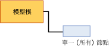

# 線性迴歸模型的採礦模型內容 (Analysis Services - 資料採礦)
  本主題描述使用 [!INCLUDE[msCoName](../../includes/msconame-md.md)] 線性迴歸演算法的模型專用的採礦模型內容。 如需適用於所有模型類型的一般採礦模型內容說明，請參閱 [採礦模型內容 &#40;Analysis Services - 資料採礦&#41;](../../analysis-services/data-mining/mining-model-content-analysis-services-data-mining.md)。  
  
## 了解線性迴歸模型的結構  
 線性迴歸模型的結構相當簡單。 每個模型都擁有代表模型及其中繼資料的單一父節點，以及包含每個可預測屬性之迴歸公式的迴歸樹模式 (NODE_TYPE = 25)。  
  
   
  
 線性迴歸模型使用與 [!INCLUDE[msCoName](../../includes/msconame-md.md)] 決策樹相同的演算法，但是使用不同的參數來限制樹狀結構，而且只有連續的屬性會當作輸入接受。 不過，線性迴歸模式是以 [!INCLUDE[msCoName](../../includes/msconame-md.md)] 決策樹演算法為基礎；因此，線性迴歸模型會使用 [!INCLUDE[msCoName](../../includes/msconame-md.md)] 決策樹檢視器顯示。 如需相關資訊，請參閱 [使用 Microsoft 樹狀檢視器瀏覽模型](../../analysis-services/data-mining/browse-a-model-using-the-microsoft-tree-viewer.md)。  
  
 下節說明如何解譯迴歸公式節點中的資訊。 此資訊不僅適用於線性迴歸模型，也適用於部分樹狀結構中包含迴歸的決策樹模型。  
  
## 線性迴歸模型的模型內容  
 本節僅針對採礦模型內容中與線性迴歸具有特定相關的資料行，提供詳細資料和範例。  
  
 如需結構描述資料列集中一般用途資料行的資訊，請參閱 [採礦模型內容 &#40;Analysis Services - 資料採礦&#41;](../../analysis-services/data-mining/mining-model-content-analysis-services-data-mining.md)。  
  
 MODEL_CATALOG  
 模型儲存位置所在資料庫的名稱。  
  
 MODEL_NAME  
 模型的名稱。  
  
 ATTRIBUTE_NAME  
 **根節點** ：空白  
  
 **迴歸節點** ：可預測屬性的名稱。  
  
 NODE_NAME  
 永遠與 NODE_UNIQUE_NAME 相同。  
  
 NODE_UNIQUE_NAME  
 節點在模型內的唯一識別項。 這項值不能被改變。  
  
 NODE_TYPE  
 線性迴歸模型會輸出下列節點類型：  
  
|節點類型識別碼|型別|說明|  
|------------------|----------|-----------------|  
|25|迴歸樹根節點|包含描述輸入和輸出變數之間關聯性的公式。|  
  
 NODE_CAPTION  
 與節點關聯的標籤或標題。 這個屬性主要是供顯示之用。  
  
 **根節點** ：空白  
  
 **迴歸節點** ：全部。  
  
 CHILDREN_CARDINALITY  
 節點所擁有子系數目的估計。  
  
 **根節點** ：指出迴歸節點的數目。 在模型中，每個可預測的屬性都會建立一個迴歸節點。  
  
 **迴歸節點** ：一律為 0。  
  
 PARENT_UNIQUE_NAME  
 節點之父系的唯一名稱。 任何根層級的節點都會傳回 NULL。  
  
 NODE_DESCRIPTION  
 節點的描述。  
  
 **根節點** ：空白  
  
 **迴歸節點** ：全部。  
  
 NODE_RULE  
 未用於線性迴歸模型。  
  
 MARGINAL_RULE  
 未用於線性迴歸模型。  
  
 NODE_PROBABILITY  
 與此節點關聯的機率。  
  
 **根節點** ：0  
  
 **迴歸節點** ：1  
  
 MARGINAL_PROBABILITY  
 從父節點到達節點的機率。  
  
 **根節點** ：0  
  
 **迴歸節點** ：1  
  
 NODE_DISTRIBUTION  
 提供節點中關於值之統計資料的巢狀資料表。  
  
 **根節點** ：0  
  
 **迴歸節點** ：包含建立迴歸公式所使用之元素的資料表。 迴歸節點包含下列值類型：  
  
|VALUETYPE|  
|---------------|  
|1 (遺漏)|  
|3 (連續)|  
|7 (係數)|  
|8 (得分)|  
|9 (統計資料)|  
|11 (截距)|  
  
 NODE_SUPPORT  
 支援這個節點的案例數目。  
  
 **根節點** ：0  
  
 **迴歸節點** ：定型案例的計數。  
  
 MSOLAP_MODEL_COLUMN  
 可預測屬性的名稱。  
  
 MSOLAP_NODE_SCORE  
 與 NODE_PROBABILITY 相同  
  
 MSOLAP_NODE_SHORT_CAPTION  
 用於顯示用途的標籤。  
  
## 備註  
 當您使用 [!INCLUDE[msCoName](../../includes/msconame-md.md)] 線性迴歸演算法建立模型時，資料採礦引擎會建立一個特殊的決策樹模型執行個體，並提供包含樹狀結構的參數以便將所有定型資料包含在單一節點中。 所有連續輸入都會加上旗標，並評估為潛在的迴歸輸入變數，但只有符合資料的迴歸輸入變數會保留為最終模型中的迴歸輸入變數。 此分析會針對每個迴歸輸入變數產生單一的迴歸公式，或不產生任何迴歸公式。  
  
 您可以按一下 [[Microsoft 樹狀檢視器]](../../analysis-services/data-mining/browse-a-model-using-the-microsoft-tree-viewer.md) 中的 [(全部)] 節點，檢視 [採礦圖例] 中的完整迴歸公式。  
  
 同時，當您建立包含連續可預測屬性的決策樹模型時，有時候樹狀結構所擁有的迴歸節點會共用迴歸樹根節點的屬性。  
  
##   連續屬性的節點分佈  
 迴歸節點中大部分重要的資訊都包含在 NODE_DISTRIBUTION 資料表中。 下列範例說明 NODE_DISTRIBUTION 資料表的配置。 在此範例中，已使用目標郵寄採礦結構建立線性迴歸模型，根據年齡預測客戶收入。 此模型僅用於說明，因為該模型可以使用現有的 [!INCLUDE[ssSampleDBnormal](../../includes/sssampledbnormal-md.md)] 範例資料和採礦結構輕鬆建立。  
  
|ATTRIBUTE_NAME|ATTRIBUTE_VALUE|SUPPORT|PROBABILITY|VARIANCE|VALUETYPE|  
|---------------------|----------------------|-------------|-----------------|--------------|---------------|  
|Yearly Income|遺漏|0|0.000457142857142857|0|1|  
|Yearly Income|57220.8876687257|17484|0.999542857142857|1041275619.52776|3|  
|Age|471.687717702463|0|0|126.969442359327|7|  
|Age|234.680904692439|0|0|0|8|  
|Age|45.4269617936399|0|0|126.969442359327|9|  
||35793.5477381267|0|0|1012968919.28372|11|  
  
 NODE_DISTRIBUTION 資料表包含多個資料列，每個資料列都會依照變數分組。 前兩個資料列的值類型永遠是 1 和 3，而且會描述目標屬性。 之後的資料列會提供特定「迴歸輸入變數」公式的詳細資料。 迴歸輸入變數是一種輸入變數，其中包含與輸出變數的線性關聯性。 您可以擁有多個迴歸輸入變數，而且每個迴歸輸入變數對於係數 (VALUETYPE = 7)、得分 (VALUETYPE = 8) 以及統計資料 (VALUETYPE = 9) 都有個別的資料列。 最後，資料表所擁有的資料列包含方程式的截距 (VALUETYPE = 11)。  
  
### 迴歸公式的元素  
 NODE_DISTRIBUTION 巢狀資料表在個別的資料列中，包含迴歸公式的每個元素。 範例結果中資料的前兩個資料列包含可預測屬性 [年收入] 的資訊，該屬性會製作相依變數的模型。 SUPPORT 資料行會顯示支援此屬性兩個狀態之案例的計數：提供 [年收入] 值，或遺漏 [年收入] 值。  
  
 VARIANCE 資料行會告訴您可預測屬性的計算變異數。 「變異數」是在給定預期分佈的情況下，值如何在範例中散佈的量值。 此處的變異數會透過從平均值取得平方差的平均值來計算。 變異數的平方根也就是所謂的標準差。 [!INCLUDE[ssASnoversion](../../includes/ssasnoversion-md.md)] 不提供標準差，但是您可以輕易地計算出來。  
  
 對於每個迴歸輸入變數，系統會輸出三個資料列。 這些資料列包含係數、得分以及迴歸輸入變數統計資料。  
  
 最後，資料表所包含的資料列會提供方程式的截距。  
  
#### Coefficient  
 每個迴歸輸入變數都會計算出一個係數 (VALUETYPE = 7)。 係數本身會出現在 ATTRIBUTE_VALUE 資料行中，而 VARIANCE 資料行會告訴您係數的變異數。 系統會計算係數以便將線性最大化。  
  
#### 得分  
 每個迴歸輸入變數的得分 (VALUETYPE = 8) 都代表屬性的有趣性分數。 您可以使用這個值估計多個迴歸輸入變數的實用性。  
  
#### Statistics  
 迴歸輸入變數統計資料 (VALUETYPE = 9) 是擁有值之案例的屬性平均值。 ATTRIBUTE_VALUE 資料行包含平均值本身，而 VARIANCE 資料行包含平均值偏差的總和。  
  
#### Intercept  
 迴歸方程式中的「截距」(VALUETYPE = 11) 或「剩餘」會在輸入屬性所在的點，告訴您可預測屬性的值為 0。 在許多情況下，這可能不會發生，但是可能會導致反直覺式的結果。  
  
 例如，在根據年齡預測收入的模型中得知年齡為 0 的收入是毫無用處的。 在實際生活中，了解關於平均值的線性行為通常比較實用。 因此，[!INCLUDE[ssNoVersion](../../includes/ssnoversion-md.md)] [!INCLUDE[ssASnoversion](../../includes/ssasnoversion-md.md)] 會修改截距，以便說明每個迴歸輸入變數與平均值的關聯性。  
  
 這種調整很難在採礦模型內容中看出來，但是如果您在 [Microsoft 樹狀檢視器] 的 [採礦圖例] 中檢視完整的方程式就很明顯。 迴歸公式會從 0 點移位到代表平均值的點。 這會讓目前的資料以更直覺的方式呈現。  
  
 因此，假設平均年齡為 45 歲左右，迴歸公式的截距 (VALUETYPE = 11) 會告訴您平均收入。  
  
## 請參閱＜  
 [採礦模型內容 &#40;Analysis Services - 資料採礦&#41;](../../analysis-services/data-mining/mining-model-content-analysis-services-data-mining.md)   
 [Microsoft 線性迴歸演算法](../../analysis-services/data-mining/microsoft-linear-regression-algorithm.md)   
 [Microsoft 線性迴歸演算法技術參考](../../analysis-services/data-mining/microsoft-linear-regression-algorithm-technical-reference.md)   
 [線性迴歸模型查詢範例](../../analysis-services/data-mining/linear-regression-model-query-examples.md)  
  
  
