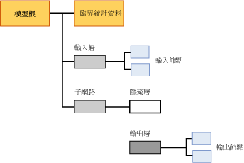

# Mining Model Content for Logistic Regression Models
[!INCLUDE[ssas-appliesto-sqlas](../../includes/ssas-appliesto-sqlas.md)]
本主題描述使用 Microsoft 羅吉斯迴歸演算法的模型專用的採礦模型內容。 如需如何解譯所有模型類型共用的統計資料與結構的說明，以及與採礦模型內容相關的一般詞彙說明，請參閱[採礦模型內容 &#40;Analysis Services - 資料採礦&#41;](../../analysis-services/data-mining/mining-model-content-analysis-services-data-mining.md)。  
  
## 了解羅吉斯迴歸模型的結構  
 羅吉斯迴歸模型是使用 Microsoft 類神經網路演算法建立的，其參數會強迫模型刪除隱藏的節點。 因此，羅吉斯迴歸模型的完整結構幾乎與類神經網路的結構相同：每個模型都有代表模型及其中繼資料的單一父節點，以及一個特殊的臨界統計資料節點 (NODE_TYPE = 24)，提供模型中所使用之輸入的名數性統計資料。  
  
 此外，每個可預測屬性的模型都包含一個子網路 (NODE_TYPE = 17)。 如同在類神經網路模型中，每個子網路永遠都包含兩個分支：其中一個用於輸入層，而另一個包含隱藏層 (NODE_TYPE = 19) 和輸出層 (NODE_TYPE = 20) 的分支則用於網路。 如果屬性指定為僅預測，相同的子網路則可用於多個屬性。 同時為輸入的可預測屬性可能不會出現在相同的子網路中。  
  
 不過，在羅吉斯迴歸模型中，代表隱藏層的節點是空的，而且沒有子系。 因此，此模型包含代表個別輸出 (NODE_TYPE = 23) 與個別輸入 (NODE_TYPE = 21) 的節點，但是不包含個別的隱藏節點。  
  
   
  
 根據預設，羅吉斯迴歸模型顯示在 **[Microsoft 類神經網路檢視器]**中。 您可以利用這個自訂的檢視器，篩選輸入屬性及其值，並以圖形方式查看這些屬性和值如何影響輸出。 檢視器中的工具提示會顯示與每個成對輸入和輸出值相關聯的機率與增益。 如需詳細資訊，請參閱 [使用 Microsoft 類神經網路檢視器瀏覽模型](../../analysis-services/data-mining/browse-a-model-using-the-microsoft-neural-network-viewer.md)。  
  
 若要探討輸入和子網路的結構以及查看詳細的統計資料，您可以使用 Microsoft 一般內容樹狀檢視器。 您可以按一下任何節點將其展開並查看其子節點，或檢視包含在節點中的加權和其他統計資料。  
  
## 羅吉斯迴歸模型的模型內容  
 本節僅針對採礦模型內容中與羅吉斯迴歸具有特定相關的資料行，提供詳細資料和範例。 此模型內容與類神經網路模型的內容幾乎相同，但是為了方便，適用於類神經網路模型的描述在此資料表中可能會重複。  
  
 如需結構描述資料列集 (例如 MODEL_CATALOG 和 MODEL_NAME) 中一般用途資料行的詳細資訊 (此處沒有說明)，或採礦模型術語的說明，請參閱 [Mining Model Content &#40;Analysis Services - Data Mining&#41;](../../analysis-services/data-mining/mining-model-content-analysis-services-data-mining.md) (採礦模型內容 &#40;Analysis Services - 資料採礦&#41;)。  
  
 MODEL_CATALOG  
 模型儲存位置所在資料庫的名稱。  
  
 MODEL_NAME  
 模型的名稱。  
  
 ATTRIBUTE_NAME  
 對應至這個節點之屬性的名稱。  
  
|節點|內容|  
|----------|-------------|  
|模型根|空白|  
|臨界統計資料|空白|  
|輸入層|空白|  
|輸入節點|輸入屬性名稱|  
|hidden layer|空白|  
|輸出層|空白|  
|輸出節點|輸出屬性名稱|  
  
 NODE_NAME  
 節點的名稱。 目前，此資料行與 NODE_UNIQUE_NAME 包含相同的值，但是未來的版本可能會變更。  
  
 NODE_UNIQUE_NAME  
 節點的唯一名稱。  
  
 如需有關名稱與識別碼如何提供模型之結構資訊的詳細資訊，請參閱＜ [使用節點名稱與識別碼](#bkmk_NodeIDs)＞一節。  
  
 NODE_TYPE  
 羅吉斯迴歸模型會輸出下列節點類型：  
  
|節點類型識別碼|說明|  
|------------------|-----------------|  
|1|模型。|  
|17|子網路的組合管理節點。|  
|18|輸入層的組合管理節點。|  
|19|隱藏層的組合管理節點。 隱藏層是空的。|  
|20|輸出層的組合管理節點。|  
|21|輸入屬性節點。|  
|23|輸出屬性節點。|  
|24|臨界統計資料節點。|  
  
 NODE_CAPTION  
 與節點關聯的標籤或標題。 在羅吉斯迴歸模型中，永遠為空白。  
  
 CHILDREN_CARDINALITY  
 節點所擁有子系數目的估計。  
  
|節點|內容|  
|----------|-------------|  
|模型根|指出子節點的計數，其中至少包含 1 個網路、1 個必要的臨界節點，以及 1 個必要的輸入層。 例如，如果值為 5，則有 3 個子網路。|  
|臨界統計資料|一律是 0。|  
|輸入層|指出模型使用之輸入屬性和值配對的數目。|  
|輸入節點|一律是 0。|  
|hidden layer|在羅吉斯迴歸模型中，永遠為 0。|  
|輸出層|指出輸出值的數目。|  
|輸出節點|一律是 0。|  
  
 PARENT_UNIQUE_NAME  
 節點之父系的唯一名稱。 任何根層級的節點都會傳回 NULL。  
  
 如需有關名稱與識別碼如何提供模型之結構資訊的詳細資訊，請參閱＜ [使用節點名稱與識別碼](#bkmk_NodeIDs)＞一節。  
  
 NODE_DESCRIPTION  
 使用者易記的節點描述。  
  
|節點|內容|  
|----------|-------------|  
|模型根|空白|  
|臨界統計資料|空白|  
|輸入層|空白|  
|輸入節點|輸入屬性名稱|  
|hidden layer|空白|  
|輸出層|空白|  
|輸出節點|如果輸出屬性是連續的，則包含輸出屬性的名稱。   如果輸出屬性是離散或離散化的，則包含輸出屬性的名稱和值。|  
  
 NODE_RULE  
 節點中內嵌之規則的 XML 描述。  
  
|節點|內容|  
|----------|-------------|  
|模型根|空白|  
|臨界統計資料|空白|  
|輸入層|空白|  
|輸入節點|包含與 NODE_DESCRIPTION 資料行資訊相同的 XML 片段。|  
|hidden layer|空白|  
|輸出層|空白|  
|輸出節點|包含與 NODE_DESCRIPTION 資料行資訊相同的 XML 片段。|  
  
 MARGINAL_RULE  
 若是羅吉斯迴歸模型，永遠為空白。  
  
 NODE_PROBABILITY  
 與此節點關聯的機率。 若是羅吉斯迴歸模型，永遠為 0。  
  
 MARGINAL_PROBABILITY  
 從父節點到達節點的機率。 若是羅吉斯迴歸模型，永遠為 0。  
  
 NODE_DISTRIBUTION  
 包含節點之統計資訊的巢狀資料表。 如需每個節點類型之這個資料表內容的詳細資訊，請參閱 [類神經網路模型的採礦模型內容 &#40;Analysis Services - 資料採礦&#41;](../../analysis-services/data-mining/mining-model-content-for-neural-network-models-analysis-services-data-mining.md)。  
  
 NODE_SUPPORT  
 若是羅吉斯迴歸模型，永遠為 0。  
  
> [!NOTE]  
>  支援機率永遠為 0，因為此模型類型的輸出不是機率。 對於演算法唯一有意義的事情是加權，因此，此演算法不會計算機率、支援或變異數。  
  
 若要在特定值的定型案例中取得支援的相關資訊，請查看臨界統計資料節點。  
  
 MSOLAP_MODEL_COLUMN  
 |節點|內容|  
|----------|-------------|  
|模型根|空白|  
|臨界統計資料|空白|  
|輸入層|空白|  
|輸入節點|輸入屬性名稱。|  
|hidden layer|空白|  
|輸出層|空白|  
|輸出節點|輸入屬性名稱。|  
  
 MSOLAP_NODE_SCORE  
 在羅吉斯迴歸模型中，永遠為 0。  
  
 MSOLAP_NODE_SHORT_CAPTION  
 在羅吉斯迴歸模型中，永遠為空白。  
  
##   使用節點名稱與識別碼  
 在羅吉斯迴歸模型中之節點的命名，可提供模型中節點間之關聯性的其他資訊。 下表顯示指派給每層節點之識別碼的慣例。  
  
|節點類型|節點識別碼的慣例|  
|---------------|----------------------------|  
|模型根 (1)|00000000000000000.|  
|臨界統計資料節點 (24)|10000000000000000|  
|輸入層 (18)|30000000000000000|  
|輸入節點 (21)|從 60000000000000000 開始|  
|子網路 (17)|20000000000000000|  
|隱藏層 (19)|40000000000000000|  
|輸出層 (20)|50000000000000000|  
|輸出節點 (23)|從 80000000000000000 開始|  
  
 您可以使用這些識別碼，透過檢視輸出節點的 NODE_DISTRIBUTION 資料表，來判斷輸出屬性如何與特定輸入層屬性產生關聯。 該資料表中的每個資料列都包含一個識別碼，可指回特定的輸入屬性節點。 NODE_DISTRIBUTION 資料表也包含該輸入和輸出配對的係數。  
  
## 另請參閱  
 [Microsoft 羅吉斯迴歸演算法](../../analysis-services/data-mining/microsoft-logistic-regression-algorithm.md)   
 [類神經網路模型的採礦模型內容 &#40;Analysis Services - 資料採礦&#41;](../../analysis-services/data-mining/mining-model-content-for-neural-network-models-analysis-services-data-mining.md)   
 [羅吉斯迴歸模型查詢範例](../../analysis-services/data-mining/logistic-regression-model-query-examples.md)   
 [Microsoft 羅吉斯迴歸演算法技術參考](../../analysis-services/data-mining/microsoft-logistic-regression-algorithm-technical-reference.md)  
  
  
