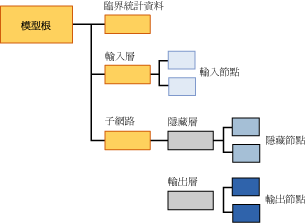

# 類神經網路模型的採礦模型內容 (Analysis Services - 資料採礦)
[!INCLUDE[ssas-appliesto-sqlas](../../includes/ssas-appliesto-sqlas.md)]
  本主題描述使用 Microsoft 類神經網路演算法的模型專用的採礦模型內容。 如需如何解譯所有模型類型共用的統計資料與結構的說明，以及與採礦模型內容相關的一般詞彙說明，請參閱 [Mining Model Content &#40;Analysis Services - Data Mining&#41;](../../analysis-services/data-mining/mining-model-content-analysis-services-data-mining.md) (採礦模型內容 &#40;Analysis Services - 資料採礦&#41;)。  
  
## 了解類神經網路模型的結構  
 每個類神經網路模型都有一個代表模型及其中繼資料的單一父節點，以及一個提供輸入屬性之相關描述性統計資料的臨界統計資料節點 (NODE_TYPE = 24)。 臨界統計資料節點相當實用，因為該節點摘要輸入的相關資訊，您就不需要從個別節點查詢資料。  
  
 在這兩個節點下面，至少還有兩個節點，可能更多，取決於模型的可預測屬性數量。  
  
-   第一個節點 (NODE_TYPE = 18) 永遠代表輸入層的最上層節點。 在這個最上層節點之下，您可以找到包含實際輸入屬性及其值的輸入節點 (NODE_TYPE = 21)。  
  
-   每個後續節點都包含不同的「子網路」 (NODE_TYPE = 17)。 每個子網路永遠包含一個隱藏層 (NODE_TYPE = 19)，以及一個該子網路的輸出層 (NODE_TYPE = 20)。  
  
   
  
 輸入層中的資訊相當直接：每個輸入層 (NODE_TYPE = 18) 的最上層節點都當做一組輸入節點 (NODE_TYPE = 21) 的組合管理使用。 輸入節點的內容詳述於下表。  
  
 每個子網路 (NODE_TYPE = 17) 都代表輸入層對於特定可預測屬性之影響的分析。 如果有多個可預測輸出，則有多個子網路。 每個子網路的隱藏層都包含多個隱藏節點 (NODE_TYPE = 22)，其中含有在該特定隱藏節點結束之每個轉換的加權詳細資料。  
  
 輸出層 (NODE_TYPE = 20) 包含輸出節點 (NODE_TYPE = 23)，其中每個節點都包含不同的可預測屬性值。 如果可預測屬性為連續的數值資料類型，則屬性只有一個輸出節點。  
  
> [!NOTE]  
>  羅吉斯迴歸演算法使用類神經網路的特殊案例，其中只有一個可預測結果，而且潛在有許多輸入。 羅吉斯迴歸不使用隱藏層。  
  
 瀏覽輸入和子網路結構最簡單的方式就是使用 **Microsoft 一般內容樹狀檢視器**。 您可以按一下任何節點將其展開並查看其子節點，或檢視包含在節點中的加權和其他統計資料。  
  
 若要使用資料並查看模型讓輸入與輸出相互關聯的方式，請使用 **Microsoft 類神經網路檢視器**。 您可以利用這個自訂的檢視器，篩選輸入屬性及其值，並以圖形方式查看這些屬性和值如何影響輸出。 檢視器中的工具提示會顯示與每個成對輸入和輸出值相關聯的機率與增益。 如需詳細資訊，請參閱 [使用 Microsoft 類神經網路檢視器瀏覽模型](../../analysis-services/data-mining/browse-a-model-using-the-microsoft-neural-network-viewer.md)。  
  
## 類神經網路模型的模型內容  
 本節僅針對採礦模型內容中與類神經網路具有特定相關的資料行，提供詳細資料和範例。 如需結構描述資料列集 (例如 MODEL_CATALOG 和 MODEL_NAME) 中一般用途資料行的詳細資訊 (此處沒有說明)，或採礦模型術語的說明，請參閱 [Mining Model Content &#40;Analysis Services - Data Mining&#41;](../../analysis-services/data-mining/mining-model-content-analysis-services-data-mining.md) (採礦模型內容 &#40;Analysis Services - 資料採礦&#41;)。  
  
 MODEL_CATALOG  
 模型儲存位置所在資料庫的名稱。  
  
 MODEL_NAME  
 模型的名稱。  
  
 ATTRIBUTE_NAME  
 對應至這個節點之屬性的名稱。  
  
|節點|內容|  
|----------|-------------|  
|模型根|空白|  
|臨界統計資料|空白|  
|輸入層|空白|  
|輸入節點|輸入屬性名稱|  
|hidden layer|空白|  
|隱藏節點|空白|  
|輸出層|空白|  
|輸出節點|輸出屬性名稱|  
  
 NODE_NAME  
 節點的名稱。 此資料行包含與 NODE_UNIQUE_NAME 相同的值。  
  
 NODE_UNIQUE_NAME  
 節點的唯一名稱。  
  
 如需有關名稱與識別碼如何提供模型之結構資訊的詳細資訊，請參閱＜ [使用節點名稱與識別碼](#bkmk_NodeIDs)＞一節。  
  
 NODE_TYPE  
 類神經網路模型會輸出下列節點類型：  
  
|節點類型識別碼|說明|  
|------------------|-----------------|  
|1|模型。|  
|17|子網路的組合管理節點。|  
|18|輸入層的組合管理節點。|  
|19|隱藏層的組合管理節點。|  
|20|輸出層的組合管理節點。|  
|21|輸入屬性節點。|  
|22|隱藏層節點|  
|23|輸出屬性節點。|  
|24|臨界統計資料節點。|  
  
 NODE_CAPTION  
 與節點關聯的標籤或標題。 在類神經網路模型中，永遠為空白。  
  
 CHILDREN_CARDINALITY  
 節點所擁有子系數目的估計。  
  
|節點|內容|  
|----------|-------------|  
|模型根|指出子節點的計數，其中至少包含 1 個網路、1 個必要的臨界節點，以及 1 個必要的輸入層。 例如，如果值為 5，則有 3 個子網路。|  
|臨界統計資料|一律是 0。|  
|輸入層|指出模型使用之輸入屬性和值配對的數目。|  
|輸入節點|一律是 0。|  
|hidden layer|指出模型建立之隱藏節點的數目。|  
|隱藏節點|一律是 0。|  
|輸出層|指出輸出值的數目。|  
|輸出節點|一律是 0。|  
  
 PARENT_UNIQUE_NAME  
 節點之父系的唯一名稱。 任何根層級的節點都會傳回 NULL。  
  
 如需有關名稱與識別碼如何提供模型之結構資訊的詳細資訊，請參閱＜ [使用節點名稱與識別碼](#bkmk_NodeIDs)＞一節。  
  
 NODE_DESCRIPTION  
 使用者易記的節點描述。  
  
|節點|內容|  
|----------|-------------|  
|模型根|空白|  
|臨界統計資料|空白|  
|輸入層|空白|  
|輸入節點|輸入屬性名稱|  
|hidden layer|空白|  
|隱藏節點|指出隱藏節點清單中，隱藏節點順序的整數。|  
|輸出層|空白|  
|輸出節點|如果輸出屬性是連續的，則包含輸出屬性的名稱。   如果輸出屬性是離散或離散化的，則包含輸出屬性的名稱和值。|  
  
 NODE_RULE  
 節點中內嵌之規則的 XML 描述。  
  
|節點|內容|  
|----------|-------------|  
|模型根|空白|  
|臨界統計資料|空白|  
|輸入層|空白|  
|輸入節點|包含與 NODE_DESCRIPTION 資料行資訊相同的 XML 片段。|  
|hidden layer|空白|  
|隱藏節點|指出隱藏節點清單中，隱藏節點順序的整數。|  
|輸出層|空白|  
|輸出節點|包含與 NODE_DESCRIPTION 資料行資訊相同的 XML 片段。|  
  
 MARGINAL_RULE  
 若是類神經網路模型，永遠為空白。  
  
 NODE_PROBABILITY  
 與此節點關聯的機率。 若是類神經網路模型，永遠為 0。  
  
 MARGINAL_PROBABILITY  
 從父節點到達節點的機率。 若是類神經網路模型，永遠為 0。  
  
 NODE_DISTRIBUTION  
 包含節點之統計資訊的巢狀資料表。 如需每個節點類型之這個資料表內容的詳細資訊，請參閱 [Understanding the NODE_DISTRIBUTION Table](#bkmk_NodeDistTable)(了解 NODE_DISTRIBUTION 資料表) 一節。  
  
 NODE_SUPPORT  
 若是類神經網路模型，永遠為 0。  
  
> [!NOTE]  
>  支援機率永遠為 0，因為此模型類型的輸出不是機率。 對於演算法唯一有意義的是加權，因此，此演算法不會計算機率、支援或變異數。  
  
 若要在特定值的定型案例中取得支援的相關資訊，請查看臨界統計資料節點。  
  
 MSOLAP_MODEL_COLUMN  
 |節點|內容|  
|----------|-------------|  
|模型根|空白|  
|臨界統計資料|空白|  
|輸入層|空白|  
|輸入節點|輸入屬性名稱。|  
|hidden layer|空白|  
|隱藏節點|空白|  
|輸出層|空白|  
|輸出節點|輸入屬性名稱。|  
  
 MSOLAP_NODE_SCORE  
 若是類神經網路模型，永遠為 0。  
  
 MSOLAP_NODE_SHORT_CAPTION  
 若是類神經網路模型，永遠為空白。  
  
## 備註  
 定型類神經網路模型的目的在於判斷與每個轉換關聯的加權 (從輸入到中點，以及從中點到端點)。 因此，模型的輸入層主要存在目的為儲存建立模型所使用的實際值。 隱藏層會儲存經過計算的加權，並提供回到輸入屬性的指標。 輸出層會儲存可預測的值，同時提供回到隱藏層中端點的指標。  
  
##   使用節點名稱與識別碼  
 類神經網路模型中節點的命名提供有關節點類型的其他資訊，讓隱藏層與輸入層更容易產生關聯，並讓輸出層與隱藏層產生關聯。 下表顯示指派給每層節點之識別碼的慣例。  
  
|節點類型|節點識別碼的慣例|  
|---------------|----------------------------|  
|模型根 (1)|00000000000000000.|  
|臨界統計資料節點 (24)|10000000000000000|  
|輸入層 (18)|30000000000000000|  
|輸入節點 (21)|從 60000000000000000 開始|  
|子網路 (17)|20000000000000000|  
|隱藏層 (19)|40000000000000000|  
|隱藏節點 (22)|從 70000000000000000 開始|  
|輸出層 (20)|50000000000000000|  
|輸出節點 (23)|從 80000000000000000 開始|  
  
 您可以檢視隱藏節點 (NODE_TYPE = 22) 中的 NODE_DISTRIBUTION 資料表，來判斷與特定隱藏層節點關聯的輸入屬性。 NODE_DISTRIBUTION 資料表的每個資料列都包含輸入屬性節點的識別碼。  
  
 同樣地，您可以檢視輸出節點 (NODE_TYPE = 23) 中的 NODE_DISTRIBUTION 資料表，來判斷與輸出屬性關聯的隱藏層。 NODE_DISTRIBUTION 資料表的每個資料列都包含隱藏層的識別碼以及相關的係數。  
  
##   解譯 NODE_DISTRIBUTION 資料表中的資訊  
 NODE_DISTRIBUTION 資料表在某些節點中可以是空的。 不過，對於輸入節點、隱藏層節點，以及輸出節點，NODE_DISTRIBUTION 資料表會儲存關於模型的重要與感興趣的資訊。 為協助您解譯這項資訊，NODE_DISTRIBUTION 資料表包含每個資料列的 VALUETYPE 資料行，這些資料列會告訴您 ATTRIBUTE_VALUE 資料行中的值是 [離散 (4)]、[離散化 (5)]，還是 [連續 (3)] 的。  
  
### 輸入節點  
 輸入層包含模型中所使用之屬性每個值的節點。  
  
 **離散屬性** ：此輸入節點僅會將屬性的名稱及其值儲存在 ATTRIBUTE_NAME 和 ATTRIBUTE_VALUE 資料行中。 例如，如果 [Work Shift] 為資料行，系統就會針對模型中使用之資料行的每個值建立個別的節點，例如，AM 和 PM。 每個節點的 NODE_DISTRIBUTION 資料表僅會列出屬性目前的值。  
  
 **離散化數值屬性** ：此輸入節點會儲存屬性的名稱及值，這可能是一個範圍或一個特定的值。 所有值都會以運算式表示，例如，'77.4 - 87.4' 或 ' < 64.0' 用於 [Time Per Issue] 的值。 每個節點的 NODE_DISTRIBUTION 資料表僅會列出屬性目前的值。  
  
 **連續屬性** ：輸入節點會儲存屬性的平均值。 每個節點的 NODE_DISTRIBUTION 資料表僅會列出屬性目前的值。  
  
### 隱藏層節點  
 隱藏層包含節點的變數數目。 在每個節點中，NODE_DISTRIBUTION 資料表在輸入層中都包含隱藏層到節點的對應。 ATTRIBUTE_NAME 資料行包含對應到輸入層中之節點的節點識別碼。 ATTRIBUTE_VALUE 資料行包含與輸入節點和隱藏層節點組合關聯的加權。 資料表中的最後一個資料列包含代表隱藏層中該隱藏節點之加權的係數。  
  
### 輸出節點  
 輸出層包含模型中所使用之每個輸出值的一個輸出節點。 在每個節點中，NODE_DISTRIBUTION 資料表在隱藏層中都包含輸出層到節點的對應。 ATTRIBUTE_NAME 資料行包含對應到隱藏層中之節點的節點識別碼。 ATTRIBUTE_VALUE 資料行包含與輸出節點和隱藏層節點組合關聯的加權。  
  
 NODE_DISTRIBUTION 資料表包含的下列額外資訊取決於屬性的類型為：  
  
 **離散屬性** ：NODE_DISTRIBUTION 資料表的最後兩個資料列包含整個節點的係數，以及屬性目前的值。  
  
 **離散化數值屬性** ：除了屬性的值為一個範圍的值之外，與離散屬性相同。  
  
 **連續屬性** ：NODE_DISTRIBUTION 資料表的最後兩個資料列包含屬性的平均值、整個節點的係數，以及係數的變異數。  
  
## 另請參閱  
 [Microsoft 類神經網路演算法](../../analysis-services/data-mining/microsoft-neural-network-algorithm.md)   
 [Microsoft 類神經網路演算法技術參考](../../analysis-services/data-mining/microsoft-neural-network-algorithm-technical-reference.md)   
 [類神經網路模型查詢範例](../../analysis-services/data-mining/neural-network-model-query-examples.md)  
  
  
