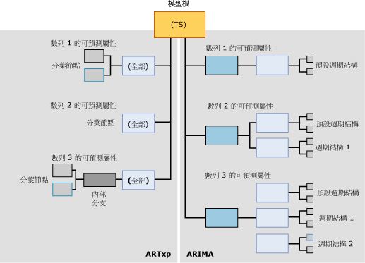

# <a name="mining-model-content-for-time-series-models-analysis-services---data-mining"></a>時間序列模型的採礦模型內容 (Analysis Services - 資料採礦)
  所有採礦模型都會使用相同的結構來儲存其內容。 這個結構是根據資料採礦內容結構描述資料列集所定義。 不過，在該標準結構內，包含資訊的節點會以不同的方式排列，以便代表各種樹狀結構。 本主題描述如何針對以 [!INCLUDE[msCoName](../../includes/msconame-md.md)] 時間序列演算法為基礎的採礦模型組織節點，以及每個節點的意義。  
  
 如需適用於所有模型類型之一般採礦模型內容的說明，請參閱 [採礦模型內容 &#40;Analysis Services - 資料採礦&#41;](../../analysis-services/data-mining/mining-model-content-analysis-services-data-mining.md)。  
  
 檢閱此主題時，您可能會發現透過瀏覽時間序列模型的內容遵循很有用。 您可以完成「資料採礦基本教學課程」，藉以建立時間序列模型。 您在該教學課程中建立的模型是同時使用 ARIMA 和 ARTXP 演算法來定型資料的混合模型。 如需如何檢視採礦模型之內容的資訊，請參閱 [資料採礦模型檢視器](../../analysis-services/data-mining/data-mining-model-viewers.md)。  
  
## <a name="understanding-the-structure-of-a-time-series-model"></a>了解時間序列模型的結構  
 時間序列模型擁有代表模型及其中繼資料的單一父節點。 在該父節點底下，則有一或兩個時間序列樹，端視您用來建立模型的演算法而定。  
  
 如果您建立混合模型，就會在模型中加入兩個個別的樹狀結構：一個用於 ARIMA 而另一個用於 ARTXP。 如果您選擇單獨使用 ARTXP 演算法或單獨使用 ARIMA 演算法，就會擁有對應至該演算法的單一樹狀結構。 您可以透過設定 FORECAST_METHOD 參數，指定要使用的演算法。 如需要使用 ARTXP、ARIMA 或混合模型的詳細資訊，請參閱 [Microsoft 時間序列演算法](../../analysis-services/data-mining/microsoft-time-series-algorithm.md)。  
  
 下圖顯示使用預設設定 (建立混合模型) 所建立的時間序列資料採礦模型範例。 因此，您可以更輕鬆地比較這兩個模型之間的差異。其中，ARTXP 模型顯示於圖表的左側，而 ARIMA 模型顯示於圖表的右側。  雖然 ARTXP 是分割成較小分支的樹狀結構，不過 ARIMA 演算法所建立的結構則更像從較小元件向上建立而成的金字塔。  
  
   
  
 此時要記住的重點是，資訊會以完全不同的方式在 ARIMA 和 ARTXP 樹狀結構內排列，而且您應該將這兩個樹狀結構視為只有在根節點相關。 雖然這兩種表示法是為求方便而以單一模型呈現，不過您應該將它們視為兩個獨立的模型。 ARTXP 代表實際的樹狀結構，但是 ARIMA 則沒有。  
  
 如果您使用 Microsoft 一般模型內容樹狀檢視器來檢視使用 ARTXP 和 ARIMA 的模型，則 ARTXP 和 ARIMA 模型的節點都會呈現為父時間序列模型的子節點。 不過，您可以根據套用至節點的標籤輕鬆加以辨別。  
  
-   第一組節點標示為 (全部)，而且代表 ARTXP 演算法的分析結果。  
  
-   第二組節點則標示為 ARIMA，而且代表 ARIMA 演算法的分析結果。  
  
> [!WARNING]  
>  ARTXP 樹狀結構上的名稱 (全部) 只為了回溯相容性而保留。 在 SQL Server 2008 之前，時間序列演算法會使用單一演算法 (亦即 ARTXP 演算法) 進行分析。  
  
 以下各節說明如何在每一個模型類型中排列節點。  
  
### <a name="structure-of-an-artxp-model"></a>ARTXP 模型的結構  
 ARTXP 演算法會建立類似於決策樹模型的模型。 每當發現重大差異時，它就會分組可預測的屬性並分割這些屬性。 因此，每個 ARTXP 模型都會針對每個可預測的屬性包含個別的分支。 例如，「資料採礦基本教學課程」會建立針對許多地區預測銷售量的模型。 在此情況下，[Amount] 就是可預測的屬性，而且會針對每個地區建立個別的分支。 如果您有兩個可預測的屬性 [Amount] 和 [Quantity]，就會針對每個屬性和地區的組合建立個別的分支。  
  
 ARTXP 分支最上層節點所包含的資訊與決策樹根節點相同。 這項資訊包括該節點的子系數目 (CHILDREN_CARDINALITY)、符合這個節點之條件的案例數目 (NODE_SUPPORT)，以及各種描述性統計資料 (NODE_DISTRIBUTION)。  
  
 如果此節點沒有任何子系，就表示找不到任何明顯條件，可以佐證將案例進一步分成子群組。 此分支會在這點結束，而且該節點就稱為「分葉節點」。 分葉節點包含 ARTXP 公式之建置組塊的屬性、係數和值。  
  
 某些分支可能會有額外的分割，與決策樹模型很相似。 例如，代表歐洲地區銷售額的樹狀結構分支就會分割成兩個分支。 如果導致這兩個群組具有重大差異的條件存在，就會發生分割。 父節點會告知您導致分割之屬性的名稱 (例如 [Amount])，以及父節點中存在的案例數目。 分葉節點會提供更多詳細資料：屬性的值 (例如 [Sales] >10,000 vs. [Sales] < 10,000)、支援每個條件的案例數目，以及 ARTXP 公式。  
  
> [!NOTE]  
>  如果您想要檢視這些公式，可以在分葉節點層級找到完整的迴歸公式，但是在中繼或根節點則找不到。  
  
### <a name="structure-of-an-arima-model"></a>ARIMA 模型的結構  
 ARIMA 演算法會針對每個資料數列 (例如 [Region]) 和可預測屬性 (例如 [Sales Amount]) 的組合建立單一資訊片段：描述可預測屬性隨著時間而變更的方程式。  
  
 每個數列的方程式都衍生自多個元件，而且在資料中找到的每個週期結構都有一個元件。 例如，如果您擁有每月收集的銷售資料，此演算法可能會偵測每月、每季或每年的週期結構。  
  
 此演算法會針對它找到的每個週期性輸出個別的父和子節點集。 預設的週期性是 1 (代表單一時間配量) 而且會自動加入至所有模型中。 您可以透過在 PERIODICITY_HINT 參數中輸入多個值，指定可能的週期結構。 不過，如果此演算法沒有偵測到週期結構，它就不會針對該提示輸出結果。  
  
 模型內容中輸出的每個週期結構都包含下列元件節點：  
  
-   「自動迴歸順序」(Autoregressive Order，AR) 的節點  
  
-   「移動平均」(Moving Average，MA) 的節點  
  
 如需這些詞彙之意義的資訊，請參閱 [Microsoft 時間序列演算法](../../analysis-services/data-mining/microsoft-time-series-algorithm.md)。  
  
 「差異順序」是公式當中的重要部分，而且會以方程式表示。 如需如何使用差異順序的詳細資訊，請參閱 [Microsoft 時間序列演算法技術參考](../../analysis-services/data-mining/microsoft-time-series-algorithm-technical-reference.md)。  
  
## <a name="model-content-for-time-series"></a>時間序列的模型內容  
 本章節僅針對採礦模型內容中與時間序列模型具有特定相關性的資料行，提供詳細資料和範例。  
  
 如需結構描述資料列集 (例如 MODEL_CATALOG 和 MODEL_NAME) 中一般用途資料行的資訊，或採礦模型術語的說明，請參閱 [採礦模型內容 &#40;Analysis Services - 資料採礦&#41;](../../analysis-services/data-mining/mining-model-content-analysis-services-data-mining.md)。  
  
 MODEL_CATALOG  
 模型儲存位置所在資料庫的名稱。  
  
 MODEL_NAME  
 模型的名稱。  
  
 ATTRIBUTE_NAME  
 在節點中表示之資料序列的可預測屬性 (與 MSOLAP_MODEL_COLUMN 的值相同)。  
  
 NODE_NAME  
 節點的名稱。  
  
 目前，此資料行與 NODE_UNIQUE_NAME 包含相同的值，但是未來的版本可能會變更。  
  
 NODE_UNIQUE_NAME  
 節點的唯一名稱。 模型父節點一律名為 **TS**。  
  
 **ARTXP** ：每個節點都由 TS 及緊接在後的十六進位數值表示。 這些節點的順序並不重要。  
  
 例如，直接位於 TS 樹狀結構底下的 ARTXP 節點可能會編號為 TS00000001-TS0000000b。  
  
 **ARIMA** ：ARIMA 樹狀結構中的每個節點都由 TA 及緊接在後的十六進位數值表示。 這些子節點包含父節點的唯一名稱，而且後面接著另一個十六進位數字，代表節點內部的順序。  
  
 所有 ARIMA 樹狀結構的結構都完全相同。 每個根都包含下表所示的節點和命名慣例：  
  
|ARIMA 節點識別碼和類型|節點名稱的範例|  
|----------------------------|--------------------------|  
|ARIMA 根 (27)|TA0000000b|  
|ARIMA 週期結構 (28)|TA0000000b00000000|  
|ARIMA 自動迴歸 (29)|TA0000000b000000000|  
|ARIMA 移動平均 (30)|TA0000000b000000001|  
  
 NODE_TYPE  
 時間序列模型會輸出下列節點類型 (視演算法而定)。  
  
 **ARTXP**  
  
|節點類型識別碼|說明|  
|------------------|-----------------|  
|1 (模型)|時間序列|  
|3 (內部)|代表 ARTXP 時間序列樹中的內部分支。|  
|16 (時間序列樹)|對應至可預測屬性和序列之 ARTXP 樹狀結構的根。|  
|15 (時間序列)|ARTXP 樹狀結構中的分葉節點。|  
  
 **ARIMA**  
  
|節點類型識別碼|說明|  
|------------------|-----------------|  
|27 (ARIMA 根)|ARIMA 樹狀結構的最上層節點。|  
|28 (ARIMA 週期結構)|描述單一週期結構之 ARIMA 樹狀結構的元件。|  
|29 (ARIMA 自動迴歸)|包含單一週期結構的係數。|  
|30 (ARIMA 移動平均)|包含單一週期結構的係數。|  
  
 NODE_CAPTION  
 與節點相關聯的標籤或標題。  
  
 這個屬性主要是供顯示之用。  
  
 **ARTXP** ：包含節點的分割條件，顯示為屬性與值範圍的組合。  
  
 **ARIMA** ：包含 ARIMA 方程式的簡短形式。  
  
 如需 ARIMA 方程式之格式的資訊，請參閱 [ARIMA 的採礦圖例](#bkmk_ARIMA_2)。  
  
 CHILDREN_CARDINALITY  
 節點擁有的直接子系數目。  
  
 PARENT_UNIQUE_NAME  
 節點之父系的唯一名稱。 任何根層級的節點都會傳回 NULL。  
  
 NODE_DESCRIPTION  
 目前節點中規則、分割或公式的文字描述。  
  
 **ARTXP** ：如需詳細資訊，請參閱 [了解 ARTXP 樹狀結構](#bkmk_ARTXP_1)。  
  
 **ARIMA** ：如需詳細資訊，請參閱 [了解 ARIMA 樹狀結構](#bkmk_ARIMA_1)。  
  
 NODE_RULE  
 目前節點中規則、分割或公式的 XML 描述。  
  
 **ARTXP** ：NODE_RULE 通常會對應至 NODE_CAPTION。  
  
 **ARIMA** ：如需詳細資訊，請參閱 [了解 ARIMA 樹狀結構](#bkmk_ARIMA_1)。  
  
 MARGINAL_RULE  
 該節點特有之分割或內容的 XML 描述。  
  
 **ARTXP** ： MARGINAL_RULE 通常會對應至 NODE_DESCRIPTION。  
  
 **ARIMA** ：一律空白，請改用 NODE_RULE。  
  
 NODE_PROBABILITY  
 **ARTXP** ：若為樹狀節點，就一律為 1。 若為分葉節點，則為從模型根節點到達此節點的機率。  
  
 **ARIMA** ：一律為 0。  
  
 MARGINAL_PROBABILITY  
 **ARTXP** ：若為樹狀節點，就一律為 1。 若為分葉節點，則為從直屬父節點到達此節點的機率。  
  
 **ARIMA** ：一律為 0。  
  
 NODE_DISTRIBUTION  
 包含節點之機率長條圖的資料表。 在時間序列模型中，這個巢狀資料表包含組合實際迴歸公式所需的所有元件。  
  
 如需 ARTXP 樹狀結構中節點分佈資料表的詳細資訊，請參閱 [了解 ARTXP 樹狀結構](#bkmk_ARTXP_1)。  
  
 如需 ARIMA 樹狀結構中節點分佈資料表的詳細資訊，請參閱[了解 ARIMA 樹狀結構](#bkmk_ARIMA_1)。  
  
 如果您想要查看撰寫成可讀取格式的所有常數和其他元件，請使用[時間序列檢視器](../../analysis-services/data-mining/browse-a-model-using-the-microsoft-time-series-viewer.md)、按一下節點，然後開啟 [採礦圖例]。  
  
 NODE_SUPPORT  
 支援這個節點的案例數目。  
  
 **ARTXP**：若為 [(全部)] 節點，表示分支所包含之時間配量的總數。  
  
 若為終端節點，則表示 NODE_CAPTION 所描述之範圍所包含的時間配量數目。 終端節點中的時間配量數目一律會加總成分支 [(全部)] 節點的 NODE_SUPPORT 值。  
  
 **ARIMA**：支援目前週期結構的案例計數。 支援的值會在目前週期結構的所有節點中重複。  
  
 MSOLAP_MODEL_COLUMN  
 在節點中表示之資料序列的可預測屬性 (與 ATTRIBUTE_NAME 的值相同)。  
  
 MSOLAP_NODE_SCORE  
 指出樹狀結構或分割之資訊值特性的數值。  
  
 **ARTXP** ：若為沒有分割的節點，值一律為 0.0。 若為含有分割的節點，該值代表分割的有趣性分數。  
  
 如需這些計分方法的詳細資訊，請參閱[特徵選取 &#40;資料採礦&#41;](../../analysis-services/data-mining/feature-selection-data-mining.md)。  
  
 **ARIMA**：ARIMA 模型的 Bayesian Information Criterion (BIC) 分數。 系統會針對與方程式相關的所有 ARIMA 節點設定相同的分數。  
  
 MSOLAP_NODE_SHORT_CAPTION  
 **ARTXP**  ：與 NODE_DESCRIPTION 的資訊相同。  
  
 **ARIMA** ：與 NODE_CAPTION 的資訊相同：亦即 ARIMA 方程式的簡短形式。  
  
##  <a name="bkmk_ARTXP_1"></a> 了解 ARTXP 樹狀結構  
 ARTXP 模型會清楚地分隔線性資料區域與根據某些其他因數分割的資料區域。 只要可預測屬性中的變更可直接表示成獨立變數的函數，迴歸公式就會計算成代表該關聯性。  
  
 例如，如果大部分資料數列的時間和銷售額之間有直接相互關聯性，每個數列就會包含在時間序列樹 (NODE_TYPE =16) 中，該樹的每個資料數列都沒有任何子節點，而只有迴歸方程式。 不過，如果此關聯性不是線性，ARTXP 時間序列樹就可以根據條件分割成子節點，如同決策樹模型一樣。 透過在 [Microsoft 一般內容樹狀檢視器] 中檢視模型內容，您可以查看發生分割的位置，以及分割如何影響趨勢線。  
  
 為了更了解這個行為，您可以檢閱在[資料採礦基本教學課程](http://msdn.microsoft.com/library/6602edb6-d160-43fb-83c8-9df5dddfeb9c)中建立的時間序列模型。 根據 AdventureWorks 資料倉儲的這個模型並不會使用特別複雜的資料。 因此，ARTXP 樹狀結構沒有很多分割。 不過，即使是這種相當簡單的模型也會說明三種不同的分割：  
  
-   太平洋地區的 [Amount] 趨勢線會根據時間索引鍵分割。 根據時間索引鍵分割就表示趨勢中的特定時間點有變更。 趨勢線最多只有到特定時間點是線性，然後曲線就會採用不同的形狀。 例如，某個時間序列可能會持續到 2002 年 8 月 6 日為止，而另一個時間序列則會從該日期之後開始。  
  
-   北美地區的 [Amount] 趨勢線會根據另一個變數分割。 在此情況下，北美的趨勢會根據歐洲地區中相同模型的值分割。 換言之，此演算法偵測出：當歐洲的值變更時，北美的值也會變更。  
  
-   歐洲地區的趨勢線會自行分割。  
  
 每個分割的意義為何？ 解譯模型內容所傳達的資訊是一項需要深入了解資料及其在商務內容中所代表之意義的技術。  
  
-   北美與歐洲地區趨勢之間的明顯連結可能只有代表歐洲的資料序列具有更多 Entropy，導致北美的趨勢看起來較弱。 或者，這兩個趨勢的計分方式沒有任何重大差異，而且相互關聯可能是意外，只是因為先計算歐洲然後再計算北美而已。 不過，您可能會想要檢閱資料並確定相互關聯是否為假，或者查看是否有某些其他因數牽涉其中。  
  
-   根據時間索引鍵分割就表示線條的漸層具有統計上的重大變更。 這項變更可能是數學因數所造成，例如每個範圍的支援，或分割所需之 Entropy 的計算。 因此，在實際的模型意義方面，這種分割可能不重要。 不過，當您檢閱分割中所指出的時間週期時，可能會發現沒有表示在資料中的重要相互關聯，例如在該時間開始而且可能已影響資料的銷售促銷或其他事件。  
  
 如果此資料包含其他屬性，您很可能會在樹狀結構中看見更重要的分支範例。 例如，如果您追蹤了氣象資訊並且使用了該項資訊當做屬性進行分析，可能會在樹狀結構中看見代表銷售額與氣象之複雜互動的多個分割。  
  
 簡而言之，資料採礦對於提供可能會發生重要現象之位置的相關提示很有用，但是您必須進一步調查並運用商務使用者的專業知識才能正確地解譯相關資訊的價值。  
  
### <a name="elements-of-the-artxp-time-series-formula"></a>ARTXP 時間序列公式的元素  
 若要檢視 ARTXP 樹狀結構或分支的完整公式，我們建議您使用 [Microsoft 時間序列檢視器](../../analysis-services/data-mining/browse-a-model-using-the-microsoft-time-series-viewer.md)的 [採礦圖例]，這項功能會以可讀取的格式呈現所有常數。  
  
-   [檢視時間序列模型的公式 &#40;資料採礦&#41;](../../analysis-services/data-mining/view-the-formula-for-a-time-series-model-data-mining.md)  
  
 以下章節將呈現範例方程式並說明基本詞彙。  
  
#### <a name="mining-legend-for-an-artxp-formula"></a>ARTXP 公式的採礦圖例  
 下列範例會針對一部分的模型顯示 ARTXP 公式，如 [採礦圖例] 所示。 若要檢視這個公式，請使用 [Microsoft 時間序列檢視器] 來開啟您在＜資料採礦基本教學課程＞中建立的 [Forecasting] 模型，並按一下 [模型] 索引標籤，然後選取 R250: Europe 資料數列的樹狀結構。  
  
 若要查看此範例所使用的方程式，請按一下代表 2003 年 7 月 5 日當天或之後日期之資料數列的節點。  
  
 樹狀節點方程式的範例：  
  
 `Quantity = 21.322 -0.293 * Quantity(R250 North America,-7) + 0.069 * Quantity(R250 Europe,-1) + 0.023 * Quantity(R250 Europe,-3) -0.142 * Quantity(R750 Europe,-8)`  
  
 在此情況下，21.322 值代表針對 Quantity 預測成下列方程式元素之函數的值。  
  
 例如，某個元素是 `Quantity(R250 North America,-7)`。 這個標記法表示 `t-7`時北美地區的數量，或目前時間配量之前的七個時間配量。 這個資料數列的值會乘以係數 -0.293。 每個元素的係數都是在定型程序期間衍生而且以資料中的趨勢為基礎。  
  
 這個方程式含有多個元素，因為此模型計算出歐洲地區 R250 模型的數量相依於多個其他資料數列的值。  
  
#### <a name="model-content-for-an-artxp-formula"></a>ARTXP 公式的模型內容  
 下表使用 [Microsoft 一般內容樹狀檢視器 &#40;資料採礦&#41;](http://msdn.microsoft.com/library/751b4393-f6fd-48c1-bcef-bdca589ce34c) 中所示的相關節點內容來顯示該公式的相同資訊。  
  
|ATTRIBUTE_NAME|ATTRIBUTE_VALUE|SUPPORT|PROBABILITY|VARIANCE|VALUETYPE|  
|---------------------|----------------------|-------------|-----------------|--------------|---------------|  
|Quantity(R250 Europe,y-intercept)|21.3223433563772|11|0|1.65508795539661|11 (截距)|  
|Quantity(R250 Europe,-1)|0.0691694140876526|0|0|0|7 (係數)|  
|Quantity(R250 Europe,-1)|20.6363635858123|0|0|182.380682874818|9 (統計資料)|  
|Quantity(R750 Europe,-8)|-0.1421203048299|0|0|0|7 (係數)|  
|Quantity(R750 Europe,-8)|22.5454545333019|0|0|104.362130048408|9 (統計資料)|  
|Quantity(R250 Europe,-3)|0.0234095979448281|0|0|0|7 (係數)|  
|Quantity(R250 Europe,-3)|24.8181818883176|0|0|176.475304989169|9 (統計資料)|  
|Quantity(R250 North America,-7)|-0.292914186039869|0|0|0|7 (係數)|  
|Quantity(R250 North America,-7)|10.36363640433|0|0|701.882534898676|9 (統計資料)|  
  
 在您比較這些範例之後，您可以看到採礦模型內容包含 [採礦圖例] 中提供的相同資訊，但是含有「變異數」和「支援」的額外資料行。 支援的值代表支援這個方程式所描述之趨勢的案例計數。  
  
### <a name="using-the-artxp-time-series-formula"></a>使用 ARTXP 時間序列公式  
 對於大部分商務使用者而言，ARTXP 模型內容的價值在於它會結合資料的樹狀檢視和線性表示法。  
  
-   如果可預測屬性中的變更可表示成獨立變數的線性函數，此演算法就會自動計算迴歸方程式並在個別的節點中輸出該數列。  
  
-   只要關聯性無法表示為線性相互關聯，時間序列將會分支成類似決策樹。  
  
 透過在 [Microsoft 時間序列檢視器](../../analysis-services/data-mining/browse-a-model-using-the-microsoft-time-series-viewer.md)中瀏覽模型內容，您可以查看發生分割的位置，以及分割如何影響趨勢線。  
  
 如果任何資料數列部分的時間與銷售額之間存在直接的相互關聯，取得公式的最簡單方式就是從 [採礦圖例] 中複製此公式，然後將它貼入文件或簡報中，以便協助說明模型。 或者，您也可以從該樹狀結構的 NODE_DISTRIBUTION 資料表中擷取平均、係數和其他資訊，然後使用這些資訊來計算趨勢的延伸。 如果整個序列都表現一致的線性關聯性，此方程式就會包含在 (All) 節點中。 如果樹狀結構含有任何分支，此方程式就會包含在分葉節點中。  
  
 下列查詢會從採礦模型中傳回所有 ARTXP 分葉節點，以及包含此方程式的巢狀資料表 NODE_DISTRIBUTION。  
  
```  
SELECT MODEL_NAME, ATTRIBUTE_NAME, NODE_NAME,  
NODE_CAPTION,   
(SELECT ATTRIBUTE_NAME, ATTRIBUTE_VALUE, [VARIANCE], VALUETYPE  
FROM NODE_DISTRIBUTION) as t  
FROM Forecasting.CONTENT  
WHERE NODE_TYPE = 15  
```  
  
##  <a name="bkmk_ARIMA_1"></a> 了解 ARIMA 樹狀結構  
 ARIMA 模型中的每個結構都會對應至「週期性」或「週期結構」。 週期結構是在整個資料序列中重複的資料模式。 在統計限制內，允許此模式產生某些次要變化。 週期性是根據培訓資料內使用的預設時間單位所測量。 例如，如果培訓資料提供每天的銷售資料，預設時間單位就是一天，而且所有週期結構都會定義成指定的天數。  
  
 此演算法所偵測的每個期間都會取得自己的結構節點。 例如，如果您要分析每日銷售資料，此模型可能會偵測代表週的週期結構。 在此情況下，演算法將會在完成的模型中建立兩個週期結構：一個代表預設每日期間 (以 {1} 表示)，而另一個則代表週 (以 {7} 表示)。  
  
 例如，下列查詢會從採礦模型中傳回所有 ARIMA 結構。  
  
```  
SELECT MODEL_NAME, ATTRIBUTE_NAME, NODE_NAME, NODE_CAPTION  
FROM Forecasting.CONTENT  
WHERE NODE_TYPE = 27  
```  
  
 範例結果：  
  
|MODEL_NAME|ATTRIBUTE_NAME|NODE_NAME|NODE_TYPE|NODE_CAPTION|  
|-----------------|---------------------|----------------|----------------|-------------------|  
|Forecasting|M200 Europe:Quantity|TA00000000|27|ARIMA (1,0,1)|  
|Forecasting|M200 North America:Quantity|TA00000001|27|ARIMA (1,0,4) X (1,1,4)(6)|  
|Forecasting|M200 Pacific:Quantity|TA00000002|27|ARIMA (2,0,8) X (1,0,0)(4)|  
|Forecasting|M200 Pacific:Quantity|TA00000002|27|ARIMA (2,0,8) X (1,0,0)(4)|  
|Forecasting|R250 Europe:Quantity|TA00000003|27|ARIMA (1,0,7)|  
|Forecasting|R250 North America:Quantity|TA00000004|27|ARIMA (1,0,2)|  
|Forecasting|R250 Pacific:Quantity|TA00000005|27|ARIMA (2,0,2) X (1,1,2)(12)|  
|Forecasting|R750 Europe:Quantity|TA00000006|27|ARIMA (2,1,1) X (1,1,5)(6)|  
|Forecasting|T1000 Europe:Quantity|TA00000009|27|ARIMA (1,0,1)|  
|Forecasting|T1000 North America:Quantity|TA0000000a|27|ARIMA (1,1,1)|  
|Forecasting|T1`000 Pacific:Quantity|TA0000000b|27|ARIMA (1,0,3)|  
  
 根據這些結果 (您也可以使用 [Microsoft 一般內容樹狀檢視器 &#40;資料採礦&#41;](http://msdn.microsoft.com/library/751b4393-f6fd-48c1-bcef-bdca589ce34c) 來瀏覽)，您可以立即判斷出哪些數列是完全線性、哪些具有多個週期結構，以及發現的週期性為何。  
  
 例如，M200 Europe 序列之 ARIMA 方程式的簡短形式會告知您只有偵測到預設或每日的循環。 此方程式的簡短形式會提供在 NODE_CAPTION 資料行中。  
  
 不過，對於 M200 North America 序列而言，則會找到額外的週期結構。 節點 TA00000001 具有兩個子節點：其中一個含有方程式 (1,0,4)，而另一個則含有方程式 (1,1,4)(6)。 這兩個方程式會在父節點中串連並呈現。  
  
 此模型內容也會針對每個週期結構提供「順序」和「移動平均」當做子節點。 例如，下列查詢會擷取先前範例所列之其中一個節點的子節點。 請注意，資料行 PARENT_UNIQUE_NAME 必須括在括號內，以便與同名的保留關鍵字區別。  
  
```  
SELECT *   
FROM Forecasting.CONTENT  
WHERE [PARENT_UNIQUE_NAME] = ' TA00000001'  
```  
  
 由於這是 ARIMA 樹狀結構而非 ARTXP 樹狀結構，因此您無法使用 [IsDescendant &#40;DMX&#41;](../../dmx/isdescendant-dmx.md) 函數來傳回這個週期結構的子節點。 不過，您可以使用此屬性和節點類型來篩選結果，並且傳回提供方程式建立方式之相關詳細資料的子節點，包括移動平均和差異順序。  
  
```  
SELECT MODEL_NAME, ATTRIBUTE_NAME, NODE_UNIQUE_NAME,  
NODE_TYPE,  NODE_CAPTION  
FROM Forecasting.CONTENT  
WHERE [MSOLAP_MODEL_COLUMN] ='M200 North America:Quantity'  
AND (NODE_TYPE = 29 or NODE_TYPE = 30)  
```  
  
 範例結果：  
  
|MODEL_NAME|ATTRIBUTE_NAME|NODE_UNIQUE_NAME|NODE_TYPE|NODE_CAPTION|  
|-----------------|---------------------|------------------------|----------------|-------------------|  
|Forecasting|M200 North America:Quantity|TA00000001000000010|29|ARIMA {1,0.961832044807041}|  
|Forecasting|M200 North America:Quantity|TA00000001000000011|30|ARIMA {1,-3.51073103693271E-02,2.15731642954099,-0.220314343327742,-1.33151478258758}|  
|Forecasting|M200 North America:Quantity|TA00000001000000000|29|ARIMA {1,0.643565911081657}|  
|Forecasting|M200 North America:Quantity|TA00000001000000001|30|ARIMA {1,1.45035399809581E-02,-4.40489283927752E-02,-0.19203901352577,0.242202497643993}|  
  
 這些範例將說明您在 ARIMA 樹狀結構中向下鑽研越深入，就會顯示越多詳細資料，但是重要資訊也會在父節點中結合並呈現。  
  
### <a name="time-series-formula-for-arima"></a>ARIMA 的時間序列公式  
 若要檢視任何 ARIMA 節點的完整公式，我們建議您使用 [Microsoft 時間序列檢視器](../../analysis-services/data-mining/browse-a-model-using-the-microsoft-time-series-viewer.md)的 [採礦圖例]，這項功能會以一致的格式呈現已經撰寫之方程式的自動迴歸順序、移動平均和其他元素。  
  
-   [檢視時間序列模型的公式 &#40;資料採礦&#41;](../../analysis-services/data-mining/view-the-formula-for-a-time-series-model-data-mining.md)  
  
 本章節將呈現範例方程式並說明基本詞彙。  
  
####  <a name="bkmk_ARIMA_2"></a> ARIMA 公式的採礦圖例  
 下列範例會針對一部分的模型顯示 ARIMA 公式，如 [採礦圖例] 所示。 若要檢視這個公式，請使用 [Microsoft 時間序列檢視器] 來開啟 **Forecasting** 模型，按一下 [模型] 索引標籤、選取 **R250: Europe** 資料數列的樹狀結構，然後按一下代表 7/5/2003 當日或之後之日期數列的節點。 此採礦圖例會以可讀取的格式來撰寫所有常數，如這個範例所示：  
  
 ARIMA 方程式：  
  
`ARIMA ({1,1},0,{1,1.49791920964142,1.10640053499397,0.888873034670339,-5.05429403071953E-02,-0.905265316720334,-0.961908900643379,-0.649991020901922}) Intercept:56.8888888888889`  
  
 這個方程式是冗長的 ARIMA 格式，其中包括係數和攔截的值。 這個方程式的簡短形式為 {1,0,7}，其中 1 表示作為時間配量計數的期間，0 表示差異順序，而 7 表示係數數目。  
  
> [!NOTE]  
>  雖然 Analysis Services 會計算常數以便求出變異數，但是此常數本身不會顯示在使用者介面中的任何位置。 不過，如果您在 [圖表] 檢視中選取了 [顯示偏差]，就可以將數列中任何一點的變異數當做這個常數的函數進行檢視。 每個資料序列的工具提示都會顯示特定預測點的變異數。  
  
#### <a name="model-content-for-arima-formula"></a>ARIMA 公式的模型內容  
 ARIMA 模型會遵循標準結構，但是在不同類型的節點中包含不同的資訊。 若要檢視 ARIMA 模型的模型內容，請將檢視器變更為 [Microsoft 一般內容樹狀檢視器]，然後展開具有屬性名稱 **R250 Europe: Quantity** 的節點。  
  
 資料序列的 ARIMA 模型包含採用四種不同格式的基本週期方程式，而且您可以根據應用程式從這些格式中選擇。  
  
 **NODE_CAPTION** ：顯示方程式的簡短格式。 此簡短格式會告知您代表的週期結構數目，以及它們擁有的係數數目。 例如，如果方程式的簡短形式為 `{4,0,6}`，則節點代表一個擁有 6 個係數的週期結構。 如果簡短格式類似於 `{2,0,8} x {1,0,0}(4)`，此節點就會包含兩個週期結構。  
  
 **NODE DESCRIPTION**：顯示長格式的方程式，這也是顯示在 [採礦圖例] 中的方程式形式。 方程式的冗長形式與簡短形式很相似，但是它會顯示而非計算係數的實際值。  
  
 **NODE_RULE** ：顯示方程式的 XML 表示。 根據節點類型而定，XML 表示可能包括單一或多個週期結構。 下表將說明 XML 節點如何積存至 ARIMA 模型的更高層級。  
  
|節點類型|XML 內容|  
|---------------|-----------------|  
|27 (ARIMA 根)|包含資料序列的所有週期結構，以及每個週期結構之所有子節點的內容。|  
|28 (ARIMA 週期結構)|定義單一週期結構，包括其自動迴歸期節點及其移動平均係數。|  
|29 (ARIMA 自動迴歸)|列出單一週期結構的詞彙。|  
|30 (ARIMA 移動平均)|列出單一週期結構的係數。|  
  
 **NODE_DISTRIBUTION** ：在巢狀資料表中顯示方程式的詞彙，而且您可以查詢此資料表以便取得特定詞彙。 節點分佈資料表會與 XML 規則遵循相同的階層式結構。 也就是說，ARIMA 序列 (NODE_TYPE = 27) 的根節點包含完整方程式的攔截值和週期性，而且此方程式可能包括多個週期性，而子節點僅包含特定週期結構或該週期結構之子節點特有的資訊。  
  
|節點類型|Attribute|值類型|  
|---------------|---------------|----------------|  
|27 (ARIMA 根)|Intercept<br /><br /> Periodicity|11|  
|28 (ARIMA 週期結構)|Periodicity<br /><br /> 自動迴歸順序<br /><br /> Difference order<br /><br /> Moving average order|12<br /><br /> 13<br /><br /> 15<br /><br /> 14|  
|29 (ARIMA 自動迴歸)|Coefficient<br /><br /> (係數的補充)|7|  
|30 (ARIMA 移動平均)|t 的值<br /><br /> t-1 的值<br /><br /> …<br /><br /> t-n 的值|7|  
  
 「移動平均順序」的值表示數列中移動平均的數目。 一般而言，如果數列中含有 `n-1` 個詞彙，移動平均就會計算 `n` 次，但是此數目可能會縮減以方便計算。  
  
 「自動迴歸順序」的值表示自動迴歸數列的數目。  
  
 「差異順序」的值表示比較或區分數列的次數。  
  
 如需可能值類型的列舉，請參閱 <xref:Microsoft.AnalysisServices.AdomdServer.MiningValueType>。  
  
### <a name="using-the-arima-tree-information"></a>使用 ARIMA 樹狀結構資訊  
 如果您在商務方案中使用以 ARIMA 演算法為基礎的預測，可能會想要將此方程式貼入報表中，以便示範用來建立預測的方法。 您可以使用標題或描述，分別以簡短或冗長的格式呈現這些公式。  
  
 如果您正在開發使用時間序列預測的應用程式，可能會發現從模型內容中取得 ARIMA 方程式，然後做出自己的預測會很有用。 若要針對任何特定輸出取得 ARIMA 方程式，您可以直接查詢 ARIMA 根是否有該特定屬性，如先前的範例所示。  
  
 如果您知道包含所需序列之節點的識別碼，就有兩個選項可以擷取此方程式的元件：  
  
-   巢狀資料表格式：使用 DMX 查詢或透過 OLEDB 用戶端查詢。  
  
-   XML 表示：使用 XML 查詢。  
  
## <a name="remarks"></a>備註  
 從 ARTXP 樹狀結構中擷取資訊可能會很困難，因為每個分割的資訊都位於樹狀結構內的不同位置。 因此，您必須透過 ARTXP 模型取得所有片段，然後進行某些處理，才能重新組成完整的公式。 從 ARIMA 模型中擷取方程式會比較方便，因為您在整個樹狀結構中都可以使用此公式。 如需如何建立查詢來擷取這項資訊的資訊，請參閱 [時間序列模型查詢範例](../../analysis-services/data-mining/time-series-model-query-examples.md)。  
  
## <a name="see-also"></a>請參閱＜  
 [採礦模型內容 &#40;Analysis Services - 資料採礦&#41;](../../analysis-services/data-mining/mining-model-content-analysis-services-data-mining.md)   
 [Microsoft 時間序列演算法](../../analysis-services/data-mining/microsoft-time-series-algorithm.md)   
 [時間序列模型查詢範例](../../analysis-services/data-mining/time-series-model-query-examples.md)   
 [Microsoft 時間序列演算法技術參考](../../analysis-services/data-mining/microsoft-time-series-algorithm-technical-reference.md)  
  
  
