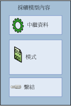

# 採礦模型 (Analysis Services - 資料採礦)
  「採礦模型」透過將演算法套用至資料來建立，但是採礦模型不只是演算法或中繼資料容器，還是可以套用至新資料以產生預測並推斷關聯性的一組資料、統計資料及模式。  
  
 本節說明資料採礦模型及其用途：模型的基本架構和結構、採礦模型的屬性，以及建立及使用採礦模型的方式。  
  
 [採礦模型架構](#bkmk_mdlArch)  
  
 [定義資料採礦模型](#bkmk_mdlDefine)  
  
 [採礦模型屬性](#bkmk_mdlProps)  
  
 [採礦模型資料行](#bkmk_mdlCols)  
  
 [處理採礦模型](#bkmk_mdlProcess)  
  
 [檢視和查詢採礦模型](#bkmk_mdlView)  
  
##   採礦模型架構  
 資料採礦模型會從採礦結構取得資料，然後使用資料採礦演算法分析該資料。 採礦結構與採礦模型是不同的物件。 採礦結構會儲存定義資料來源的資訊。 採礦模型會儲存資料統計處理衍生的資訊，例如，分析結果所發現的模式。  
  
 採礦模型在採礦結構提供的資料經過處理與分析前是空的。 採礦模型經過處理之後，包含中繼資料、結果，以及回到採礦結構的繫結。  
  
   
  
 中繼資料會指定模型的名稱與儲存模型的伺服器，以及模型的定義，包括建立模型所使用之採礦結構的資料行、處理模型時套用之任何篩選的定義，以及分析資料所使用的演算法。 上述所有選擇 (資料行及其資料類型、篩選及演算法) 都會大大影響分析的結果。  
  
 例如，您可以使用相同的資料建立多個模型，可能包括使用叢集演算法、決策樹演算法及貝氏機率分類演算法。 每種模型類型會建立不同的模式、項目集、規則或公式集，以供您進行預測。 每種演算法通常會以不同的方式來分析資料，因此產生之模型的「內容」也會組織成不同的結構。 在其中一種模型類型中，資料和模式可能會分組成「叢集」，而在另一種模型類型中，資料可能會組織成樹狀目錄、分支，以及分割與定義資料的規則。  
  
 模型也會受到定型所依據之資料的影響：如果您以不同的方式篩選資料，或在分析期間使用不同的種子，即使是在相同採礦結構上定型的模型也可能產生不同的結果。 但是，實際資料不會儲存在模型中 (只會儲存摘要統計資料，而實際資料則位於採礦結構中)。 如果您在定型模型時所使用的資料上建立篩選，篩選定義會與模型物件儲存在一起。  
  
 此模型包含一組繫結，會指回採礦結構中快取的資料。 如果資料已經在結構中快取，而且尚未在處理後快取，這些繫結就可以讓您從結果向下鑽研到支援結果的案例。 不過，實際的資料會儲存在結構快取中，而非模型中。  
  
 [採礦模型架構](#bkmk_mdlArch)  
  
##   定義資料採礦模型  
 您可以使用下列一般步驟建立資料採礦模型：  
  
-   建立基礎採礦結構，並包含可能需要的資料行。  
  
-   選取最適合分析工作的演算法。  
  
-   從模型所使用的結構中選擇資料行，並指定其使用方式 (哪些資料行包含您要預測的結果、哪些資料行僅用於輸入等)。  
  
-   選擇性地設定演算法處理之微調的參數。  
  
-   以「處理」結構和模型的資料擴展模型。  
  
 [!INCLUDE[ssASnoversion](../../includes/ssasnoversion-md.md)] 提供下列工具協助您管理採礦模型：  
  
-   資料採礦精靈可協助您建立結構與相關的採礦模型。 這是最簡單的使用方法。 此精靈會自動建立所需的採礦結構，並協助您設定重要的設定。  
  
-   DMX CREATE MODEL 陳述式可用於定義模型。 所需的結構會在處理程序中自動建立，因此，您無法搭配此方法重複使用現有的結構。 如果您已經確切知道您要建立的模型，或者您想撰寫模型的指令碼，請使用這個方法。  
  
-   DMX ALTER STRUCTURE ADD MODEL 陳述式可用於將新的採礦模型加入到現有的結構。 如果您要根據相同的資料集試驗不同的模型，請使用此方法。  
  
 您也可以使用 AMO 或 XML/A，或者使用適用於 Excel 之資料採礦用戶端之類的其他用戶端，透過程式設計方式建立採礦模型。 如需詳細資訊，請參閱下列主題：  
  
 [採礦模型架構](#bkmk_mdlArch)  
  
##   採礦模型屬性  
 每個採礦模型都擁有定義模型及其中繼資料的屬性。 這些包括名稱、描述、上次處理模型的日期、模型的權限，以及用於定型之資料的任何篩選。  
  
 每個採礦模型也都擁有衍生自採礦結構的屬性，以及描述模型所使用資料之資料行的屬性。 如果模型使用的任何資料行是巢狀資料表，該資料行也可以套用個別的篩選。  
  
 此外，每個採礦模型都包含兩個特殊的屬性： <xref:Microsoft.AnalysisServices.MiningModel.Algorithm%2A> 和 <xref:Microsoft.AnalysisServices.MiningModelColumn.Usage%2A>。  
  
-   **演算法屬性** ：指定建立模型所使用的演算法。 可用的演算法取決於您所使用的提供者。 如需 [!INCLUDE[ssNoVersion](../../includes/ssnoversion-md.md)] [!INCLUDE[ssASnoversion](../../includes/ssasnoversion-md.md)]的演算法清單，請參閱 [資料採礦演算法 &#40;Analysis Services - 資料採礦&#41;](../../analysis-services/data-mining/data-mining-algorithms-analysis-services-data-mining.md)。 **Algorithm** 屬性會套用到採礦模型，而且每一個模型只能設定一次。 您可以在稍後變更演算法，但是如果採礦模型中的某些資料行未受到您所選擇的演算法所支援，這些資料行可能會變成無效。 您一定要在變更此屬性之後重新處理模型。  
  
-   **Usage 屬性**：定義此模型要如何使用每一個資料行。 資料行使用方式可以定義為 [輸入]、[預測]、[僅預測] 或 [金鑰]。 **Usage** 屬性會套用到個別採礦模型，而且必須針對模型中所包含的每一個資料行來個別設定。 如果此結構包含模型中未使用的資料行，使用方式會設為 **Ignore**。 您想包含在採礦結構中但不想用於分析的資料範例可能包括客戶名稱或電子郵件地址。 如此一來，您可以稍後再查詢，而不需要包含在分析階段期間。  
  
 您可以在建立採礦模型後，變更採礦模型屬性的值。 不過，即使是採礦模型名稱的任何變更都需要您重新處理模型。 重新處理模型後，您可能會看到不同的結果。  
  
 [採礦模型架構](#bkmk_mdlArch)  
  
##   採礦模型資料行  
 採礦模型包含從採礦結構中定義的資料行取得的資料行。 您可以從採礦結構中選擇要用於模型的資料行，您也可以建立採礦結構資料行的複本，然後為其重新命名或變更其用法。 在建立模型的過程中，您也必須定義模型使用資料行的方式； 包括資料行是否為索引鍵資料行、資料行是否用於預測，或者演算法是否可以忽略資料行等資訊。  
  
 當您建立模型時，建議您仔細檢閱結構中的資料，僅將對分析有意義的資料行加入至模型，而不是自動加入每一個可用的資料行。 例如，您應該避免包含重複相同資料的多個資料行，您也應該避免使用擁有最多唯一值的資料行。 如果您認為不應該使用資料行，就不需要從採礦結構或採礦模型中刪除，但是您可以在資料行上，只設定一個旗標，指定在建立模型時應該忽略該資料行。 這表示資料行會保留在採礦結構中，但不會在採礦模型中使用。 如果您啟用從模型鑽研到採礦結構，則可以在稍後從資料行擷取資訊。  
  
 根據您選擇的演算法，採礦結構中的某些資料行可能與特定模型類型不相容，或可能產生不良的結果。 例如，如果您的資料包含連續數值資料 (如 [收入] 資料行)，但是模型需要離散值，則必須將資料轉換為離散範圍或從模型中移除資料。 在某些情況下，演算法會自動為您轉換或移除資料，但是結果可能不一定如您所需或如您所預期。 請考慮另外複製資料行，並嘗試其他模型。 您也可以在個別資料行上設定旗標，以指出需要特殊處理的地方。 例如，如果您的資料包含 Null 值，則可以使用模型旗標來控制處理。 如果您想將特定資料行當做模型中的迴歸輸入變數，也可以使用模型旗標。  
  
 建立模型之後，您就可以進行變更，例如，加入或移除資料行，或變更模型的名稱。 不過，即使只是模型中繼資料的任何變更都需要您重新處理模型。  
  
 [採礦模型架構](#bkmk_mdlArch)  
  
##   處理採礦模型  
 資料採礦模型在處理之前是一個空物件。 當您處理模型時，如果有在模型中定義篩選，而且經過演算法分析，結構所快取的資料會透過該篩選傳遞。 演算法會計算一組描述資料的摘要統計資料、識別資料內的規則和模式，然後使用這些規則和模式來擴展模型。  
  
 採礦模型經過處理之後會包含有關透過分析所找到之資料和模式的許多資訊，包括統計資料、規則及迴歸公式。 您可以使用自訂檢視器瀏覽這些資訊，也可以建立資料採礦查詢擷取這些資訊並用於分析及簡報。  
  
 [採礦模型架構](#bkmk_mdlArch)  
  
##   檢視和查詢採礦模型  
 在您處理模型之後，就可以使用 [!INCLUDE[ssBIDevStudioFull](../../includes/ssbidevstudiofull-md.md)] 和 [!INCLUDE[ssManStudioFull](../../includes/ssmanstudiofull-md.md)]中提供的自訂檢視器來瀏覽該模型。 For  
  
 您也可以根據採礦模型建立查詢以進行預測，或者擷取模型中繼資料或模型建立的模式。 您可以使用資料採礦擴充模組 (DMX) 建立查詢。  
  
## 相關內容  
  
|主題|連結|  
|------------|-----------|  
|了解如何建立可支援多個採礦模型的採礦結構。 了解資料行在模型中的使用方式。|[採礦結構資料行](../../analysis-services/data-mining/mining-structure-columns.md)   [採礦模型資料行](../../analysis-services/data-mining/mining-model-columns.md)   [內容類型 &#40;資料採礦&#41;](../../analysis-services/data-mining/content-types-data-mining.md)|  
|了解不同的演算法，以及選擇的演算法如何影響模型內容。|[採礦模型內容 &#40;Analysis Services - 資料採礦&#41;](../../analysis-services/data-mining/mining-model-content-analysis-services-data-mining.md)   [資料採礦演算法 &#40;Analysis Services - 資料採礦&#41;](../../analysis-services/data-mining/data-mining-algorithms-analysis-services-data-mining.md)|  
|了解您現在可以在模型上設定影響其組成和行為的屬性。|[採礦模型屬性](../../analysis-services/data-mining/mining-model-properties.md)   [模型旗標 &#40;資料採礦&#41;](../../analysis-services/data-mining/modeling-flags-data-mining.md)|  
|了解資料採礦的程式設計介面。|[使用分析管理物件 &#40;AMO&#41; 來開發](../../analysis-services/multidimensional-models/analysis-management-objects/developing-with-analysis-management-objects-amo.md)   [資料採礦延伸模組 &#40;DMX&#41; 參考](../../dmx/data-mining-extensions-dmx-reference.md)|  
|了解如何在 [!INCLUDE[ssASnoversion](../../includes/ssasnoversion-md.md)]中使用自訂資料採礦檢視器。|[資料採礦模型檢視器](../../analysis-services/data-mining/data-mining-model-viewers.md)|  
|檢視您可以對資料採礦模型使用的不同查詢類型範例。|[資料採礦查詢](../../analysis-services/data-mining/data-mining-queries.md)|  
  
## 相關工作  
 使用下列連結以取得使用資料採礦模型的其他特定資訊  
  
|工作|連結|  
|----------|----------|  
|加入及刪除採礦模型|[將採礦模型加入至現有的採礦結構](../../analysis-services/data-mining/add-a-mining-model-to-an-existing-mining-structure.md)   [從採礦結構刪除採礦模型](../../analysis-services/data-mining/delete-a-mining-model-from-a-mining-structure.md)|  
|使用採礦模型資料行|[從採礦模型排除資料行](../../analysis-services/data-mining/exclude-a-column-from-a-mining-model.md)   [建立模型資料行的別名](../../analysis-services/data-mining/create-an-alias-for-a-model-column.md)   [變更採礦模型中的資料行離散化](../../analysis-services/data-mining/change-the-discretization-of-a-column-in-a-mining-model.md)   [在模型中指定當做迴歸輸入變數使用的資料行](../../analysis-services/data-mining/specify-a-column-to-use-as-regressor-in-a-model.md)|  
|改變模型屬性|[變更採礦模型的屬性](../../analysis-services/data-mining/change-the-properties-of-a-mining-model.md)   [將篩選套用至採礦模型](../../analysis-services/data-mining/apply-a-filter-to-a-mining-model.md)   [從採礦模型刪除篩選](../../analysis-services/data-mining/delete-a-filter-from-a-mining-model.md)   [針對採礦模型啟用鑽研](../../analysis-services/data-mining/enable-drillthrough-for-a-mining-model.md)   [檢視或變更演算法參數](../../analysis-services/data-mining/view-or-change-algorithm-parameters.md)|  
|複製、 移動或管理模型|[建立採礦模型的複本](../../analysis-services/data-mining/make-a-copy-of-a-mining-model.md)   [複製採礦模型的檢視](../../analysis-services/data-mining/copy-a-view-of-a-mining-model.md)   [EXPORT &#40;DMX&#41;](../../dmx/export-dmx.md)   [IMPORT &#40;DMX&#41;](../../dmx/import-dmx.md)|  
|以資料擴展模型，或更新模型中的資料|[處理採礦模型](../../analysis-services/data-mining/process-a-mining-model.md)|  
|使用 OLAP 模型|[建立資料採礦維度](../../analysis-services/data-mining/create-a-data-mining-dimension.md)|  
  
## 請參閱＜  
 [資料庫物件 &#40;Analysis Services - 多維度資料&#41;](../../analysis-services/multidimensional-models/olap-logical/database-objects-analysis-services-multidimensional-data.md)  
  
  

