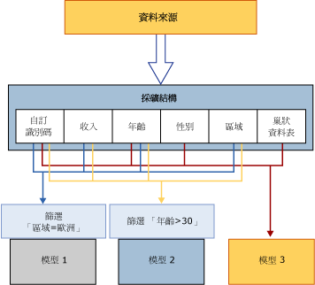

# 採礦結構 (Analysis Services - 資料採礦)
  採礦結構定義從中建立採礦模型的資料：此結構會指定來源資料檢視、資料行的數目和類型，並將選用的資料分割指定為定型集和測試集。 單一採礦結構可支援共用相同網域的多個採礦模型。 下列圖表說明資料採礦結構與資料來源及其所構成資料採礦模型間的關聯性。  
  
   
  
 此圖表的採礦結構是根據包含多個資料表或檢視的資料來源而定，這些資料表或檢視則是以 CustomerID 欄位聯結。 其中一個資料表包含客戶的相關資訊，例如地理區域、年齡、收入和性別，而相關的巢狀資料表則包含多個與個別客戶相關的其他資訊，例如該客戶曾購買過的產品。 此圖表顯示可以根據一個採礦結構而建立多個模型，而這些模型可使用此結構的不同資料行。  
  
 **模型 1** 使用 CustomerID、收入、年齡和區域，並根據區域篩選資料。  
  
 **模型 2** 使用 CustomerID、收入、年齡和區域，並根據年齡篩選資料。  
  
 **模型 3** 使用 CustomerID、年齡、性別和巢狀資料表，且沒有任何篩選。  
  
 因為這些模型會使用不同的資料行做為輸入，而且其中兩個模型因套用篩選而會對模型中使用的資料進行額外的限制，所以即使模型是以相同的資料為基礎，也可能會產生非常不同的結果。 請注意，所有模型都需要 CustomerID 資料行，因為這是唯一可用來當做案例索引鍵的資料行。  
  
 本節說明資料採礦模型的基本架構：定義採礦結構的方式、使用資料填入的方式，以及用來建立模型的方式。 如需如何管理或匯出現有資料採礦結構的詳細資訊，請參閱 [資料採礦方案與物件的管理](../../analysis-services/data-mining/management-of-data-mining-solutions-and-objects.md)。  
  
## 定義採礦結構  
 資料採礦結構的設定包含下列步驟：  
  
-   定義資料來源。  
  
-   選取要包含在結構中的資料行 (並非所有資料行都必須加入模型) 並定義索引鍵。  
  
-   定義結構的索引鍵，包括巢狀資料表的索引鍵 (如果適用的話)。  
  
-   指定來源資料是否應分成定型集和測試集。 此步驟是選擇性的。  
  
-   處理結構。  
  
 這些步驟在下列章節中有更詳細的說明。  
  
### 採礦結構的資料來源  
 當您定義採礦結構時，您會使用現有資料來源檢視中可用的資料行。 資料來源檢視是可讓您合併多個資料來源，以做為單一來源的共用物件。 用戶端應用程式無法檢視原始資料來源，且您可以使用資料來源檢視的屬性修改資料類型、建立彙總或別名資料行。  
  
 如果您從相同的採礦結構建立多個採礦模型，這些模型可使用此結構中的不同資料行。 例如，您可以建立單一結構，然後從此結構建立個別的決策樹和群集模型，每一個模型都使用不同的資料行，並預測不同的屬性。  
  
 此外，每個模型可以透過不同方式來使用結構中的資料行。 例如，您的資料來源檢視可能包含 [收入] 資料行，您可以透過不同方式用於不同模型。  
  
 資料採礦結構會以來源資料的 *「繫結」* (Binding) 格式，來儲存資料來源定義及其中的資料行。 如需資料來源繫結的詳細資訊，請參閱[資料來源和繫結 &#40;SSAS 多維度&#41;](../../analysis-services/multidimensional-models/data-sources-and-bindings-ssas-multidimensional.md)。 但是請注意，您也可以使用 DMX [CREATE MINING STRUCTURE &#40;DMX&#41;](../../dmx/create-mining-structure-dmx.md) 陳述式建立資料採礦結構，而不將其繫結至特定資料來源。  
  
### 採礦結構資料行  
 採礦結構的建置組塊是採礦結構資料行，它們會描述資料來源包含的資料。 這些資料行包含如資料類型、內容類型和資料散發方式等資訊。 採礦結構不包含有關資料行如何用於特定採礦模型的資訊，或有關用來建立模型之演算法類型的資訊；此資訊是在採礦模型本身中定義。  
  
 採礦結構也可以包含巢狀資料表。 巢狀資料表代表案例實體及其相屬性之間的一對多關聯性。 例如，若描述客戶的資訊位於一個資料表中，而客戶的採購資料位於另一個資料表中，您就可以使用巢狀資料表將資訊結合成單一案例。 客戶識別碼是實體，而採購是相關的屬性。 如需何時使用巢狀資料表的詳細資訊，請參閱[巢狀資料表 &#40;Analysis Services - 資料採礦&#41;](../../analysis-services/data-mining/nested-tables-analysis-services-data-mining.md)。  
  
 若要在 [!INCLUDE[ssBIDevStudioFull](../../includes/ssbidevstudiofull-md.md)]中建立資料採礦模型，您必須先建立資料採礦結構。 資料採礦精靈會帶領您逐步完成建立採礦結構、選擇資料和加入採礦模型的程序。  
  
 如果是利用資料採礦延伸模組 (DMX) 建立採礦模型，則可在其中指定模型和資料行，DMX 會自動建立所需的採礦結構。 如需詳細資訊，請參閱 [CREATE MINING MODEL &#40;DMX&#41;](../../dmx/create-mining-model-dmx.md)。  
  
 如需詳細資訊，請參閱 [Mining Structure Columns](../../analysis-services/data-mining/mining-structure-columns.md)。  
  
### 將資料分割成定型集和測試集  
 當您為採礦結構定義資料時，也可以指定某些資料用於定型，某些資料則用於測試。 因此，不再需要在建立資料採礦結構之前事先分割資料。 相反地，當您建立模型時，您可以指定保留某個百分比的資料用於測試，並將其餘的資料用於定型，或者可以指定某些案例數當做測試資料集來使用。 有關定型和測試資料集的資訊會使用採礦結構來快取，因此，以該結構為基礎的所有模型都可以使用相同的測試集。  
  
 如需詳細資訊，請參閱 [Training and Testing Data Sets](../../analysis-services/data-mining/training-and-testing-data-sets.md)。  
  
### 啟用鑽研  
 即使您不打算在特定的採礦模型中使用資料行，還是可以將此資料行加入到採礦結構。 例如，如果您想在群集模型中擷取客戶的電子郵件地址，但不想在分析程序期間使用電子郵件地址，這會很有用。 若要在分析和預測階段忽略資料行，您可以將該資料行加入結構，但不指定資料行的使用方式，或將使用方式旗標設為 [忽略]。 如果已經在採礦模型上啟用鑽研，而且有適當的權限，您仍然可以在查詢中使用以此方式標示的資料。 例如，您可以檢閱分析所有客戶所產生的叢集，然後使用鑽研查詢取得特定叢集之客戶的名稱和電子郵件地址，即使這些資料行不是用來建立模型的資料行。  
  
 如需詳細資訊，請參閱[鑽研查詢 &#40;資料採礦&#41;](../../analysis-services/data-mining/drillthrough-queries-data-mining.md)。  
  
### 處理採礦結構  
 採礦結構在處理之前只是一個中繼資料容器。 當您處理採礦結構時， [!INCLUDE[ssASnoversion](../../includes/ssasnoversion-md.md)] 會建立快取來儲存有關資料的統計資料、如何將連續屬性離散化的資訊，以及採礦模型稍後所使用的其他資訊。 採礦模型本身不會儲存此摘要資訊，而是參考在處理採礦結構時快取的資訊。 因此，您不需要在每次將新模型加入至現有的結構時，重新處理結構；您可以只處理模型。  
  
 如果快取很大，或您想移除詳細的資料，您可以選擇在處理後捨棄此快取。 如果不要快取資料，您可以將採礦結構的 **CacheMode** 屬性變更為 **ClearAfterProcessing**。 這樣一來就會在處理任何模型之後將快取終結。 將 **CacheMode** 屬性設定為 **ClearAfterProcessing** 會從採礦模型停用鑽研。  
  
 但是在您終結快取之後，則無法將新模型加入至採礦結構。 如果您將新的採礦模型加入至結構，或變更現有模型的屬性，則需要先重新處理採礦結構。 如需詳細資訊，請參閱[處理需求和考量 &#40;資料採礦&#41;](../../analysis-services/data-mining/processing-requirements-and-considerations-data-mining.md)。  
  
### 檢視採礦結構  
 您無法使用檢視器來瀏覽採礦結構中的資料。 但是在 [!INCLUDE[ssBIDevStudioFull](../../includes/ssbidevstudiofull-md.md)]中，您可以使用資料採礦設計師的 **[採礦結構]** 索引標籤，檢視結構資料行和其定義。 如需詳細資訊，請參閱 [Data Mining Designer](../../analysis-services/data-mining/data-mining-designer.md)。  
  
 如果想要檢視採礦結構中的資料，可以使用資料採礦延伸模組 (DMX) 來建立查詢。 例如， `SELECT * FROM <structure>.CASES` 陳述式會傳回採礦結構中的所有資料。 若要擷取這項資訊，必須已經處理過採礦結構，且必須將處理結果存入快取。  
  
 `SELECT * FROM <model>.CASES` 陳述式會傳回相同的資料行，但是僅針對該特定模型中的案例。 如需詳細資訊，請參閱 [SELECT FROM &#60;structure&#62;.CASES](../../dmx/select-from-structure-cases.md) 和 [SELECT FROM &#60;model&#62;.CASES &#40;DMX&#41;](../../dmx/select-from-model-cases-dmx.md)。  
  
## 搭配採礦結構使用資料採礦模型  
 資料採礦模型會將採礦模型演算法套用至以採礦結構表示的資料。 採礦模型是屬於特定採礦結構的物件，且繼承採礦結構所定義的所有屬性值。 此模型可以使用採礦結構包含的所有資料行或資料行子集。 您可以將結構資料行的多個複本加入到結構中。 您也可以將結構資料行的多個複本加入到模型中，然後針對此模型中的每一個結構資料行指派不同的名稱或 *「別名」*(Alias)。 如需為結構資料行建立別名的詳細資訊，請參閱 [建立模型資料行的別名](../../analysis-services/data-mining/create-an-alias-for-a-model-column.md) 和 [採礦模型屬性](../../analysis-services/data-mining/mining-model-properties.md)。  
  
 如需資料採礦模型之結構的詳細資訊，請參閱 [採礦模型 &#40;Analysis Services - 資料採礦&#41;](../../analysis-services/data-mining/mining-models-analysis-services-data-mining.md)。  
  
## 相關工作  
 使用此處提供的連結來深入了解如何定義、管理及使用採礦結構。  
  
|工作|連結|  
|-----------|-----------|  
|使用關聯式採礦結構|[建立新的關聯式採礦結構](../../analysis-services/data-mining/create-a-new-relational-mining-structure.md)   [將巢狀資料表加入至採礦結構](../../analysis-services/data-mining/add-a-nested-table-to-a-mining-structure.md)|  
|使用以 OLAP Cube 為基礎的採礦結構|[建立新的 OLAP 採礦結構](../../analysis-services/data-mining/create-a-new-olap-mining-structure.md)|  
|使用採礦結構中的資料行|[將資料行加入至採礦結構](../../analysis-services/data-mining/add-columns-to-a-mining-structure.md)   [從採礦結構中移除資料行](../../analysis-services/data-mining/remove-columns-from-a-mining-structure.md)|  
|變更或查詢採礦結構屬性和資料|[變更採礦結構的屬性](../../analysis-services/data-mining/change-the-properties-of-a-mining-structure.md)|  
|使用基礎資料來源及更新來源資料|[編輯用於採礦結構的資料來源檢視](../../analysis-services/data-mining/edit-the-data-source-view-used-for-a-mining-structure.md)   [處理採礦結構](../../analysis-services/data-mining/process-a-mining-structure.md)|  
  
## 請參閱＜  
 [資料庫物件 &#40;Analysis Services - 多維度資料&#41;](../../analysis-services/multidimensional-models/olap-logical/database-objects-analysis-services-multidimensional-data.md)   
 [採礦模型 &#40;Analysis Services - 資料採礦&#41;](../../analysis-services/data-mining/mining-models-analysis-services-data-mining.md)  
  
  
