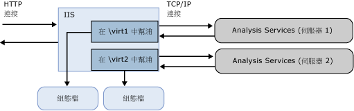

# <a name="configure-http-access-to-analysis-services-on-iis-80"></a>設定 IIS 8.0 上 Analysis services 的 HTTP 存取
[!INCLUDE[ssas-appliesto-sqlas](../../includes/ssas-appliesto-sqlas.md)]
  本文說明如何設定 HTTP 端點來存取 Analysis Services 執行個體。 您可以設定 MSMDPUMP.dll (這是在 Internet Information Services (IIS) 中執行的一個 ISAPI 擴充程式，可以在用戶端應用程式與 Analysis Services 伺服器之間來回提取資料) 來啟用 HTTP 存取。 此方法會在您的 BI 方案需要下列功能時，提供連接至 Analysis Services 的替代方式。  
  
-   用戶端存取是透過網際網路或外部網路連接進行，但會限制可啟用的通訊埠。  
  
-   用戶端連接是來自相同網路的不信任網域。  
  
-   用戶端應用程式會在允許 HTTP 但不允許 TCP/IP 連接的網路環境中執行。  
  
-   用戶端應用程式無法使用 Analysis Services 用戶端程式庫 (例如，在 UNIX 伺服器上執行的 Java 應用程式)。 如果您無法使用 Analysis Services 用戶端程式庫進行資料存取，可以透過與 Analysis Services 執行個體的 HTTP 直接連接，使用 SOAP 和 XML/A。  
  
-   需要 Windows 整合式安全性以外的驗證方法。 具體而言，您可以在設定 Analysis Services 進行 HTTP 存取時使用匿名連接和基本驗證。 不支援摘要式、表單和 ASP.NET 驗證。 之所以要啟用 HTTP 存取，主要原因之一是基本驗證有此要求。 若要深入了解，請參閱 [Microsoft BI 驗證及身分識別委派](http://go.microsoft.com/fwlink/?LinkId=286576)(英文)。  
  
 不論是執行表格式模式還是多維度模式，只要是受支援版本的 Analysis Services，您就可以設定 HTTP 存取。 但本機 Cube 例外。 您無法透過 HTTP 端點連接到本機 Cube。  
  
 設定 HTTP 存取是安裝後續工作。 必須先安裝 Analysis Services，才能設定其 HTTP 存取。 身為 Analysis Services 系統管理員，您必須授與權限給 Windows 帳戶才能進行 HTTP 存取。 此外，您最好先驗證安裝以確保它可完整運作，然後才進一步設定伺服器。 設定 HTTP 存取之後，您可以透過 TCP/IP 使用 HTTP 端點和一般的伺服器網路名稱。 設定 HTTP 存取並不會讓其他方法就此無法存取資料。  
  
 當您繼續進行 MSMDPUMP 設定時，請記住您有兩種連接可以納入考慮：client-to-IIS、IIS-to-SSAS。 本文中的指示與「IIS 到 SSAS」有關。 用戶端應用程式可能需要先進行其他設定才能連接到 IIS。 決定是否使用 SSL 或如何設定繫結等內容並不在本文的討論範圍。 請參閱 [網頁伺服器 (IIS)](http://technet.microsoft.com/library/hh831725.aspx) ，以取得 IIS 的詳細資訊。  
  
##  <a name="bkmk_overview"></a> 概觀  
 MSMDPUMP 是一個 ISAPI 擴充程式，會載入到 IIS 並可重新導向至本機或遠端 Analysis Services 執行個體。 藉由設定此 ISAPI 擴充程式，即可建立 Analysis Services 執行個體的 HTTP 端點。  
  
 您必須為每個 HTTP 端點建立及設定一個虛擬目錄。 每個端點都需要一組自己的 MSMDPUMP 檔案，用於您要連接的每個 Analysis Services 執行個體。 這組檔案中的組態檔會指定用於每個 HTTP 端點的 Analysis Services 執行個體名稱。  
  
 在 IIS 上，MSMDPUMP 會使用 Analysis Services OLE DB 提供者，透過 TCP/IP 連接至 Analysis Services。 雖然用戶端要求可以來自網域信任之外，但 Analysis Services 和 IIS 必須位於相同的網域或受信任的網域，原生連接才會成功。  
  
 當 MSMDPUMP 連接至 Analysis Services 時，它會利用 Windows 使用者識別這麼做。 此帳戶將是匿名帳戶 (如果您是設定匿名連接的虛擬目錄) 或 Windows 使用者帳戶。 這個帳戶在 Analysis Services 伺服器和資料庫上必須擁有適當的資料存取權限。  
  
   
  
 下表列出您針對不同狀況啟用 HTTP 存取時的其他考量。  
  
|狀況|組態|  
|--------------|-------------------|  
|相同電腦上的 IIS 和 Analysis Services|這是最簡單的組態，因為它可讓您搭配 NTLM 使用預設組態 (其伺服器名稱為 localhost)、本機 Analysis Services OLE DB 提供者，以及 Windows 整合式安全性。 假設用戶端也位於相同網域，驗證對使用者而言是透明的，您不需要採取其他任何動作。|  
|不同電腦上的 IIS 和 Analysis Services|針對此拓撲，您必須在 Web 伺服器上安裝 Analysis Services OLE DB 提供者。 您也必須編輯 msmdpump.ini 檔案，以便在遠端電腦上指定 Analysis Services 執行個體的位置。<br /><br /> 此拓撲加入了雙躍點驗證步驟，其中認證必須從用戶端流向 Web 伺服器，然後再流向後端 Analysis Services 伺服器。 如果您要使用 Windows 認證和 NTLM，將會出現錯誤，因為 NTLM 不允許將用戶端認證委派給另一部伺服器。 最常見的方案是搭配安全通訊端層 (SSL) 使用基本驗證，但在存取 MSMDPUMP 虛擬目錄時，這將需要使用者提供使用者名稱和密碼。 更直接的方法可能是啟用 Kerberos 並設定 Analysis Services 限制委派，讓使用者可以用透明的方式存取 Analysis Services。 請參閱 [設定 Analysis Services 進行 Kerberos 限制委派](../../analysis-services/instances/configure-analysis-services-for-kerberos-constrained-delegation.md) 以取得詳細資訊。<br /><br /> 請考慮要在 Windows 防火牆中解除封鎖哪些通訊埠。 您將需要解除封鎖兩部伺服器上的通訊埠，以便存取 IIS 上的 Web 應用程式，以及遠端伺服器上的 Analysis Services。|  
|用戶端連接是來自不信任網域或外部網路連接|來自不信任網域的用戶端連接會進一步導入驗證的限制。 根據預設，Analysis Services 使用 Windows 整合式驗證，這種驗證需要使用者與伺服器位於相同網域上。 如果您有從網域外部連接至 IIS 的外部網路使用者，當伺服器設定為使用預設值時，那些使用者會發生連接錯誤。<br /><br /> 因應措施包括，讓外部網路使用者使用網域認證，透過 VPN 連接。 不過，更好的方法可能是在 IIS 網站上啟用基本驗證和 SSL。|  
  
##  <a name="bkmk_prereq"></a> 必要條件  
 本文中的指示假設已設定 IIS 且已安裝 Analysis Services。 Windows Server 2012 隨附 IIS 8.x 以做為伺服器角色，您可以在系統上加以啟用。  
  
 **在 IIS 8.0 中的額外設定**  
  
 IIS 8.0 的預設組態遺漏要透過 HTTP 存取 Analysis services 所需的元件。 這些元件 (位於 [網頁伺服器 (IIS)] 角色的 [安全性] 和 [應用程式開發] 功能區域) 包括：  
  
-   **安全性** | **Windows 驗證**或**基本驗證**，以及您的資料存取案例所需的任何其他安全性功能。  
  
-   **應用程式開發** | **CGI**  
  
-   **應用程式開發** | **ISAPI 擴充程式**  
  
 若要驗證或加入這些元件，請使用 [伺服器管理員] | [管理] | [新增角色及功能]。 逐步執行精靈直到到達 [伺服器角色]。 向下捲動以尋找 [網頁伺服器 (IIS)]。  
  
1.  開啟 [網頁伺服器] | [安全性]，並選擇驗證方法。  
  
2.  開啟 [網頁伺服器] | [應用程式開發]並選擇 [CGI] 和 [ISAPI 擴充程式]。  
  
       
  
 **當 IIS 是在遠端伺服器上**  
  
 要在 IIS 和 Analysis Services 之間進行遠端連接，您必須在執行 IIS 的 Windows 伺服器上安裝 Analysis Services OLE DB 提供者 (MSOLAP)。  
  
1.  移至 [SQL Server 2014 功能套件](http://www.microsoft.com/download/details.aspx?id=42295)的下載頁面  
  
2.  按一下紅色的 [下載] 按鈕。  
  
3.  向下捲動以找到 CHT\x64\SQL_AS_OLEDB.msi。  
  
4.  遵循精靈的指示完成安裝。  
  
> [!NOTE]  
>  請記得解除封鎖 Windows 防火牆中的連接埠，以允許用戶端與 Analysis Services 遠端伺服器的連接。 如需詳細資訊，請參閱 [設定 Windows 防火牆以允許 Analysis Services 存取](../../analysis-services/instances/configure-the-windows-firewall-to-allow-analysis-services-access.md)。  
  
##  <a name="bkmk_copy"></a> 步驟 1：將 MSMDPUMP 檔案複製到 Web 伺服器上的資料夾中  
 您建立的每個 HTTP 端點都必須有一組自己的 MSMDPUMP 檔案。 在此步驟中，您要將 MSMDPUMP 可執行檔、組態檔以及資源資料夾從 Analysis Services 程式資料夾，複製到您將在執行 IIS 所在電腦的檔案系統上建立的新虛擬目錄資料夾。  
  
 磁碟機必須格式化為 NTFS 檔案系統。 您所建立之資料夾的路徑不得包含任何空格。  
  
1.  將下列檔案複製，請參閱\<磁碟機 >: SQL Server \Program Files\Microsoft\\< 執行個體\>\OLAP\bin\isapi: MSMDPUMP。DLL，MSMDPUMP。INI，以及 Resources 資料夾。  
  
       
  
2.  在 web 伺服器上，建立新的資料夾：\<磁碟機 >: \inetpub\wwwroot\\**OLAP**  
  
3.  將您先前複製的檔案貼入此新資料夾中。  
  
4.  請確認您 Web 伺服器上的 \inetpub\wwwroot\OLAP 資料夾中包含下列內容：MSMDPUMP.DLL、MSMDPUMP.INI，以及 Resources 資料夾。 您的資料夾結構看起來應該像這樣：  
  
    -   \<drive>:\inetpub\wwwroot\OLAP\MSMDPUMP.dll  
  
    -   \<drive>:\inetpub\wwwroot\OLAP\MSMDPUMP.ini  
  
    -   \<drive>:\inetpub\wwwroot\OLAP\Resources  
  
##  <a name="bkmk_appPool"></a> 步驟 2：在 IIS 中建立應用程式集區與虛擬目錄  
 接下來，為幫浦建立應用程式集區和端點。  
  
#### <a name="create-an-application-pool"></a>建立應用程式集區  
  
1.  啟動 IIS 管理員。  
  
2.  開啟伺服器資料夾，以滑鼠右鍵按一下 [應用程式集區]，然後按一下 [新增應用程式集區]。 使用 .NET Framework，在 Managed 管線模式設為 [傳統] 的情況下，建立名稱為 **OLAP** 的應用程式集區。  
  
       
  
3.  根據預設，IIS 會以 **ApplicationPoolIdentity** 做為安全性識別來建立應用程式集區，這對 Analysis Services 的 HTTP 存取來說是有效的選擇。 如果您有特定的理由要變更識別，請以滑鼠右鍵按一下 [OLAP]，然後選取 [進階設定]。 選取 [ApplicationPoolIdentity]。 按一下此屬性的 [變更] 按鈕，以您要使用的自訂帳戶取代內建帳戶。  
  
       
  
4.  根據預設，IIS 會在 64 位元作業系統上，將 [啟用 32 位元應用程式] 屬性設定為 **false**。 如果您從 64 位元的 Analysis Services 安裝複製 msmdpump.dll，對 64 位元 IIS 伺服器上的 MSMDPUMP 延伸程式而言，這是正確的設定。 如果您從 32 位元安裝複製 MSMDPUMP 二進位檔，請將它設定為 **true**。 立即在 [進階設定] 中檢查此屬性以確認設定是否正確。  
  
#### <a name="create-an-application"></a>建立應用程式  
  
1.  在 [IIS 管理員] 中，依序開啟 [網站] 和 [預設的網站]。 您應該會看到名為 **Olap** 的資料夾。 這是 \inetpub\wwwroot 之下所建立的 OLAP 資料夾的參考。  
  
       
  
2.  以滑鼠右鍵按一下該資料夾，然後選擇 [轉換成應用程式]。  
  
3.  在 [新增應用程式] 中，輸入 **OLAP** 做為別名。 按一下 [選取] 以選擇 OLAP 應用程式集區。 實體路徑應該設定為 C:\inetpub\wwwroot\OLAP  
  
       
  
4.  按一下 [確定] 。 重新整理網站，並注意「OLAP」資料夾現在是在「預設的網站」底下的應用程式。 現在即已建立 MSMDPUMP 檔案的虛擬路徑。  
  
       
  
> [!NOTE]  
>  舊版的這些指示包含建立虛擬目錄的步驟。 現已不再需要該步驟。  
  
##  <a name="bkmk_auth"></a> 步驟 3：設定 IIS 驗證並加入延伸模組  
 在此步驟中，您會進一步設定您剛建立的 SSAS 虛擬目錄。 您將會指定驗證方法，然後加入指令碼對應。 經由 HTTP 的 Analysis Services 所支援的驗證方法包括：  
  
-   Windows 驗證 (Kerberos 或 NTLM)  
  
-   基本驗證  
  
-   匿名驗證  
  
 **Windows 驗證** 是被視為最安全，並且會針對使用 Active Directory 的網路運用現有基礎結構。 若要有效使用 Windows 驗證，所有瀏覽器、用戶端應用程式及伺服器應用程式都必須支援該驗證。 這是最安全的建議模式，但是它要求 IIS 能夠存取可驗證要求連接之使用者識別的 Windows 網域控制站。  
  
 對於將 Analysis Services 和 IIS 放置於不同電腦的拓撲，您將需要解決雙躍點問題，這是在需要將使用者識別委派至遠端電腦上的另一項服務時所引發的問題，通常是因啟用 Analysis Services 進行 Kerberos 限制委派所造成。 如需詳細資訊，請參閱 [Configure Analysis Services for Kerberos constrained delegation](../../analysis-services/instances/configure-analysis-services-for-kerberos-constrained-delegation.md)。  
  
 **基本驗證** 是在您有 Windows 識別，但使用者連接來自非信任網域，因而禁止使用委派或模擬的連接時使用。 基本驗證可讓您在連接字串上指定使用者識別和密碼。 連接至 Analysis Services 時不會使用目前使用者的安全性內容，而是使用連接字串上的認證。 由於 Analysis Services 僅支援 Windows 驗證，因此任何傳遞至 Analysis Services 的認證都必須是裝載 Analysis Services 所在網域之成員的 Windows 使用者或群組。  
  
 **匿名驗證** 經常在初始測試期間使用，因為它容易設定，可協助您快速驗證 Analysis Services 的 HTTP 連線。 只要執行幾個步驟，您就可以指派唯一的使用者帳戶做為識別、授與該帳戶 Analysis Services 中的權限、使用帳戶確認用戶端應用程式中的資料存取，然後在測試完成時停用匿名驗證。  
  
 如果使用者沒有 Windows 使用者帳戶，您也可以在生產環境中使用匿名驗證，不過請遵循最佳做法鎖定主機系統上的權限，如同此文件中所述： [啟用匿名驗證 (IIS 7)](http://technet.microsoft.com/library/cc731244\(v=ws.10\).aspx)。 務必在虛擬目錄上設定驗證，而不是在父網站上，以便進一步降低帳戶存取層級。  
  
 啟用匿名時，可透過匿名使用者身分進行任何對 HTTP 端點的使用者連接。 您將無法稽核個別使用者連接，也無法使用使用者識別從模型選取資料。 如您所見，使用匿名的影響範圍包含從模型設計到資料重新整理和存取的一切。 不過，如果使用者沒有 Windows 使用者登入，則使用匿名帳戶可能是您唯一的選項。  
  
#### <a name="set-the-authentication-type-and-add-a-script-map"></a>設定驗證類型及加入指令碼對應  
  
1.  在 [IIS 管理員] 中，依序開啟 [網站] 和 [預設的網站]，然後選取 [OLAP] 虛擬目錄。  
  
2.  在主頁面的 IIS 區段中，按兩下 [驗證]。  
  
       
  
3.  如果要使用 Windows 整合式安全性，請啟用 [Windows 驗證]。  
  
       
  
4.  或者，如果您的用戶端和伺服器應用程式位於不同的網域，請啟用 [基本驗證]。 此模式會要求使用者輸入使用者名稱和密碼。 使用者名稱和密碼是透過 HTTP 連接，傳送到 IIS。 連接至 MSMDPUMP 時，IIS 將嘗試模擬使用所提供認證的使用者，但是認證不會委派至 Analysis Services。 您必須在連接時傳遞有效的使用者名稱和密碼，如本文件的步驟 6 所述。  
  
    > [!IMPORTANT]  
    >  請注意，建立傳送密碼之目標系統的任何人都必須有數種方式來保護通訊通道的安全。 IIS 提供一組可協助您保護通道安全的工具。 如需詳細資訊，請參閱[如何在 IIS 7 上設定 SSL](http://go.microsoft.com/fwlink/?LinkId=207562) (英文)。  
  
5.  如果您使用 Windows 或基本驗證，請停用 [匿名驗證]。 啟用匿名驗證時，IIS 將一律優先使用它，即使已啟用其他驗證方法也一樣。  
  
     在匿名驗證下，幫浦 (msmdpump.dll) 會以您為匿名使用者建立的使用者帳戶執行。 連接至 IIS 的使用者以及連接至 Analysis Services 的使用者之間並沒有差別。 根據預設，IIS 會使用 IUSR 帳戶，不過，您可以將它變更為具有網路權限的網域使用者帳戶。 如果 IIS 和 Analysis Services 位於不同的電腦上，您將需要這項功能。  
  
     如需有關如何設定匿名驗證之認證的指示，請參閱 [匿名驗證](http://www.iis.net/configreference/system.webserver/security/authentication/anonymousauthentication)。  
  
    > [!IMPORTANT]  
    >  匿名驗證最可能在受到高度控制的環境中使用，這類環境是依據檔案系統中的存取控制清單給予或拒絕使用者的存取權。 如需最佳做法，請參閱[啟用匿名驗證 (IIS 7)](http://technet.microsoft.com/library/cc731244\(v=ws.10\).aspx)。  
  
6.  按一下 [OLAP] 虛擬目錄來開啟主頁面。 按兩下 [處理常式對應]。  
  
       
  
7.  以滑鼠右鍵按一下頁面的任何位置，然後選取 [新增指令碼對應]。 在 [新增指令碼對應] 對話方塊中，將要求路徑指定為 **\*.dll**，再指定 c:\inetpub\wwwroot\olap\msmdpump.dll 作為可執行檔，然後輸入 **OLAP** 作為名稱。 讓所有預設限制與這個指令碼對應保持關聯。  
  
       
  
8.  當畫面上出現允許 ISAPI 擴充程式的提示時，請按一下 [是]。  
  
       
  
##  <a name="bkmk_edit"></a> 步驟 4：編輯 MSMDPUMP.INI 檔案來設定目標伺服器  
 MSMDPUMP.INI 檔案會指定 MSMDPUMP.DLL 連接的 Analysis Services 執行個體。 這個執行個體可以位於本機或遠端，以及安裝為預設或具名執行個體。  
  
 開啟 C:\inetpub\wwwroot\OLAP 資料夾中的 msmdpump.ini 檔，然後查看此檔案的內容。 它應該如下所示：  
  
```  
<ConfigurationSettings>  
<ServerName>localhost</ServerName>  
<SessionTimeout>3600</SessionTimeout>  
<ConnectionPoolSize>100</ConnectionPoolSize>  
</ConfigurationSettings>  
  
```  
  
 如果您要為其設定 HTTP 存取的 Analysis Services 執行個體位於本機電腦，而且當做預設執行個體安裝，則不需要變更此設定。 否則，您必須指定伺服器名稱 (例如\<伺服器名稱 > S-SRV01\</ServerName >)。 會安裝為具名執行個體的伺服器，務必附加執行個體名稱 (例如\<伺服器名稱 > s adwrks-srv01\tabular</servername\</ServerName >)。  
  
 根據預設，Analysis Services 會接聽 TCP/IP 通訊埠 2383。 如果您安裝 Analysis Services 的預設執行個體時，您不需要指定任何連接埠中的\<ServerName > 因為 Analysis Services 知道如何自動接聽通訊埠 2383年。 不過，您需要在 Windows 防火牆中，允許該通訊埠的傳入連接。 如需詳細資訊，請參閱 [設定 Windows 防火牆以允許 Analysis Services 存取](../../analysis-services/instances/configure-the-windows-firewall-to-allow-analysis-services-access.md)。  
  
 如果您設定具名或預設為接聽固定通訊埠的 Analysis Services 執行個體時，您必須將連接埠號碼加入的伺服器名稱 (例如\<伺服器名稱 > AW-aw-srv01:55555</servername\</ServerName >)，您必須允許輸入在 Windows 防火牆中該連接埠的連線。  
  
## <a name="step-5-grant-data-access-permissions"></a>步驟 5：授與資料存取權限  
 如前面所述，您需要授與 Analysis Services 執行個體的權限。 每個資料庫物件都有提供特定層級權限的角色 (讀取或讀取/寫入)，因此，每個角色都會有由 Windows 使用者識別所組成的成員。  
  
 若要設定權限，您可以使用 SQL Server Management Studio。 在 [資料庫] | [角色] 資料夾底下，您可以建立角色、指定資料庫權限、指派成員資格給 Windows 使用者或群組帳戶，然後授與特定物件的讀取或寫入權限。 一般而言，Cube 的 [讀取] 權限對於使用 (但不會更新) 模型資料的用戶端連接而言就已足夠。  
  
 角色指派會根據您設定的驗證而有所不同。  
  
|||  
|-|-|  
|匿名|將 IIS 的 [編輯匿名驗證認證] 中指定的帳戶加入至 [成員資格] 清單。 如需詳細資訊，請參閱[匿名驗證](http://www.iis.net/configreference/system.webserver/security/authentication/anonymousauthentication)，|  
|Windows 驗證|將透過模擬或委派要求 Analysis Services 資料的 Windows 使用者或群組帳戶加入至 [成員資格] 清單。<br /><br /> 假使您使用 Kerberos 限制委派，則只有要求存取的 Windows 使用者和群組帳戶需要權限。 應用程式集區識別不需要權限。|  
|基本驗證|將要在連接字串中傳遞的 Windows 使用者或群組帳戶加入至 [成員資格] 清單。<br /><br /> 此外，如果您要透過連接字串上的 **EffectiveUserName** 傳遞認證，則應用程式集區識別必須具有 Analysis Services 執行個體的系統管理員權限。 在 SSMS 中，以滑鼠右鍵按一下執行個體&#124;**屬性** &#124; **安全性** &#124; **新增**。 輸入應用程式集區識別。 如果您使用的內建的預設身分識別，做為指定的帳戶**IIS AppPool\DefaultAppPool**。<br /><br /> |  
  
 如需關於設定權限的詳細資訊，請參閱 [物件和作業的存取權授權 &#40;Analysis Services&#41;](../../analysis-services/multidimensional-models/authorizing-access-to-objects-and-operations-analysis-services.md)(英文)。  
  
##  <a name="bkmk_test"></a> 步驟 6：測試您的設定  
 MSMDPUMP 的連接字串語法為 MSMDPUMP.dll 檔案的 URL。  
  
 如果 web 應用程式正在接聽固定通訊埠，將通訊埠編號附加至的伺服器名稱或 IP 位址 (例如 `http://my-web-srv01:8080/OLAP/msmdpump.dll` 或 `http://123.456.789.012:8080/OLAP/msmdpump.dll` 。  
  
 若要快速測試連接，您可以使用 Internet Explorer、Microsoft Excel 或 SQL Server Management Studio 開啟連接。  
  
 **使用 Internet Explorer 對連接進行疑難排解**  
  
 發生此錯誤會終止的連接要求可能會讓您在上獲得很多有用: 「 無法建立連接，以 '\<伺服器名稱 >'，或 Analysis Service 未在伺服器上執行"。  
  
 若要取得進一步的錯誤資訊，請執行下列作業︰  
  
1.  在 [Internet Explorer] > [網際網路選項] > [進階] 中，清除 [顯示易懂的 HTTP 訊息] 的核取方塊。  
  
2.  重試連線 (比方說， `http://my-web-srv01:8080/OLAP/msmdpump.dll`)  
  
 如果您看到瀏覽器視窗中顯示錯誤 XML，您就可以將 MSMDPUMP 排除在可能的原因之外，並將焦點轉移到憑證。  
  
 **使用 SQL Server Management Studio 測試連接**  
  
1.  在 Management Studio 的 [連接到伺服器] 對話方塊中，選取 [Analysis Services] 做為伺服器類型。 在 [伺服器名稱] 中，輸入 msmdpump 延伸模組的 HTTP 位址： `http://my-web-srv01/OLAP/msmdpump.dll`。  
  
     [物件總管] 會顯示 HTTP 連接：  
  
       
  
2.  驗證必須是 Windows 驗證，而且使用 Management Studio 的使用者必須是 Analysis Services 系統管理員。 系統管理員可以授與更多權限來啟用其他使用者的存取。  
  
 **使用 Excel 測試連接**  
  
1.  在 Excel 的 [資料] 索引標籤上的 [取得外部資料] 中，按一下 [從其他來源]，然後選擇 [從 Analysis Services] 以啟動 [資料連線精靈]。  
  
2.  在 [伺服器名稱] 中，輸入 msmdpump 延伸模組的 HTTP 位址：`http://my-web-srv01/OLAP/msmdpump.dll`。  
  
3.  針對 [登入認證]，如果您使用 Windows 整合式安全性或 NTLM 或是匿名使用者，則選擇 [使用 Windows 驗證]。  
  
     針對基本驗證，請選擇 [使用下列的使用者名稱和密碼]，然後指定用來登入的認證。 您提供的認證將在連接字串中傳遞至 Analysis Services。  
  
 **使用 AMO 測試連接**  
  
 您可以使用 AMO 透過程式設計的方式測試 HTTP 存取，替代端點的 URL 做為伺服器名稱。 如需詳細資訊，請參閱 [論壇文章 (如何透過 HTTPS 跨網域/樹系和防火牆界限同步處理 SSAS 2008 R2 資料庫)](http://social.msdn.microsoft.com/Forums/en/sqlanalysisservices/thread/c4249d55-914d-4c81-9980-44d0b8df9c3e)。  
  
 範例連接字串，說明使用基本驗證的 HTTP(S) 存取語法：  
  
 `Data Source=https://<servername>/olap/msmdpump.dll; Initial Catalog=AdventureWorksDW2012; Integrated Security=Basic; User ID=XXXX; Password=XXXXX;`  
  
 如需關於以程式設計方式設定連接的詳細資訊，請參閱[在 ADOMD.NET 中建立安全連接](https://docs.microsoft.com/bi-reference/adomd/multidimensional-models-adomd-net-client/connections-in-adomd-net-establishing-secure-connections)。  
  
 最後一個步驟是確實使用更嚴格的測試進行後續追蹤，方法是，使用在連接來源之網路環境中執行的用戶端電腦。  
  
## <a name="see-also"></a>另請參閱  
 [論壇文章 (使用 msmdpump 和基本驗證的 HTTP 存取)](http://social.msdn.microsoft.com/Forums/en/sqlanalysisservices/thread/79d2f225-df35-46da-aa22-d06e98f7d658)   
 [Configure the Windows Firewall to Allow Analysis Services Access](../../analysis-services/instances/configure-the-windows-firewall-to-allow-analysis-services-access.md)   
 [物件和作業的存取權授權 &#40;Analysis Services&#41;](../../analysis-services/multidimensional-models/authorizing-access-to-objects-and-operations-analysis-services.md)   
 [IIS 驗證方法](http://go.microsoft.com/fwlink/?LinkdID=208461)   
 [如何在 IIS 7 上設定 SSL](http://go.microsoft.com/fwlink/?LinkId=207562)  
  
  
