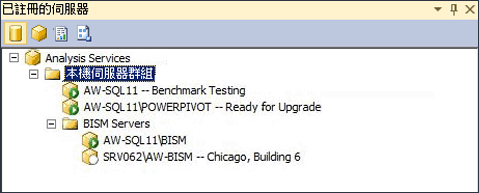

# 註冊伺服器群組中的 Analysis Services 執行個體
[!INCLUDE[ssas-appliesto-sqlas](../../includes/ssas-appliesto-sqlas.md)]如果您有大量 Analysis Services 伺服器執行個體，您可以在 Management Studio 可讓伺服器管理更容易建立伺服器群組。 伺服器群組的目的是在管理工作空間內提供一組相關伺服器之間的接近性。 例如，假設您負責管理十個不同的 Analysis Services 執行個體。 依伺服器模式、開機時間準則，或依部門或地區的伺服器群組方式，可讓檢視及連接到共用相同特性的執行個體更輕鬆。 您還可以加入有助於記住伺服器用法的描述性資訊。  
  
   
  
 可以用階層式結構來建立伺服器群組。 [本機伺服器群組] 是根節點， 它永遠包含本機電腦上執行的 Analysis Services 執行個體。 您可以將遠端伺服器加入至任何群組，包括本機群組。  
  
 在建立伺服器群組之後，您必須使用 [已註冊的伺服器] 窗格來檢視及連接到成員伺服器。 此窗格依伺服器類型 (Database Engine、Analysis Services、Reporting Services 和 Integration Services) 來篩選 SQL Server 執行個體。 按一下伺服器類型，即可檢視為此類型建立的伺服器群組。 若要連接到群組中的特定伺服器，您可以按兩下群組中的伺服器。  
  
 為伺服器所定義的連接資訊 (包括伺服器名稱) 會隨著伺服器註冊保存。 您不能修改連接資訊，或在透過其他工具連接到伺服器時使用已註冊的名稱。  
  
## 建立伺服器群組及加入已註冊的伺服器  
  
1.  在 Management Studio 中，按一下 [檢視] 功能表上的 [已註冊的伺服器]，在工作空間中開啟 [已註冊的伺服器] 窗格。 根據預設，本機伺服器群組已建立。 在本機伺服器上執行的所有 Analysis Services 執行個體都是成員。  
  
2.  以滑鼠右鍵按一下 [本機伺服器群組]，選取 [新增伺服器群組]，並提供群組名稱。  
  
3.  以滑鼠右鍵按一下伺服器群組，然後選取 [新增伺服器註冊]。 如果伺服器安裝為具名執行個體，請輸入本機或遠端伺服器的網路名稱，包括執行個體名稱。 或者，您也可以提供出現在 [已註冊的伺服器] 中的已註冊伺服器名稱。 此名稱只在 [已註冊的伺服器] 中使用。 您不能使用它來重新命名伺服器，也不能在連接字串中使用它。 已註冊的伺服器名稱可以比實際伺服器名稱更具描述性，或包含有助於區別伺服器的識別特性。  
  
  
