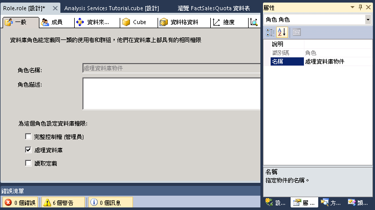
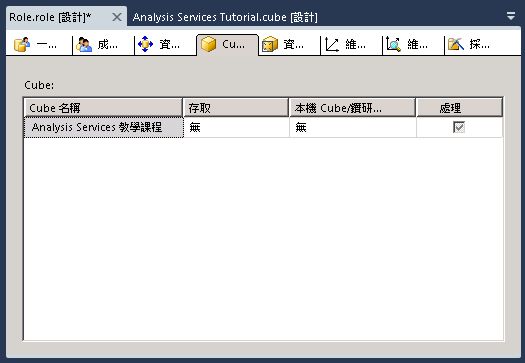

# 課程 10-授與處理資料庫權限
[!INCLUDE[ssas-appliesto-sqlas](../includes/ssas-appliesto-sqlas.md)]

當您安裝 [!INCLUDE[ssASnoversion](../includes/ssasnoversion-md.md)]的執行個體之後，該執行個體中 [!INCLUDE[ssASnoversion](../includes/ssasnoversion-md.md)] 伺服器管理員角色的所有成員都會具有伺服器範圍權限，可在 [!INCLUDE[ssASnoversion](../includes/ssasnoversion-md.md)]執行個體內執行任何工作。 依預設，其他使用者都無權管理或檢視 [!INCLUDE[ssASnoversion](../includes/ssasnoversion-md.md)]執行個體中的任何物件。  
  
伺服器管理員角色的成員可在整個伺服器範圍，讓他們成為角色的成員，以授與使用者管理存取權。 伺服器管理員角色的成員也可以在資料庫層級授與使用者有限或完整的管理權或存取權，藉此授與使用者比較有限的存取權。 有限的管理員權限包括在資料庫、Cube 或維度層級的處理或讀取定義權限。  
  
在本主題的工作中，您要定義處理資料庫物件安全性角色，這個角色會授權讓角色成員處理所有的資料庫物件，但不讓他們有權檢視資料庫中的資料。  
  
## 定義處理資料庫物件安全性角色  
  
1.  在方案總管中，以滑鼠右鍵按一下 [角色]，然後按一下 [新增角色] 以開啟 [角色設計師]。  
  
2.  按一下 [處理資料庫] 核取方塊。  
  
3.  在 [屬性] 視窗中，將這個新角色的 [名稱] 屬性變更為 [處理資料庫物件角色]。  
  
      
  
4.  切換到 [角色設計師] 的 [成員資格] 索引標籤，然後按一下 [新增]。  
  
5.  輸入 Windows 網域使用者或群組的帳戶，他們將成為這個角色的成員。 按一下 [檢查名稱] 來確認帳戶資訊，然後按一下 [確定]。  
  
6.  切換到 [角色設計師] 的 [Cube] 索引標籤。  
  
    請注意，雖然這個角色的成員有權處理這個資料庫，但是無權存取 [!INCLUDE[ssASnoversion](../includes/ssasnoversion-md.md)] 教學課程 Cube 中的資料，也沒有本機 Cube/鑽研存取權，如下圖所示。  
  
      
  
7.  切換到 [角色設計師] 的 [維度] 索引標籤。  
  
    請注意，這個角色的成員有權處理這個資料庫中的所有維度物件，而且依預設，也有權讀取 [!INCLUDE[ssASnoversion](../includes/ssasnoversion-md.md)] 教學課程資料庫中的每一個維度物件。  
  
8.  在 [建立] 功能表上，按一下 [部署 Analysis Services 教學課程]。  
  
    現在您已經順利定義和部署處理資料庫物件安全性角色了。 當您把 Cube 部署到實際環境之後，部署 Cube 的管理員就可以根據需要，把使用者加入這個角色中，將處理責任委託給特定的使用者。  
  
> [!NOTE]  
> 您可以下載並安裝範例，取得完成第 10 課的專案。 如需詳細資訊，請參閱 [安裝 Analysis Services 多維度模型化教學課程的範例資料和專案](../analysis-services/install-sample-data-and-projects.md)。  
  
## 另請參閱  
[角色與權限 &#40;Analysis Services&#41;](../analysis-services/multidimensional-models/roles-and-permissions-analysis-services.md)  
  
  
  
