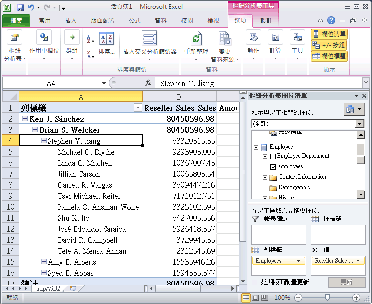
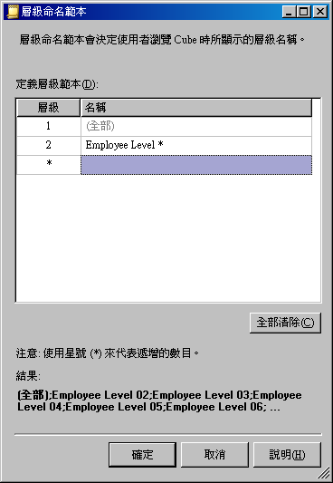

# 父子式階層中的課程 4-2-定義父屬性
父子式階層是指維度中以兩個資料表資料行為基礎的階層。 這些資料行會一起定義維度成員之間的階層式關聯性。 第一個名稱為「成員索引鍵資料行」的資料行會識別每個維度成員。 另一個名稱為「父資料行」資料行則會識別每個維度成員的父系。 父屬性的 **NamingTemplate** 屬性決定父子式階層中每個層級的名稱，而 **MembersWithData** 屬性則決定是否應該顯示父成員的資料。  
  
如需詳細資訊，請參閱 [父子式維度](../analysis-services/multidimensional-models/parent-child-dimension.md), [父子式階層中的屬性](../analysis-services/multidimensional-models/parent-child-dimension-attributes.md)。  
  
> [!NOTE]  
> 當您使用「維度精靈」來建立維度時，此精靈會辨識具有父子式關聯性的資料表，並自動定義父子式階層。  
  
在這個主題的工作中，您會建立一個命名範本，而它會在 [Employee (員工)] 維度中定義父子式階層中每一個層級的名稱。 接著，您將會設定父屬性來隱藏所有的父資料，以便只顯示分葉層級成員的銷售量。  
  
## 瀏覽 Employee 維度  
  
1.  在方案總管中，按兩下**維度**資料夾中的 **Employee.dim**，即可針對 [Employee (員工)] 維度開啟維度設計師。  
  
2.  按一下 [瀏覽器] 索引標籤，確認已在 [階層] 清單中選取 [Employee (員工)]，然後展開 [All Employees (所有員工)] 成員。  
  
    請注意，在這個父子式階層中，**Ken J. Sánchez** 為最上層的主管。  
  
3.  選取 **Ken J. Sánchez** 成員。  
  
    請注意，這個成員的層級名稱是 [Level 02 (層級 02)]。 (層級名稱會立即出現在 [目前層級:] 之後的 [All Employees (所有成員)] 成員上方)。在下一項工作中，您會為每一個層級定義更具描述性的名稱。  
  
4.  展開 **Ken J. Sánchez** 以檢視向這位主管報告的員工姓名，然後選取 **Brian S. Welcker** 來檢視這個層級的名稱。  
  
    請注意，這個成員的層級名稱是 [Level 03 (層級 03)]。  
  
5.  在方案總管中，按兩下 **Cubes** 資料夾的 **Analysis Services Tutorial.cube**，來針對 [!INCLUDE[ssASnoversion](../includes/ssasnoversion-md.md)] 教學課程 Cube 開啟 Cube 設計師。  
  
6.  按一下 **[瀏覽器]** 索引標籤。  
  
7.  按一下 Excel 圖示，然後在出現啟用連接的提示時，按一下 [啟用]。  
  
8.  在樞紐分析表欄位清單中，展開 [Reseller Sales (轉售商銷售)]。 將 [Reseller Sales-Sales Amount (轉售商銷售 - 銷售量)] 拖曳至 [值] 區域。  
  
9. 在樞紐分析表欄位清單中，展開 [Employee (員工)]，然後將 [Employees (員工)] 階層拖曳至 [資料列] 區域。  
  
    [員工] 階層的所有成員都會加入至樞紐分析表報表的資料行 A 中。  
  
    下列影像顯示展開的 [員工] 階層。  
  
10.   
  
    請注意，每位主管在 [Level 03 (層級 03)] 中達到的銷售量也會顯示在 [Level 04 (層級 04)] 中。 這是因為每位主管也是另一位主管的員工。 在下一項工作中，您會隱藏這些銷售量。  
  
## 修改員工維度中父屬性 (Attribute) 的屬性 (Property)  
  
1.  針對 [Employee (員工)] 維度，切換至維度設計師。  
  
2.  按一下 [維度結構] 索引標籤，然後在 [屬性] 窗格中選取 [Employees (員工)] 屬性階層。  
  
    請注意這個屬性的唯一圖示。 這個圖示表示屬性為父子式階層中的父索引鍵。 也請注意，在 [屬性] 視窗中，該屬性的 **Usage** 屬性是定義為 [父系]。 當您設計維度，「維度精靈」就會設定這個屬性。 此精靈會自動偵測父子式關聯性。  
  
3.  在 [屬性] 視窗中，按一下 **NamingTemplate** 屬性資料格中的省略符號按鈕 (**...**)。  
  
    在 [層級命名範本] 對話方塊中，您會定義可決定父子式階層中層級名稱的層級命名範本，而使用者瀏覽 Cube 時便會看到這些名稱。  
  
4.  在第二個資料列 (即 **\*** 資料列) 的 [名稱] 資料行中，輸入 **Employee Level \***，然後按一下第 3 個資料列。  
  
    請注意，在 [結果] 之下，每一個層級的名稱都變成 "Employee Level"，後面接著循序遞增的數字。  
  
    下圖顯示 [層級命名範本] 對話方塊中的變更。  
  
      
  
5.  按一下 **[確定]**。  
  
6.  在 **Employees** 屬性的屬性視窗中，選取 **MembersWithData** 屬性儲存格的 **NonLeafDataHidden** 來變更 **Employees** 屬性的這個值。  
  
    這會使父子式階層中與非分葉層級成員相關的資料隱藏起來。  
  
## 瀏覽含有已修改屬性的 Employee 維度  
  
1.  在 [!INCLUDE[ssBIDevStudioFull](../includes/ssbidevstudiofull-md.md)] 的 [建立] 功能表上，按一下 [Deploy Analysis Services Tutorial (部署 Analysis Services 教學課程)]。  
  
2.  順利完成部署之後，針對 [!INCLUDE[ssASnoversion](../includes/ssasnoversion-md.md)] 教學課程 Cube，切換到 Cube 設計師，然後按一下 [瀏覽器] 索引標籤之工具列上的 [重新連接]。  
  
3.  按一下 Excel 圖示，然後按一下 [啟用]。  
  
4.  將 [Reseller Sales-Sales Amount (轉售商銷售 - 銷售量)] 拖曳至 [值] 區域。  
  
5.  將 [Employees (員工)] 階層拖曳至 [資料列標籤] 區域中。  
  
    下圖顯示您對 [Employees] 階層所做的變更。 請注意，Stephen Y. Jiang 不再顯示為自己的員工。  
  
    ![修改 [Employees] 階層](../analysis-services/media/l4-employee-2.png "修改員工階層")  
  
## 本課程的下一項工作  
[自動分組屬性成員](../analysis-services/lesson-4-3-automatically-grouping-attribute-members.md)  
  
## 另請參閱  
[父子式維度](../analysis-services/multidimensional-models/parent-child-dimension.md)  
[父子式階層中的屬性](../analysis-services/multidimensional-models/parent-child-dimension-attributes.md)  
  
  
  
