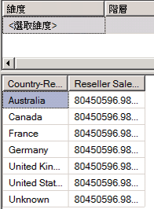
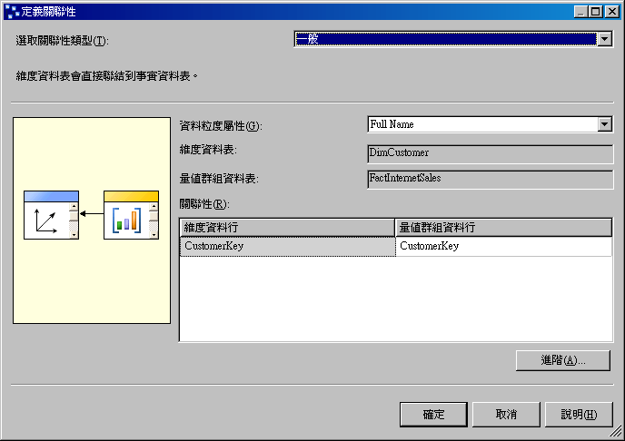
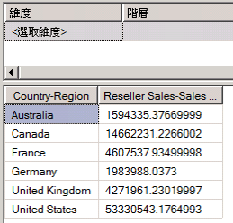

# 課程 5-1-定義參考的關聯性
[!INCLUDE[ssas-appliesto-sqlas](../includes/ssas-appliesto-sqlas.md)]

本教學課程最特別要注意的事就是，您定義的每一個 Cube 維度所依據的資料表，是透過主索引鍵對外部索引鍵的關聯性，直接連結到量值群組的事實資料表。 在本主題的工作中，您會透過 [轉售商] 維度 (稱為「參考維度」)，將 [地理位置] 維度連結到事實資料表。 這樣可讓使用者按地理位置建立轉售商銷售的維度。 如需詳細資訊，請參閱 [定義參考的關聯性及參考的關聯性屬性](../analysis-services/multidimensional-models/define-a-referenced-relationship-and-referenced-relationship-properties.md)。  
  
## 按地理位置建立轉售商銷售的維度  
  
1.  在方案總管中，以滑鼠右鍵按一下 [Cubes] 資料夾中的 [Analysis Services Tutorial]，然後按一下 [瀏覽]。  
  
2.  從 [資料] 窗格中移除所有階層，然後確認 [轉售商銷售 - 銷售量] 量值確實出現在 [資料] 窗格的資料區域中。 如果沒有，請將它加入至 [資料] 窗格中。  
  
3.  從 [中繼資料] 窗格的 [地理位置] 維度中，將 [地理位置] 使用者定義階層拖曳到 [資料] 窗格的 [將列欄位拖曳到這裡] 區域。  
  
    請注意，[區域] 階層中的 [國家地區] 屬性成員未正確設定 [轉售商銷售 - 銷售量] 量值的維度。 針對每個 [國家地區] 屬性成員，[轉售商銷售 - 銷售量] 的值會重複。  
  
      
  
4.  請針對 **Adventure Works DW 2012** 資料來源檢視，開啟資料來源檢視設計師。  
  
5.  在 [圖表組合管理] 窗格中，檢視 [Geography] 資料表與 [ResellerSales] 資料表之間的關聯性。  
  
    請注意，這些資料表之間沒有直接連結。 不過，透過 [Reseller] 資料表或 [SalesTerritory] 資料表，這些資料表之間有間接連結。  
  
6.  按兩下代表 [Geography] 資料表和 [Reseller] 資料表之間關聯性的箭頭。  
  
    請注意，在 [編輯關聯性] 對話方塊中，[GeographyKey] 資料行是 [Geography] 資料表中的主索引鍵以及 [Reseller] 資料表中的外部索引鍵。  
  
7.  按一下 [取消]，針對 [!INCLUDE[ssASnoversion](../includes/ssasnoversion-md.md)] 教學課程的 Cube 切換到 [Cube 設計師]，然後按一下 [維度使用方式] 索引標籤。  
  
    請注意，目前 [地理位置] Cube 維度與 [網際網路銷售] 量值群組或 [轉售商銷售] 量值群組之間沒有關聯性。  
  
8.  按一下 [全名] 資料格中的省略符號按鈕 (**…**)，這個資料格位於 [客戶] 維度和 [網際網路銷售] 量值群組的交集處。  
  
    請注意，在 [定義關聯性] 對話方塊中，[DimCustomer] 維度資料表和 [FactInternetSales] 量值群組資料表之間定義的 [一般] 關聯性，是依據這些資料表中的 [CustomerKey] 資料行。 到目前為止，您在這個教學課程中定義的所有關聯性都是一般關聯性。  
  
    下圖顯示 [定義關聯性] 對話方塊，其中在 [DimCustomer] 維度資料表和 [FactInternetSales] 量值群組資料表之間有一般關聯性。  
  
      
  
9. 按一下 [取消]。  
  
10. 按一下未命名的資料格中的省略符號按鈕 (**…**)，這個資料格位於 [地理位置] 維度和 [轉售商銷售] 量值群組的交集處。  
  
    在 [定義關聯性] 對話方塊中，請注意，[地理位置] Cube 維度和 [轉售商銷售] 量值群組之間目前並未定義關聯性。 您不能定義一般關聯性，因為 [Geography] 維度的維度資料表和 [Reseller Sales] 量值群組的事實資料表之間沒有直接關聯性。  
  
11. 在 [選取關聯性類型] 清單中，選取 [參考的]。  
  
    您可以指定一個直接連接到量值群組資料表的維度 (稱為「中繼維度」) 來定義參考關聯性，[!INCLUDE[ssASnoversion](../includes/ssasnoversion-md.md)] 可利用它來連結參考維度與事實資料表。 然後，您可以指定一個屬性來連結參考維度與中繼維度。  
  
12. 在 [中繼維度] 清單中，選取 [轉售商]。  
  
    [Geography] 維度的基礎資料表會透過 [Reseller] 維度的基礎資料表連結到事實資料表。  
  
13. 在 [參考維度屬性] 清單中，選取 [地理位置索引鍵]，然後試著選取 [中繼維度屬性] 清單中的 [地理位置索引鍵]。  
  
    請注意，[地理位置索引鍵] 並沒有出現在 [中繼維度屬性] 清單中。 這是因為 [地理位置索引鍵] 資料行未定義成 [轉售商] 維度中的屬性。  
  
14. 按一下 [取消]。  
  
在下一項工作中，您將定義一個依據 [Reseller] 維度的 [GeographyKey] 資料行的屬性來解決這個問題。  
  
## 定義中繼維度屬性和參考維度關聯性  
  
1.  針對 [轉售商] 維度開啟 [維度設計師]，然後在 [資料來源檢視] 窗格的 [Reseller] 資料表中檢視資料行，並在 [屬性] 窗格的 [轉售商] 維度中檢視已定義的屬性。  
  
    請注意，雖然 GeographyKey 是定義成 [Reseller] 資料表中的資料行，但在 [Reseller] 維度中並沒有定義依據這個資料行的維度屬性。 [Geography] 是定義成 [Geography] 維度中的維度屬性，因為它是連結維度的基礎資料表與事實資料表的索引鍵資料行。  
  
2.  若要將 [地理位置索引鍵] 屬性加入 [轉售商] 維度，請以滑鼠右鍵按一下 [資料來源檢視] 窗格中的 [GeographyKey]，然後按一下 [從資料行新增屬性]。  
  
3.  在 [屬性] 窗格中，選取 [地理位置索引鍵]，然後在 [屬性] 視窗中，將 [AttributeHierarchyOptimizedState] 屬性設定為 [NotOptimized]、將 [AttributeHierarchyOrdered] 屬性設定為 [False]，並且將 [AttributeHierarchyVisible] 屬性設定為 [False]。  
  
    [Reseller] 維度中的 [Geography Key] 屬性只用來連結 [Geography] 維度與 [Reseller Sales] 事實資料表。 因為它不用於瀏覽，所以定義這個屬性階層的值沒有一個會顯示出來。 而且，屬性階層的排序和最佳化對處理效能只有負面影響。 不過，必須啟用屬性才能做為兩個維度之間的連結。  
  
4.  請針對 [!INCLUDE[ssASnoversion](../includes/ssasnoversion-md.md)] 教學課程的 Cube，切換到 [Cube 設計師]，按一下 [維度使用方式] 索引標籤，然後按一下 [轉售商銷售] 量值群組和 [地理位置] Cube 維度的交集處的省略符號按鈕 (**…**)。  
  
5.  在 [選取關聯性類型] 清單中，選取 [參考的]。  
  
6.  在 [中繼維度] 清單中，選取 [轉售商]。  
  
7.  在 [參考維度屬性] 清單中，選取 [地理位置索引鍵]，然後選取 [中繼維度屬性] 清單中的 [地理位置索引鍵]。  
  
    請注意，已選取 [具體化] 核取方塊。 這項設定是 MOLAP 維度的預設值。 具體化維度屬性連結，會在處理期間使事實資料表與每個資料列的參考維度之間的連結值具體化，或是儲存在維度的 MOLAP 結構中。 這對處理效能及儲存體需求上會有一點影響，但會提升 (偶爾也會大幅提升) 查詢效能。  
  
8.  按一下 **[確定]**。  
  
    請注意，[地理位置] Cube 維度現在是連結到 [轉售商銷售] 量值群組。 這個圖示指出其關聯性是參考維度關聯性。  
  
9. 在 [維度使用方式] 索引標籤的 [維度] 清單中，以滑鼠右鍵按一下 [地理位置]，然後按一下 [重新命名]。  
  
10. 將這個 Cube 維度的名稱變更為**轉售商地理位置**。  
  
    由於這個 Cube 維度現在是連結到 [轉售商銷售] 量值群組，所以使用者可在 Cube 中明確定義其使用方式，如此可避免產生可能的誤解。  
  
## 按地理位置成功地建立轉售商銷售的維度  
  
1.  在 [建立] 功能表上，按一下 [部署 Analysis Services 教學課程]。  
  
2.  順利完成部署之後，針對 [!INCLUDE[ssASnoversion](../includes/ssasnoversion-md.md)] 教學課程 Cube，按一下 [Cube 設計師] 的 [瀏覽器] 索引標籤，然後按一下 [重新連接] 按鈕。  
  
3.  在 [中繼資料] 窗格中，展開 [轉售商地理位置]以滑鼠右鍵按一下 [地理位置]，然後按一下 [加入至資料列區域]。  
  
    請注意，[地理位置] 使用者定義階層的 [國家地區] 屬性現在已正確設定 [轉售商銷售 - 銷售量] 量值的維度，如下圖所示。  
  
      
  
## 本課程的下一項工作  
[定義事實關聯性](../analysis-services/lesson-5-2-defining-a-fact-relationship.md)  
  
## 另請參閱  
[中，使用 [維度設計師] 的](../analysis-services/multidimensional-models-olap-logical-dimension-objects/attribute-relationships.md)  
[定義參考的關聯性及參考的關聯性屬性](../analysis-services/multidimensional-models/define-a-referenced-relationship-and-referenced-relationship-properties.md)  
  
  
  
