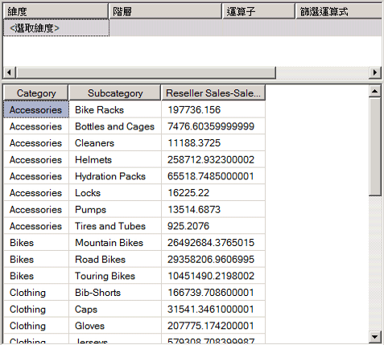
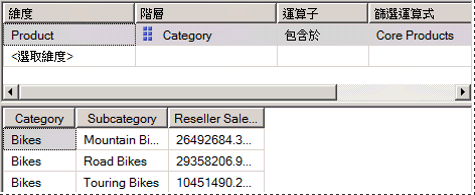
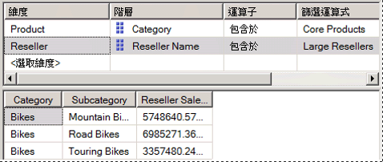

# <a name="lesson-6-2---defining-named-sets"></a>課程 6-2-定義命名集
[!INCLUDE[ssas-appliesto-sqlas](../includes/ssas-appliesto-sqlas.md)]

命名集是指傳回一組維度成員的多維度運算式 (MDX) 運算式。 您可以定義命名集，將它們儲存為 Cube 定義的一部分；也可以在用戶端應用程式建立命名集。 您可以結合 Cube 資料、算術運算子、數字和函數，來建立命名集。 使用者可以在用戶端應用程式中將命名集用於 MDX 查詢，也可以用於定義 Subcube 中的集合。 Subcube 是指交叉聯結集的集合，它會將 Cube 空間限制為針對後續陳述式定義的子空間。 定義限制的 Cube 空間是 MDX 指令碼的基本概念。  
  
命名集可以簡化 MDX 查詢，為複雜常用的集合運算式，提供有用的別名。 例如，您可以定義一個稱為 [大型轉售商] 的命名集，其含有 [轉售商] 維度中，擁有最多員工的成員集合。 一般使用者可以在查詢使用 [大型轉售商] 命名集，也可以使用命名集在 Subcube 中定義一個集合。 命名集定義是儲存在 Cube 中，但其值卻只存在於記憶體。 若要建立命名集，請在 Cube 設計師的 **[計算]** 索引標籤上，使用 **[新增命名集]** 命令。 如需詳細資訊，請參閱 [計算](../analysis-services/multidimensional-models-olap-logical-cube-objects/calculations.md)、 [建立命名集](../analysis-services/multidimensional-models/create-named-sets.md)。  
  
在這個主題的工作中，您要定義兩個命名集：[核心產品] 命名集以及 [大型轉售商] 命名集。  
  
## <a name="defining-a-core-products-named-set"></a>定義核心產品命名集  
  
1.  針對 [!INCLUDE[ssASnoversion](../includes/ssasnoversion-md.md)] 教學課程 Cube，切換到 [Cube 設計師] 的 [計算] 索引標籤，然後在工具列按一下 [表單檢視]。  
  
2.  按一下 [指令碼組合管理] 窗格中的 [總銷售與所有產品的比率]，然後在 [計算] 索引標籤的工具列上，按一下 [新增命名集]。  
  
    當您在 [計算] 索引標籤上定義新的計算時，請記住，計算是根據它們出現在 [指令碼組合管理] 窗格中的順序加以解析的。 在建立新計算時，您在窗格內的焦點，決定了執行計算的順序；新的計算會在焦點計算進行之後立即定義。  
  
3.  在 [名稱] 方塊中，將新命名集的名稱變更為 [核心產品]。  
  
    在 [指令碼組合管理] 窗格中，請注意分辨命名集與指令碼命令或導出成員所用的唯一圖示。  
  
4.  在 [計算工具] 窗格的 [中繼資料] 索引標籤上，依序展開 [產品]、[類別目錄]、[成員] 以及 [所有產品]。  
  
    > [!NOTE]  
    > 如果您無法在 [計算工具] 窗格檢視任何中繼資料，請在工具列上按一下 [重新連接]。 如果此舉無效，可能得處理 Cube，或者啟動 [!INCLUDE[ssASnoversion](../includes/ssasnoversion-md.md)] 的執行個體。  
  
5.  將 [自行車] 拖曳到 [運算式] 方塊。  
  
    現在您已經建立了一個集合運算式，它會傳回位於 [產品] 維度 [自行車] 類別目錄中的成員集合。  
  
## <a name="defining-a-large-resellers-named-set"></a>定義大型轉售商命名集  
  
1.  以滑鼠右鍵按一下 [指令碼組合管理] 窗格中的 [核心產品]，然後按一下 [新增命名集]。  
  
2.  在 [名稱] 方塊中，將這個命名集的名稱變更為 [大型轉售商]。  
  
3.  在 [運算式] 方塊中，輸入 **Exists()**。  
  
    您會使用 Exists 函數，傳回 [轉售商名稱] 屬性階層中的成員集合，這個成員集合與 [員工數目] 屬性階層中，具有最多員工的成員集合交集。  
  
4.  在 [計算工具] 窗格中的 [中繼資料] 索引標籤上，依序展開 [轉售商] 維度和 [轉售商名稱] 屬性階層。  
  
5.  將 [轉售商名稱] 層級拖曳到 Exists 集合運算式的括弧內。  
  
    您要使用 Members 函數，傳回這個集合的所有成員。 如需詳細資訊，請參閱 [Members &#40;集合&#41; &#40;MDX&#41;](../mdx/members-set-mdx.md)。  
  
6.  在部分集合運算式之後，輸入一個英文句點，再加上 Members 函數。 您的運算式應該如下所示：  
  
    ```  
    Exists([Reseller].[Reseller Name].[Reseller Name].Members)  
    ```  
  
    現在您已經定義了 Exists 集合運算式的第一個集合，可以再加入第二個集合，亦即含有最多員工之 [轉售商] 維度的成員集合。  
  
7.  在 [計算工具] 窗格的 [中繼資料] 索引標籤上，依序展開 [轉售商] 維度的 [員工數目]、[成員] 和 [所有轉售商]。  
  
    請注意，這個屬性階層的成員並未分組。  
  
8.  針對 [轉售商] 維度開啟 [維度設計師]，然後按一下 [屬性] 窗格中的 [員工數目]。  
  
9. 在 [屬性] 視窗中，將 [DiscretizationMethod] 屬性變更為 [自動]，然後將 [DiscretizationBucketCount] 屬性變更為 **5**。 如需詳細資訊，請參閱 [Group Attribute Members &#40;Discretization&#41;](../analysis-services/multidimensional-models/attribute-properties-group-attribute-members.md) (群組屬性成員 (分隔))。  
  
10. 在 [!INCLUDE[ssBIDevStudioFull](../includes/ssbidevstudiofull-md.md)] 的 [建立] 功能表上，按一下 [部署 Analysis Services 教學課程]。  
  
11. 順利完成部署之後，針對 [!INCLUDE[ssASnoversion](../includes/ssasnoversion-md.md)] 教學課程 Cube，切換到 [Cube 設計師]，然後按一下 [計算] 索引標籤之工具列上的 [重新連接]。  
  
12. 在 [計算工具] 窗格的 [中繼資料] 索引標籤上，依序展開 [轉售商] 維度的 [員工數目]、[成員] 和 [所有轉售商]。  
  
    請注意，這個屬性階層的成員現已包含在編號 0 到 4 的五個群組中。 若要檢視群組的數目，請將資料指標暫停在該群組上，以檢視資訊提示。 對於範圍 `2 -17`，資訊提示應該會包含 `[Reseller].[Number of Employees].&[0]`。  
  
    將此屬性階層的成員分組，是因為 DiscretizationBucketCount 屬性被設為 **5**，而 DiscretizationMethod 屬性被設為 [自動]。  
  
13. 在 [運算式] 方塊中，Exists 集合運算式的 Members 函數後面和右括弧前面加入逗號，然後將 [83 - 100] 從 [中繼資料] 窗格拖曳到逗號後面。  
  
    現在您已經完成 Exists 集合運算式，當 [大型轉售商] 命名集置於軸上時，這個運算式會傳回與這兩個指定集合交集的成員集合：所有轉售商的集合以及擁有 83 到 100 名員工的轉售商集合。  
  
    下圖所顯示的是，[大型轉售商] 命名集的 [計算運算式] 窗格。  
  
    ![[大型轉售商] 的計算運算式窗格](../analysis-services/media/l6-named-set-02.gif "[大型轉售商] 的計算運算式窗格")  
  
14. 在 [計算] 索引標籤的工具列上，按一下 [指令碼檢視]，檢視您剛剛加到計算指令碼中的兩個命名集。  
  
15. 緊接在計算指令碼的第一個 CREATE SET 命令之前加入一行，然後在指令碼那一行加入下列文字：  
  
    ```  
    /* named sets */  
    ```  
  
    現在您已經定義了兩個命名集，兩個都會出現在 [指令碼組合管理] 窗格中。 現在就可以部署這兩個命名集，然後在 [!INCLUDE[ssASnoversion](../includes/ssasnoversion-md.md)] 教學課程 Cube 中瀏覽這些量值。  
  
## <a name="browsing-the-cube-by-using-the-new-named-sets"></a>利用新的命名集來瀏覽 Cube  
  
1.  在 [!INCLUDE[ssBIDevStudio](../includes/ssbidevstudio-md.md)] 的 [建立] 功能表上，按一下 [部署 Analysis Services 教學課程]。  
  
2.  當部署順利完成時，請依序按一下 [瀏覽器] 索引標籤和 [重新連接]。  
  
3.  清除資料窗格中的方格。  
  
4.  將 [轉售商銷售 - 銷售量] 量值加入資料區域。  
  
5.  展開 [產品] 維度，然後將 [類別目錄] 和 [子類別目錄] 加入至資料列區域，如下圖所示。  
  
      
  
6.  在 [中繼資料] 窗格的 [產品] 維度中，將 [核心產品] 拖曳至篩選區域。  
  
    請注意，只有 [類別目錄] 屬性的 [自行車] 成員和 [自行車] 子類別目錄的成員會繼續留在 Cube 中。 這是因為 [核心產品] 命名集是用來定義 Subcube。 這個 Subcube 會將 Subcube 內 [產品] 維度的 [類別目錄] 屬性的成員限制為 [核心產品] 命名集的那些成員，如下圖所示。  
  
      
  
7.  在 [中繼資料] 窗格中，展開 [轉售商]，然後將 [大型轉售商] 加入篩選區域。  
  
    請注意，[資料] 窗格中的 [轉售商銷售量] 量值只會顯示自行車大型轉售商的銷售量。 同時也請注意，[篩選] 窗格現在會顯示用於定義這個特定 Subcube 的兩個命名集，如下圖所示。  
  
      
  
## <a name="next-lesson"></a>下一課  
[第 7 課： 定義關鍵效能指標 & #40;Kpi & #41;](../analysis-services/lesson-7-defining-key-performance-indicators-kpis.md)  
  
## <a name="see-also"></a>另請參閱  
[[新增命名集]](../analysis-services/multidimensional-models-olap-logical-cube-objects/calculations.md)  
[建立命名集](../analysis-services/multidimensional-models/create-named-sets.md)  
  
  
  
