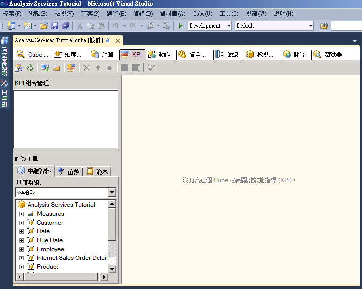

# <a name="lesson-7-1---defining-and-browsing-kpis"></a>課程 7-1-定義和瀏覽 Kpi
[!INCLUDE[ssas-appliesto-sqlas](../includes/ssas-appliesto-sqlas.md)]

若要定義關鍵效能指標 (KPI)，您必須先定義 KPI 名稱以及與該 KPI 相關聯的量值群組。 KPI 可以和所有的量值群組或單一量值群組相關聯。 接著就定義 KPI 的下列元素：  
  
-   值運算式  
  
    值運算式是一個實體量值 (例如，銷售)、導出量值 (例如，利潤) 或是利用多維度運算式 (MDX) 運算式，在 KPI 中定義的計算。  
  
-   目標運算式  
  
    目標運算式是一個值，或是解析為一值的 MDX 運算式，它會針對值運算式所定義的量值定義目標。 例如，目標運算式可能是公司業務經理想要提升銷售或利潤所用的量。  
  
-   狀態運算式  
  
    狀態運算式是一個 MDX 運算式，可讓 [!INCLUDE[ssASnoversion](../includes/ssasnoversion-md.md)] 用於評估相較於目標運算式的值運算式目前狀態。 目標運算式是 -1 至 +1 範圍內的正規化值，其中 -1 表示非常差，而 +1 則表示非常好。 狀態運算式會顯示一個圖形，幫助您輕鬆地判斷相較於目標運算式的值運算式狀態。  
  
-   趨勢運算式  
  
    趨勢運算式是一個 MDX 運算式，是 [!INCLUDE[ssASnoversion](../includes/ssasnoversion-md.md)] 用於評估相較於目標運算式的值運算式目前趨勢。 趨勢運算式可以幫助商務使用者快速判斷，相對於目標運算式來說，值運算式是越來越好亦或越來越糟。 您可以將其中一個圖形關聯到趨勢運算式，幫助商務使用者快速了解趨勢。  
  
除了您為 KPI 定義的這些元素之外，還可以定義 KPI 的幾種屬性。 這些屬性包括顯示資料夾、父系 KPI (如果 KPI 是從其他 KPI 計算而來)、目前時間成員 (如果有的話)、KPI 的加權 (如果有的話) 以及 KPI 的描述。  
  
> [!NOTE]  
> 如需 KPI 的其他範例，請參閱 [計算工具] 窗格之 [範本] 索引標籤上的 KPI 範例，或是 **Adventure Works DW 2012** 範例資料倉儲中的範例。 如需如何安裝此資料庫的詳細資訊，請參閱 [安裝 Analysis Services 多維度模型化教學課程的範例資料和專案](../analysis-services/install-sample-data-and-projects.md)。  
  
在這一課的工作中，您會在 [!INCLUDE[ssASnoversion](../includes/ssasnoversion-md.md)] 教學課程專案中定義 KPI，然後利用這些 KPI 來瀏覽 [!INCLUDE[ssASnoversion](../includes/ssasnoversion-md.md)] 教學課程 Cube。 您將定義下列 KPI：  
  
-   轉售商收入  
  
    這個 KPI 是用於測量實際轉售商銷售與轉售商銷售配額之間的對比、銷售情形與目標之間的差距，以及達到目標的趨勢走向。  
  
-   產品毛利率  
  
    這個 KPI 是用於判斷每個產品類別目錄的毛利率與每個產品類別目錄指定的目標之間的差距，同時也用於判斷達到此目標的趨勢走向。  
  
## <a name="defining-the-reseller-revenue-kpi"></a>定義轉售商收入 KPI  
  
1.  針對 [!INCLUDE[ssASnoversion](../includes/ssasnoversion-md.md)] 教學課程 Cube，開啟 [Cube 設計師]，然後按一下 [KPI] 索引標籤。  
  
    [KPI] 索引標籤包含多個窗格。 在該索引標籤的左方，是 [KPI 組合管理] 窗格和 [計算工具] 窗格。 索引標籤中間的顯示窗格，含有在 [KPI 組合管理] 窗格所選的 KPI 詳細資料。  
  
    下圖顯示 [Cube 設計師] 的 [KPI] 索引標籤。  
  
      
  
2.  在 [KPI] 索引標籤的工具列上，按一下 [新增 KPI] 按鈕。  
  
    顯示窗格中會出現一個空白的 KPI 範本，如下圖所示。  
  
    ![在 [顯示] 窗格中的空白 KPI 範本](../analysis-services/media/l7-kpi-2.gif "顯示 窗格中的空白 KPI 範本")  
  
3.  在 [名稱] 方塊中，輸入 [轉售商收入]，然後選取 [相關聯的量值群組] 清單中的 [轉售商銷售]。  
  
4.  在 [計算工具] 窗格的 [中繼資料] 索引標籤上，依序展開 [量值] 和 [轉售商銷售]，然後將 [轉售商銷售 - 銷售量] 量值拖曳到 [值運算式] 方塊。  
  
5.  在 [計算工具] 窗格的 [中繼資料] 索引標籤上，依序展開 [量值] 和 [銷售配額]，然後將 [銷售量配額] 量值拖曳到 [目標運算式] 方塊。  
  
6.  驗證 [狀態指標] 清單中是否已經選取 [量測計]，然後在 [狀態運算式] 方塊中，輸入下列 MDX 運算式：  
  
    ```  
    Case  
     When   
      KpiValue("Reseller Revenue")/KpiGoal("Reseller Revenue")>=.95  
       Then 1  
     When  
      KpiValue("Reseller Revenue")/KpiGoal("Reseller Revenue")<.95  
       And   
      KpiValue("Reseller Revenue")/KpiGoal("Reseller Revenue")>=.85  
       Then 0  
      Else-1  
    End  
    ```  
  
    這個 MDX 運算式可提供一個依據，讓您評估到達目標的進度。 在這個 MDX 運算式中，如果實際的轉售商銷售超過目標的 85%，則會使用 0 值來擴展所選擇的圖形。 由於量測計是所選的圖形，量測計中的指標是介於空和滿之間。 如果實際的轉售商銷售超過 90%，則量測計上的指標，大約是在空和滿之間的四分之三處。  
  
7.  驗證 [趨勢指標] 清單中是否已選取 [標準箭頭]，然後在 [趨勢運算式] 方塊中輸入下列運算式：  
  
    ```  
    Case  
     When IsEmpty  
      (ParallelPeriod  
       ([Date].[Calendar Date].[Calendar Year],1,  
           [Date].[Calendar Date].CurrentMember))  
      Then 0    
     When  (  
      KpiValue("Reseller Revenue") -   
       (KpiValue("Reseller Revenue"),   
        ParallelPeriod  
         ([Date].[Calendar Date].[Calendar Year],1,  
           [Date].[Calendar Date].CurrentMember))  
          /  
          (KpiValue ("Reseller Revenue"),  
           ParallelPeriod  
            ([Date].[Calendar Date].[Calendar Year],1,  
             [Date].[Calendar Date].CurrentMember)))  
           >=.02  
      Then 1  
       When(  
        KpiValue("Reseller Revenue") -   
         (KpiValue ( "Reseller Revenue" ),  
          ParallelPeriod  
           ([Date].[Calendar Date].[Calendar Year],1,  
            [Date].[Calendar Date].CurrentMember))  
           /  
            (KpiValue("Reseller Revenue"),  
             ParallelPeriod  
              ([Date].[Calendar Date].[Calendar Year],1,  
                [Date].[Calendar Date].CurrentMember)))  
            <=.02  
      Then -1  
       Else 0  
    End  
    ```  
  
    這個 MDX 運算式可提供一個依據，讓您評估到達定義目標的趨勢。  
  
## <a name="browsing-the-cube-by-using-the-reseller-revenue-kpi"></a>使用轉售商收入 KPI 來瀏覽 Cube  
  
1.  在 [!INCLUDE[ssBIDevStudioFull](../includes/ssbidevstudiofull-md.md)] 的 [建立] 功能表上，按一下 [Deploy Analysis Services Tutorial (部署 Analysis Services Tutorial)]。  
  
2.  當您順利完成部署時，請在 [KPI] 索引標籤的工具列上，按一下 [瀏覽器檢視] 按鈕，然後按一下 [重新連接]。  
  
    狀態和趨勢量測計會根據每個維度的預設成員值，顯示在轉售商銷售的 [KPI 瀏覽器] 窗格中，連同該值和目標的值一起。 每個維度的預設成員是 [所有層級] 的 [所有成員]，因為您尚未定義任何維度的其他成員，做為預設成員。  
  
3.  在 [篩選] 窗格中，從 [維度] 清單中選取 [銷售領域]、從 [階層] 清單中選取 [銷售領域]、從 [運算子] 清單中選取 [等於]、從 [篩選運算式] 清單中選取 [北美] 核取方塊，然後按一下 [確定]。  
  
4.  在 [篩選] 窗格的下一個資料列中，從 [維度] 清單中選取 [日期]、從 [階層] 清單中選取 [日曆日期]、從 [運算子] 清單中選取 [等於]、從 [篩選運算式] 清單中選取 [Q3 CY 2007] 核取方塊，然後按一下 [確定]。  
  
5.  按一下 [KPI 瀏覽器] 窗格中的任何位置，更新 [轉售商收入 KPI] 的值。  
  
    請注意，KPI 的 [值]、[目標] 和 [狀態] 區段都反映新時段的值。  
  
## <a name="defining-the-product-gross-profit-margin-kpi"></a>定義產品毛利率 KPI  
  
1.  按一下 [KPI] 索引標籤之工具列上的 [表單檢視] 按鈕，然後按一下 [新增 KPI] 按鈕。  
  
2.  在 [名稱] 方塊中，輸入 **Product Gross Profit Margin**，然後確認 **<All>** 出現在 [相關聯的量值群組] 清單中。  
  
3.  在 [計算工具] 窗格的 [中繼資料] 索引標籤中，將 [總毛利率] 量值拖曳到 [值運算式] 方塊。  
  
4.  在 [目標運算式] 方塊中，輸入下列運算式：  
  
    ```  
    Case  
        When [Product].[Category].CurrentMember Is  
          [Product].[Category].[Accessories]  
        Then .40                   
        When [Product].[Category].CurrentMember   
          Is [Product].[Category].[Bikes]  
        Then .12                  
        When [Product].[Category].CurrentMember Is  
          [Product].[Category].[Clothing]  
        Then .20  
        When [Product].[Category].CurrentMember Is  
          [Product].[Category].[Components]  
        Then .10  
        Else .12              
    End  
    ```  
  
5.  在 [狀態指標] 清單中，選取 [圓柱]。  
  
6.  在 [狀態運算式] 方塊中，輸入下列 MDX 運算式：  
  
    ```  
    Case  
        When KpiValue( "Product Gross Profit Margin" ) /   
             KpiGoal ( "Product Gross Profit Margin" ) >= .90  
        Then 1  
        When KpiValue( "Product Gross Profit Margin" ) /   
             KpiGoal ( "Product Gross Profit Margin" ) <  .90  
             And   
             KpiValue( "Product Gross Profit Margin" ) /   
             KpiGoal ( "Product Gross Profit Margin" ) >= .80  
        Then 0  
        Else -1  
    End  
    ```  
  
    這個 MDX 運算式可提供一個依據，讓您評估到達目標的進度。  
  
7.  驗證 [趨勢指標] 清單中是否已選取 [標準箭頭]，然後在 [趨勢運算式] 方塊中輸入下列 MDX 運算式：  
  
    ```  
    Case  
    When IsEmpty  
      (ParallelPeriod  
       ([Date].[Calendar Date].[Calendar Year],1,  
           [Date].[Calendar Date].CurrentMember))  
      Then 0    
       When VBA!Abs  
        (  
          KpiValue( "Product Gross Profit Margin" ) -   
           (  
             KpiValue ( "Product Gross Profit Margin" ),  
              ParallelPeriod  
              (   
                [Date].[ Calendar Date].[ Calendar Year],  
                1,  
                [Date].[ Calendar Date].CurrentMember  
              )  
            ) /  
            (  
              KpiValue ( "Product Gross Profit Margin" ),  
              ParallelPeriod  
              (   
                [Date].[ Calendar Date].[ Calendar Year],  
                1,  
                [Date].[ Calendar Date].CurrentMember  
              )  
            )    
          ) <=.02  
      Then 0  
      When KpiValue( "Product Gross Profit Margin" ) -   
           (  
             KpiValue ( "Product Gross Profit Margin" ),  
             ParallelPeriod  
             (   
               [Date].[ Calendar Date].[ Calendar Year],  
               1,  
               [Date].[ Calendar Date].CurrentMember  
             )  
           ) /  
           (  
             KpiValue ( "Product Gross Profit Margin" ),  
             ParallelPeriod  
             (   
               [Date].[Calendar Date].[Calendar Year],  
               1,  
               [Date].[Calendar Date].CurrentMember  
             )  
           )  >.02  
      Then 1  
      Else -1  
    End  
    ```  
  
    這個 MDX 運算式可提供一個依據，讓您評估到達定義目標的趨勢。  
  
## <a name="browsing-the-cube-by-using-the-total-gross-profit-margin-kpi"></a>使用總毛利率 KPI 來瀏覽 Cube  
  
1.  在 [建立] 功能表上，按一下 [Deploy Analysis Services Tutorial (部署 Analysis Services Tutorial)]。  
  
2.  當您順利完成部署時，請在 [KPI] 索引標籤的工具列上按一下 [重新連接]，然後按一下 [瀏覽器檢視]。  
  
    [產品毛利率] KPI 隨即出現並顯示 [Q3 CY 2007] 和 [北美] 銷售領域的 KPI 值。  
  
3.  在 [篩選] 窗格中，從 [維度] 清單中選取 [產品]、從 [階層] 清單中選取 [類別目錄]、從 [運算子] 清單中選取 [等於]，並從 [篩選運算式] 清單中選取 [自行車]，然後按一下 [確定]。  
  
    北美地區轉售商 Q3 CY 2007 自行車銷售的毛利率隨即出現。  
  
## <a name="next-lesson"></a>下一課  
[第 8 課： 定義動作](../analysis-services/lesson-8-defining-actions.md)  
  
