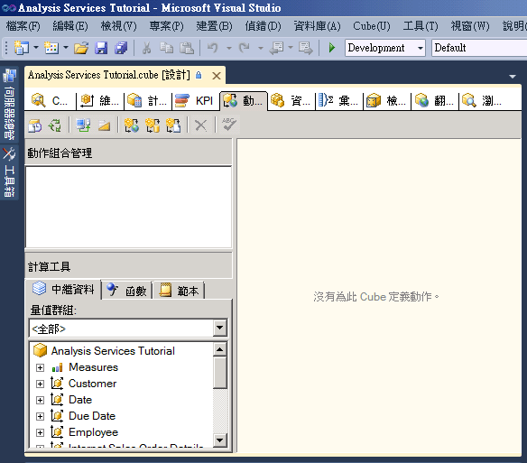
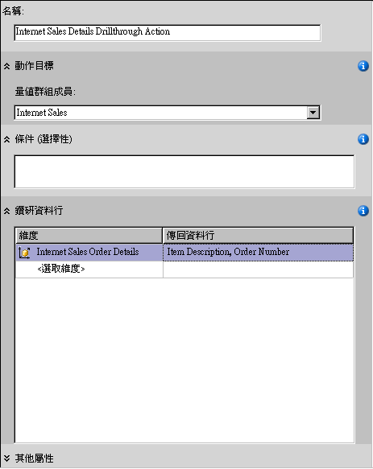
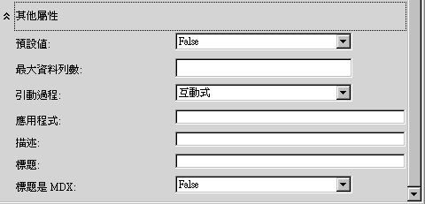
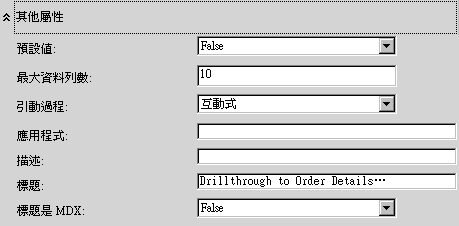
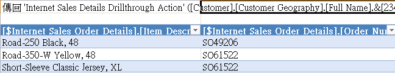
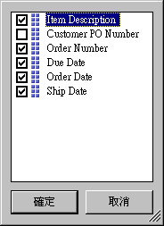
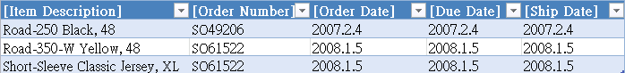

# 課程 8-1-定義和使用鑽研動作
依據事實維度測量事實資料的維度，但卻未正確篩選查詢傳回的資料，可能會降低查詢效能。 為了避免這種情況，您可以定義鑽研動作，以便限制傳回的資料列總數。 這樣做將會大幅改善查詢效能。  
  
在這個主題的工作中，您要定義鑽研動作，透過網際網路將銷售訂購的詳細資訊傳回給客戶。  
  
## 定義鑽研動作屬性  
  
1.  在 [!INCLUDE[ssASnoversion](../includes/ssasnoversion-md.md)] 教學課程 Cube 的 [Cube 設計師] 中，按一下 [動作] 索引標籤。  
  
    [動作] 索引標籤含有幾個窗格。 該索引標籤的左側具有 [動作組合管理] 窗格和 [計算工具] 窗格。 這兩個窗格右邊的窗格是 [顯示] 窗格，其中包含在 [動作組合管理] 窗格中選取之動作的詳細資料。  
  
    下圖顯示 [Cube 設計師] 的 [動作] 索引標籤。  
  
      
  
2.  在 [動作] 索引標籤的工具列上，按一下 [新增鑽研動作] 按鈕。  
  
    此時，[顯示] 窗格中會出現一個空白的動作範本。  
  
    ![在 [顯示] 窗格中的空白動作範本](../analysis-services/media/l8-action2.gif "顯示 窗格中的空白動作範本")  
  
3.  在 [名稱] 方塊中，將這個動作名稱變更為 [網際網路銷售詳細資料鑽研動作]。  
  
4.  在 [量值群組成員] 清單中，選取 [網際網路銷售]。  
  
5.  在 [鑽研資料行] 方塊中，從 [維度] 清單中選取 [網際網路銷售訂單的詳細資料]。  
  
6.  在 [傳回資料行] 清單中，選取 [項目描述] 和 [訂單號碼] 核取方塊，然後按一下 [確定]。 下圖所示範的是，程序此時應該顯示的動作範本。  
  
      
  
7.  展開 [其他屬性] 方塊，如下圖所示。  
  
      
  
8.  在 [最大資料列數] 方塊中，輸入 **10**。  
  
9. 在 [標題] 方塊中，輸入**鑽研至訂單詳細資料…**。  
  
    這些設定會限制傳回的資料列數，指定在用戶端應用程式功能表中所顯示的標題。 下圖顯示 [其他屬性] 方塊中的這些設定。  
  
      
  
## 使用鑽研動作  
  
1.  在 [建立] 功能表上，按一下 [部署 Analysis Services 教學課程]。  
  
2.  順利完成部署之後，針對 [!INCLUDE[ssASnoversion](../includes/ssasnoversion-md.md)] 教學課程 Cube，按一下 [Cube 設計師] 的 [瀏覽器] 索引標籤，然後按一下 [重新連接] 按鈕。  
  
3.  啟動 Excel。  
  
4.  將 [網際網路銷售 - 銷售量] 量值加入 [值] 區域。  
  
5.  將 客戶地理位置 使用者定義階層從 客戶 維度的 位置 資料夾加入 報表篩選 區域中。  
  
6.  在樞紐分析表的 [客戶地理位置] 中，加入選取單一客戶的篩選。 依序展開 [所有客戶]、[澳大利亞]、[昆士蘭]、[布里斯本]、[4000]，選取 [Adam Powell] 的核取方塊，然後按一下 [確定]。  
  
    [!INCLUDE[ssSampleDBCoFull](../includes/sssampledbcofull-md.md)] 到 Adam Powell 的產品總銷售會顯示在資料區域中。  
  
7.  以滑鼠右鍵按一下銷售量，指向 [其他動作]，然後按一下 [鑽研至訂單詳細資料]。  
  
    運送給 Adam Powell 的訂單詳細資料會顯示在 [資料範例檢視器] 中，如下圖所示。 不過，額外附加的詳細資料，有時候是很有用的，例如，訂購日期、截止日期和出貨日期。 在下一個程序中，您要加入這些額外的詳細資料。  
  
      
  
8.  關閉 Excel/  
  
## 修改鑽研動作  
  
1.  針對 [網際網路銷售訂單的詳細資料] 維度開啟 [維度設計師]。  
  
    請注意，這個維度只定義了三個屬性。  
  
2.  在 [資料來源檢視] 窗格中，以滑鼠右鍵按一下其中一個開放區域，然後按一下 [顯示所有資料表]。  
  
3.  在 [格式] 功能表上，指向 [自動版面配置]，然後按一下 [圖表]。  
  
4.  以滑鼠右鍵按一下 [資料來源檢視] 窗格中的開放區域，藉以找出 **InternetSales (dbo.FactInternetSales)** 資料表。 然後，依序按一下 [尋找資料表]、[InternetSales] 和 [確定]。  
  
5.  根據下列資料行，建立新的屬性：  
  
    -   OrderDateKey  
  
    -   DueDateKey  
  
    -   ShipDateKey  
  
6.  將 [訂單日期索引鍵] 屬性 (attribute) 的 [名稱] 屬性 (property) 變更為**訂單日期**。然後，針對 [名稱資料行] 屬性 (property) 按一下瀏覽按鈕，接著在 [名稱資料行] 對話方塊中，選取 [日期] 當作來源資料表並選取 SimpleDate 當作來源資料行。 [!INCLUDE[clickOK](../includes/clickok-md.md)]  
  
7.  將 [到期日索引鍵] 屬性 (attribute) 的 [名稱] 屬性 (property) 變更為**到期日**。然後，使用處理 [訂單日期索引鍵] 屬性 (attribute) 的相同方法，將這個屬性的 [名稱資料行] 屬性 (property) 變更為 **Date.SimpleDate (WChar)**。  
  
8.  將 [出貨日期索引鍵] 屬性 (attribute) 的 [名稱] (property) 屬性變更為**出貨日期**，然後將這個屬性 (attribute) 的 [名稱資料行] 屬性 (property) 變更為 **Date.SimpleDate (WChar)**。  
  
9. 針對 [!INCLUDE[ssASnoversion](../includes/ssasnoversion-md.md)] 教學課程 Cube，切換到 [Cube 設計師] 的 [動作] 索引標籤。  
  
10. 在 [鑽研資料行] 方塊中，選取核取方塊，以便下列資料行加入 [傳回資料行] 清單，然後按一下 [確定]：  
  
    -   Order Date  
  
    -   Due Date  
  
    -   Ship Date  
  
    下圖所顯示的是這些選取的資料行。  
  
      
  
## 檢閱修改後的鑽研動作  
  
1.  在 [建立] 功能表上，按一下 [部署 Analysis Services 教學課程]。  
  
2.  順利完成部署之後，針對 [!INCLUDE[ssASnoversion](../includes/ssasnoversion-md.md)] 教學課程 Cube，切換至 [Cube 設計師] 的 [瀏覽器] 索引標籤，然後按一下 [重新連接] 按鈕。  
  
3.  啟動 Excel。  
  
4.  使用 [值] 區域中的 [網際網路銷售 - 銷售量]，以及報表篩選中的 [客戶地理位置] 重新建立樞紐分析表。  
  
    加入從 [所有客戶]、[澳大利亞]、[昆士蘭]、[布里斯本]、[4000]、[Adam Powell] 選取的篩選。  
  
5.  按一下 [網際網路銷售 - 銷售量] 資料格，指向 [其他動作]，然後按一下 [鑽研至訂單詳細資料]。  
  
    傳送給 Adam Powell 的訂購詳細資料會顯示在暫存的工作表中。 這項資料包括項目描述、訂單號碼、訂購日期、截止日期和出貨日期資訊，如下圖所示。  
  
      
  
## 下一課  
[第 9 課：定義檢視方塊和翻譯](../analysis-services/lesson-9-defining-perspectives-and-translations.md)  
  
## 另請參閱  
[動作 &#40;Analysis Services - 多維度資料&#41;](../analysis-services/multidimensional-models/actions-analysis-services-multidimensional-data.md)  
[多維度模型中的動作](../analysis-services/multidimensional-models/actions-in-multidimensional-models.md)  
[維度關聯性](../analysis-services/multidimensional-models-olap-logical-cube-objects/dimension-relationships.md)  
[定義事實關聯性](../analysis-services/lesson-5-2-defining-a-fact-relationship.md)  
[定義事實關聯性及事實關聯性屬性](../analysis-services/multidimensional-models/define-a-fact-relationship-and-fact-relationship-properties.md)  
  
  
  

