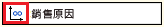
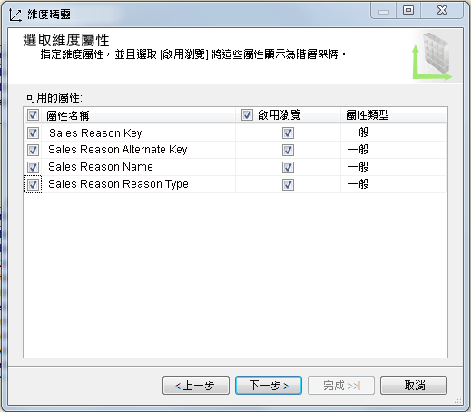
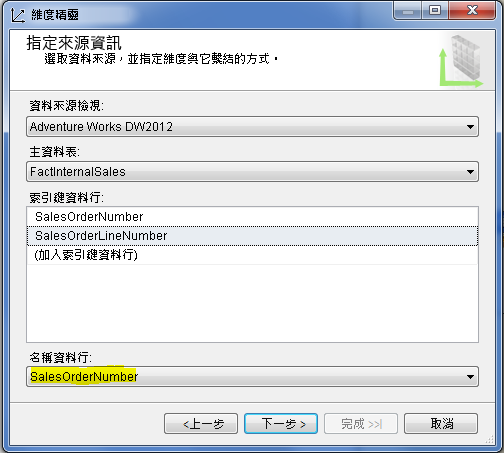
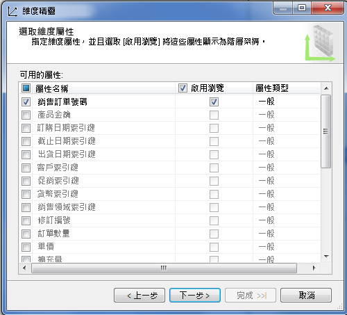
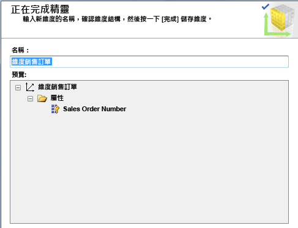
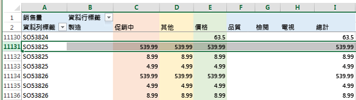
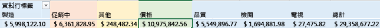

# 定義多對多關聯性及多對多關聯性屬性
[!INCLUDE[ssas-appliesto-sqlas](../../includes/ssas-appliesto-sqlas.md)]
  本主題說明 Analysis Services 中的多對多維度，包括何時使用這些維度以及如何建立這些維度。  
  
## 簡介  
 Analysis Services 支援多對多維度，其允許的分析方式比典型星形結構描述中所描述的分析方式更為複雜許多。 在典型星形結構描述中，所有維度都有包含事實資料表的一對多關聯性。 每個事實只會聯結到一個維度成員，單一維度成員會與多個事實產生關聯。  
  
 多對多關聯性會移除這個模型化限制，其方式是啟用要與相同維度之多個成員產生關聯的事實 (例如帳戶餘額，聯合帳戶的餘額可歸因於聯合帳戶的兩個或多個擁有者)。  
  
 就概念上而言，Analysis Services 中的多對多維度關聯性等於關聯式模型中的多對多關聯性，以便支援相同種類的案例。 常見的多對多範例包括：  
  
-   學生註冊許多課程，每個課程都有許多學生。  
  
-   醫生有許多病人，病人有許多醫生。  
  
-   客戶擁有許多銀行帳戶，銀行帳戶可能屬於一個以上的客戶。  
  
-   在 Adventure Works 中，許多客戶可能基於多個理由而訂購產品，而且銷售原因可以與多筆訂單產生關聯。  
  
 就分析而言，多對多關聯性所解決的問題是相對於維度關聯性的計數或總和的精確表示 (通常在執行特定維度成員的計算時會除去重複計數)。 為了釐清這個重點，我們提供了範例。 假設有一個產品或服務屬於一個以上的類別。 如果您依據類別計算服務數目，您會想要將屬於這兩個類別的服務併入每個類別中。 同時，您不會想要誇大您所提供的服務數目。 藉由指定多對多維度關聯性，當您依類別或服務查詢時，就更有可能取回正確的結果。 但是，一定要經由測試才能確定是這個狀況。  
  
 就結構而言，建立多對多維度關聯性類似於您可能在關聯式資料模型中建立多對多關聯性的方式。 而當關聯式模型使用「聯合資料表」來儲存資料列關聯時，多維度模型會使用「中繼量值群組」。 中繼量值群組這個詞彙是用來指稱會對應不同維度之成員的資料表。  
  
 就視覺上而言，Cube 圖表中不會指示多對多維度關聯性。 請改用 [維度使用方式] 索引標籤來快速識別模型中的任何多對多關聯性。 以下圖示會指示多對多關聯性。  
  
   
  
 請按一下此按鈕來開啟 [定義關聯性] 對話方塊，以確認關聯性類型為多對多並且檢視關聯性中會使用哪一個中繼量值群組。  
  
   
  
 在後續的章節中，您將會學習如何設定多對多維度及測試模型的行為。 如果您想要先檢閱其他資訊或是先嘗試教學課程，請參閱本文結尾的 **深入了解** 。  
  
## 建立多對多維度  
 簡單的多對多關聯性包含擁有多對多基數的兩個維度、用來排序成員關聯的中繼量值群組，以及包含可測量資料的事實量值群組，例如總銷售總和或是銀行帳戶的餘額。  
  
 多對多關聯性中的維度可能擁有 DSV 中的對應資料表，而模型中的每個維度都會根據資料來源中的現有資料表。 相反地，您的模型中的維度可能會衍生自 DSV 中較少或不同的實體資料表。 Adventure Works 範例 Cube 會使用「銷售原因」和「銷售訂單」當做重點案例來示範多對多關聯性，其中使用以僅限模型資料結構形式存在的維度，而在 DSV 中沒有實體對應項目。 「銷售訂單」維度是根據基礎資料來源中的事實資料表，而不是維度資料表。  
  
 下一個程序假設您已經知道哪些實體參與多對多關聯性。 如需進一步研究，請參閱 **深入了解** 。  
  
 為了說明用來建立多對多關聯性的步驟，這個程序會在 Adventure Works 範例 Cube 中重新建立其中一個多對多關聯性。 如果您已經將來源資料 (也就是 Adventure Works 範例資料倉儲) 安裝在關聯式資料庫引擎執行個體上，您可以依照以下步驟進行。  
  
#### 步驟 1:確認 DSV 關聯性  
  
1.  在 SQL Server Data Tools 的多維度專案中，建立 Adventure Works DW 2012 關聯式資料倉儲的資料來源 (裝載於 SQL Server Database Engine 執行個體上)。  
  
2.  使用以下現有的資料表建立資料來源檢視：  
  
    -   FactInternetSales  
  
    -   FactInternetSalesReason  
  
    -   DimSalesReason  
  
3.  確認您打算在多對多關聯性中使用的所有資料表都在 DSV 中透過主索引鍵關聯性產生關聯。 這是在後續步驟中建立中繼量值群組之連結的必要條件。  
  
    > [!NOTE]  
    >  如果基礎資料來源未提供主索引鍵和外部索引鍵關聯性，您可以在 DSV 中手動建立關聯性。 如需詳細資訊，請參閱[在資料來源檢視中定義邏輯關聯性 &#40;Analysis Services&#41;](../../analysis-services/multidimensional-models/define-logical-relationships-in-a-data-source-view-analysis-services.md)。  
  
     以下範例會確認這個程序中所使用的資料表會利用主索引鍵來連結。  
  
       
  
#### 步驟 2:建立維度和量值群組  
  
1.  在 SQL Server Data Tools 的多維度專案中，以滑鼠右鍵按一下 [維度]，然後選取 [新增維度]。  
  
2.  根據現有的資料表 **DimSalesReason** 建立新的維度。 在指定來源時接受所有預設值。  
  
     針對屬性選取全部的值。  
  
       
  
3.  根據現有的資料表 [事實網際網路銷售] 建立第二個維度。 雖然這是事實資料表，但是它包含了銷售訂單資訊。 我們將會使用它來建立「銷售訂單」維度。  
  
4.  在 [指定來源資訊] 中，您將會看到一則警告指出必須指定名稱資料行。 選擇 **SalesOrderNumber** 作為名稱。  
  
       
  
5.  在精靈的下一頁選擇屬性。 在此範例中，您可以只選取 **SalesOrderNumber**。  
  
       
  
6.  將維度重新命名為 **維度銷售訂單**，好讓您擁有一致的維度命名慣例。  
  
       
  
7.  以滑鼠右鍵按一下 [Cube]，並選取 [新增 Cube]。  
  
8.  在量值群組資料表中，選擇 **FactInternetSales** 和 **FactInternetSalesReason**。  
  
     您選擇 **FactInternetSales** ，因為它包含您想要在 Cube 中使用的量值。 您選擇 **FactInternetSalesReason** ，因為它是中繼量值群組，提供將銷售訂單與銷售原因產生關聯的成員關聯資料。  
  
9. 為每一個事實資料表選擇量值。  
  
     若要簡化您的模型，請清除所有量值，然後只選取清單底部的 [銷售量] 和 [事實網際網路銷售計數]。 **FactInternetSalesReason** 只有一個量值，所以系統會自動為您加以選取。  
  
10. 在維度清單中，您應該會看到 [維度銷售原因] 和 [維度銷售訂單]。  
  
     在 [選取新維度] 頁面上，精靈會提示您為 [事實網際網路銷售] 維度建立新的維度。 您不需要這個維度，所以可以從清單中將它清除。  
  
11. 為 Cube 命名，然後按一下 [完成]。  
  
#### 步驟 3：定義多對多關聯性  
  
1.  在 Cube 設計師中，按一下 [維度使用方式] 索引標籤。請注意，[維度銷售原因] 和 [事實網際網路銷售] 之間已經有多對多關聯性。 記得以下圖示表示多對多關聯性。  
  
       
  
2.  按一下 [維度銷售原因] 和 [事實網際網路銷售] 之間的交集資料格，然後按一下此按鈕來開啟 [定義關聯性] 對話方塊。  
  
     您可以看到這個對話方塊是用來指定多對多關聯性。 如果您改為新增具有一般關聯性的維度，您會使用這個對話方塊將它變更為多對多關聯性。  
  
       
  
3.  將專案部署到 Analysis Services 多維度執行個體。 在下一個步驟，您將會瀏覽 Excel 中的 Cube 來驗證其行為。  
  
## 測試多對多  
 當您在 Cube 中定義多對多關聯性時，一定要進行測試，以確保查詢會傳回預期的結果。 您應該使用將由使用者使用的用戶端應用程式工具來測試 Cube。 在下一個程序中，您將會使用 Excel 連接到 Cube 並驗證查詢結果。  
  
#### 在 Excel 中瀏覽 Cube  
  
1.  部署專案，然後瀏覽 Cube 來確認彙總有效。  
  
2.  在 Excel 中，按一下 [資料] | [從其他來源] | [從 Analysis Services]。 輸入伺服器的名稱，並選擇資料庫和 Cube。  
  
3.  建立使用以下項目的樞紐分析表：  
  
    -   **銷售量** 作為值  
  
    -   資料行上的**銷售原因名稱**  
  
    -   資料列上的 [銷售訂單號碼]  
  
4.  分析結果。 因為我們使用範例資料，所以最初的印象就是所有銷售訂單都有相同的值。 但是，如果您向下捲動，您會開始看到資料的變化。  
  
     在往下捲動的過程中，您可以發現訂單號碼 **SO5382**的銷售量和銷售原因。 這個特別訂單的總計為 **539.99**，而歸因於此訂單的購買原因包括促銷、其他和價格。  
  
       
  
     請注意，已經為訂單正確算出銷售量，整筆訂單為 **539.99** 。 雖然每個原因都指出 **539.99** ，但是該值並不是所有三個原因的總和，因而錯誤地誇大了總計。  
  
     為什麼一開始要將銷售量放在每個銷售原因之下？ 答案是因為它可讓我們識別可以歸因於每個原因的銷售量。  
  
5.  捲動到工作表的底部。 現在很容易看到，相對於其他原因及總計，價格對於客戶購買而言是最重要的原因。  
  
       
  
#### 處理非預期查詢結果的秘訣  
  
1.  隱藏中繼量值群組中不會在查詢內傳回有意義之結果的量值，例如計數。 這樣可避免人們嘗試使用彙總來產生無意義的資料。 若要隱藏量值，請在維度設計師的屬性中將 [可見性] 設定為 **False**。  
  
2.  建立檢視方塊來使用量值和維度的子集，以便支援您想要提供的分析體驗。 包含許多量值群組和維度的 Cube 有可能無法在所有案例中一起順利運作。 藉由隔離您打算一起使用的維度和量值群組，您可以確保預測度更高的結果。  
  
3.  請務必記得，變更模型之後一定要部署及重新連接。 在 Excel 中，請使用樞紐分析表 [分析] 功能區上的 [重新整理] 按鈕。  
  
4.  請避免在多個多對多關聯性中使用連結量值群組，特別是當這些關聯性位於不同 Cube 時。 這樣做可能會導致模糊不清的彙總。 如需詳細資訊，請參閱 [Incorrect Amounts for Linked Measures in Cubes containing Many-to-Many Relationships (SSAS Troubleshooting)](http://social.technet.microsoft.com/wiki/contents/articles/22911.incorrect-amounts-for-linked-measures-in-cubes-containing-many-to-many-relationships-ssas-troubleshooting.aspx)(包含多對多關聯性之 Cube 中連結量值的數量不正確 (SSAS 疑難排解))。  
  
##   Learn more  
 使用以下連結來取得可幫助您掌握各個概念的其他資訊。  
  
 [多對多革命 2.0](http://go.microsoft.com/fwlink/?LinkId=324760)  
  
 [教學課程：SQL Server Analysis services 多對多維度範例](http://go.microsoft.com/fwlink/?LinkId=324761)  
  
## 另請參閱  
 [維度關聯性](../../analysis-services/multidimensional-models-olap-logical-cube-objects/dimension-relationships.md)   

 [部署 Analysis Services 專案 &#40;SSDT&#41;](../../analysis-services/multidimensional-models/deploy-analysis-services-projects-ssdt.md)   
 [多維度模型中的檢視方塊](../../analysis-services/multidimensional-models/perspectives-in-multidimensional-models.md)  
  
  
