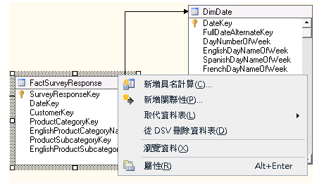

# <a name="define-named-calculations-in-a-data-source-view-analysis-services"></a>在資料來源檢視中定義具名計算 (Analysis Services)
[!INCLUDE[ssas-appliesto-sqlas](../../includes/ssas-appliesto-sqlas.md)]
  具名計算是以導出資料行表示的 SQL 運算式。 此運算式的顯示和行為如同資料表中的資料行一樣。 具名計算可讓您在資料來源檢視中擴充現有資料表或檢視表的關聯式結構描述，而不必修改基礎資料來源中的資料表或檢視表。 請考量下列範例：  
  
-   建立衍生自事實資料表之多個資料行的單一具名計算 (例如透過將稅率乘以銷售價格來建立「稅額」)。  
  
-   為維度成員建構使用者易記名稱。  
  
-   在 DSV 中建立具名計算，而不是在 Cube 中建立導出成員，以提升查詢效能。 具名計算是在處理期間所計算，而導出成員則是在查詢時所計算。  
  
## <a name="creating-named-calculations"></a>建立具名計算  
  
> [!NOTE]  
>  您無法將具名計算加入具名查詢中，也不可以用包含具名計算的資料表做為具名查詢的基礎。  
  
 當您建立具名計算時，要指定名稱、SQL 運算式和計算的描述 (選擇性)。 SQL 運算式可以參考資料來源檢視中的其他資料表。 在定義具名計算之後，具名計算中的運算式會傳送給資料來源的提供者，並驗證為下列 SQL 陳述式，其中 `<Expression>` 包含定義具名計算的運算式。  
  
```  
SELECT   
   <Table Name in Data Source>.*,   
   <Expression> AS <Column Name>   
FROM   
   <Table Name in Data Source> AS <Table Name in Data Source View>  
```  
  
 資料行的資料類型是由運算式所傳回之純量值的資料類型來決定。 如果提供者在運算式中找不到任何錯誤，則資料行會加入資料表中。  
  
 在運算式中所參考的資料行不應該限定，或只能由資料表名稱加以限定。 例如，若要參考資料表中的 SaleAmount 資料行， `SaleAmount` 或 `Sales.SaleAmount` 為有效，但 `dbo.Sales.SaleAmount` 會產生錯誤。  
  
 運算式不會自動用括號括住。 因此，如果運算式 (例如 SELECT 陳述式) 需要括號，您必須在 [運算式] 方塊中輸入括號。 例如，唯有輸入括號，下列運算式才有效。  
  
```  
(SELECT Description FROM Categories WHERE Categories.CategoryID = CategoryID)  
```  
  
## <a name="add-or-edit-a-named-calculation"></a>加入或編輯具名計算  
  
1.  在 [!INCLUDE[ssBIDevStudioFull](../../includes/ssbidevstudiofull-md.md)] 中，開啟含有您想在其中定義具名計算之資料來源檢視的專案，或連接到包含此資料來源檢視的資料庫。  
  
2.  在方案總管中，展開 [資料來源檢視] 資料夾，然後按兩下資料來源檢視。  
  
3.  在 [資料表] 或 [圖表] 窗格中，以滑鼠右鍵按一下您想要在其中定義具名計算的資料表，然後按一下 [新增具名計算]。 請務必在資料表名稱上按一下滑鼠右鍵，而不是在屬性上。 功能表應該如下所示：  
  
       
  
    > [!NOTE]  
    >  若要尋找資料表或檢視表，您可以按一下 [資料來源檢視] 功能表，或是以滑鼠右鍵按一下 [資料表] 或 [圖表] 窗格的開放區域，即可使用 [尋找資料表] 選項。  
  
4.  在 [建立具名計算] 對話方塊中，執行下列步驟：  
  
    -   在 [資料行名稱] 文字方塊中，輸入新資料行的名稱。  
  
    -   在 [描述] 文字方塊中，輸入新資料行的描述。  
  
    -   在 [運算式] 文字方塊中，輸入會使用適合資料提供者的 SQL 用語來產生新資料行內容的運算式。  
  
5.  按一下 **[確定]**。  
  
     具名計算資料行會顯示為資料來源檢視資料表中的最後一個資料行。 計算機符號表示資料行包含具名計算。  
  
## <a name="delete-a-named-calculation"></a>刪除具名計算  
 當您嘗試刪除具名計算時，會出現一個提示，此提示會列出將會因為此刪除動作而變成無效之專案或資料庫中定義的物件清單。 仔細檢閱清單，再刪除計算。  
  
## <a name="see-also"></a>另請參閱  
 [在資料來源檢視 & #40; 中定義具名的查詢Analysis Services & #41;](../../analysis-services/multidimensional-models/define-named-queries-in-a-data-source-view-analysis-services.md)  
  
  
