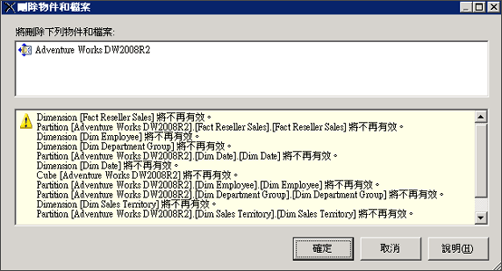

# 刪除資料來源檢視 (Analysis Services)
[!INCLUDE[ssas-appliesto-sqlas](../../includes/ssas-appliesto-sqlas.md)]
  如果您不再需要使用 OLAP 專案中的某個資料來源檢視 (DSV)，您可以使用 [!INCLUDE[ssBIDevStudioFull](../../includes/ssbidevstudiofull-md.md)] 從專案中刪除檢視。  
  
 刪除 DSV 是一個永久動作。 您無法將已刪除的 DSV 還原到 [!INCLUDE[ssASnoversion](../../includes/ssasnoversion-md.md)] 專案或資料庫。  
  
 您無法從 [!INCLUDE[ssASnoversion](../../includes/ssasnoversion-md.md)] 以線上模式開啟的 [!INCLUDE[ssBIDevStudioFull](../../includes/ssbidevstudiofull-md.md)] 資料庫中，刪除其他物件所相依的 DSV。 若要從連接到伺服器上執行之資料庫的專案中刪除 DSV，您必須先從 [!INCLUDE[ssASnoversion](../../includes/ssasnoversion-md.md)] 資料庫中刪除相依於該 DSV 的所有物件，再刪除 DSV 本身。  
  
 刪除 DSV 會使其他相依的 [!INCLUDE[ssASnoversion](../../includes/ssasnoversion-md.md)] 物件無效，因此在您刪除 DSV 之前，請查看移除 DSV 後會變成無效的物件清單。 請仔細檢閱此清單，以確保清單中未包含您仍要使用的物件。  
  
   
  
## 另請參閱  
 [多維度模型中的資料來源檢視](../../analysis-services/multidimensional-models/data-source-views-in-multidimensional-models.md)   
 [在資料來源檢視 & #40; 變更內容Analysis Services & #41;](../../analysis-services/multidimensional-models/change-properties-in-a-data-source-view-analysis-services.md)  
  
  
