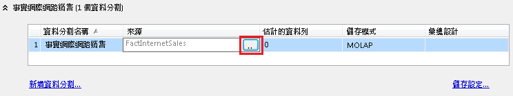

# 編輯或刪除分割區 (Analysis Services - 多維度)
  若要修改 Cube 資料分割，可以在 [!INCLUDE[ssBIDevStudio](../../includes/ssbidevstudio-md.md)] 中使用 Cube 設計師的 [資料分割] 索引標籤。 [資料分割] 索引標籤會列出 Cube 中所有量值群組的資料分割。 它也會列出已啟用回寫功能的回寫分割區。  
  
 若要編輯任何量值群組的資料分割，請在 [資料分割] 索引標籤上展開量值群組。下表會以資料表格式依序號列出量值群組的分割區和資料行。  
  
 連結量值群組的設定必須在來源 Cube 中編輯。  
  
 當您將來源分割區合併至目的地分割區中時，會自動刪除分割區。 完成合併之後，就會刪除指定做為來源的分割區。 您也可以在 [!INCLUDE[ssManStudioFull](../../includes/ssmanstudiofull-md.md)] 中或是 [!INCLUDE[ssBIDevStudio](../../includes/ssbidevstudio-md.md)] 的 [分割區] 索引標籤中，手動刪除分割區。 按一下滑鼠右鍵，再選擇 [刪除]。 請記住，刪除分割區也會刪除資料和彙總。 為安全起見，請確定您有資料庫的最新備份，以防您之後需要回復此步驟。  
  
> [!NOTE]  
>  或者，您可以使用 XMLA 指令碼，將建立、合併和刪除分割區的工作自動化。 您可以在 [!INCLUDE[ssManStudioFull](../../includes/ssmanstudiofull-md.md)]，或是在以排程工作執行的自訂 SSIS 封裝中，建立和執行 XMLA 指令碼。 如需詳細資訊，請參閱 [使用 SSIS 自動化 Analysis Services 管理工作](../../analysis-services/instances/automate-analysis-services-administrative-tasks-with-ssis.md)。  
  
## 分割區來源  
 指定分割區的來源資料表或具名查詢。 若要變更來源資料表，請按一下資料格，然後按一下瀏覽 (**...**) 按鈕。  
  
   
  
 如果分割區是以查詢為基礎，請按一下 [瀏覽]\(**...**) 按鈕以編輯查詢。 這樣可以編輯分割區的 **Source** 屬性。 如需詳細資訊，請參閱 [變更資料分割來源以使用不同的事實資料表](../../analysis-services/multidimensional-models/change-a-partition-source-to-use-a-different-fact-table.md)。  
  
 您可以在具有與原始來源資料表 (在從其擷取資料的外部資料來源中) 相同結構的資料來源檢視中，指定資料表。 來源可以在 Cube 資料庫的任何資料來源或資料來源檢視中。  
  
## 儲存設定  
 您可以在 Cube 設計師的 [資料分割] 索引標籤上，按一下 [儲存設定]，針對 MOLAP、ROLAP 或 HOLAP 儲存挑選其中一個標準設定，或針對儲存模式和主動式快取設定自訂設定。 預設值為 MOLAP，因為它提供最快速的查詢效能。 如需每個設定的詳細資訊，請參閱[設定磁碟分割儲存體 &#40;Analysis Services - 多維度資料&#41;](../../analysis-services/multidimensional-models/set-partition-storage-analysis-services-multidimensional.md)。  
  
 可以針對 Cube 中之每一個量值群組的每一個分割區進行個別設定儲存。 您也可以針對 Cube 或量值群組進行預設儲存設定。 儲存是在 Cube 精靈的 [資料分割] 索引標籤上設定。  
  
## 另請參閱  
 [建立及管理本機資料分割 &#40;Analysis Services&#41;](../../analysis-services/multidimensional-models/create-and-manage-a-local-partition-analysis-services.md)   
 [設計彙總 &#40;Analysis Services-多維度 &#41;](../../analysis-services/multidimensional-models/designing-aggregations-analysis-services-multidimensional.md)   
 [在 Analysis Services 中合併分割區 &#40;SSAS - 多維度&#41;](../../analysis-services/multidimensional-models/merge-partitions-in-analysis-services-ssas-multidimensional.md)  
  
  

