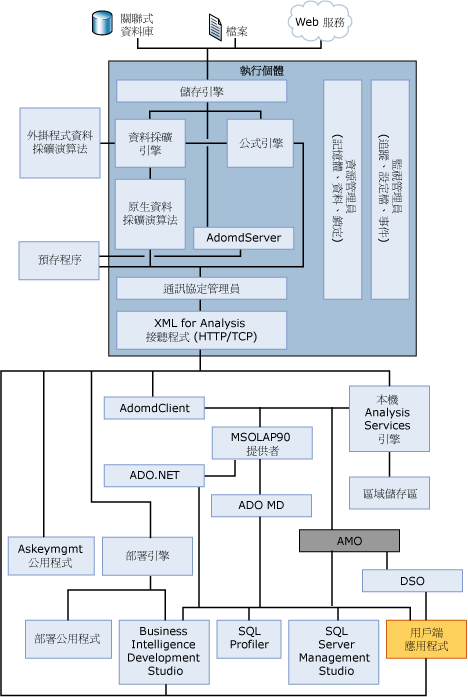

# OLAP 引擎伺服器元件
[!INCLUDE[ssas-appliesto-sqlas](../../../includes/ssas-appliesto-sqlas.md)]
  伺服器元件[!INCLUDE[msCoName](../../../includes/msconame-md.md)] [!INCLUDE[ssNoVersion](../../../includes/ssnoversion-md.md)] [!INCLUDE[ssASnoversion](../../../includes/ssasnoversion-md.md)]是**msmdsrv.exe**應用程式，以 Windows 服務執行。 這個應用程式是由安全性元件、XML for Analysis (XMLA) 接聽程式元件、查詢處理器元件及執行下列功能的許多其他內部元件所組成：  
  
-   剖析從用戶端收到的陳述式  
  
-   管理中繼資料  
  
-   處理交易  
  
-   處理計算  
  
-   儲存維度和資料格資料  
  
-   建立彙總  
  
-   排程查詢  
  
-   快取物件  
  
-   管理伺服器資源  
  
## 架構圖表  
 [!INCLUDE[ssASnoversion](../../../includes/ssasnoversion-md.md)] 執行個體會當做獨立服務來執行，並與透過 XML for Analysis (XMLA) 所進行的服務通訊 (使用 HTTP 或 TCP)。 AMO 是使用者應用程式與 [!INCLUDE[ssASnoversion](../../../includes/ssasnoversion-md.md)] 執行個體之間的一層。 這一層提供了對 [!INCLUDE[ssASnoversion](../../../includes/ssasnoversion-md.md)] 管理物件的存取。 AMO 是一個類別庫，它會接收來自用戶端應用程式的命令，並將這些命令轉換成 [!INCLUDE[ssASnoversion](../../../includes/ssasnoversion-md.md)] 執行個體的 XMLA 訊息。 AMO 會使用執行命令的方法成員以及為 [!INCLUDE[ssASnoversion](../../../includes/ssasnoversion-md.md)] 物件保存資料的屬性成員，將 [!INCLUDE[ssASnoversion](../../../includes/ssasnoversion-md.md)] 執行個體物件當做類別呈現給使用者應用程式。  
  
 下圖顯示 [!INCLUDE[ssASnoversion](../../../includes/ssasnoversion-md.md)] 元件架構，其中包括在 [!INCLUDE[ssASnoversion](../../../includes/ssasnoversion-md.md)] 執行個體內執行的所有主要元素以及與此執行個體互動的所有使用者元件。 下圖也會顯示存取此執行個體的唯一方法，就是使用 XML for Analysis (XMLA) 接聽程式 (利用 HTTP 或 TCP)。  
  
   
  
## XMLA 接聽程式  
 XMLA 接聽程式元件會處理 [!INCLUDE[ssASnoversion](../../../includes/ssasnoversion-md.md)] 及其用戶端之間的所有 XMLA 通訊。 msmdsrv.ini 檔中的 [!INCLUDE[ssASnoversion](../../../includes/ssasnoversion-md.md)] [通訊埠] 組態設定可用來指定 [!INCLUDE[ssASnoversion](../../../includes/ssasnoversion-md.md)] 執行個體所接聽的通訊埠。 這個檔案中 0 的值表示 [!INCLUDE[ssASnoversion](../../../includes/ssasnoversion-md.md)] 會接聽預設通訊埠。 除非另有指定，否則 [!INCLUDE[ssASnoversion](../../../includes/ssasnoversion-md.md)] 會使用下列預設 TCP 通訊埠：  
  
|通訊埠|Description|  
|----------|-----------------|  
|2383|預設的 [!INCLUDE[ssNoVersion](../../../includes/ssnoversion-md.md)] [!INCLUDE[ssASnoversion](../../../includes/ssasnoversion-md.md)]執行個體。|  
|2382|其他 [!INCLUDE[ssNoVersion](../../../includes/ssnoversion-md.md)] [!INCLUDE[ssASnoversion](../../../includes/ssasnoversion-md.md)]執行個體的重新導向程式。|  
|在伺服器啟動時動態指派|具名的 [!INCLUDE[ssNoVersion](../../../includes/ssnoversion-md.md)] [!INCLUDE[ssASnoversion](../../../includes/ssasnoversion-md.md)]執行個體。|  
  
 請參閱[設定 Windows 防火牆以允許 Analysis Services 存取](../../../analysis-services/instances/configure-the-windows-firewall-to-allow-analysis-services-access.md)如需詳細資訊。  
  
## 另請參閱  
 [物件命名規則&#40;Analysis Services&#41;](../../../analysis-services/multidimensional-models/olap-physical/object-naming-rules-analysis-services.md)   
 [實體架構&#40;Analysis Services-多維度資料&#41;](../../../analysis-services/multidimensional-models/olap-physical/understanding-microsoft-olap-physical-architecture.md)   
 [邏輯架構&#40;Analysis Services-多維度資料&#41;](../../../analysis-services/multidimensional-models/olap-logical/understanding-microsoft-olap-logical-architecture.md)  
  
  
