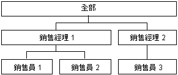

# 父子式維度屬性
[!INCLUDE[ssas-appliesto-sqlas](../../includes/ssas-appliesto-sqlas.md)]
  在 [!INCLUDE[msCoName](../../includes/msconame-md.md)] [!INCLUDE[ssNoVersion](../../includes/ssnoversion-md.md)] [!INCLUDE[ssASnoversion](../../includes/ssasnoversion-md.md)]中，通常會針對維度成員的內容進行一般假設。 分葉成員包含直接衍生自基礎資料來源的資料；非分葉成員包含衍生自對子成員執行的彙總。  
  
 不過，在父子式階層中，除了從子成員彙總的資料之外，有些非分葉成員也含有衍生自基礎資料來源的資料。 對於在父子式階層中的這些非分葉成員，會建立特殊系統產生的子成員，它們包含基礎事實資料表資料。 它們稱為 *資料成員*，它們包含與非分葉成員直接關聯的值，此值與從非分葉成員之下階計算而來的摘要值無關。  
  
 資料成員只可供含有父子式階層的維度使用，而且唯有父屬性允許時才會顯示出來。 您可以使用維度設計師來控制資料成員的可見性。 若要公開資料成員，請將父屬性的 **MembersWithData** 屬性設為 **NonLeafDataVisible.** 若要隱藏父屬性內含的資料成員，請將父屬性上的 **MembersWithData** 屬性設為 **NonLeafDataHidden**。  
  
 這項設定不會覆寫非分葉成員的正常彙總行為；基於彙總用途，一律會將資料成員併入為子成員。 然而，可使用自訂積存公式來覆寫正常彙總行為。 多維度運算式 (MDX) [DataMember](../../mdx/datamember-mdx.md) 函數讓您能夠存取相關聯資料成員的值，這與 **MembersWithData** 屬性的值無關。  
  
 父屬性的 **MembersWithDataCaption** 屬性提供具名範本給 [!INCLUDE[ssASnoversion](../../includes/ssasnoversion-md.md)] ，用以產生資料成員的成員名稱。  
  
## 使用資料成員  
 彙總量值與具有父子式階層的組織維度時，資料成員非常有用。 例如，下圖顯示具有三個層級的維度，而這個維度代表產品的銷售毛額。 第一層顯示所有業務員的銷售毛額。 第二層包含依銷售經理分組之所有銷售成員的銷售毛額，而第三層包含依銷售員分組之所有銷售成員的銷售毛額。  
  
   
  
 Sales Manager 1 成員的值通常是彙總 Salesperson 1 和 Salesperson 2 成員的值而衍生。 然而，因為 Sales Manager 1 也可以銷售產品，因此事實資料表中可能會有與 Sales Manager 1 相關的銷售毛額，所以該成員也包含衍生自事實資料表的資料。  
  
 甚至，每位銷售成員的個別佣金也會不同。 在此情況下，銷售經理的佣金計算方式會採用個別銷售毛額佔其銷售員產生之總銷售毛額的兩個不同比率來計算。 因此，非分葉成員可存取基礎事實資料表資料就變得非常重要。 在提供與成員相關之銷售員的銷售毛額的前提下，MDX **DataMember** 函數可用來擷取 Sales Manager 1 成員的個人銷售毛額，而自訂積存運算式則可用來從 Sales Manager 1 成員的彙總值中排除該資料成員。  
  
## 另請參閱  
 [維度屬性 （Property） 參考](../../analysis-services/multidimensional-models/dimension-attribute-properties-reference.md)   
 [父子式維度](../../analysis-services/multidimensional-models/parent-child-dimension.md)  
  
  
