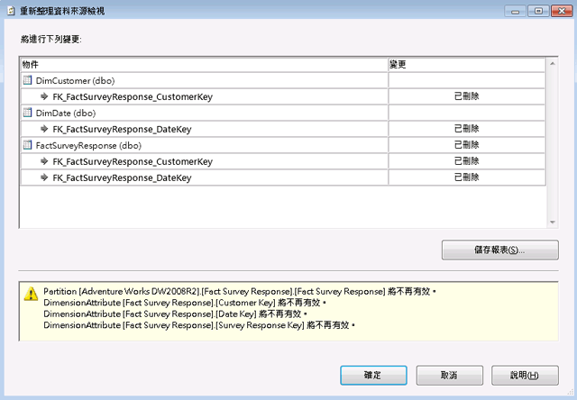

# 在資料來源檢視中重新整理結構描述 (Analysis Services)
[!INCLUDE[ssas-appliesto-sqlas](../../includes/ssas-appliesto-sqlas.md)]
  當您在 [!INCLUDE[ssASnoversion](../../includes/ssasnoversion-md.md)] 專案或資料庫中定義資料來源檢視 (DSV) 之後，基礎資料來源中的結構描述可能會變更。 但在開發專案中不會自動偵測或更新這些變更。 此外，如果您將專案部署至伺服器，當 Analysis Services 無法再連接至外部資料來源時，您現在會發生處理錯誤。  
  
 若要更新 DSV 以符合外部資料來源，您可以在 Business Intelligence Development Studio (BIDS) 中重新整理 DSV。 重新整理 DSV 會偵測做為 DSV 基礎之外部資料來源的變更，並建立變更清單，以列舉外部資料來源中的加入或刪除。 然後，您可以將一組變更套用至 DSV，以將 DSV 重新調整為符合基礎資料來源。 請注意，您通常需要額外的工作，以進一步更新專案中使用 DSV 的 Cube 和維度。  
  
 本主題包含下列各節：  
  
 [重新整理所支援的變更](#bkmk_changlist)  
  
 [在 SQL Server Data Tools 中重新整理 DSV](#bkmk_DSVrefresh)  
  
##   重新整理所支援的變更  
 DSV 重新整理可以包含下列任何一項動作：  
  
-   刪除資料表、資料行及關聯性  
  
-   加入資料行和關聯性，並套用至已經包含在 DSV 中的資料表。  
  
-   加入新的唯一條件約束。 如果 DSV 中有資料表的邏輯主索引鍵存在，而且資料來源中的資料表已加入實體索引鍵，則會移除此邏輯索引鍵，並由此實體索引鍵來加以取代。  
  
 重新整理永遠不會將新資料表加入至 DSV。 如果您想加入新資料表，則必須手動加入。 如需詳細資訊，請參閱 [在資料來源檢視中加入或移除資料表或檢視 &#40;Analysis Services&#41;](../../analysis-services/multidimensional-models/adding-or-removing-tables-or-views-in-a-data-source-view-analysis-services.md)的 [方案總管] 中執行 [資料來源檢視精靈]。  
  
##   在 SQL Server Data Tools 中重新整理 DSV  
 若要重新整理 DSV，請按兩下 [從方案總管] 中的 DSV [!INCLUDE[ssBIDevStudioFull](../../includes/ssbidevstudiofull-md.md)]。  這會啟動在 DSV 設計工具。  然後按一下 [設計工具中的 [重新整理資料來源檢視] 按鈕，或選擇**重新整理**從資料來源檢視] 功能表。  
  
 在重新整理期間， [!INCLUDE[ssASnoversion](../../includes/ssasnoversion-md.md)] 會查詢所有基礎關聯式資料來源，以判斷 DSV 中所包含的資料表/檢視表是否已有變更。 如果可以對所有基礎資料來源建立連接，而且已經有變更，您將會在 [重新整理資料來源檢視] 對話方塊中看到這些變更。  
  
   
  
 此對話方塊列出要在 DSV 中刪除或加入的資料表、資料行、條件約束和關聯性。 此報表亦列出無法順利準備的具名查詢或計算。 受影響的物件會列在樹狀檢視中，其中資料行和關聯性是以巢狀方式建立在資料表之下，並指出每一個物件的變更類型 (刪除或加入)。 標準資料來源檢視物件圖示會指出受影響的物件類型。  
  
 重新整理完全以基礎物件的名稱為基礎。 因此，如果基礎物件重新命名資料來源中，資料來源檢視設計師會將重新命名的物件視為兩個不同作業的刪除和加入。 在此案例中，您必須手動加入已重新命名的物件，讓它回到資料來源檢視中。 您也必須重新建立關聯性或邏輯主索引鍵。  
  
> [!IMPORTANT]  
>  如果您知道資料表在資料來源中已重新命名，則在您重新整理資料來源檢視之前，您可以使用 [取代資料表] 命令，以重新命名的資料表來取代該資料表。 如需詳細資訊，請參閱[取代資料來源檢視中的資料表或具名查詢 &#40;Analysis Services&#41;](../../analysis-services/multidimensional-models/replace-a-table-or-a-named-query-in-a-data-source-view-analysis-services.md)。  
  
 當您檢查報表之後，可以接受變更，或是取消更新來拒絕任何變更。 您必須一起接受或拒絕所有變更。 您無法選擇清單中的個別項目。 您也可以儲存一份含有變更的報表。  
  
## 另請參閱  
 [多維度模型中的資料來源檢視](../../analysis-services/multidimensional-models/data-source-views-in-multidimensional-models.md)  
  
  
