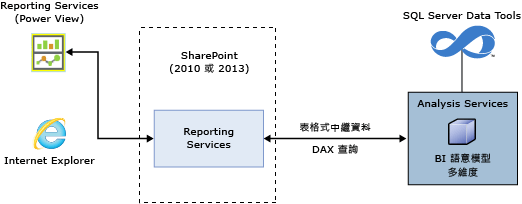
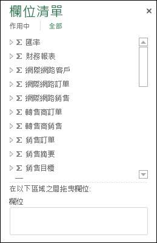
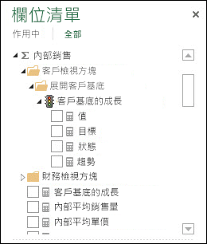
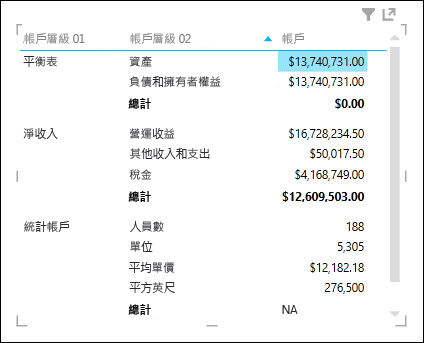
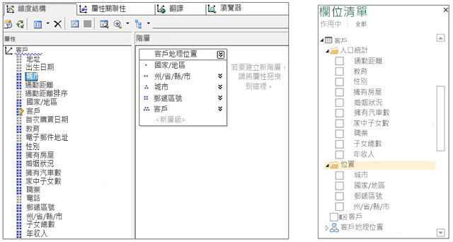
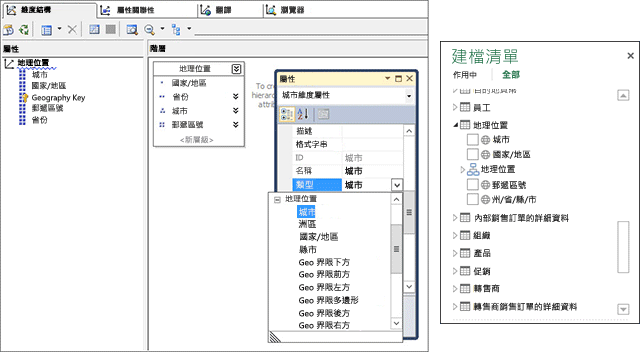
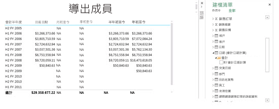
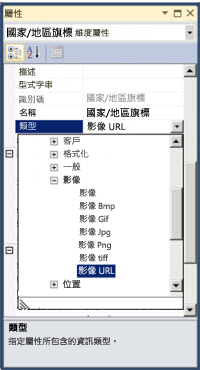
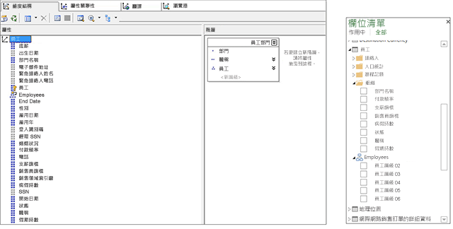
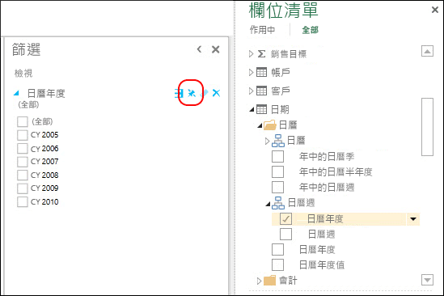

# 了解適用於多維度模型的 Power View
  本文描述 SQL Server 中的 [多維度模型的 Power View] 功能，並為想要在組織中實作 Power View 的 BI 專業人員和系統管理員提供重要資訊。  
  
 多維度模型提供領先業界的 OLAP 資料模型化、儲存體和分析解決方案。 SQL Server 中的多維度模型透過 Microsoft Power View 支援特定資料分析、探索和視覺效果。  
  
 Power View 是一種精簡型 Web 用戶端，會在瀏覽器中從 SharePoint 文件庫的共用報表資料來源 (.rsds) 檔案啟動。 報表資料來源會做為用戶端與後端資料來源之間的橋樑。 後端資料來源可以是 SharePoint 中的 [!INCLUDE[ssGemini](../../includes/ssgemini-md.md)] 活頁簿、以表格式模式執行之 Analysis Services 伺服器上的表格式模型，或是以多維度模式執行之 Analysis Services 伺服器上的多維度模型。 Power View 報表然後可以儲存至 SharePoint 文件庫或組件庫，與組織中的其他成員共用。  
  
 **多維度模型架構的 Power View**  
  
   
  
## 必要條件  
 **伺服器需求**  
  
-   以多維度模式執行的 Microsoft SQL Server 2016 Analysis Services。  
  
-   適用於 Microsoft SharePoint Server 2010 或更新 Enterprise Edition 的 Microsoft SQL Server 2016 Reporting Services 增益集。  
  
 **用戶端需求**  
  
-   Power View 用戶端功能需要 Microsoft Silverlight 5。 如需詳細資訊，請參閱 [Reporting Services 和 Power View 的瀏覽器支援](../../reporting-services/browser-support-for-reporting-services-and-power-view.md)。  
  
## 功能  
 **Power View 的原生支援**  
  
 在此版本中，多維度模型透過 SharePoint 模式的 Power View，支援分析和視覺效果。 您的多維度模型不需要特殊組態。 不過，相較於其他用戶端工具，例如 Microsoft Excel 和 Microsoft Performance Point，Power View 顯示多維度模型物件的方式有些不同。 此版本不支援在 Excel 中使用 Power View，進行多維度模型的分析和視覺效果。  
  
 **DAX 查詢的原生支援**  
  
 在此版本中，除了比較傳統的 MDX 查詢之外，多維度模型還支援 DAX 查詢和函數。 有些 DAX 函數 (例如 PATH) 不適用於多維度模型。 若要進一步了解 DAX 及與 MDX 的比較，請參閱 [Data Analysis Expressions 和 MDX](http://msdn.microsoft.com/library/ff487170\(SQL.105\).aspx)。  
  
## 多維度與表格式物件的對應  
 Analysis Services 提供多維度模型的表格式模型中繼資料表示。 多維度模型的物件在 Power View 中以及在 CSDL 輸出 BI 註解中表示為表格式物件。  
  
 **物件對應摘要**  
  
|多維度物件|表格式物件|  
|-----------------------------|--------------------|  
|Cube|模型|  
|Cube 維度|Table|  
|維度屬性(索引鍵、名稱)|資料行|  
|量值群組|資料表|  
|量值|[量值]|  
|不含量值群組的量值|在名為量值的資料表中|  
|量值群組 Cube 維度關聯性|關聯性|  
|檢視方塊|遠近景深|  
|KPI|KPI|  
|使用者/父子式階層|階層|  
|顯示資料夾|顯示資料夾|  
  
## 量值、量值群組和 KPI  
  
> [!NOTE]  
>  本文中某些影像和文字參照 SQL Server 2012 範例資料庫 Adventure Works 多維度模型。  
  
 多維度 Cube 中的量值群組，在 Power View 欄位清單中顯示為含 Sigma (∑) 符號的資料表。  
  
 **Power View 欄位清單中的量值群組**  
  
   
  
 量值群組內的量值顯示為量值。 如果有未與任何量值群組相關聯的導出量值，它們會分組在稱為「量值」的特殊資料表中。  
  
 為簡化複雜的多維度模型，模型作者可以在 Cube 中定義一組量值或 KPI，以便在顯示資料夾中找到。 Power View 可以顯示顯示資料夾和其中的量值和 KPI。  
  
 **量值群組中的量值和 KPI**  
  
   
  
### 量值做為變化  
 多維度模型中的量值是變化。 這表示，量值不是強型別，可以有不同的資料類型。 例如，在下圖中，Financial Reporting 資料表中的 Amount 量值預設為 Currency 資料類型，但是 String 資料類型的 “Statistical Accounts” 的小計也有字串值 “NA”。 Power View 會將特定量值辨識為變化，並以不同的視覺效果顯示正確值和格式。  
  
 **量值做為變化**  
  
   
  
### 隱含量值  
 表格式模型讓使用者能夠建立「隱含」量值，例如欄位的計數、加總或平均。 對於多維度模型，因為維度屬性資料的儲存方式不同，查詢隱含量值可能很耗時。 因此，Power View 中無法使用隱含量值。  
  
## 維度、屬性和階層  
 Cube 維度在表格式中繼資料中公開為資料表。 在 Power View 欄位清單中，維度屬性會顯示為顯示資料夾中的資料行。  AttributeHierarchyEnabled 屬性設為 false 的維度屬性，例如 Customer 維度中的 Birth Date 屬性，或是 AttributeHierarchyVisible 屬性設為 false 的維度屬性都不會出現在 Power View 欄位清單中。 多層級階層或使用者階層，例如 Customer 維度中的 Customer Geography，在 Power View 欄位清單中公開為階層。 維度屬性的隱藏 UnknownMembers 會在 DAX 查詢和 Power View 中公開。  
  
 **SQL Server Data Tools (SSDT) 和 Power View 欄位清單中的維度、屬性和階層**  
  
   
  
### 維度屬性類型  
 多維度模型支援維度屬性與特定維度屬性類型產生關聯。 下圖顯示 Geography 維度中的 City、State-Province、Country 和 Postal Code 維度屬性與地理類型相關聯。 這些是在表格式中繼資料中公開。 Power View 會辨識中繼資料，讓使用者可以建立地圖視覺效果。 這是由 Power View 欄位清單中 Geography 資料表的 City、Country、Postal Code 和 State-Province 資料行旁邊的地圖圖示所表示。  
  
 **SSDT 和 Power View 欄位清單中的維度屬性地理類型**  
  
   
  
### 維度導出成員  
 多維度模型支援含單一真實成員的 All 之子系導出成員。 公開這類型的導出成員時，其他條件約束為：  
  
-   當維度有一個以上的屬性時，必須是單一真實成員。  
  
-   包含導出成員的屬性不可以是維度的索引鍵屬性，除非它是唯一的屬性。  
  
-   包含導出成員的屬性不可以是父子式屬性。  
  
 使用者階層的導出成員不會在 Power View 中公開，不過使用者仍然可以連接到包含使用者階層導出成員的 Cube。  
  
 下圖顯示 Cube 的 Power View 報表，其中包含 Date 維度中維度屬性 “Fiscal Date Calculations” 的時間智慧導出成員。  
  
 **含導出成員的 Power View 報表**  
  
   
  
### 預設成員  
 多維度模型支援維度屬性的預設成員。 Analysis Services 彙總查詢資料時會使用預設成員。 維度屬性的預設成員在表格式中繼資料中公開為對應資料行的預設值或篩選。  
  
 套用屬性時，Power View 的行為模式與 Excel 樞紐分析表幾乎相同。 當使用者將包含預設值的資料行加入至 Power View 視覺效果 (資料表、矩陣或圖表) 時，並不會套用預設值，而是會顯示所有可用值。 如果使用者將該資料行加入至 [篩選]，則會套用預設值。  
  
### 維度安全性  
 多維度模型透過角色支援維度和資料格層級安全性。 透過使用 Power View 連接到 Cube 的使用者，會經過驗證並評估是否具備適當權限。 套用維度安全性時，使用者不會看到 Power View 中的個別維度成員，不過如果使用者的資料格層級安全性已定義為限制某些資料格，該使用者就無法透過 Power View 連接到 Cube。 在某些情況下，當該資料的部分是從安全資料計算出來時，使用者可以看到彙總資料。  
  
### 非彙總屬性/階層  
 在多維度模型中，維度屬性 (Attribute) 的 IsAggregatable 屬性 (Property) 可設定為 false。 這表示，模型作者已經指定用戶端應用程式在查詢資料時不應該跨階層 (屬性或多層級) 彙總資料。 在 Power View 中，此維度屬性是公開為沒有小計的資料行。 在下圖，您可以看到非彙總階層範例：Accounts。 Accounts 父子式階層的最頂層為非彙總，其他層級為可彙總的。 在 Accounts 階層的矩陣視覺效果 (前兩個層級) 中，您可以看到 Account Level 02 的小計，但是最頂層 Account Level 01 則沒有小計。  
  
 **Power View 中的非彙總階層**  
  
   
  
## 影像  
 Power View 提供呈現影像的能力。 在多維度模型中，提供影像給 Power View 的方法之一是公開包含影像 URL (統一資源定位器) 的資料行。 在此版本中，Analysis Services 支援維度屬性切換為 ImageURL 類型。 然後在表格式中繼資料中，提供此資料類型給 Power View。 Power View 然後會下載 URL 中指定的影像，並在視覺效果中顯示影像。  
  
 **SSDT 中的 ImageURL 維度屬性類型**  
  
   
  
## 父子式階層  
 多維度模型支援父子式階層，父子式階層在表格式中繼資料中公開為階層。 父子式階層的每個層級會公開為隱藏的資料行。 父子式維度的索引鍵屬性不會在表格式中繼資料中公開。  
  
 **Power View 中的父子式階層**  
  
   
  
## 檢視方塊和翻譯  
 檢視方塊是在用戶端工具中只看到某些維度或量值群組的 Cube 檢視。 您可以將檢視方塊名稱指定為 Cube 連接字串屬性的值。 例如，在下列連接字串中，‘Direct Sales’ 就是多維度模型中的檢視方塊：  
  
 `Data Source=localost;Initial Catalog=AdventureWorksDW-MD;Cube='Direct Sales'`  
  
 模型中，可以指定各種語言的 Cube 中繼資料和資料翻譯。 若要顯示翻譯 (資料和中繼資料)，您必須在 RSDS 檔案中加入連接字串的選擇性 “Locale Identifier” 屬性，如下所示。  
  
 `Data Source=localost;Initial Catalog=AdventureWorksDW-MD;Cube='Adventure Works'; Locale Identifier=3084`  
  
 當 Power View 連接到 .rsds 檔案中有 Locale Identifier 屬性的多維度模型時，而且對應翻譯已包含在 Cube 時，使用者就會在 Power View 中看到翻譯。  
  
 如需詳細資訊，請參閱[建立報表資料來源](../../analysis-services/multidimensional-models/create-a-report-data-source.md)。  
  
## Power View 固定的篩選  
 Power View 報表可以包含多個檢視。 在此版本中，適用於表格式和多維度模型的「固定篩選」功能，提供了建立套用到報表中所有檢視之篩選的功能。 下圖顯示檢視篩選的 [固定篩選] 切換按鈕。 根據預設，檢視篩選為取消固定，只套用到該檢視。 固定檢視篩選，會將篩選套用到所有檢視，取消固定篩選則會從其他檢視移除篩選。  
  
 **固定的篩選**  
  
   
  
## 不支援的功能  
 **Excel 2013 中的 Power View**不支援連接到多維度模型以及建立多維度模型報表。 但是，**Excel 2016 中的 Power View** 不支援連接到多維度模型以及建立多維度模型報表。 如需詳細資訊，請參閱 [Power View 及 Excel 2016 中的 OLAP](https://support.office.com/en-us/article/power-view-and-olap-in-excel-2016-ea5ff7a5-ea5f-48d4-aeb0-98c89ab738ac)  
  
 **動作** - 在 Power View 報表或多維度模型的 DAX 查詢中不支援此功能。  
  
 **命名集** - 在 Power View 報表或多維度模型的 DAX 查詢中不支援在多維度模型中使用命名集。  
  
> [!NOTE]  
>  不支援的動作和命名集不會妨礙使用者使用 Power View 連接到多維度模型以及探索多維度模型。  
  
 **資料格層級安全性** - 在 Power View 報表中不支援資料格層級安全性。  
  
## CSDLBI 註解  
 多維度 Cube 中繼資料是由概念結構定義語言商業智慧註解 (CSDLBI) 公開為實體資料模型 (EDM) 概念模型。  
  
 當 DISCOVER_CSDL_METADATA 要求傳送至 Analysis Services 執行個體時，多維度中繼資料會表示為 CSDLBI 文件 (或 CSDL 輸出) 的表格式模型命名空間。  
  
 **範例 DISCOVER_CSDL_METADATA 要求**  
  
```  
<Envelopexmlns=”http://schemas.xmlsoap.org/soap/envelope/”>  
   <Body>  
      <Discoverxmlns=”urn:schemas-microsoft-com:xml-analysis”>  
         <RequestType>DISCOVER_CSDL_METADATA</RequestType>  
         <Restrictions>  
            <RestrictionList>  
              <CATALOG_NAME>”catalogname”<CATALOG_NAME>  
            </RestrictionList>  
         </Restrictions>  
         <Properties>  
            <PropertyList>  
            </PropertyList>  
         </Properties>  
      </Discover>  
   </Body>  
</Envelope>  
  
```  
  
 DISCOVER_CSDL_METADATA 要求具有下列限制：  
  
|名稱|必要項|說明|  
|----------|--------------|-----------------|  
|CATALOG_NAME|是|目錄\資料庫名稱。|  
|PERSPECTIVE_NAME|是，如果 Cube 包含一個以上的檢視方塊。 如果只有一個 Cube 或有預設檢視方塊，則為選擇性。|多維度資料庫中的 Cube 名稱或檢視方塊名稱。|  
|VERSION|是|用戶端要求的 CSDL 版本。 2.0 版中支援多維度功能和建構。|  
  
 傳回的 CSDL 輸出文件將模型表示為命名空間，其中包含實體、關聯和屬性。  
  
 如需表格式模型 CSDLBI 註解的詳細資訊，請參閱 MSDN 上的 [Technical Reference for BI Annotations to CSDL](../../analysis-services/tabular-model-programming-compatibility-levels-1050-1103/conceptual-schema-definition-language-csdl/technical-reference-for-bi-annotations-to-csdl.md) (CSDL 的商業智慧註解技術參考) 和 [\[MS-CSDLBI\]: Conceptual Schema Definitions File Format with Business Intelligence Annotations](http://msdn.microsoft.com/library/jj161299\(SQL.105\).aspx) ([MS-CSDLBI]：搭配商業智慧註解的概念性結構描述定義檔案格式)。  
  
## Office.com 上的用戶端說明  
 Office.com 提供下列文章，協助使用者了解多維度模型物件如何出現在 Power View 中，以及如何建立範例報表：  
  
 [了解 Power View 中的多維度模型物件](http://office.microsoft.com/en-us/excel-help/understanding-multidimensional-model-objects-in-power-view-HA104018589.aspx)  
  
 [使用 Power View 探索 Adventure Works 多維度模型](http://office.microsoft.com/excel-help/explore-the-adventure-works-multidimensional-model-by-using-power-view-HA104046830.aspx)  
  
  