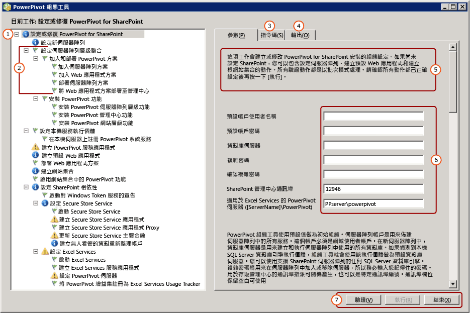

# <a name="configure-or-repair-power-pivot-for-sharepoint-2013"></a>設定或修復 Power Pivot for SharePoint 2013
  若要設定或修復 [!INCLUDE[ssCurrent](../../includes/sscurrent-md.md)][!INCLUDE[ssGemini](../../includes/ssgemini-md.md)] for SharePoint 2013 的安裝，請使用 [!INCLUDE[ssGemini](../../includes/ssgemini-md.md)] for SharePoint 組態工具。 此組態工具一開始先掃描系統，然後傳回完成或修復安裝所需的動作清單。 [!INCLUDE[ssCurrent](../../includes/sscurrent-md.md)] 安裝精靈會安裝適用於 SharePoint 2010 的 [!INCLUDE[ssGemini](../../includes/ssgemini-md.md)] 組態工具，以及適用於 SharePoint 2013 的 [!INCLUDE[ssGemini](../../includes/ssgemini-md.md)] 組態工具。 本主題描述適用於 SharePoint 2013 的 [!INCLUDE[ssGemini](../../includes/ssgemini-md.md)] 組態工具。 如需 SharePoint 2010 的詳細資訊，請參閱 [設定或修復 Power Pivot for SharePoint 2010 (Power Pivot 組態工具)](http://msdn.microsoft.com/en-us/d61f49c5-efaa-4455-98f2-8c293fa50046)。  
  
 **[!INCLUDE[applies](../../includes/applies-md.md)]**  SharePoint 2013  
  
 **本主題內容：**  
  
 [開始之前](#bkmk_before)  
  
 [使用 Power Pivot for SharePoint 2013 組態工具](#bkmk_using)  
  
 [組態步驟](#bkmk_steps)  
  
 [用於設定伺服器的輸入值](#bkmk_input)  
  
 [後續的步驟](#bkmk_nextsteps)  
  
##  <a name="bkmk_before"></a> 開始之前  
 [!INCLUDE[ssGemini](../../includes/ssgemini-md.md)] for SharePoint 2013 組態工具會掃描程式檔案、登錄設定和可用的通訊埠。 若要充分利用這些工具，請檢閱下列各項。  
  
-   執行 [Power Pivot 組態工具](../../analysis-services/power-pivot-sharepoint/power-pivot-configuration-tools.md)的一般需求。  
  
-   [!INCLUDE[ssGemini](../../includes/ssgemini-md.md)] for SharePoint 2013 偏好設定為宣告式驗證的 Web 應用程式。 如果 [!INCLUDE[ssGemini](../../includes/ssgemini-md.md)] for SharePoint 2013 組態工具為您建立應用程式，它就會將應用程式設定為使用宣告式 Windows 驗證。 如需驗證需求的詳細資訊，請參閱 [Power Pivot 驗證及授權](../../analysis-services/power-pivot-sharepoint/power-pivot-authentication-and-authorization.md)。  
  
-   您必須將通訊埠 80 提供給 P[!INCLUDE[ssGemini](../../includes/ssgemini-md.md)] for SharePoint 2013 組態工具，才能建立 Web 應用程式。  
  
##  <a name="bkmk_using"></a> 使用 Power Pivot for SharePoint 2013 組態工具  
 此工具的第一頁提供用於設定 SharePoint 伺服器陣列的輸入值摘要。 除了您提供的輸入值之外，也會使用預設值來設定系統。 預設名稱用於服務應用程式、服務應用程式資料庫和服務應用程式屬性。  
  
> [!TIP]  
>  如果組態工具掃描電腦並於左側窗格傳回空白的工作清單，就表示沒有偵測到任何需要設定的功能或設定。 若要修改 SharePoint 或 [!INCLUDE[ssGemini](../../includes/ssgemini-md.md)] 組態，請使用 Windows PowerShell 或 SharePoint 管理中心的管理頁面。 如需詳細資訊，請參閱 [管理中心的 Power Pivot 伺服器管理和組態](../../analysis-services/power-pivot-sharepoint/power-pivot-server-administration-and-configuration-in-central-administration.md)。  
  
 服務帳戶的值可用於多個服務。 例如，組態工具使用第一頁上的預設帳戶來設定所有應用程式集區識別。 您可以稍後透過在管理中心修改服務應用程式屬性，變更這些帳戶。  
  
 此工具提供索引標籤式介面，其中包含參數輸入、Windows PowerShell 指令碼和狀態訊息。  
  
 此工具會使用 Windows PowerShell 來設定伺服器。 您可以按一下 **[指令碼]** 索引標籤，檢閱此工具用於設定伺服器的 Windows PowerShell 指令碼。  
  
   
  
||Description|  
|-|-----------------|  
|**(1)**|工作清單視窗。|  
|**(2)**|個別動作。|  
|**(3)**|由組態工具建立的 Windows PowerShell 指令碼。|  
|**(4)**|當您啟動驗證或執行動作時建立的記錄訊息。|  
|**(5)**|頁面的描述。|  
|**(6)**|輸入參數|  
|**(7)**|在您驗證動作之後， **[執行]** 按鈕便會啟用。|  
  
##  <a name="bkmk_steps"></a> 組態步驟  
 只有在本機伺服器上安裝了 [!INCLUDE[ssGemini](../../includes/ssgemini-md.md)] for SharePoint 2013 時，才看得見組態工具的連結。  
  
1.  在 [開始] 功能表上，指向 [所有程式]，然後依序按一下 [[!INCLUDE[ssCurrentUI](../../includes/sscurrentui-md.md)]]、[組態工具] 和 [[!INCLUDE[ssGemini](../../includes/ssgemini-md.md)] for SharePoint 2013 組態]。  
  
2.  按一下 [設定或修復 [!INCLUDE[ssGemini](../../includes/ssgemini-md.md)] for SharePoint]。  
  
3.  將視窗展開為全螢幕。 您應該會在視窗底部看到一個按鈕列，其中包含 **[驗證]**、 **[執行]**和 **[結束]** 命令。  
  
4.  **預設帳戶** ：在 [參數] 索引標籤上，輸入 **[預設帳戶使用者名稱]**的網域使用者帳戶。 此帳戶會用來佈建主要服務，包括 [!INCLUDE[ssGemini](../../includes/ssgemini-md.md)] 服務應用程式集區。 請勿指定內建帳戶，例如 Network Service 或 Local System。 此工具會封鎖指定內建帳戶的組態。  
  
     **複雜密碼** ：輸入複雜密碼。 如果 SharePoint 伺服器陣列是新的，每當新的伺服器或應用程式加入至 SharePoint 伺服器陣列時，就會使用此複雜密碼。 如果伺服器陣列已存在，請輸入可讓您將伺服器應用程式加入至該伺服器陣列的複雜密碼。  
  
5.  **通訊埠** ：選擇性地輸入連接至管理中心 Web 應用程式的通訊埠編號，或是使用提供的隨機產生編號。 組態工具會先檢查這個編號是否可以使用，然後再提供它當做選項。  
  
6.  在主要頁面上，輸入以 SharePoint 模式執行之 [!INCLUDE[ssCurrent](../../includes/sscurrent-md.md)][!INCLUDE[ssGemini](../../includes/ssgemini-md.md)] 伺服器的名稱。  
  
7.  (選擇性) 檢閱用來完成每個動作的其餘輸入值。 如需有關每個的詳細資訊，請參閱本主題中的 [用於設定伺服器的輸入值](#bkmk_input) 。  
  
8.  選擇性地移除您不想處理的任何動作。 例如，如果您想要在稍後設定 Secure Store Service，請按一下 **[設定 Secure Store Service]**，然後清除 **[在工作清單中包含這個動作]**核取方塊。  
  
9. 按一下 **[驗證]** ，檢查此工具是否有足夠的資訊來處理清單中的動作。  
  
10. 按一下 **[執行]** ，處理工作清單中的所有動作。 **[執行]** 按鈕只在驗證動作之後才可供使用。 如果 **[執行]** 未啟用，請先按一下 **[驗證]** 。  
  
     如果您看見類似下面的錯誤訊息，請確認 SQL Server 資料庫執行個體已啟動。  
  
    ```  
    Cannot connect to the database server instance  
    ```  
  
11. [驗證 PowerPivot for SharePoint 安裝](../../analysis-services/instances/install-windows/verify-a-power-pivot-for-sharepoint-installation.md)。  
  
##  <a name="bkmk_input"></a> 用於設定伺服器的輸入值  
 [!INCLUDE[ssGemini](../../includes/ssgemini-md.md)] 組態工具會使用輸入值 (您所輸入) 以及預設值 (其偵測到或自動使用) 的組合。  
  
 組態工具所顯示的動作清單取決於 SharePoint 伺服器陣列目前的組態。 例如，如果已設定 SharePoint 伺服器陣列，您就不會看到用於設定此伺服器陣列或建立 Web 應用程式的動作。 您可以隨時執行工具以設定、修復或偵測組態錯誤。 如果必要服務 (例如 Excel Services 或 Secure Store Service) 未在伺服器陣列中執行，此工具會偵測遺漏的服務並且提供用於啟用這些服務的選項。 如果無需執行任何動作，則工作清單就是空的。  
  
 下表說明用於設定伺服器的值。  
  
|頁面|輸入值|來源|說明|  
|----------|-----------------|------------|-----------------|  
|**設定或修復 [!INCLUDE[ssGemini](../../includes/ssgemini-md.md)] for SharePoint**|預設帳戶|目前使用者|預設帳戶是用於在伺服器陣列中佈建共用服務的網域 Windows 使用者帳戶。 它可用來佈建下列項目：|  
||||-<br />                    [!INCLUDE[ssGemini](../../includes/ssgemini-md.md)] 服務應用程式|  
||||-Secure Store Service|  
||||-Excel Services|  
||||-Web 應用程式集區識別|  
||||-網站集合管理員|  
||||[!INCLUDE[ssGemini](../../includes/ssgemini-md.md)] 自動資料重新整理帳戶。|  
||||預設使用目前的使用者網域帳戶。<br /><br /> 請注意：除非您是針對評估和非實際執行目的設定伺服器，否則建議您取代預設值。<br /><br /> 您可以在設定或修復之後使用管理中心變更服務識別。<br /><br /> (選擇性) 在 [!INCLUDE[ssGemini](../../includes/ssgemini-md.md)] 組態工具中，為下列項目指定專用帳戶：|  
||||-Web 應用程式，使用 [建立預設 Web 應用程式] 頁面 (假設此工具正在為伺服器陣列建立 Web 應用程式)。|  
||||-<br />                    [!INCLUDE[ssGemini](../../includes/ssgemini-md.md)] 自動資料重新整理帳戶，使用此工具中的 **[建立無人看管的資料重新整理帳戶]** 頁面。|  
||資料庫伺服器|本機 [!INCLUDE[ssGemini](../../includes/ssgemini-md.md)] 具名執行個體 (如果有的話)|如果資料庫引擎執行個體安裝為 [!INCLUDE[ssGemini](../../includes/ssgemini-md.md)] 具名執行個體，此工具會將這個執行個體名稱填入資料庫伺服器欄位。 如果您沒有安裝資料庫引擎，此欄位是空的。<br /><br /> **[資料庫伺服器]**  是必要參數。 此執行個體可以是 SharePoint 伺服器陣列所支援的任何 SQL Server 版本或版別。|  
||複雜密碼|使用者輸入|如果您要建立新的伺服器陣列，您所輸入的複雜密碼就會當做此伺服器陣列的複雜密碼使用。 如果您要將 [!INCLUDE[ssGemini](../../includes/ssgemini-md.md)] for SharePoint 加入至現有的伺服器陣列，請輸入現有伺服器陣列的複雜密碼。|  
||SharePoint 管理中心通訊埠|預設值 (如果需要)|如果未設定伺服器陣列，則此工具會提供用於建立伺服器陣列的選項，包括建立指向管理中心的 HTTP 端點。 它會選取一個隨機產生、未使用中的通訊埠編號。|  
||[!INCLUDE[ssGemini](../../includes/ssgemini-md.md)] for Excel Services ([伺服器名稱]\ [!INCLUDE[ssGemini](../../includes/ssgemini-md.md)])|使用者輸入|Excel Services 需要 [!INCLUDE[ssGemini](../../includes/ssgemini-md.md)] 伺服器才能啟用核心的 [!INCLUDE[ssGemini](../../includes/ssgemini-md.md)] 功能。 您在此頁面上輸入的伺服器名稱也會加入 [設定 [!INCLUDE[ssGemini](../../includes/ssgemini-md.md)] 伺服器] 頁面上的清單。|  
|**設定新伺服器陣列**|資料庫伺服器<br /><br /> 伺服器陣列帳戶<br /><br /> 複雜密碼<br /><br /> SharePoint 管理中心通訊埠|預設值 (如果需要)|設定會預設為您在主頁面中輸入的內容。|  
|**建立 [!INCLUDE[ssGemini](../../includes/ssgemini-md.md)] 服務應用程式**|服務應用程式名稱|預設值|[!INCLUDE[ssGemini](../../includes/ssgemini-md.md)]服務應用程式名稱的預設名稱為**預設[!INCLUDE[ssGemini](../../includes/ssgemini-md.md)]服務應用程式**。 您可以在工具中取代為不同的值。|  
||資料庫伺服器|預設值|裝載 [!INCLUDE[ssGemini](../../includes/ssgemini-md.md)] 服務應用程式資料庫的資料庫伺服器。 預設伺服器名稱就是用於伺服器陣列的資料庫伺服器。 您可以用不同的值來取代預設伺服器名稱。|  
||資料庫名稱|預設值|要針對 [!INCLUDE[ssGemini](../../includes/ssgemini-md.md)] 服務應用程式資料庫建立的資料庫名稱。 預設資料庫名稱以服務應用程式名稱為基礎，後面跟著 GUID，以確保名稱是唯一的。 您可以在工具中取代為不同的值。|  
|**建立預設 Web 應用程式**|Web 應用程式名稱|預設值 (如果需要)|如果沒有任何 Web 應用程式存在，此工具會建立一個。 Web 應用程式會設定為傳統模式驗證，並且接聽通訊埠 80。 上傳檔案大小上限設為 2047，這是 SharePoint 所允許的最大值。 較大的上傳檔案大小是為了容納將上傳至伺服器的大型 [!INCLUDE[ssGemini](../../includes/ssgemini-md.md)] 檔案。|  
||URL|預設值 (如果需要)|此工具會根據伺服器名稱，使用與 SharePoint 相同的檔案命名慣例來建立 URL。|  
||應用程式集區|預設值 (如果需要)|此工具會在 IIS 中建立預設應用程式集區。|  
||應用程式集區帳戶和密碼|預設值 (如果需要)|應用程式集區帳戶以預設帳戶為基礎，但您可以在工具中覆寫它。|  
||資料庫伺服器|預設值 (如果需要)|將預先選取預設資料庫執行個體以儲存應用程式內容資料庫，但您可以在此工具中指定不同的 SQL Server 執行個體。|  
||資料庫名稱|預設值 (如果需要)|應用程式資料庫的名稱。 資料庫名稱以 SharePoint 的檔案命名慣例為基礎，但您可以選擇其他名稱。|  
|**部署 Web 應用程式方案**|URL|預設值 (如果需要)|[預設 URL] 是來自預設 Web 應用程式。|  
||檔案大小上限 (MB)|預設值 (如果需要)|預設值是 2047。 SharePoint 文件庫也有大小上限，而 [!INCLUDE[ssGemini](../../includes/ssgemini-md.md)] 設定不應超過文件庫設定。 如需詳細資訊，請參閱[設定檔案上傳的大小上限 &#40;Power Pivot for SharePoint&#41;](../../analysis-services/power-pivot-sharepoint/configure-maximum-file-upload-size-power-pivot-for-sharepoint.md)。|  
|**建立網站集合**|網站管理員|預設值 (如果需要)|此工具使用預設帳戶。 您可以在 **[建立網站集合]** 頁面中覆寫預設帳戶。|  
||連絡人電子郵件|預設值 (如果需要)|如果伺服器上設定了 Microsoft Outlook，此工具會使用目前使用者的電子郵件地址， 否則會使用預留位置值。|  
||網站 URL|預設值 (如果需要)|此工具會使用與 SharePoint 相同的 URL 命名慣例來建立網站 URL。|  
||網站標題|預設值 (如果需要)|此工具會加入 [[!INCLUDE[ssGemini](../../includes/ssgemini-md.md)] 網站] 作為預設標題。|  
|**啟用網站集合中的 [!INCLUDE[ssGemini](../../includes/ssgemini-md.md)] 功能**|網站 URL||您要啟用 [!INCLUDE[ssGemini](../../includes/ssgemini-md.md)] 功能之網站集合的 URL。|  
||啟用這個網站的高階功能||啟用 SharePoint 網站功能 "PremiumSite"。|  
|**建立 Secure Store Service 應用程式**|服務應用程式名稱|預設值 (如果需要)|輸入 Secure Store Service 應用程式的名稱。|  
||資料庫伺服器|使用者輸入|輸入用於 Secure Store Service 應用程式的資料庫伺服器名稱。|  
|**建立 Secure Store Service 應用程式 Proxy**|服務應用程式名稱|預設值 (如果需要)|輸入您在先前頁面中輸入的 Secure Store Service 應用程式名稱。|  
||服務應用程式 Proxy|預設值 (如果需要)|輸入 Secure Store Service 應用程式 Proxy 的名稱。 這個名稱將顯示在預設連接群組中，藉由群組可以將應用程式與 SharePoint 內容 Web 應用程式產生關聯。|  
|**更新 Secure Store Service 主要金鑰**|服務應用程式 Proxy|預設值 (如果需要)|輸入您在先前頁面中輸入的 Secure Store Service 應用程式 Proxy 名稱。|  
||複雜密碼|使用者輸入|用於資料加密的主要金鑰。 根據預設，用來產生金鑰的複雜密碼與用來在伺服器陣列中佈建新伺器所用的複雜密碼相同。 您可以用唯一的複雜密碼取代預設複雜密碼。|  
|**建立無人看管的資料重新整理帳戶**|目標應用程式識別碼|預設值 (如果需要)|建立目標應用程式以儲存無人看管之 [!INCLUDE[ssGemini](../../includes/ssgemini-md.md)] 資料重新整理的認證。<br /><br /> 應用程式識別碼可以是描述性文字。|  
||目標應用程式的易記名稱|預設值 (如果需要)||  
||無人看管帳戶的使用者名稱和密碼|預設值 (如果需要)|輸入目標應用程式用來執行無人看管之資料重新整理的 Windows 使用者帳戶認證。 如需詳細資訊，請參閱 [Configure Excel Services data refresh by using the unattended service account in SharePoint Server 2013](http://technet.microsoft.com/library/hh525344\(office.15\).aspx) (在 SharePoint Server 2013 中使用自動服務帳戶設定 Excel Services 資料重新整理) (http://technet.microsoft.com/en-us/library/hh525344(office.15).aspx)。|  
||網站 URL|預設值 (如果需要)|輸入與目標應用程式相關聯之網站集合的網站 URL。 若要與其他網站集合產生關聯，請使用 SharePoint 管理中心。|  
|**建立 Excel Services 服務應用程式**|服務應用程式名稱|預設值 (如果需要)|輸入服務應用程式名稱。 系統會在 SharePoint 伺服器陣列的資料庫伺服器上建立相同名稱的服務應用程式資料庫。|  
|**設定 [!INCLUDE[ssGemini](../../includes/ssgemini-md.md)] 伺服器**|服務應用程式名稱|預設值 (如果需要)|您在先前頁面上輸入的服務應用程式名稱。|  
||[!INCLUDE[ssGemini](../../includes/ssgemini-md.md)] 伺服器名稱||已註冊的 [!INCLUDE[ssGemini](../../includes/ssgemini-md.md)] 伺服器清單。<br /><br /> 在主要頁面上輸入的伺服器名稱會自動加入至此頁面。|  
|**將 [!INCLUDE[ssGemini](../../includes/ssgemini-md.md)] 增益集註冊為 Excel Services Usage Tracker**|服務應用程式名稱||您在先前頁面上輸入的服務應用程式名稱。|  
|||||  
  
 如果 [!INCLUDE[ssGemini](../../includes/ssgemini-md.md)] for SharePoint 2013 組態工具建立伺服器陣列，它會使用與 SharePoint 相同的檔案命名慣例，在資料庫伺服器上建立必要資料庫。 您無法變更伺服器陣列資料庫名稱。  
  
 如果工具建立網站集合，它會使用與 SharePoint 相同的檔案命名慣例，在資料庫伺服器上建立內容資料庫。 您無法變更內容資料庫名稱。  
  
## <a name="verify-the-configuration"></a>確認組態  
 請參閱[設定 Power Pivot 及部署方案 &#40;SharePoint 2013&#41;](../../analysis-services/instances/install-windows/configure-power-pivot-and-deploy-solutions-sharepoint-2013.md) 的＜驗證 [!INCLUDE[ssGemini](../../includes/ssgemini-md.md)] 組態＞一節。  
  
##  <a name="bkmk_nextsteps"></a> 後續步驟  
 完成伺服器安裝之後，有幾個您應該執行的後置安裝工作：  
  
-   授與 SharePoint 權限給個人與群組。 若要存取網站及內容，這是必要的工作。  
  
-   變更服務應用程式集區識別，以不同的帳戶執行。 為服務和應用程式指定不同的識別是 SharePoint 對於安全部署的最佳作法建議。  
  
-   在 Excel Services 中建立其他信任的網站，讓您可以變更最適合 [!INCLUDE[ssGemini](../../includes/ssgemini-md.md)] 資料存取的權限和組態設定。  
  
-   安裝常用的資料提供者，以啟用伺服器端資料重新整理。  
  
### <a name="grant-sharepoint-permissions-to-workbook-users"></a>將 SharePoint 權限授與活頁簿使用者  
 使用者需要有 SharePoint 權限，才能發行或檢視活頁簿。 請將 **[檢視]** 權限授與需要檢視已發行之活頁簿的使用者，並將 **[參與]** 權限授與發行或管理活頁簿的使用者。 您必須是網站集合管理員，才能授與權限。  
  
1.  在 SharePoint 2013 網站中，按一下 [設定] 圖示，然後按一下 **站台設定**。  
  
2.  按一下 **[使用者與權限]** 群組中的 **[網站權限]** 。  
  
3.  如果您希望其中一組使用者具有 **[參與]** 權限，而另一個使用者群組只有 **[檢視]** 權限，則視需要建立群組。  
  
4.  輸入應該擁有群組成員資格的 Windows 網域使用者或群組帳戶。 如同上面所述，如果應用程式有設定傳統驗證，請勿使用電子郵件地址或通訊群組。  
  
### <a name="install-data-providers-used-in-data-refresh-and-check-user-permissions"></a>安裝資料重新整理中使用的資料提供者並檢查使用者權限  
 伺服器端資料重新整理可讓使用者以自動安裝模式將更新的資料重新匯入其活頁簿中。 為了讓資料重新整理成功，以 SharePoint 模式執行 Analysis Services 的伺服器必須擁有原先用來匯入資料的相同資料提供者。 此外，用來執行資料重新整理的使用者帳戶經常會需要外部資料來源的讀取權限。 請您務必檢查啟用和設定資料重新整理的需求，以確保獲得成功的結果。 如需詳細資訊，請參閱 [Power Pivot 資料重新整理與 SharePoint 2010](http://msdn.microsoft.com/en-us/01b54e6f-66e5-485c-acaa-3f9aa53119c9)。  
  
> [!NOTE]  
>  若為 [!INCLUDE[ssCurrent](../../includes/sscurrent-md.md)][!INCLUDE[ssGemini](../../includes/ssgemini-md.md)] for SharePoint 2013，當您執行 **spPowerPivot.msi** 安裝程式和 [!INCLUDE[ssGemini](../../includes/ssgemini-md.md)] for SharePoint 2013 組態工具時，就會安裝這些資料提供者。 如需詳細資訊，請參閱 [安裝或解除安裝 Power Pivot for SharePoint 增益集 &#40;SharePoint 2013&#41;](../../analysis-services/instances/install-windows/install-or-uninstall-the-power-pivot-for-sharepoint-add-in-sharepoint-2013.md)。  
  
### <a name="change-application-pool-and-service-identities-in-sharepoint"></a>在 SharePoint 中變更應用程式集區和服務識別  
 [!INCLUDE[ssGemini](../../includes/ssgemini-md.md)] 組態工具會提供在單一帳戶下執行的伺服器陣列功能、應用程式和服務。 這樣會簡化安裝，但是不會產生一個符合 SharePoint 伺服陣列安全性需求的部署。 若要建立更強固的部署，請變更應用程式集區和服務識別，使其在安裝完成之後於不同的帳戶之下執行。 如需詳細資訊，請參閱 [設定 Power Pivot 服務帳戶](../../analysis-services/power-pivot-sharepoint/configure-power-pivot-service-accounts.md)。  
  
### <a name="create-additional-trusted-sites-in-excel-services"></a>在 Excel Services 中建立其他信任的網站  
 您可以在 Excel Services 中加入信任的網站，以便在提供 Excel 活頁簿和 [!INCLUDE[ssGemini](../../includes/ssgemini-md.md)] 資料的網站上變更權限和組態設定。 如需詳細資訊，請參閱 [在管理中心建立 Power Pivot 網站的信任位置](../../analysis-services/power-pivot-sharepoint/create-a-trusted-location-for-power-pivot-sites-in-central-administration.md)。  
  
### <a name="build-a-includessgeminiincludesssgemini-mdmd-workbook"></a>建置 [!INCLUDE[ssGemini](../../includes/ssgemini-md.md)] 活頁簿  
 當您在伺服器陣列中安裝了伺服器元件之後，就可以建立使用內嵌 [!INCLUDE[ssGemini](../../includes/ssgemini-md.md)] 資料的第一份 Excel 2013 活頁簿，然後將它發行到 SharePoint 文件庫。 或者，您可以上傳或發行 [!INCLUDE[ssGemini](../../includes/ssgemini-md.md)] 活頁簿範例以確認 SharePoint 中的 [!INCLUDE[ssGemini](../../includes/ssgemini-md.md)] 資料存取。 如需詳細資訊，請參閱下列內容：  
  
-   [Power Pivot 說明](https://support.office.com/en-us/article/Power-Pivot-Help-241aac41-92e3-4e46-ae58-2f2cd7dbcf4f)(https://support.office.com/en-us/article/Power-Pivot-Help-241aac41-92e3-4e46-ae58-2f2cd7dbcf4f)。  
  
-   [Start Power Pivot in Excel 2013 add-in](http://office.microsoft.com/excel-help/start-powerpivot-in-excel-2013-add-in-HA102837097.aspx?CTT=5&origin=HA102837110) (在 Excel 2013 增益集中啟動 Power Pivot) (http://office.microsoft.com/excel-help/start-powerpivot-in-excel-2013-add-in-HA102837097.aspx?CTT=5&origin=HA102837110)。  
  
### <a name="add-additional-analysis-services-servers-in-sharepoint-mode"></a>加入其他 SharePoint 模式的 Analysis Services 伺服器  
 一段時間之後，如果您決定需要額外的資料儲存和處理功能，可以將其他以 SharePoint 模式執行 Analysis Services 的伺服器加入至伺服器陣列。 若為 [!INCLUDE[ssCurrent](../../includes/sscurrent-md.md)][!INCLUDE[ssGemini](../../includes/ssgemini-md.md)] for SharePoint 2013，您可以使用 SharePoint 模式安裝新的 [!INCLUDE[ssASnoversion](../../includes/ssasnoversion-md.md)] 伺服器，然後設定 Excel Services。 如需詳細資訊，請參閱 [以 Power Pivot 模式安裝 Analysis Services](../../analysis-services/instances/install-windows/install-analysis-services-in-power-pivot-mode.md)中的＜超過單一伺服器安裝＞一節。  
  
## <a name="additional-resources"></a>其他資源  
 [透過 Microsoft SQL Server Connect 提交意見和連絡資訊](https://connect.microsoft.com/SQLServer/Feedback)(https://connect.microsoft.com/SQLServer/Feedback)。  
  
## <a name="see-also"></a>請參閱＜  
 [安裝或解除安裝 Power Pivot for SharePoint 增益集 &#40;SharePoint 2013&#41;](../../analysis-services/instances/install-windows/install-or-uninstall-the-power-pivot-for-sharepoint-add-in-sharepoint-2013.md)   
 [Power Pivot 組態工具](../../analysis-services/power-pivot-sharepoint/power-pivot-configuration-tools.md)   
 [管理中心的 PowerPivot 伺服器管理和組態](../../analysis-services/power-pivot-sharepoint/power-pivot-server-administration-and-configuration-in-central-administration.md)   
 [升級活頁簿和排程的資料重新整理 &#40;SharePoint 2013&#41;](../../analysis-services/instances/install-windows/upgrade-workbooks-and-scheduled-data-refresh-sharepoint-2013.md)  
  
  
