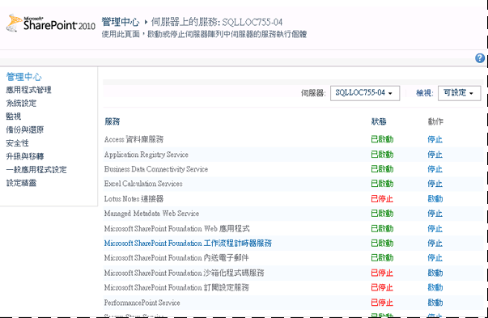
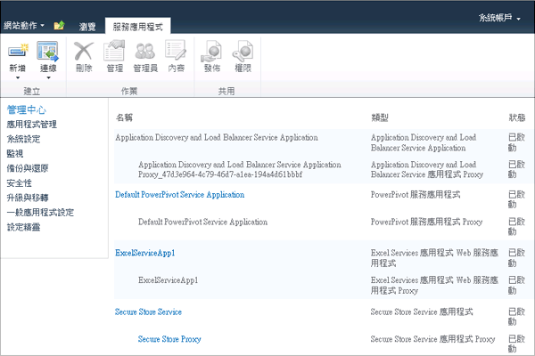

# <a name="configure-power-pivot-health-rules"></a>設定 PowerPivot 健全狀況規則
[!INCLUDE[ssGemini_md](../../includes/ssgemini-md.md)] for SharePoint 包含的 SharePoint 健全狀況規則可幫助您監控及修復伺服器可用性與組態問題。 套用至 [!INCLUDE[ssGemini_md](../../includes/ssgemini-md.md)] for SharePoint 的健全狀況規則會出現在 [檢閱規則定義] 頁面中。  
  
 健全狀況規則可以早期偵測最終可能導致服務中斷的伺服器問題。 [!INCLUDE[ssGemini_md](../../includes/ssgemini-md.md)] for SharePoint 提供數個規則來協助您在影響使用者之前，先識別並修正問題。 您可以自訂這些規則中的多個規則，以納入部署的唯一特性。 例如，如果您想要更多時間來處理磁碟空間的警告，可以將可用磁碟空間百分比從 5% 提高到 10%，讓您可以提前收到警告。  
  
 可以自訂的規則是報告資源耗用或伺服器可用性的規則。 在這些領域中，自訂相當有協助，因為基礎系統功能在不同的伺服器和部署拓撲中，有相當大的不同。 相較之下，沒有任何自訂可用於識別伺服器組態或安全性問題的規則。 那些規則會跨所有安裝，統一套用。  
  
||  
|-|  
|**[!INCLUDE[applies](../../includes/applies-md.md)]**  SharePoint 2013 &#124; SharePoint 2010|  
  
 **注意**：健全狀況規則設定是針對 SQL Server Analysis Services 執行個體和 [!INCLUDE[ssGemini_md](../../includes/ssgemini-md.md)] 服務應用程式分別設定。 請使用本主題的指示來設定每一個服務的健全狀況規則。 如果是 SharePoint 2013 部署， [!INCLUDE[ssGeminiShort](../../includes/ssgeminishort-md.md)] 只會使用服務應用程式。 因此， [!INCLUDE[ssGeminiShort](../../includes/ssgeminishort-md.md)] 會針對不同版本的 SharePoint 安裝不同組的健全狀況規則。 請參閱[健全狀況規則參考 &#40;Power Pivot for SharePoint&#41;](../../analysis-services/power-pivot-sharepoint/health-rules-reference-power-pivot-for-sharepoint.md) 主題中的「版本」資料行，或者也可以執行以下 Windows PowerShell 命令來查看已安裝的規則。  
  
```  
Get-SPHealthAnalysisRule | select name, enabled, summary | where {$_.summary -like “*power*”}  | format-table -property * -autosize | out-default  
```  
  
 **本主題內容：**  
  
 [檢視 PowerPivot 健全狀況規則](#bkmk_view)  
  
 [設定用於評估伺服器穩定性的健全狀況規則 (SQL Server Analysis Services)](#bkmk_HR_SSAS)  
  
 [設定用於評估應用程式穩定性的健全狀況規則 (PowerPivot 服務應用程式)](#bkmk_evaluate_application_stability)  
  
## <a name="prerequisites"></a>必要條件  
 您必須是服務應用程式管理員，才能變更 Analysis Services 執行個體與 [!INCLUDE[ssGemini_md](../../includes/ssgemini-md.md)] 服務應用程式的組態屬性。  
  
##  <a name="bkmk_view"></a> 檢視 PowerPivot 健全狀況規則  
  
1.  在 SharePoint 管理中心按一下 **[監視]**，然後在 **[狀況分析器]** 區段中按一下 **[檢閱規則定義]**。  
  
2.  在 [組態] 區段中，尋找前置詞為 **[!INCLUDE[ssGemini_md](../../includes/ssgemini-md.md)]:** 的規則。 所有 [!INCLUDE[ssGemini_md](../../includes/ssgemini-md.md)]相關健全狀況規則都擁有此前置詞，可協助您區分它們與內建 SharePoint 規則。  
  
 偵測到問題時，這些規則將會出現在 **[檢閱問題與方案]** 頁面中。  
  
 如果您對於要立即調查的問題有疑問，可以手動執行規則檢查來找出是否有任何問題。  
  
 若要這樣做，請按一下此規則來開啟其規則定義，然後在功能區中按一下 **[立即執行]** 。 按一下 **[關閉]** 回到 **[檢閱問題與方案]** 頁面來檢視報表。 如果此規則偵測到問題，則頁面上會報告警告或錯誤。 在某些情況下，可能需要幾分鐘的時間才會出現錯誤或警告。  
  
##  <a name="bkmk_HR_SSAS"></a> 設定用於評估伺服器穩定性的健全狀況規則 (SQL Server Analysis Services)  
 Analysis Services 執行個體包括可偵測系統層級 (快取用途的 CPU、記憶體與磁碟空間) 問題的健全狀況規則。 請使用下列指示來修改可觸發健全狀況規則的臨界值。  
  
1.  在 SharePoint 管理中心內，按一下 **[系統設定]** 區段中的 **[管理伺服器上的服務]**。  
  
2.  在頁面頂端，擁有 Analysis Services 執行個體的 SharePoint 伺服器陣列中選取伺服器 (在下圖中，伺服器名稱為 AW-SRV033)。 **[SQL Server Analysis Services]** 將會出現在服務清單中。  
  
       
  
3.  按一下 **[SQL Server Analysis Services]**。  
  
4.  在 [健全狀況規則設定] 中的服務屬性頁上，修改下列設定：  
  
     CPU 資源配置不足 (預設為 80%)  
     如果 Analysis Services 伺服器處理序 (msmdsrv.exe) 使用的 CPU 資源在 4 個小時期間超過或等於 80% (如 [資料收集間隔] 設定所指定)，就會觸發這個健全狀況規則。  
  
     此組態設定會對應到 [檢閱問題與方案] 頁面上的以下規則定義：[[!INCLUDE[ssGemini_md](../../includes/ssgemini-md.md)]: Analysis Services 的 CPU 資源不足，無法執行要求的作業]。  
  
     系統的 CPU 資源不足 (預設為 90%)  
     如果伺服器的 CPU 資源在 4 個小時的期間內大於或等於 90% (如 [資料收集間隔] 設定所指定)，就會觸發這個健全狀況規則。 整體 CPU 使用量會以健全狀態為基礎之負載平衡演算法的一部分來衡量，以伺服器健全狀態量值的形式監視 CPU 使用量。  
  
     此組態設定會對應到 [檢閱問題與方案] 頁面上的以下規則定義：[[!INCLUDE[ssGemini_md](../../includes/ssgemini-md.md)]: 整體 CPU 使用率太高]。  
  
     記憶體臨界值不足 (預設為 5%)  
     在 SharePoint 應用程式伺服器上，SQL Server Analysis Services 執行個體應該一律擁有永遠是未使用的少量保留記憶體。 由於伺服器對於大部分的作業都會繫結記憶體，如果此伺服器一直都沒有執行到上限，則運作狀況會最好。 5% 的未使用記憶體會計算為配置給 Analysis Services 之記憶體的百分比。 例如，如果您的總記憶體為 200 GB，並將 80% 的記憶體 (或 160 GB) 配置給 Analysis Services，則 5% 的未使用記憶體為 160 GB 的 5% (或 8 GB)。  
  
     此組態設定會對應到 [檢閱問題與方案] 頁面上的以下規則定義：[[!INCLUDE[ssGemini_md](../../includes/ssgemini-md.md)]: Analysis Services 的記憶體不足，無法執行要求的作業]。  
  
     最大連接數目 (預設為 100)  
     如果 Analysis Services 執行個體的連接數目在 4 個小時的期間超過或等於 100 個連接 (如 [資料收集間隔] 設定所指定)，就會觸發這個健全狀況規則。 這個預設值為任意值 (而不是根據伺服器的硬體規格或使用者活動)，所以您可能會根據您的環境中的伺服器容量和使用者活動來提高或降低此值。  
  
     此組態設定會對應到 [檢閱問題與方案] 頁面上的以下規則定義：[[!INCLUDE[ssGemini_md](../../includes/ssgemini-md.md)]: 連接數目太多表示要部署更多的伺服器才能處理目前的負載]。  
  
     磁碟空間不足 (預設為 5%)  
     每次要求資料庫時，都會使用磁碟空間來快取 [!INCLUDE[ssGemini_md](../../includes/ssgemini-md.md)] 資料。 當磁碟空間不足時，這個規則會讓您知道這個狀況。 根據預設，當備份資料夾所在之磁碟機上的磁碟空間低於 5% 時，便會觸發此健全狀況規則。 如需磁碟使用量的詳細資訊，請參閱[設定磁碟空間使用量 &#40;Power Pivot for SharePoint&#41;](../../analysis-services/power-pivot-sharepoint/configure-disk-space-usage-power-pivot-for-sharepoint.md)。  
  
     此組態設定會對應到 [檢閱問題與方案] 頁面上的以下規則定義：[[!INCLUDE[ssGemini_md](../../includes/ssgemini-md.md)]: [!INCLUDE[ssGemini_md](../../includes/ssgemini-md.md)]資料快取所在之磁碟機上的磁碟空間不足]。  
  
     資料收集間隔 (小時)  
     您可以指定資料收集期間，該期間用來計算觸發健全狀況規則所使用的數字。 雖然系統會持續受到監控，但是用來觸發健全狀況規則警告的臨界值會使用一段預先定義之間隔內所產生的資料來計算。 預設間隔是 4 小時。 伺服器會擷取過去 4 小時所收集的系統和使用量資料，以評估使用者連接數目、磁碟空間使用量以及 CPU 和記憶體使用率。  
  
##  <a name="bkmk_evaluate_application_stability"></a> 設定用於評估應用程式穩定性的健全狀況規則 (PowerPivot 服務應用程式)  
  
1.  在 [管理中心] 的 [應用程式管理] 中，按一下 **[管理服務應用程式]**。  
  
2.  在 [服務應用程式] 頁面中，按一下 [預設的 [!INCLUDE[ssGemini_md](../../includes/ssgemini-md.md)] 服務應用程式]。  
  
       
  
3.  [ [!INCLUDE[ssGemini_md](../../includes/ssgemini-md.md)] 管理儀表板] 隨即出現。 在 **[動作]** 清單中，按一下 **[設定服務應用程式設定]** ，以開啟服務應用程式設定頁面。  
  
       
  
4.  在 [健全狀況規則設定] 中，修改下列設定：  
  
     連接負載比率 (預設為 20%)  
     如果載入事件數目相對於連接事件數目而言較高，則會觸發這個健全狀況規則，發出伺服器可能卸載資料庫太快的訊號，或減少快取設定太極端的訊號。  
  
     此組態設定會對應到 [檢閱問題與方案] 頁面上的以下規則定義：[[!INCLUDE[ssGemini_md](../../includes/ssgemini-md.md)]: 連接的載入事件的比率過高]。  
  
     資料收集間隔 (預設為 4 小時)  
     您可以指定資料收集期間，該期間用來計算觸發健全狀況規則所使用的數字。 雖然系統會持續受到監控，但是用來觸發健全狀況規則警告的臨界值會使用一段預先定義之間隔內所產生的資料來計算。 預設間隔是 4 小時。 伺服器會擷取過去 4 小時所收集的系統和使用量資料，以評估收集負載比率。  
  
     檢查 [!INCLUDE[ssGemini_md](../../includes/ssgemini-md.md)] Management Dashboard.xlsx 的更新 (預設為 5 天)  
     [!INCLUDE[ssGemini_md](../../includes/ssgemini-md.md)] Management Dashboard.xlsx 檔案是 [ [!INCLUDE[ssGemini_md](../../includes/ssgemini-md.md)] 管理儀表板] 中的報表所使用的資料來源。 在預設伺服器組態中，此 .xlsx 檔每天都會重新整理 (使用 SharePoint 和 [!INCLUDE[ssGemini_md](../../includes/ssgemini-md.md)] 系統服務所收集的使用量資料)。 萬一未更新此檔案，健全狀況規則會將它報告為問題。 根據預設，如果此檔案的時間戳記長達 5 天都未變更，則會觸發此規則。  
  
     如需使用量資料收集的詳細資訊，請參閱[設定使用量資料收集的對象 &#40;Power Pivot for SharePoint](../../analysis-services/power-pivot-sharepoint/configure-usage-data-collection-for-power-pivot-for-sharepoint.md)。  
  
     此組態設定會對應到 [檢閱問題與方案] 頁面上的以下規則定義：[[!INCLUDE[ssGemini_md](../../includes/ssgemini-md.md)]: 使用量資料並未以預期的頻率更新]。  
  
## <a name="see-also"></a>另請參閱  
 [設定磁碟空間使用量 &#40;Power Pivot for SharePoint&#41;](../../analysis-services/power-pivot-sharepoint/configure-disk-space-usage-power-pivot-for-sharepoint.md)   
 [Power Pivot 管理儀表板和使用量資料](../../analysis-services/power-pivot-sharepoint/power-pivot-management-dashboard-and-usage-data.md)  
  
  

