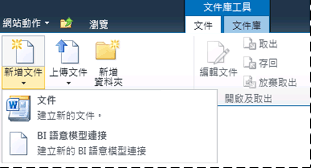
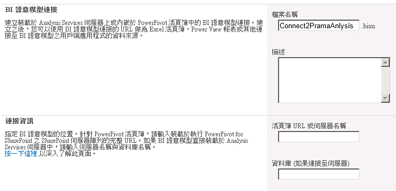

# 建立與 Power Pivot 活頁簿的 BI 語意模型連接
[!INCLUDE[ssas-appliesto-sqlas](../../includes/ssas-appliesto-sqlas.md)]
  使用本主題中的資訊可設定 BI 語意模型連接，該連接會重新導向至相同伺服器陣列中的 [!INCLUDE[ssGemini](../../includes/ssgemini-md.md)] 活頁簿。  
  
 在您建立 BI 語意模型連接並且設定 SharePoint 權限之後，可以將其做為 Excel 或 [!INCLUDE[ssCrescent](../../includes/sscrescent-md.md)] 報表的資料來源。  
  
 本主題包含下列各節。 請依指定順序執行每個工作。  
  
 [檢閱必要條件](#bkmk_prereq)  
  
 [建立連接](#bkmk_create)  
  
 [設定 BI 語意模型連接的 SharePoint 權限](#bkmk_permissions)  
  
 [設定活頁簿的 SharePoint 權限](#bkmk_userdb)  
  
 [後續步驟](#bkmk_next)  
  
##   檢閱必要條件  
 您必須有 [參與] 以上權限，才能建立 BI 語意模型連接檔案。  
  
 您必須具有支援 BI 語意模型連接內容類型的文件庫。 如需詳細資訊，請參閱[將 BI 語意模型連接內容類型加入至文件庫 &#40;Power Pivot for SharePoint&#41;](../../analysis-services/power-pivot-sharepoint/add-bi-semantic-model-connection-content-type-to-library.md)。  
  
 您必須知道的 URL[!INCLUDE[ssGemini](../../includes/ssgemini-md.md)]活頁簿，您要設定 BI 語意模型連接 (例如， `http://adventure-works/shared documents/myworkbook.xlsx`)。 活頁簿必須位於相同伺服器陣列中。  
  
 參與連接順序的所有電腦和使用者都必須是在相同網域或受信任網域 (雙向信任) 中。  
  
##   建立連接  
  
1.  在包含 BI 語意模型連接的文件庫中，按一下 SharePoint 功能區上的 [文件]。 按一下 [新文件] 上的向下箭號，然後選取 [BISM 連接檔案] 開啟 [新增 BI 語意模型連接] 頁面。  
  
       
  
2.  設定**伺服器**屬性的 SharePoint url[!INCLUDE[ssGemini](../../includes/ssgemini-md.md)]活頁簿 (例如， `http://mysharepoint/shared documents/myWorkbook.xlsx`。 在 [!INCLUDE[ssGemini](../../includes/ssgemini-md.md)] for SharePoint 部署中，可以在伺服器陣列中的任何伺服器上載入資料。 因此，資料來源與 [!INCLUDE[ssGemini](../../includes/ssgemini-md.md)] 資料的連接只會指定活頁簿的路徑。 [!INCLUDE[ssGemini](../../includes/ssgemini-md.md)] 系統服務會決定載入資料的伺服器。  
  
     請不要使用 [資料庫] 屬性；指定 [!INCLUDE[ssGemini](../../includes/ssgemini-md.md)] 活頁簿的位置時，不會使用這個屬性。  
  
     頁面應看起來類似下圖。  
  
       
  
     或者，如果您有活頁簿的 SharePoint 權限，則會執行額外的驗證步驟，以確保該位置有效。 如果您沒有資料的存取權限，則會提供一個無需驗證回應即儲存 BI 語意模型連接的選項。  
  
##   設定 BI 語意模型連接的 SharePoint 權限  
 需要有 SharePoint 文件庫中 BI 語意模型連接項目的 [讀取] 權限，才能使用 BI 語意模型連接作為 Excel 活頁簿或 Reporting Services 報表的資料來源。 [讀取] 權限等級包含 [開啟項目] 權限，此權限允許將 BI 語意模型連接資訊下載到 Excel 桌面應用程式。  
  
 有數種方法可以在 SharePoint 中授與權限。 下列指示說明如何建立具有 [讀取] 權限等級、稱為「BISM 使用者」的新群組。  
  
 您必須是網站擁有者，才能變更權限。  
  
1.  在 [網站動作] 中，按一下 [網站權限]。  
  
2.  按一下 [建立群組]，並將新群組命名為「BISM 使用者」。  
  
3.  選擇 [讀取] 權限等級，然後按一下 [建立]。  
  
4.  選取 [人員與群組] 中的 [BISM 使用者]。  
  
5.  指向 [新增]，按一下 [加入使用者]，然後加入使用者或群組帳戶。  
  
     這些使用者和群組現在具有整個網站 (包括從網站層級繼承權限的所有文件庫和清單) 的讀取權限。 如果這些權限太高，您可以從特定文件庫、清單或項目中選擇地移除此群組。  
  
 若要選擇地在項目層級移除權限，請執行下列動作：  
  
1.  在文件庫中，選取文件。 按一下右下箭頭，然後按一下 [管理權限]。  
  
2.  根據預設，項目會繼承權限。 若要變更此文件庫中個別文件的權限，請按一下 [停止繼承權限]。  
  
3.  選取 [BISM 使用者] 旁邊的核取方塊。  
  
4.  按一下 [移除使用者權限]。  
  
##   設定活頁簿的 SharePoint 權限  
 如果您在 Excel 活頁簿內使用 [!INCLUDE[ssGemini](../../includes/ssgemini-md.md)] 資料庫，此 Excel 活頁簿的 SharePoint 權限會決定透過 BI 語意模型連接的資料存取。 存取活頁簿的所有使用者都必須擁有活頁簿的讀取權限，才能將它做為外部資料來源。  
  
 如果您使用上一節中的指示建立了「BISM 使用者」群組，則「BISM 使用者」成員的使用者和群組帳戶都會有此活頁簿和 BI 語意模型連接檔案的充足權限 (假設活頁簿使用繼承的權限)。  
  
##   後續步驟  
 在建立 BI 語意模型連接並且確保其安全之後，可以將此連接指定為資料來源。 如需詳細資訊，請參閱 [在 Excel 或 Reporting Services 使用 BI 語意模型連接](../../analysis-services/power-pivot-sharepoint/use-a-bi-semantic-model-connection-in-excel-or-reporting-services.md)。  
  
## 另請參閱  
 [Power Pivot BI 語意模型連接 &#40;.bism&#41;](../../analysis-services/power-pivot-sharepoint/power-pivot-bi-semantic-model-connection-bism.md)   
 [使用 Excel 或 Reporting Services 中的 BI 語意模型連接](../../analysis-services/power-pivot-sharepoint/use-a-bi-semantic-model-connection-in-excel-or-reporting-services.md)   
 [C建立與表格式模型資料庫的 BI 語意模型連接](../../analysis-services/power-pivot-sharepoint/create-a-bi-semantic-model-connection-to-a-tabular-model-database.md)  
  
  
