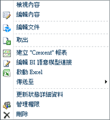
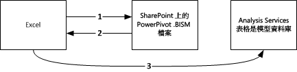

# Power Pivot BI 語意模型連接 (.bism)
[!INCLUDE[ssas-appliesto-sqlas](../../includes/ssas-appliesto-sqlas.md)]
  BI 語意模型連接 (.bism) 是可攜式連接，可將 Excel 或 Power View 報表連接到 Analysis Services 表格式模型資料庫或多維度模式下的 Analysis Services 執行個體。 如果您熟悉 Office 資料連接 (.odc) 檔案，您會注意到定義和使用 .bism 連接檔案之方式的相似性。  
  
 BI 語意模型連接是透過 SharePoint 來建立和存取。 建立 BI 語意模型連接會針對程式庫中的 BI 語意模型連接啟用命令。 快速啟動命令會開啟新的 Excel 活頁簿或是編輯連接檔案的選項。 如果已安裝 Reporting Services，您也會看到用來建立 [!INCLUDE[ssCrescent](../../includes/sscrescent-md.md)] 報表的命令。  
  
   
  
##   支援的資料庫  
 BI 語意模型連接指向表格式模型資料庫。 這個資料有三個來源：  
  
-   在表格式伺服器模式中於獨立 Analysis Services 執行個體上執行的表格式模型資料庫。 獨立 Analysis Services 執行個體的部署來自伺服陣列外部。 存取伺服陣列外部的資料來源需要額外的權限，您可以在這個主題中閱讀詳細資訊：＜ [建立與表格式模型資料庫的 BI 語意模型連接](../../analysis-services/power-pivot-sharepoint/create-a-bi-semantic-model-connection-to-a-tabular-model-database.md)＞。  
  
-   [!INCLUDE[ssGemini](../../includes/ssgemini-md.md)] 活頁簿。 Excel 活頁簿內部的內嵌 [!INCLUDE[ssGemini](../../includes/ssgemini-md.md)] 資料庫相當於在獨立 Analysis Services 表格式模式伺服器上執行的表格式模型資料庫。 如果您已經使用 [!INCLUDE[ssGemini](../../includes/ssgemini-md.md)] for Excel 和 [!INCLUDE[ssGemini](../../includes/ssgemini-md.md)] for SharePoint，可以在 SharePoint 文件庫中定義指向 [!INCLUDE[ssGemini](../../includes/ssgemini-md.md)] 活頁簿的 BI 語意模型連接，並使用現有的 [!INCLUDE[ssCrescent](../../includes/sscrescent-md.md)] 資料建立 [!INCLUDE[ssGemini](../../includes/ssgemini-md.md)] 報表。  您可以使用在 SQL Server 2008 R2 或 [!INCLUDE[ssSQL11](../../includes/sssql11-md.md)] 版本的 [!INCLUDE[ssGemini](../../includes/ssgemini-md.md)] for Excel 中建立的活頁簿。  
  
-   Analysis Services 執行個體上的多維度資料模型。  
  
 如需資料來源的比較，請參閱社群內容： [Understanding the SQL Server 2012 BI Semantic Model (BISM)](http://www.mssqltips.com/sqlservertip/2818/understanding-the-sql-server-2012-bi-semantic-model-bism/)(了解 SQL Server 2012 BI 語意模型 (BISM)。  
  
## 了解 BI 語意連接的連接順序  
 本節說明各種用戶端應用程式 (例如 Excel 桌面應用程式或 SharePoint 上的 Power View 報表用戶端) 和 SharePoint 伺服器陣列內部或外部表格式模型資料庫之間的連接行為。  
  
 表格式模型資料庫的所有連接都是使用要求資料之使用者的認證來建立。 不過，根據連接是伺服器陣列內部連接、單躍點或雙躍點連接，以及 Kerberos 是否啟用，連接機制將會有所不同。 如需 SharePoint 與後端資料來源之間驗證連接的詳細資訊，請參閱 [雙躍點驗證：NTLM 失敗與 Kerberos 成功的原因](http://go.microsoft.com/fwlink/?LinkId=237137)。  
  
 **從 Excel 連接到網路上的表格式資料**  
  
 當 Excel 使用者指定 BI 語意模型連接做為資料來源時，.bism 檔案內部的連接資訊會下載至用戶端應用程式，然後用戶端應用程式會將它自己的直接要求發出至 Analysis Services 上的表格式模型資料庫。 若要存取 .bism 連接，Excel 使用者必須是具有 .bism 連接檔案讀取權限的 SharePoint 使用者。 下載連接資訊之後，所有後續連接都會略過 SharePoint，直接從 Excel 流向後端表格式模型資料庫。  
  
 下圖顯示此連接順序。 一開始是 .bism 連接的要求，接著將連接資訊下載至用戶端，最後是資料庫的單躍點連接。 連接是使用具有 Analysis Services 資料庫讀取權限之 Excel 使用者的 Windows 認證來建立。 它是單躍點，因此不需要 Kerberos，即使啟用此設定也一樣。  
  
   
  
 **從 Power View 連接到網路上的表格式資料**  
  
 當 SharePoint 使用者按一下文件庫中的 BI 語意連接時，Power View (如果已安裝) 會立即啟動並開啟表格式模型資料庫的連接。  
  
 Power View 和表格式模型資料庫之間的連接依循雙躍點驗證順序，其中使用者識別會從用戶端流向 SharePoint，然後再從 SharePoint 流向伺服器陣列外部執行的後端 Analysis Services 表格式模型資料庫。 處理連接要求的 ADOMD.NET 用戶端程式庫在初次嘗試時一定會嘗試 Kerberos。 如果設定 Kerberos，表格式模型資料庫的連接上會模擬使用者識別，而且連接會成功。  
  
 如果未設定 Kerberos，而且要求失敗，Reporting Services 會進行第二次嘗試。 在這種情況下，用戶端程式庫會使用 Reporting Services 服務識別和 NTLM 驗證連接到 Analysis Services。 Power View 使用者的識別是透過使用 **effectiveusername** 參數的連接字串來傳遞。  
  
 僅 Analysis Services 執行個體的系統管理員角色成員有權使用 **effectiveusername** 參數建立連接以及模擬伺服器執行個體上的另一個使用者。 因此，Reporting Services 共用服務的執行帳戶必須有 Analysis Services 執行個體的管理權限。  [建立與表格式模型資料庫的 BI 語意模型連接](../../analysis-services/power-pivot-sharepoint/create-a-bi-semantic-model-connection-to-a-tabular-model-database.md)主題中提供有關授與管理權限給服務帳戶的指示。  
  
 下圖顯示每個連接都使用相同 Windows 使用者識別的連接順序。 最後一個 Analysis Services 連接上，連接是透過 Reporting Services 服務應用程式識別，使用 **effectiveusername**傳遞 Windows 使用者識別來建立。  
  
   
  
 **從 Power View 連接到 SharePoint 中的 [!INCLUDE[ssGemini](../../includes/ssgemini-md.md)] 資料**  
  
 當 SharePoint 使用者按一下 BI 語意連接，而解析為相同伺服器陣列中的 [!INCLUDE[ssGemini](../../includes/ssgemini-md.md)] 活頁簿時，該連接會在 SharePoint 環境的內容中發生。 [!INCLUDE[ssGemini](../../includes/ssgemini-md.md)] 服務應用程式會處理連接要求，將它轉送到同一部電腦上的 Analysis Services 執行個體。 Analysis Services 執行個體會從活頁簿擷取並載入 [!INCLUDE[ssGemini](../../includes/ssgemini-md.md)] 資料。 所有後續連接都是由伺服器陣列中的 [!INCLUDE[ssGemini](../../includes/ssgemini-md.md)] 服務應用程式管理。  
  
 在這種情況下，所有連接都是在相同伺服器陣列中發生，因此不需要 Kerberos 或受條件約束的委派。  
  
##   相關工作  
 [將 BI 語意模型連接內容類型加入至文件庫 &#40;Power Pivot for SharePoint&#41;](../../analysis-services/power-pivot-sharepoint/add-bi-semantic-model-connection-content-type-to-library.md)  
  
 [建立與 Power Pivot 活頁簿的 BI 語意模型連接](../../analysis-services/power-pivot-sharepoint/create-a-bi-semantic-model-connection-to-a-power-pivot-workbook.md)  
  
 [C建立與表格式模型資料庫的 BI 語意模型連接](../../analysis-services/power-pivot-sharepoint/create-a-bi-semantic-model-connection-to-a-tabular-model-database.md)  
  
 [在 Excel 或 Reporting Services 使用 BI 語意模型連接](../../analysis-services/power-pivot-sharepoint/use-a-bi-semantic-model-connection-in-excel-or-reporting-services.md)  
  
## 另請參閱  
 [判斷 Analysis Services 執行個體的伺服器模式](../../analysis-services/instances/determine-the-server-mode-of-an-analysis-services-instance.md)   
 [連接到 Analysis Services](../../analysis-services/instances/connect-to-analysis-services.md)  
  
  
