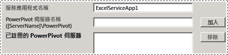
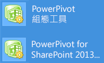
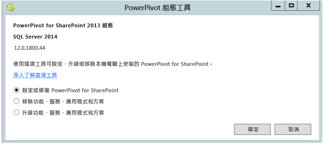

# Power Pivot 組態工具
[!INCLUDE[ssas-appliesto-sqlas](../../includes/ssas-appliesto-sqlas.md)]
  使用 [!INCLUDE[ssGemini](../../includes/ssgemini-md.md)] 組態工具設定、修復或移除 [!INCLUDE[ssCurrent](../../includes/sscurrent-md.md)] [!INCLUDE[ssGeminiShort](../../includes/ssgeminishort-md.md)]。  
  
 [ [!INCLUDE[ssCurrent](../../includes/sscurrent-md.md)] 安裝精靈] 不會為 SharePoint 安裝 [!INCLUDE[ssGemini](../../includes/ssgemini-md.md)] 組態工具。 組態工具在 [!INCLUDE[ssCurrent](../../includes/sscurrent-md.md)]未來的版本中將可供下載。  
  
 本主題描述 [!INCLUDE[ssGemini](../../includes/ssgemini-md.md)] 工具的一般使用方式以及兩者之間的差異。  
  
 **[!INCLUDE[applies](../../includes/applies-md.md)]**  SharePoint 2013  
  
 **本主題內容：**  
  
-   [使用組態工具的需求](#bkmk_requirements)  
  
-   [兩種版本的組態工具](#bkmk_twoversions)  
  
-   [使用 Power Pivot 組態工具的概觀](#bkmk_overview)  
  
-   [啟動其中一種 Power Pivot 組態工具](#bmkm_start_tool)  
  
##   使用組態工具的需求  
  
-   您必須是伺服陣列管理員。  
  
-   您必須是 Analysis Services 執行個體的伺服器管理員 (僅限 SharePoint 2010)。  
  
-   您必須是伺服器陣列的組態資料庫上的 db_owner。  
  
-   使用組態工具沒有 TCP/IP 通訊埠要求，因此，您應該不必設定防火牆來容納組態工具。 組態工具預期 Web 應用程式和共用服務為 SharePoint 平台的一部分。 您可能必須為 [!INCLUDE[ssASnoversion](../../includes/ssasnoversion-md.md)] 伺服器設定防火牆。 如需詳細資訊，請參閱 [設定 Windows 防火牆以允許 Analysis Services 存取](../../analysis-services/instances/configure-the-windows-firewall-to-allow-analysis-services-access.md)。  
  
##   兩種版本的組態工具  
 [!INCLUDE[ssCurrent](../../includes/sscurrent-md.md)] 安裝精靈會安裝適用於 SharePoint 2010 的 [!INCLUDE[ssGemini](../../includes/ssgemini-md.md)] 組態工具，以及適用於 SharePoint 2013 的 [!INCLUDE[ssGemini](../../includes/ssgemini-md.md)] 組態工具。  
  
 這些工具僅能搭配 [!INCLUDE[ssCurrent](../../includes/sscurrent-md.md)] 的 [!INCLUDE[ssSQL11SP1](../../includes/sssql11sp1-md.md)] 或 [!INCLUDE[ssGeminiShort](../../includes/ssgeminishort-md.md)]執行個體使用。 請勿將它們用於 [!INCLUDE[ssKilimanjaro](../../includes/sskilimanjaro-md.md)] 安裝。  
  
|名稱|支援的 SharePoint 版本|詳細組態|  
|----------|-------------------------------------|----------------------------|  
|[!INCLUDE[ssGemini](../../includes/ssgemini-md.md)] for SharePoint 2013 組態|SharePoint 2013|[設定或修復 Power Pivot for SharePoint 2013 &#40;Power Pivot 組態工具&#41;](../../analysis-services/power-pivot-sharepoint/configure-or-repair-power-pivot-for-sharepoint-2013.md)|  
|[!INCLUDE[ssGemini](../../includes/ssgemini-md.md)] 組態工具|SharePoint 2010 含 SharePoint 2010|[設定或修復 Power Pivot for SharePoint 2010 (Power Pivot 組態工具)](http://msdn.microsoft.com/en-us/d61f49c5-efaa-4455-98f2-8c293fa50046)|  
  
###   兩種組態工具之間的差異  
 這兩個版本的組態工具很類似，但是兩者執行的組態設定步驟有些差異。 這些差異是因為 SharePoint 2010 和 SharePoint 2013 之間的變更，以及 SQL Server 2012 SP1 版的 [!INCLUDE[ssGemini](../../includes/ssgemini-md.md)] for SharePoint 與舊版 [!INCLUDE[ssGemini](../../includes/ssgemini-md.md)] for SharePoint 之間的架構差異而產生。  
  
 下表描述 [[!INCLUDE[ssGemini](../../includes/ssgemini-md.md)] for SharePoint 2013 組態] 工具的新功能和變更的功能。 表中還會描述 [[!INCLUDE[ssGemini](../../includes/ssgemini-md.md)] 組態工具] 中 [[!INCLUDE[ssGemini](../../includes/ssgemini-md.md)] for SharePoint 2013 組態工具] 所沒有的功能。 資料表中資料列的順序與組態工具中索引標籤的順序相同。  
  
|[!INCLUDE[ssGemini](../../includes/ssgemini-md.md)] for SharePoint 2013 組態|[!INCLUDE[ssGemini](../../includes/ssgemini-md.md)] 組態工具|  
|--------------------------------------------------------------|-----------------------------------------------|  
|主頁面有 [適用於 Excel Services 的 [!INCLUDE[ssGemini](../../includes/ssgemini-md.md)] 伺服器] 這個新選項。 這個選項支援採用在 SharePoint 伺服器陣列外部執行之 [!INCLUDE[ssASnoversion](../../includes/ssasnoversion-md.md)] 的新架構。 您設定 Excel Services 使用以 SharePoint 模式執行的一部或多部 [!INCLUDE[ssASnoversion](../../includes/ssasnoversion-md.md)] 伺服器。   ||  
||2010 工具包括 [在本機伺服器上註冊 SQL Server Analysis Services ([!INCLUDE[ssGemini](../../includes/ssgemini-md.md)])] 頁面，用來設定 [!INCLUDE[ssASnoversion](../../includes/ssasnoversion-md.md)] 的本機執行個體。 這個頁面不是 2013 工具的一部分，因為沒有 [!INCLUDE[ssASnoversion](../../includes/ssasnoversion-md.md)]的本機執行個體。   |  
||[建立 [!INCLUDE[ssGemini](../../includes/ssgemini-md.md)] 服務應用程式] 頁面多了 [升級活頁簿以啟用資料重新整理] 這個額外選項。 這個選項在 2013 工具中無法使用。   |  
|2013 工具有 [設定 [!INCLUDE[ssGemini](../../includes/ssgemini-md.md)] 伺服器] 這個新頁面。 這個頁面支援在 SharePoint 伺服器陣列外部執行之 [!INCLUDE[ssASnoversion](../../includes/ssasnoversion-md.md)] 的新架構。 根據預設，在主頁面的文字方塊 [適用於 Excel Services 的 [!INCLUDE[ssGemini](../../includes/ssgemini-md.md)] 伺服器] 中輸入的伺服器名稱，也會在 [設定 [!INCLUDE[ssGemini](../../includes/ssgemini-md.md)] 伺服器] 上列出。   ||  
|2013 工具有一個新頁面 [將 [!INCLUDE[ssGemini](../../includes/ssgemini-md.md)] 增益集註冊為 Excel Services Usage Tracker]。 SharePoint 2010 Excel Services 不會追蹤 [!INCLUDE[ssGemini](../../includes/ssgemini-md.md)] 的使用量資料。||  
||2010 工具包括 [加入 MSOLAP.5 做為受信任的提供者] 這個頁面，可用來註冊 MSOLAP，讓 SharePoint 2010 中的 Excel Services 可以載入 [!INCLUDE[ssGemini](../../includes/ssgemini-md.md)] 模型。 這個頁面不是 2013 工具的一部分。 SharePoint 2013 Excel Services 不會使用 MSOLAP 提供者來載入模型。|  
  
##   使用 Power Pivot 組態工具的概觀  
 當您啟動其中一種 [!INCLUDE[ssGemini](../../includes/ssgemini-md.md)] 組態工具時，該工具會評估現有的安裝以判斷適用的作業。 在新的安裝上，只有組態工作可以使用。 設定伺服器後，移除工作就會出現。 如果您從 [!INCLUDE[ssKilimanjaro](../../includes/sskilimanjaro-md.md)] 執行個體開始，升級也會在可用工作的清單中啟用。  
  
 如果您不熟悉管理中心或 Windows PowerShell，可以執行此組態工具當做替代方案，以完成 [!INCLUDE[ssGeminiShort](../../includes/ssgeminishort-md.md)] 安裝。  
  
 此外，此工具可以偵測到是否已設定伺服器陣列或缺少必要的功能。 如果已安裝 SharePoint 程式檔案但未設定伺服器陣列，此工具會提供設定伺服器陣列與 [!INCLUDE[ssGeminiShort](../../includes/ssgeminishort-md.md)] 安裝的動作。  
  
 您可以檢閱 [指令碼] 索引標籤，以學習並了解如何使用 Windows PowerShell 設定 [!INCLUDE[ssGemini](../../includes/ssgemini-md.md)] 和 SharePoint。 如需詳細資訊，請參閱下列內容：  
  
-   [使用 Windows PowerShell 的 Power Pivot 組態](../../analysis-services/power-pivot-sharepoint/power-pivot-configuration-using-windows-powershell.md)  
  
-   [Power Pivot for SharePoint 的 PowerShell 參考](../../analysis-services/powershell/powershell-reference-for-power-pivot-for-sharepoint.md)  
  
> [!NOTE]  
>  此工具不會設定 Reporting Services。 如果您要將 Reporting Services 加入至 SharePoint 環境，則需要另外安裝及設定 Reporting Services。 如需詳細資訊，請參閱下列內容：  
>   
>  -   [以 SharePoint 模式安裝第一部報表伺服器](../../reporting-services/install-windows/install-the-first-report-server-in-sharepoint-mode.md)。  
> -   [Install Reporting Services SharePoint Mode for SharePoint 2010](http://msdn.microsoft.com/en-us/47efa72e-1735-4387-8485-f8994fb08c8c)。  
  
##   啟動其中一種 Power Pivot 組態工具  
  
1.  在 [開始]  畫面上輸入 **powerpivot**  
  
     在 [開始] 畫面上輸入 **powerpivot**，或在 [開始] 功能表上，依序按一下 [所有程式]、[[!INCLUDE[ssCurrentUI](../../includes/sscurrentui-md.md)]]、[組態工具]，然後按一下下列其中一個選項：  
  
    -   **[!INCLUDE[ssGemini](../../includes/ssgemini-md.md)] 組態工具**。  
  
    -   **OR**  
  
    -   **[!INCLUDE[ssGemini](../../includes/ssgemini-md.md)] for SharePoint 2013 組態**。  
  
       
  
     **注意** ：只有在本機伺服器上安裝了 [!INCLUDE[ssGeminiShort](../../includes/ssgeminishort-md.md)] 時，才可以使用這些工具。  
  
2.  在啟動時，組態工具會檢查您安裝的狀態，並提供適用於您安裝的工作。  
  
3.  根據目前的安裝狀態而定，可以執行下列其中一項或多項工作：  
  
    1.  按一下 [設定或修復 [!INCLUDE[ssGemini](../../includes/ssgemini-md.md)] for SharePoint] 來完成安裝後工作或修復安裝。  
  
    2.  按一下 **[移除功能、服務、應用程式和方案]** ，從伺服器陣列移除功能和方案。  
  
    3.  按一下 **[升級功能、服務、應用程式和方案]** 以升級使用舊版 [!INCLUDE[ssGeminiShort](../../includes/ssgeminishort-md.md)]安裝的功能和方案。  
  
     例如，影像顯示 [適用於 SharePoint 2013 的 [!INCLUDE[ssGemini](../../includes/ssgemini-md.md)] 組態工具] 的啟動頁面。  
  
       
  
 每個工作都是由處理伺服器組態特定層面的個別動作所組成。 例如，組態工作包含的動作有部署解決方案、建立 [!INCLUDE[ssGemini](../../includes/ssgemini-md.md)] 服務應用程式、啟動功能，以及設定資料重新整理。 動作清單將隨著您安裝的目前狀態而有所不同。 如果不需要某個動作，此工具會從工作清單中排除它。  
  
 當您按一下 [執行]，此工具就會以批次模式處理所有動作。 雖然每個動作都是當做個別項目出現在工作清單中，但是包含在工作中的所有動作都會一起處理。 只有通過驗證檢查的動作會進行處理。 您可能需要加入或變更某些輸入值，才能通過驗證檢查。  
  
## 相關內容  
 [升級 Power Pivot for SharePoint](../../database-engine/install-windows/upgrade-power-pivot-for-sharepoint.md) ：描述已經在伺服器陣列中升級現有安裝的工作流程。  
  
 [解除安裝 Power Pivot for SharePoint](../../sql-server/install/uninstall-power-pivot-for-sharepoint.md) ：描述從伺服器陣列移除 [!INCLUDE[ssGemini](../../includes/ssgemini-md.md)] for SharePoint 服務、方案和應用程式頁面的工作流程。  
  
 [使用 Windows PowerShell 的 Power Pivot 組態](../../analysis-services/power-pivot-sharepoint/power-pivot-configuration-using-windows-powershell.md)  
  
 [管理中心的 Power Pivot 伺服器管理和設定](../../analysis-services/power-pivot-sharepoint/power-pivot-server-administration-and-configuration-in-central-administration.md)  
  
  
