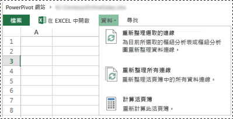
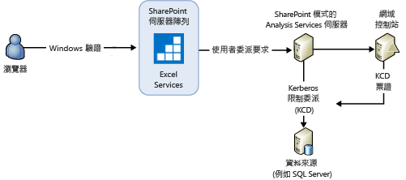
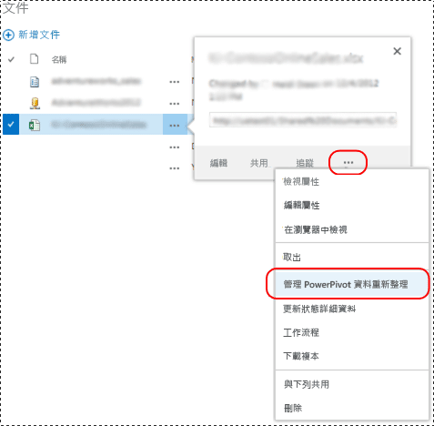
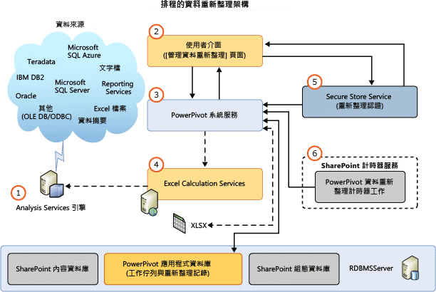
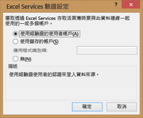

# SharePoint 2013 中的 PowerPivot 資料重新整理
[!INCLUDE[ssas-appliesto-sqlas](../../includes/ssas-appliesto-sqlas.md)]重新整理的設計[!INCLUDE[ssGemini](../../includes/ssgemini-md.md)]SharePoint 2013 中的資料模型會運用 Excel Services 做為主要元件，載入並重新整理資料模型的執行個體上[!INCLUDE[ssCurrent](../../includes/sscurrent-md.md)][!INCLUDE[ssASnoversion](../../includes/ssasnoversion-md.md)]以 SharePoint 模式執行。 [!INCLUDE[ssASnoversion](../../includes/ssasnoversion-md.md)] 伺服器會在 SharePoint 伺服器陣列外部執行。 SharePoint 2013 Excel Services 中的架構同時支援 **互動式資料重新整理** 和 **排定的資料重新整理**。  
  
 **[!INCLUDE[applies](../../includes/applies-md.md)]**  SharePoint 2013  
  
 **本主題內容：**  
  
-   [Interactive Data Refresh](#bkmk_interactive_refresh)  
  
-   [Windows 驗證與活頁簿資料連接以及互動式資料重新整理](#bkmk_windows_auth_interactive_data_refresh)  
  
-   [Scheduled Data Refresh](#bkmk_scheduled_refresh)  
  
-   [SharePoint 2013 中排程的資料重新整理架構](#bkmk_refresh_architecture)  
  
-   [其他驗證考量](#datarefresh_additional_authentication)  
  
-   [其他資訊](#bkmk_moreinformation)  
  
## 背景  
 SharePoint Server 2013 Excel Services 會管理 Excel 2013 活頁簿的資料重新整理，並且在以 SharePoint 模式執行的 [!INCLUDE[ssCurrent](../../includes/sscurrent-md.md)] [!INCLUDE[ssASnoversion](../../includes/ssasnoversion-md.md)] 伺服器上觸發資料模型處理。 若為 Excel 2010 活頁簿，Excel Services 也會管理活頁簿與資料模型的載入和儲存。 不過，Excel Services 會仰賴 [!INCLUDE[ssGemini](../../includes/ssgemini-md.md)] 系統服務，將處理命令傳送給資料模型。 下表將摘要說明根據活頁簿的版本傳送資料重新整理命令的元件。 假設的環境是 SharePoint 2013 伺服器陣列，並且設定為使用以 SharePoint 模式執行的 [!INCLUDE[ssCurrent](../../includes/sscurrent-md.md)] Analysis Server。  
  
||||  
|-|-|-|  
||Excel 2013 活頁簿|Excel 2010 活頁簿|  
|觸發資料重新整理|**互動式** ：驗證的使用者   **已排程** [!INCLUDE[ssGemini](../../includes/ssgemini-md.md)] 系統服務|[!INCLUDE[ssGemini](../../includes/ssgemini-md.md)] 系統服務|  
|從內容資料庫載入活頁簿|SharePoint 2013 Excel Services|SharePoint 2013 Excel Services|  
|在 Analysis Services 執行個體上載入資料模型|SharePoint 2013 Excel Services|SharePoint 2013 Excel Services|  
|將處理命令傳送至 Analysis Services 執行個體|SharePoint 2013 Excel Services|[!INCLUDE[ssGemini](../../includes/ssgemini-md.md)] 系統服務|  
|更新活頁簿資料|SharePoint 2013 Excel Services|SharePoint 2013 Excel Services|  
|將活頁簿和資料模型儲存至內容資料庫|**互動式** ：無   **已排程** ：SharePoint 2013 Excel Services|SharePoint 2013 Excel Services|  
  
 下表將摘要說明 SharePoint 2013 伺服器陣列 (設定為使用以 SharePoint 模式執行的 [!INCLUDE[ssCurrent](../../includes/sscurrent-md.md)] Analysis Server) 中支援的重新整理功能：  
  
|活頁簿建立於|排定的資料重新整理|互動式重新整理|  
|-------------------------|----------------------------|-------------------------|  
|2008 R2 [!INCLUDE[ssGemini](../../includes/ssgemini-md.md)] for Excel|不支援。 升級活頁簿 **(\*)**|不支援。 升級活頁簿 **(\*)**|  
|2012 [!INCLUDE[ssGemini](../../includes/ssgemini-md.md)] for Excel|支援|不支援。 升級活頁簿 **(\*)**|  
|Excel 2013|支援|支援|  
  
 **(\*)** 如需活頁簿升級的詳細資訊，請參閱[升級活頁簿和排程的資料重新整理 &#40;SharePoint 2013&#41;](../../analysis-services/instances/install-windows/upgrade-workbooks-and-scheduled-data-refresh-sharepoint-2013.md)。  
  
##   Interactive Data Refresh  
 SharePoint Server 2013 Excel Services 中的互動式或手動資料重新整理，可以利用原始資料來源中的資料，以重新整理資料模型。 在您透過註冊以 SharePoint 模式執行的 [!INCLUDE[ssASnoversion](../../includes/ssasnoversion-md.md)] 伺服器，設定 Excel Services 應用程式之後，就可以使用互動式資料重新整理。 如需詳細資訊，請參閱 [Manage Excel Services data model settings (SharePoint Server 2013)](http://technet.microsoft.com/library/jj219780.aspx) (管理 Excel Services 資料模型設定 (SharePoint Server 2013)) (http://technet.microsoft.com/library/jj219780.aspx)。  
  
> [!NOTE]  
>  互動式資料重新整理僅適用於在 Excel 2013 中建立的活頁簿。 如果您嘗試重新整理 Excel 2010 活頁簿，Excel Services 就會顯示類似以下的錯誤訊息：「[!INCLUDE[ssGemini](../../includes/ssgemini-md.md)] 作業失敗: 此活頁簿是以舊版 Excel 與 [!INCLUDE[ssGemini](../../includes/ssgemini-md.md)] 建立而成，在檔案升級之前無法重新整理」。 如需升級活頁簿的詳細資訊，請參閱[升級活頁簿和排程的資料重新整理 &#40;SharePoint 2013&#41;](../../analysis-services/instances/install-windows/upgrade-workbooks-and-scheduled-data-refresh-sharepoint-2013.md)。  
  
 **互動式重新整理關鍵重點：**  
  
-   互動式資料重新整理只會重新整理目前使用者工作階段中的資料。 資料不會自動儲存回 SharePoint 內容資料庫中的活頁簿項目。  
  
-   **認證** ：互動式資料重新整理可以使用目前登入之使用者的識別作為認證或預存認證來連接到資料來源。 使用的認證會取決於針對外部資料來源之活頁簿連接所定義的 Excel Services 驗證設定。  
  
-   **支援的活頁簿**  ：在 Excel 2013 中建立的活頁簿。  
  
 **若要重新整理資料：**  
  
-   請參閱這些步驟後面的圖例。  
  
1.  在 SharePoint 文件庫中，使用瀏覽器來開啟 [!INCLUDE[ssGemini](../../includes/ssgemini-md.md)] 活頁簿。  
  
2.  在瀏覽器視窗中，按一下 **[資料]** 功能表，然後按一下 **[重新整理選取的連線]** 或 **[重新整理所有連線]**。  
  
3.  Excel Services 就會載入 [!INCLUDE[ssGemini](../../includes/ssgemini-md.md)] 資料庫、加以處理，然後進行查詢以重新整理 Excel 活頁簿快取。  
  
4.  **注意** ：更新的活頁簿不會自動儲存回文件庫。  
  
   
  
###   Windows 驗證與活頁簿資料連接以及互動式資料重新整理  
 Excel Services 會將處理命令傳送至 Analysis Services 伺服器，以便指示伺服器模擬使用者帳戶。 為了取得足以執行使用者模擬-委派處理的系統權限，Analysis Services 服務帳戶需要本機伺服器的 [當成作業系統的一部分] 權限。 Analysis Services 伺服器也必須能夠將使用者的認證委派給資料來源。 查詢結果會傳送到 Excel Services。  
  
 一般使用者經驗：當客戶在包含 [!INCLUDE[ssGemini](../../includes/ssgemini-md.md)] 模型的 Excel 2013 活頁簿中選取 [重新整理所有連線] 時，他們會看見類似以下的錯誤訊息：  
  
-   **外部資料重新整理失敗** ：在活頁簿中處理資料模型時發生錯誤。 請再試一次。 無法重新整理此活頁簿中的一個或多個資料連線。  
  
 根據您所使用的資料提供者，您會在 ULS 記錄中看見類似以下的訊息。  
  
 **使用 SQL Native Client：**  
  
-   無法建立外部連線或執行查詢。 提供者訊息：參考至識別碼 '20102481-39c8-4d21-bf63-68f583ad22bb' 的非正規物件 'DataSource' 已指定，但尚未使用。  OLE DB 或 ODBC 錯誤：建立 SQL Server 的連接時，發生網路相關或執行個體特定錯誤。 找不到伺服器或是無法存取。 檢查執行個體名稱是否正確以及 SQL Server 執行個體是否設定為允許遠端連接。 如需詳細資訊，請參閱《SQL Server 線上叢書》。; 08001; SSL 提供者：要求的安全性封裝不存在 ; 08001; 用戶端無法建立連線 ; 08001; 用戶端不支援加密。; 08001。  , 連線名稱：ThisWorkbookDataModel，活頁簿：book1.xlsx。  
  
 **使用 Microsoft OLE DB Provider for SQL Server：**  
  
-   無法建立外部連線或執行查詢。 提供者訊息: 參考至識別碼 '6e711bfa-b62f-4879-a177-c5dd61d9c242' 的非正規物件 'DataSource' 已指定，但尚未使用。 OLE DB 或 ODBC 錯誤。 , 連線名稱: ThisWorkbookDataModel, 活頁簿: OLEDB Provider.xlsx。  
  
 **使用 .NET Framework Data Provider for SQL Server：**  
  
-   無法建立外部連線或執行查詢。 提供者訊息：參考至識別碼 'f5fb916c-3eac-4d07-a542-531524c0d44a' 的非正規物件 'DataSource' 已指定，但尚未使用。  高層級關聯式引擎有錯誤。 使用 Managed IDbConnection 介面時，發生下列例外狀況: 無法載入檔案或組件 'System.Transactions, Version=4.0.0.0, Culture=neutral, PublicKeyToken=b77a5c561934e089' 或是它的其中一個相依性。 未提供所要求的模擬層，或所提供的模擬層不正確。 (來自 HRESULT 的例外狀況：0x80070542)。  , 連線名稱：ThisWorkbookDataModel，活頁簿：NETProvider.xlsx。  
  
 **組態設定步驟的摘要** ：若要在本機伺服器上設定 **[當成作業系統的一部分]** 權限：  
  
1.  在以 SharePoint 模式執行的 Analysis Services 伺服器上，將 Analysis Services 服務帳戶加入至 [當成作業系統的一部分] 權限：  
  
    1.  執行 “`secpol.msc`”  
  
    2.  依序按一下 **[本機安全性原則]**、 **[本機原則]**和 **[使用者權限指派]**。  
  
    3.  加入服務帳戶。  
  
2.  重新啟動 Excel Services 並且讓 Analysis Services 伺服器重新開機。  
  
3.  不需要從 Excel Services 服務帳戶或對 Windows Token 服務的宣告 (C2WTS) 委派至 Analysis Services 執行個體。 因此，從 Excel Services 或 C2WTS 到 [!INCLUDE[ssGemini](../../includes/ssgemini-md.md)] AS 服務之 KCD 的任何組態都是不必要的。 若後端資料來源與 [!INCLUDE[ssASnoversion](../../includes/ssasnoversion-md.md)] 執行個體位於相同的伺服器上，即不需要 Kerberos 限制委派。 但 [!INCLUDE[ssASnoversion](../../includes/ssasnoversion-md.md)] 服務帳戶需要「當成作業系統的一部分」權限。  
  
   
  
 如需詳細資訊，請參閱 [當成作業系統的一部分](http://technet.microsoft.com/library/cc784323\(WS.10\).aspx) (http://technet.microsoft.com/library/cc784323(WS.10).aspx)。  
  
##   Scheduled Data Refresh  
 **排程的資料重新整理關鍵重點：**  
  
-   需要部署 [!INCLUDE[ssGemini](../../includes/ssgemini-md.md)] for SharePoint 增益集。 如需詳細資訊，請參閱 [安裝或解除安裝 Power Pivot for SharePoint 增益集 &#40;SharePoint 2013&#41;](../../analysis-services/instances/install-windows/install-or-uninstall-the-power-pivot-for-sharepoint-add-in-sharepoint-2013.md)。  
  
-   使用者會設定活頁簿的重新整理排程。 在排程的時間， [!INCLUDE[ssGemini](../../includes/ssgemini-md.md)] 系統服務會傳送要求給 Excel Services，以便：  
  
    -   載入並處理 [!INCLUDE[ssGemini](../../includes/ssgemini-md.md)] 資料庫。  
  
    -   重新整理活頁簿。  
  
    -   將活頁簿儲存回內容資料庫。  
  
-   **認證** ：使用預存認證。 不使用目前使用者的識別。  
  
-   **支援的活頁簿** ：使用適用於 Excel 2010 的 [!INCLUDE[ssSQL11](../../includes/sssql11-md.md)][!INCLUDE[ssGemini](../../includes/ssgemini-md.md)] 增益集或 Excel 2013 所建立的活頁簿。 不支援在 Excel 2010 中使用 [!INCLUDE[ssKilimanjaro](../../includes/sskilimanjaro-md.md)][!INCLUDE[ssGemini](../../includes/ssgemini-md.md)] 增益集所建立的活頁簿。 請至少將活頁簿升級為 [!INCLUDE[ssSQL11](../../includes/sssql11-md.md)][!INCLUDE[ssGemini](../../includes/ssgemini-md.md)] 格式。 如需活頁簿升級的詳細資訊，請參閱[升級活頁簿和排程的資料重新整理 &#40;SharePoint 2013&#41;](../../analysis-services/instances/install-windows/upgrade-workbooks-and-scheduled-data-refresh-sharepoint-2013.md)。  
  
 若要顯示 **[管理資料重新整理]** 頁面：  
  
-   請參閱這些步驟後面的圖例。  
  
1.  在 SharePoint 文件庫中，針對 [!INCLUDE[ssGemini](../../includes/ssgemini-md.md)] 活頁簿按一下 [開啟] 功能表 (**...**)。  
  
2.  按一下第二個 [開啟] 功能表，然後按一下 [管理 [!INCLUDE[ssGemini](../../includes/ssgemini-md.md)] 資料重新整理]。  
  
3.  在 **[管理資料重新整理]** 頁面上，按一下 **[啟用]** ，然後設定重新整理排程。  
  
4.  在指定的時間， [!INCLUDE[ssGemini](../../includes/ssgemini-md.md)] 系統服務會傳送要求給 Excel Services，以便：  
  
    -   載入並處理 [!INCLUDE[ssGemini](../../includes/ssgemini-md.md)] 資料模型。  
  
    -   重新整理活頁簿。  
  
    -   將活頁簿儲存回內容資料庫。  
  
   
  
> [!TIP]  
>  如需從 SharePoint Online 重新整理活頁簿的資訊，請參閱 [Refreshing Excel workbooks with embedded Power Pivot models from SharePoint Online](http://technet.microsoft.com/library/jj992650.aspx) (從 SharePoint Online 重新整理內嵌 Power Pivot 模型的 Excel 活頁簿) (技術白皮書) (http://technet.microsoft.com/library/jj992650.aspx)。  
  
##   SharePoint 2013 中排程的資料重新整理架構  
 下圖摘要說明 SharePoint 2013 和 SQL Server 2012 SP1 中的資料重新整理架構。  
  
   
  
||描述||  
|-|-----------------|-|  
|**(1)**|Analysis Services 引擎|以 SharePoint 模式執行的 [!INCLUDE[ssCurrent](../../includes/sscurrent-md.md)][!INCLUDE[ssASnoversion](../../includes/ssasnoversion-md.md)] 伺服器上觸發資料模型處理。 此伺服器會在 SharePoint 伺服器陣列外部執行。|  
|**(2)**|使用者介面|使用者介面是由兩個頁面組成。 第一個頁面用於定義排程，而第二個頁面則用於檢視重新整理記錄。 這些頁面不會直接存取 [!INCLUDE[ssGemini](../../includes/ssgemini-md.md)] 服務應用程式資料庫，而是使用 [!INCLUDE[ssGemini](../../includes/ssgemini-md.md)] 系統服務來存取資料庫。|  
|**(3)**|[!INCLUDE[ssGemini](../../includes/ssgemini-md.md)] 系統服務|此服務是在您部署 [!INCLUDE[ssGemini](../../includes/ssgemini-md.md)] for SharePoint 增益集時安裝的。   此服務的用途如下：|  
|||此服務會裝載重新整理排程引擎，而這個引擎會呼叫 Excel Services API，針對 Excel 2013 活頁簿進行資料重新整理。 若為 Excel 2010 活頁簿，此服務就會直接執行資料模型處理，但是仍然仰賴 Excel Services 載入資料模型和更新活頁簿。|  
|||此服務會提供方法給使用者介面頁面等元件，以便與系統服務進行通訊。|  
|||管理將活頁簿當做資料來源存取的外部要求 (透過 [!INCLUDE[ssGemini](../../includes/ssgemini-md.md)] Web 服務收到)。|  
|||計時器工作和組態頁面的排程資料重新整理要求管理。 此服務會管理讀取服務應用程式資料庫內部和外部資料的要求，以及使用 Excel Services 觸發資料重新整理的要求。|  
|||使用量處理以及相關的計時器工作。|  
|**(4)**|Excel Calculation Services|負責載入資料模型。|  
|**(5)**|Secure Store Service|如果活頁簿的驗證設定設為 **[使用經驗證的使用者帳戶]** 或 **[無]**，就會使用 Secure Store 目標應用程式識別碼中儲存的認證進行資料重新整理。 如需詳細資訊，請參閱本主題中的＜ [其他驗證考量](#datarefresh_additional_authentication) ＞一節。|  
|**(6)**|[!INCLUDE[ssGemini](../../includes/ssgemini-md.md)] 資料重新整理計時器工作|指示 [!INCLUDE[ssGemini](../../includes/ssgemini-md.md)] 系統服務與 Excel Services 連接，以便重新整理資料模型。|  
  
 [!INCLUDE[ssASnoversion](../../includes/ssasnoversion-md.md)] 需要適當的資料提供者和用戶端程式庫，才能讓 SharePoint 模式的 [!INCLUDE[ssASnoversion](../../includes/ssasnoversion-md.md)] 伺服器存取資料來源。  
  
> [!NOTE]  
>  因為 [!INCLUDE[ssGemini](../../includes/ssgemini-md.md)] 系統服務不再載入或儲存 [!INCLUDE[ssGemini](../../includes/ssgemini-md.md)] 模型，所以應用程式伺服器上快取模型的大部分設定都不會套用至 SharePoint 2013 伺服器陣列。  
  
## 資料重新整理記錄資料  
 **使用量資料** ：您可以在 [!INCLUDE[ssGemini](../../includes/ssgemini-md.md)] 管理儀表板中檢視資料重新整理使用量資料。 若要查看使用量資料：  
  
1.  在 SharePoint 管理中心的 [一般應用程式設定] 群組中，按一下 [[!INCLUDE[ssGemini](../../includes/ssgemini-md.md)] 管理儀表板]。  
  
2.  在儀表板底部，查看 **[資料重新整理 - 最近的活動]** 和 **[資料重新整理 - 最近的失敗]**。  
  
3.  如需有關使用量資料以及如何啟用的詳細資訊，請參閱＜ [Power Pivot Management Dashboard and Usage Data](../../analysis-services/power-pivot-sharepoint/power-pivot-management-dashboard-and-usage-data.md)＞。  
  
 **診斷記錄資料** ：您可以檢視與資料重新整理有關的 SharePoint 診斷記錄資料。 首先，請在 SharePoint 管理中心的 [監視] 頁面中，確認 [[!INCLUDE[ssGemini](../../includes/ssgemini-md.md)] 服務] 的診斷記錄組態。 您可能必須提高要記錄之「最低緊急事件」的記錄層級。 例如，請暫時將此值設定為 **[詳細資訊]** ，然後重新執行資料重新整理作業。  
  
 記錄項目就會包含：  
  
-   [[!INCLUDE[ssGemini](../../includes/ssgemini-md.md)] 服務] 的 [區域]。  
  
-   **[資料重新整理]**的類別。  
  
 檢閱 **[設定診斷記錄]**。 如需詳細資訊，請參閱[設定及檢視 SharePoint 記錄檔與診斷記錄 &#40;Power Pivot for SharePoint&#41;](../../analysis-services/power-pivot-sharepoint/configure-and-view-sharepoint-and-diagnostic-logging.md)。
  
##   其他驗證考量  
 在 Excel 2013 中， **[Excel Services 驗證設定]** 對話方塊的設定會決定 Excel Services 和 [!INCLUDE[ssASnoversion](../../includes/ssasnoversion-md.md)] 用於資料重新整理的 Windows 識別。  
  
-   **使用經驗證的使用者帳戶**：Excel Services 會使用目前登入之使用者的識別執行資料重新整理。  
  
-   **使用儲存的帳戶**：採用 SharePoint Secure Store Service 應用程式識別碼，讓 Excel Services 用來擷取進行資料重新整理驗證的使用者名稱和密碼。  
  
-   **無**：使用 Excel Services 的 **[自動服務帳戶]** 。 此服務帳戶與 Secure Store Proxy 相關聯。 您可以在 **[Excel Services 應用程式設定]** 頁面的 **[外部資料]** 區段中進行設定。  
  
 若要開啟驗證設定對話方塊：  
  
1.  在 Excel 2013 中，按一下 **[資料]** 索引標籤。  
  
2.  在功能區中，按一下 **[連線]** 。  
  
3.  在 **[活頁簿連線]**對話方塊中，選取連線，然後按一下 **[內容]**。  
  
4.  在 **[連線內容]** 對話方塊中，按一下 **[定義]**，然後按一下 **[驗證設定]** 按鈕，可選取色彩。  
  
   
  
 如需資料重新整理驗證以及認證使用方式的詳細資訊，請參閱部落格文章： [Refreshing PowerPivot Data in SharePoint 2013](http://blogs.msdn.com/b/analysisservices/archive/2012/12/21/refreshing-powerpivot-data-in-sharepoint-2013.aspx)(在 SharePoint 2013 中重新整理 PowerPivot 資料)。  
  
##   其他資訊  
 [Troubleshooting PowerPivot Data Refresh](http://social.technet.microsoft.com/wiki/contents/articles/3870.troubleshooting-powerpivot-data-refresh.aspx)(PowerPivot 資料重新整理疑難排解)。  
  
 [SharePoint 2013 中的 excel Services](http://msdn.microsoft.com/library/sharepoint/jj164076\(v=office.15\)) (http://msdn.microsoft.com/library/sharepoint/jj164076 (v = office.15)。  
  
## 請參閱  
 [以 Power Pivot 模式安裝 Analysis Services](../../analysis-services/instances/install-windows/install-analysis-services-in-power-pivot-mode.md)  
  
  
