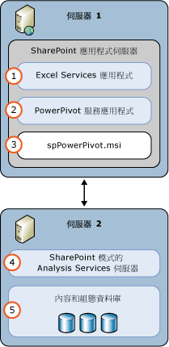

# Power Pivot for SharePoint (SSAS)
  [!INCLUDE[ssASnoversion](../../includes/ssasnoversion-md.md)] 模式中的 [!INCLUDE[ssGemini](../../includes/ssgemini-md.md)] 伺服器提供將 [!INCLUDE[ssGemini](../../includes/ssgemini-md.md)] 資料裝載於 SharePoint 伺服器陣列的功能。 [!INCLUDE[ssGemini](../../includes/ssgemini-md.md)] 資料是您使用下列其中一個項目建立的分析資料模型：  
  
-   [!INCLUDE[ssGemini](../../includes/ssgemini-md.md)] for Excel 2010 增益集  
  
-   Excel 2013  
  
-   Excel 2016  
  
 **[!INCLUDE[applies](../../includes/applies-md.md)]**  [!INCLUDE[ssGeminiShort](../../includes/ssgeminishort-md.md)] 2016 | [!INCLUDE[ssGeminiShort](../../includes/ssgeminishort-md.md)] 2013  
  
 這些資料的伺服器裝載需要 SharePoint、Excel Services 和 [!INCLUDE[ssGemini](../../includes/ssgemini-md.md)] for SharePoint 安裝。 資料載入到 [!INCLUDE[ssGemini](../../includes/ssgemini-md.md)] for SharePoint 執行個體上，在此處可透過伺服器為 Excel 2010 活頁簿提供的 [!INCLUDE[ssGemini](../../includes/ssgemini-md.md)] 資料重新整理功能或是為 Excel 2013 和 2016 活頁簿提供的 [!INCLUDE[ssGemini](../../includes/ssgemini-md.md)] ，依排程間隔重新整理資料。  
  
## Power Pivot for SharePoint 2016  
 [!INCLUDE[ssCurrent](../../includes/sscurrent-md.md)] [!INCLUDE[ssGeminiShort](../../includes/ssgeminishort-md.md)] 支援 [!INCLUDE[msCoName](../../includes/msconame-md.md)] SharePoint 2016 以及包含資料模型和 [!INCLUDE[offOnlineServer](../../includes/offonlineserver-md.md)] Power View 報表的 Excel 活頁簿 [!INCLUDE[ssRSnoversion](../../includes/ssrsnoversion-md.md)] 使用。  
  
 [!INCLUDE[offOnlineServer](../../includes/offonlineserver-md.md)] Excel 包含資料模型功能，可在瀏覽器中啟用與 [!INCLUDE[ssGemini](../../includes/ssgemini-md.md)] 活頁簿的互動。 您不需要將 [!INCLUDE[ssGemini](../../includes/ssgemini-md.md)] for SharePoint 2016 增益集部署至伺服器陣列。 您只需要在 [!INCLUDE[ssASnoversion](../../includes/ssasnoversion-md.md)] 模式中安裝 [!INCLUDE[ssGemini](../../includes/ssgemini-md.md)] 伺服器，並向 [!INCLUDE[offOnlineServer](../../includes/offonlineserver-md.md)]註冊伺服器。  
  
 若部署 [!INCLUDE[ssGemini](../../includes/ssgemini-md.md)] for SharePoint 2016 增益集，會在 SharePoint 伺服器陣列中啟用其他功能與特性。 其他功能包括 [!INCLUDE[ssGemini](../../includes/ssgemini-md.md)] 圖庫、排程資料重新整理。  
  
   
  
## Power Pivot for SharePoint 2013  
 [!INCLUDE[ssCurrent](../../includes/sscurrent-md.md)] [!INCLUDE[ssGeminiShort](../../includes/ssgeminishort-md.md)] 支援 [!INCLUDE[msCoName](../../includes/msconame-md.md)] SharePoint 2013 Excel Services 使用包含資料模型和 [!INCLUDE[ssRSnoversion](../../includes/ssrsnoversion-md.md)] Power View 報表的 Excel 活頁簿。  
  
 SharePoint 2013 中的 Excel Services 包含資料模型功能，可在瀏覽器中啟用與 [!INCLUDE[ssGemini](../../includes/ssgemini-md.md)] 活頁簿的互動。 您不需要將 [!INCLUDE[ssGemini](../../includes/ssgemini-md.md)] for SharePoint 2013 增益集部署至伺服器陣列。 您只需要在 SharePoint 模式下安裝 [!INCLUDE[ssASnoversion](../../includes/ssasnoversion-md.md)] 伺服器，並且在 Excel Services **[資料模型]** 設定中註冊伺服器即可。  
  
 若部署 [!INCLUDE[ssGemini](../../includes/ssgemini-md.md)] for SharePoint 2013 增益集，會在 SharePoint 伺服器陣列中啟用其他功能與特性。 其他功能包括 [!INCLUDE[ssGemini](../../includes/ssgemini-md.md)] 圖庫、排程資料重新整理及 [!INCLUDE[ssGemini](../../includes/ssgemini-md.md)] 管理儀表板。  
  
   
  
##   本節內容  
 [管理中心的 PowerPivot 伺服器管理和組態](../../analysis-services/power-pivot-sharepoint/power-pivot-server-administration-and-configuration-in-central-administration.md)  
  
 [使用 Windows PowerShell 的 Power Pivot 組態](../../analysis-services/power-pivot-sharepoint/power-pivot-configuration-using-windows-powershell.md)  
  
 [Power Pivot 組態工具](../../analysis-services/power-pivot-sharepoint/power-pivot-configuration-tools.md)  
  
 [PowerPivot 驗證及授權](../../analysis-services/power-pivot-sharepoint/power-pivot-authentication-and-authorization.md)  
  
 [設定 PowerPivot 健全狀況規則](../../analysis-services/power-pivot-sharepoint/configure-power-pivot-health-rules.md)  
  
 [Power Pivot 管理儀表板和使用量資料](../../analysis-services/power-pivot-sharepoint/power-pivot-management-dashboard-and-usage-data.md)  
  
 [Power Pivot 圖庫](http://msdn.microsoft.com/library/2a0db616-e08e-4062-aac8-979f8cad7794)  
  
 [Power Pivot 資料存取](../../analysis-services/power-pivot-sharepoint/power-pivot-data-access.md)  
  
 [Power Pivot 資料重新整理](../../analysis-services/power-pivot-sharepoint/power-pivot-data-refresh.md)  
  
 [Power Pivot 資料摘要](../../analysis-services/power-pivot-sharepoint/power-pivot-data-feeds.md)  
  
 [Power Pivot BI 語意模型連接 &#40;.bism&#41;](../../analysis-services/power-pivot-sharepoint/power-pivot-bi-semantic-model-connection-bism.md)  
  
 **其他章節內容**  
  
## 其他主題  
 [升級 Power Pivot for SharePoint](../../database-engine/install-windows/upgrade-power-pivot-for-sharepoint.md)  
  
 [以 Power Pivot 模式安裝 Analysis Services](../../analysis-services/instances/install-windows/install-analysis-services-in-power-pivot-mode.md)  
  
 [Power Pivot for SharePoint 的 PowerShell 參考](../../analysis-services/powershell/powershell-reference-for-power-pivot-for-sharepoint.md)  
  
 [SQL Server 2016 Business Intelligence 的授權拓撲和成本範例](http://msdn.microsoft.com/library/682b8711-407a-48d1-9807-415d4c24dad6)  
  
## 請參閱＜  
 [Power Pivot 規劃和部署](http://go.microsoft.com/fwlink/?linkID=220972)   
 [Power pivot for SharePoint 災害復原](http://go.microsoft.com/fwlink/p/?LinkId=389570)  
  
  
