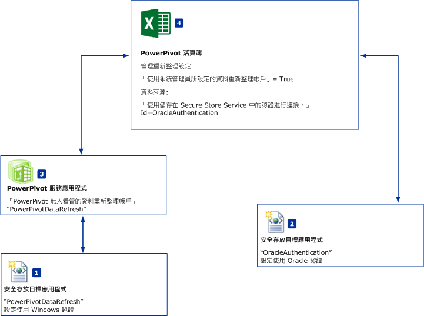
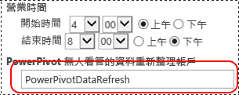

# 排程資料重新整理與資料來源-沒有 Windows 驗證
[!INCLUDE[ssas-appliesto-sqlas](../../includes/ssas-appliesto-sqlas.md)]
  本主題描述 [!INCLUDE[ssGemini](../../includes/ssgemini-md.md)] for SharePoint 排程資料重新整理的工作流程，而且這項作業可以使用「不」  支援 Windows 驗證的資料來源。 例如，Oracle 或 IDM DB2 資料來源。 雖然本主題的圖例和步驟參考的是 Oracle 資料來源，但是相同的工作流程也適用於其他資料來源。  
  
||  
|-|  
|**[!INCLUDE[applies](../../includes/applies-md.md)]**  SharePoint 2010 &#124; SharePoint 2013。|  
  
 **概觀：** 建立兩個安全存放目標應用程式。 將第一個目標應用程式 (PowerPivotDataRefresh) 設定為使用 Windows 認證。 使用不支援 Windows 驗證之資料來源 (例如 Oracle 資料庫) 的認證來設定第二個目標應用程式。 第二個目標應用程式也會將第一個目標應用程式用於無人看管的資料重新整理帳戶。  
  
   
  
-   **（1) PowerPivotDatarefresh:** 使用 Windows 驗證所設定的安全存放目標應用程式識別碼。  
  
-   **（2) OracleAuthentication:** 使用 Oracle 認證所設定的安全存放目標應用程式識別碼。  
  
-   **(3)** [!INCLUDE[ssGemini](../../includes/ssgemini-md.md)]服務應用程式是設定為目標應用程式"PowerPivotDataRefresh"**無人看管資料重新整理帳戶**。  
  
-   **(4)** PowerePivot 活頁簿會使用 Oracle 資料。 活頁簿重新整理設定會指定要將目標應用程式 **(2)** 用於認證的資料來源連接。  
  
## 先決條件  
  
-   [!INCLUDE[ssGemini](../../includes/ssgemini-md.md)] 服務應用程式存在。  
  
-   Secure Store Service 應用程式存在。  
  
-   包含 [!INCLUDE[ssGemini](../../includes/ssgemini-md.md)] 資料模型的 Excel 活頁簿存在。  
  
## 若要建立使用 Windows 驗證的目標應用程式識別碼  
  
1.  在 SharePoint 管理中心內，按一下 [管理服務應用程式] 。  
  
2.  按一下 Secure Store Service 應用程式的名稱。  
  
3.  在 [管理]  頁面上，按一下 [新增] 。   
  
4.  在 [建立新的 Secure Store 目標應用程式]  頁面上，設定下列值：  
  
    -   **目標應用程式識別碼：** PowerPivotDataRefresh。  
  
    -   **顯示名稱：** PowerPivotDataRefresh。  
  
    -   **連絡人電子郵件：** ？  
  
    -   **目標應用程式類型：** 群組。  
  
    -   **目標應用程式頁面 URL:** 無。  
  
5.  按 [下一步] 。  
  
6.  在 [認證] 頁面上，保留 [Windows 使用者名稱]  和 [Windows 密碼] 的兩個預設欄位名稱和欄位類型。  
  
7.  按 [下一步] 。  
  
8.  在 [成員資格設定]  頁面上，至少加入一個 **目標應用程式管理員** ，然後加入需要存取目標應用程式的成員。  
  
9. 按一下 [確定] 。  
  
10. 新的目標應用程式識別碼就會加入至清單。 選取目標應用程式識別碼，然後按一下**設定認證**。  
  
11. 輸入 Windows 使用者名稱和 Windows 密碼，然後按一下 [確定] 。  
  
## 若要建立使用 Oracle 認證的目標應用程式識別碼  
  
1.  在 SharePoint 管理中心內，按一下 [管理服務應用程式] 。  
  
2.  按一下 Secure Store Service 應用程式的名稱。  
  
3.  在 **管理**頁面上，按一下**新增**.  
  
4.  在 [建立新的 Secure Store 目標應用程式]  頁面上，設定下列值：  
  
    -   **目標應用程式識別碼：** OracleAuthentication。  
  
    -   **顯示名稱：** OracleAuthentication。  
  
    -   **連絡人電子郵件：** ？  
  
    -   **目標應用程式類型：** 群組。  
  
    -   **目標應用程式頁面 URL:** 無。  
  
5.  按 [下一步] 。  
  
6.  在 [認證]  頁面上，將第一個欄位名稱變更為 **Oracle 使用者識別碼** ，並將 [欄位類型]  變更為使用者名稱 。  
  
     將第二個欄位名稱變更為 Oracle 密碼  ，並將 [欄位類型]  變更為 [密碼] 。  
  
7.  按 [下一步] 。  
  
8.  在 [成員資格設定]  頁面上，至少加入一個 **目標應用程式管理員** ，然後加入需要存取目標應用程式的成員。  
  
9. 按一下 [確定] 。  
  
10. 新的目標應用程式識別碼就會加入至清單。 選取目標應用程式識別碼，然後按一下**設定認證**。  
  
11. 輸入 Oracle 使用者識別碼和 Oracle 密碼，然後按一下 [確定] 。  
  
 如需詳細資訊，請參閱 「 為 SQL Server 驗證建立目標應用程式 」 一節中[使用 Secure Store 搭配 SQL Server 驗證 (SharePoint Server 2013)](http://technet.microsoft.com/library/gg298949.aspx) (http://technet.microsoft.com/library/gg298949.aspx)。  
  
## 設定 Power Pivot 服務應用程式  
  
1.  在 SharePoint 管理中心內，按一下 [管理服務應用程式]。  
  
2.  按一下名稱您[!INCLUDE[ssGemini](../../includes/ssgemini-md.md)]服務應用程式，例如 「 預設[!INCLUDE[ssGemini](../../includes/ssgemini-md.md)]服務應用程式 」。  
  
3.  在 [動作] 區段中，按一下 [設定服務應用程式設定]  。  
  
4.  在 [資料重新整理] 區段中，將 [[!INCLUDE[ssGemini](../../includes/ssgemini-md.md)] 無人看管的資料重新整理帳戶)] 設定為 **PowerPivotDataRefresh**，然後按一下 [確定]。  
  
       
  
## 若要設定活頁簿  
  
1.  瀏覽至活頁簿[!INCLUDE[ssGemini](../../includes/ssgemini-md.md)]資源庫，然後按一下 **管理資料重新整理**.  
  
2.  如果您看見 [資料重新整理記錄]  頁面，請按一下 [設定排程] 。  
  
3.  按一下 [啟用] 。  
  
4.  按一下 [並且盡快重新整理] 。  
  
5.  在 [認證]  區段中，按一下 [使用系統管理員所設定的資料重新整理帳戶] 。  
  
6.  清除 [所有資料來源] 。  
  
7.  針對使用 Oracle 資料的資料來源選取 [重新整理]  。 您可以在 Microsoft Excel 的 [資料] 、[連線] 、[內容]  功能表中變更資料來源的名稱。  
  
8.  在您的資料來源底下，選取 [使用預設排程]。  
  
9. 選取 **使用儲存在 Secure Store Service (SSS) 中的認證進行連接，以登入資料來源。在 SSS ID 方塊中輸入用來查閱認證的 ID**。  
  
10. 在 [識別碼:] 方塊中，輸入 **OracleAuthentication**。  
  
11. 按一下 [確定] 。  
  
     如果您看到類似下列的錯誤訊息： `The provided Secure Store target application is either incorrectly configured or does not exist`。  
  
     常見的解決方法有兩種：  
  
    -   確認目標應用程式識別碼是否正確。  
  
    -   確認您已設定目標應用程式的認證。  
  
## 若要使用新的驗證來確認資料重新整理  
 當您按一下 [確定] 時，就會看見 [重新整理記錄]  頁面。 在幾分鐘之內，您應該會在重新整理記錄中看見新的項目，因為您在先前的步驟中選取了 [並且盡快重新整理] 。 計時器工作 **[!INCLUDE[ssGemini](../../includes/ssgemini-md.md)] 資料重新整理計時器工作** 的預設值為 1 分鐘。 如果您並未在重新整理記錄中看見新的項目，請等候幾分鐘，然後重新整理瀏覽器。 如果您仍然看不到新的項目，請確認計時器工作的目前值。  
  
## [詳細資訊]  
  
-   [在 SharePoint 2013 中設定 Secure Store Service](http://technet.microsoft.com/library/ee806866.aspx)。  
  
-   請參閱的 < 排程資料重新整理 > 一節[Power Pivot Data Refresh with SharePoint 2013 和 SQL Server 2012 SP1 (Analysis Services)](http://msdn.microsoft.com/library/jj879294.aspx#bkmk_windows_auth_interactive_data_refresh)。  
  
  
