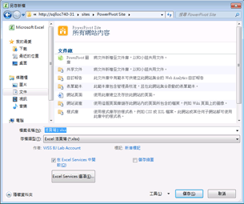

# 使用 Power Pivot 圖庫
  [!INCLUDE[ssGemini](../../includes/ssgemini-md.md)] 圖庫是一種特殊的 SharePoint 文件庫，針對包含 [!INCLUDE[ssGemini](../../includes/ssgemini-md.md)] 資料的已發行 Excel 活頁簿和 Reporting Services 報表，提供豐富的預覽與文件管理功能。  
  
> [!NOTE]  
>  根據您伺服器設定的方式，可能會在特定文件的預覽區域中看到警告或錯誤訊息。 如果 Excel 活頁簿設定為每次開啟時都自動重新整理其資料，可能會出現訊息。 如果設定 Excel Services 來顯示資料重新整理時警告的錯誤訊息，資料重新整理警告訊息將會以預覽影像的形式出現。 伺服陣列或服務管理員可以修改組態設定，讓實際工作表的預覽可以顯示出來。 如需詳細資訊，請參閱 [在管理中心建立 Power Pivot 網站的信任位置](../../analysis-services/power-pivot-sharepoint/create-a-trusted-location-for-power-pivot-sites-in-central-administration.md)。  
  
##   本主題內容  
 [必要條件](#prereq)  
  
 [Power Pivot 圖庫中的圖示](#icons)  
  
 [將 Excel 活頁簿儲存至 Power Pivot 圖庫](#add)  
  
 [根據發行的 Power Pivot 活頁簿來建立新的報表或活頁簿](#newdocs)  
  
 [在整頁模式中開啟活頁簿或報表](#view)  
  
 [為 Power Pivot 圖庫中的 Power Pivot 活頁簿進行資料重新整理排程](#newdr)  
  
 [刪除 Power Pivot 圖庫中的活頁簿或報表](#delete)  
  
 [重新整理縮圖影像](#image)  
  
 [已知問題](#bkmk_known_issues)  
  
##   必要條件  
  
> [!NOTE]  
>  Power Pivot 圖庫需要 Microsoft Silverlight，  但 Microsoft Edge 瀏覽器不支援 Silverlight。   
> 若要檢視 Edge 中的程式庫內容，請按一下 Powerpivot 圖庫中的 [程式庫]  索引標籤，然後將文件庫檢視變更為 [所有文件] 。    
> 若要變更預設檢視，請按一下 [程式庫]  索引標籤，然後按一下 [修改檢視]。 按一下 [設定為預設檢視]，然後按一下 [確定] 以儲存預設檢視。  
>  如需 Edge 支援項目的詳細資訊，請參閱 Windows 部落格 [揮別以往，第 2 部分：和 ActiveX、VBScript... 說再見](https://blogs.windows.com/msedgedev/2015/05/06/a-break-from-the-past-part-2-saying-goodbye-to-activex-vbscript-attachevent/)  
  
 如需必要條件的完整清單，請參閱 [建立及自訂 Power Pivot 圖庫](../../analysis-services/power-pivot-sharepoint/create-and-customize-power-pivot-gallery.md)。  
  
##   Power Pivot 圖庫中的圖示  
 圖示會提供有關內容可用性和狀態的視覺指標。  
  
|圖示|Description|  
|----------|-----------------|  
||在文件中產生每一個頁面的縮圖影像時，將會出現沙漏圖示。 重新整理頁面以顯示更新的影像。|  
||當活頁簿或報表的頁面數多於可以顯示在 [!INCLUDE[ssGemini](../../includes/ssgemini-md.md)] 圖庫中的頁數時，將會出現頁面圖示。 若要檢視所有頁面，您必須使用用戶端應用程式。|  
||當無法轉譯文件的縮圖影像時，將會出現錯誤圖示。 此文件會發行至文件庫，但是無法在自訂的 [!INCLUDE[ssGemini](../../includes/ssgemini-md.md)] 圖庫檢視中轉譯。 您應該能夠在用戶端應用程式中檢視此文件，例如 [!INCLUDE[ssGemini](../../includes/ssgemini-md.md)] for Excel 增益集。|  
||當您上傳的文件無法在 [!INCLUDE[ssGemini](../../includes/ssgemini-md.md)] 圖庫中轉譯時，將會出現無法使用的內容圖示。 支援的文件類型包括使用 SQL Server 2008 R2 Reporting Services 報表產生器所建立的 [!INCLUDE[ssGemini](../../includes/ssgemini-md.md)] 活頁簿和報表。   如果您從 [資源回收筒] 回收文件，也會出現這個圖示。   如果您要針對先前呈現有效預覽影像的文件取得此圖示，您可以編輯文件屬性然後儲存變更來重新整理影像。|  
||當特意停用這個文件的縮圖頁面時，將會出現鎖定的內容圖示。 [!INCLUDE[ssGemini](../../includes/ssgemini-md.md)] 圖庫不會針對不包含 [!INCLUDE[ssGemini](../../includes/ssgemini-md.md)] 資料的 Excel 活頁簿，或不符合快照集產生需求的 [!INCLUDE[ssGemini](../../includes/ssgemini-md.md)] 活頁簿或 Reporting Services 報表，產生縮圖影像。 如需詳細資訊，請參閱本主題中的＜必要條件＞一節。|  
  
##   將 Excel 活頁簿儲存至 Power Pivot 圖庫  
 您可以使用 Excel 2010 提供的所有共用技術，將 [!INCLUDE[ssGemini](../../includes/ssgemini-md.md)] 活頁簿發行至文件庫。 例如，您可以使用 Excel 2010 中的 [另存新檔] 來指定文件庫的所有或部分 SharePoint 路徑。  
  
1.  儲存檔案。  
  
2.  1.  **Excel 2010：** 在 [檔案] 功能表中，按一下 [儲存和傳送]。  
  
    2.  按一下 **[儲存至 SharePoint]**。  
  
    3.  如果您要使用 [Excel Services 選項] 來選取要發行的個別工作表或參數，請按一下 **[發行選項]** 。 例如，[Excel Services 選項] 中的 [參數] 索引標籤可讓您選擇哪些交叉分析篩選器要出現在發行的活頁簿中。  
  
    1.  **Excel 2013**  ：在 [檔案] 功能表中，按一下 **[儲存]**。  
  
    2.  如果您要使用 [Excel Services 選項] 來選取要發行的個別工作表或參數，請按一下 **[瀏覽器檢視選項]** 。 例如，[Excel Services 選項] 中的 [參數] 索引標籤可讓您選擇哪些交叉分析篩選器要出現在發行的活頁簿中。  
  
3.  在 [另存新檔] 對話方塊的 [檔案名稱] 中，輸入 [!INCLUDE[ssGemini](../../includes/ssgemini-md.md)] 圖庫的完整或部分 URL。 如果您輸入部分 URL 位址 (如伺服器名稱)，則可以瀏覽該網站以尋找 [!INCLUDE[ssGemini](../../includes/ssgemini-md.md)] 圖庫。 若要這樣做，按一下 **[儲存]** 以開啟連至您指定的伺服器連接。  
  
       
  
1.  使用 [另存新檔] 對話方塊，在您的網站上選取 [!INCLUDE[ssGemini](../../includes/ssgemini-md.md)] 圖庫。  
  
2.  按一下 **[開啟]** 以開啟文件庫。  
  
3.  按一下 **[儲存]** ，將活頁簿發行至文件庫。  
  
 在瀏覽器視窗中，確認文件出現在 [!INCLUDE[ssGemini](../../includes/ssgemini-md.md)] 圖庫中。 新發行的文件將會出現在清單中。 文件庫設定會決定文件出現的位置 (例如，依日期以遞增方式排序，或依名稱以字母順序排序)。 您可能需要重新整理瀏覽器視窗來檢視最近加入的文件。  
  
#### 將活頁簿上傳至 Power Pivot 圖庫  
 如果您要從 SharePoint 開始，並從您的電腦選取要發行哪些檔案，則也可以上傳活頁簿。  
  
1.  在 SharePoint 網站中，開啟 [!INCLUDE[ssGemini](../../includes/ssgemini-md.md)] 圖庫。  
  
2.  在文件庫功能區中，按一下 **[文件]**。  
  
3.  在 **[上載文件]**中，選取上傳選項，然後輸入您要上傳之檔案的名稱和位置。 文件庫設定會決定文件出現的位置。 您可能需要重新整理瀏覽器視窗來檢視最新加入的文件。  
  
##   根據發行的 Power Pivot 活頁簿來建立新的報表或活頁簿  
 對於您發行到 [!INCLUDE[ssGemini](../../includes/ssgemini-md.md)] 圖庫的 [!INCLUDE[ssGemini](../../includes/ssgemini-md.md)] 活頁簿，可以建立使用發行的活頁簿做為連接的資料來源之其他活頁簿或 Reporting Services 報表。  
  
|||  
|-|-|  
||按一下 [新增報表] 按鈕的向下箭頭部分，以啟動報表產生器或 Excel 2010。 [!INCLUDE[ssGemini](../../includes/ssgemini-md.md)] 圖庫必須使用其中一個預先設計的檢視 (劇場、圖庫或浮動切換)，才能使用 [新增報表] 按鈕。|  
  
#### 建立報表產生器報表  
 根據文件庫中現有的 [!INCLUDE[ssGemini](../../includes/ssgemini-md.md)] 活頁簿建立新報表時，需要針對包含 [!INCLUDE[ssGemini](../../includes/ssgemini-md.md)] 圖庫的相同網站將 Reporting Services 設定為 SharePoint 整合。 當您選取 [建立報表產生器報表] 選項時，報表產生器會在第一次使用時，從報表伺服器下載並安裝在本機工作站上。 預留位置報表檔案會針對新的報表建立，並儲存到 [!INCLUDE[ssGemini](../../includes/ssgemini-md.md)] 圖庫中。 系統會為您建立 [!INCLUDE[ssGemini](../../includes/ssgemini-md.md)] 活頁簿的連接資訊，作為報表中新的資料來源。 在下一個步驟中，您可以在設計工作空間中建立資料集與報表版面配置。 由於您是使用報表產生器組合報表，因此您可以將變更和最終結果儲存到文件庫中的報表文件。 若要避免稍後資料連線中斷，請務必將報表和活頁簿檔案一起保留在相同的文件庫中。  
  
#### 開啟新 Excel 活頁簿  
 若要從現有的活頁簿建立新的 Excel 活頁簿，您的本機電腦必須已經安裝 Excel 與 [!INCLUDE[ssGeminiClient](../../includes/ssgeminiclient-md.md)] 。 選擇 [開啟新 Excel 活頁簿] 會啟動 Excel、開啟一個空白的活頁簿 (.xlsx) 檔案，並在背景將 [!INCLUDE[ssGemini](../../includes/ssgemini-md.md)] 資料載入成連接的資料來源。 在新活頁簿中只會使用原始活頁簿中來自 [!INCLUDE[ssGemini](../../includes/ssgemini-md.md)] 視窗的資料。 原始活頁簿中的樞紐分析表或樞紐分析圖則會予以排除。 新活頁簿會連結至原始活頁簿中的資料。 不會將資料複製到新活頁簿本身。  
  
##   在整頁模式中開啟活頁簿或報表  
 按一下預覽文件的任何可見縮圖影像，不論 [!INCLUDE[ssGemini](../../includes/ssgemini-md.md)] 圖庫預覽為何，都以整頁模式開啟。 [!INCLUDE[ssGemini](../../includes/ssgemini-md.md)] 活頁簿將會在瀏覽器中開啟。 Reporting Services 報表會在 ReportViewer Web 組件中開啟，這個 Web 組件是 SharePoint 伺服器上 Reporting Services 部署的一部分。  
  
 在瀏覽器中檢視活頁簿的替代方法，是在用戶端工作站上的 Excel 中開啟它。 您必須擁有 Excel 2013 或 Excel 2010 與 [!INCLUDE[ssGeminiClient](../../includes/ssgeminiclient-md.md)] 增益集，才能檢視檔案。 您可以使用 Excel 2007 來開啟檔案，但是您不能使用它對資料進行樞紐分析。 因此，建議使用 Excel 2013 或 Excel 2010 來檢視和建立 [!INCLUDE[ssGemini](../../includes/ssgemini-md.md)] 資料。 如果您沒有所需的應用程式，則必須使用瀏覽器來檢視 SharePoint 的活頁簿。  
  
##   為 Power Pivot 圖庫中的 Power Pivot 活頁簿進行資料重新整理排程  
 [!INCLUDE[ssGemini](../../includes/ssgemini-md.md)] 資料。  
  
|||  
|-|-|  
||按一下 [管理資料重新整理] 按鈕以建立或檢視排程，從連接的資料來源擷取更新的資料。 如需如何建立排程的指示，請參閱 [排程資料重新整理 (PowerPivot for SharePoint)](http://msdn.microsoft.com/en-us/8571208f-6aae-4058-83c6-9f916f5e2f9b)。|  
  
##   刪除 Power Pivot 圖庫中的活頁簿或報表  
 若要從文件庫中刪除文件，請先切換至 [所有文件] 檢視。  
  
1.  在 SharePoint 網站中，開啟 [!INCLUDE[ssGemini](../../includes/ssgemini-md.md)] 圖庫。  
  
2.  在功能區中，按一下 **[文件庫]**。  
  
3.  在 [管理檢視] 的 [目前檢視] 清單中，按一下向下箭頭，然後選取 [所有文件]。  
  
4.  選取您要刪除的活頁簿或報表。  
  
5.  在 [文件 (檔案)] 中，按一下 [管理] 中的 **[刪除文件]** 按鈕。  
  
##   重新整理縮圖影像  
 使用下列步驟，為 [!INCLUDE[ssGemini](../../includes/ssgemini-md.md)] 圖庫中的文件重新產生縮圖影像。  
  
1.  將 [!INCLUDE[ssGemini](../../includes/ssgemini-md.md)] 圖庫切換到 [所有文件] 檢視。 若要執行這項操作，請按一下功能區中的 **[文件庫]** ，然後將 **[目前檢視]** 變更為 **[所有文件]**。  
  
2.  選取您要重新整理其縮圖影像的活頁簿或報表。  
  
3.  按一下右邊的向下箭號，然後選取 **[編輯屬性]**。  
  
4.  按一下 **[儲存]**。 儲存文件會強制快照服務重新產生預覽影像。  
  
##   已知問題  
  
### 不支援的文件類型  
 不支援 [[!INCLUDE[ssGemini](../../includes/ssgemini-md.md)] 圖庫文件] 內容類型。 如果您啟用 [[!INCLUDE[ssGemini](../../includes/ssgemini-md.md)] 圖庫文件] 內容類型作為文件庫，並嘗試建立該類型的新文件，則會看見類似下列其中一項的錯誤訊息：  
  
-   「新文件」需要與 Microsoft SharePoint Foundation 相容的應用程式和 Web 瀏覽器。 若要在此文件庫中加入文件，請按一下 [上傳文件] 按鈕。  
  
-   「網際網路位址 'http://[server name]/testSite/PowerPivot Gallery/ReportGallery/Forms/Template.xlsx' 無效」。「Microsoft Excel 無法存取檔案 'http://[server name]/testSite/PowerPivot Gallery/ReportGallery/Forms/Template.xlsx'」。 有幾項可能的原因：  
  
 [[!INCLUDE[ssGemini](../../includes/ssgemini-md.md)] 圖庫文件] 內容類型不會自動加入至文件庫。除非您手動啟用不支援的內容類型，否則不會發生這個問題。  
  
## 請參閱＜  
 [在管理中心建立 Power Pivot 網站的信任位置](../../analysis-services/power-pivot-sharepoint/create-a-trusted-location-for-power-pivot-sites-in-central-administration.md)   
 [刪除 Power Pivot 圖庫](../../analysis-services/power-pivot-sharepoint/delete-power-pivot-gallery.md)   
 [建立及自訂 Power Pivot 圖庫](../../analysis-services/power-pivot-sharepoint/create-and-customize-power-pivot-gallery.md)   
 [排定資料重新整理 (Power Pivot for SharePoint)](http://msdn.microsoft.com/en-us/8571208f-6aae-4058-83c6-9f916f5e2f9b)  
  
  
