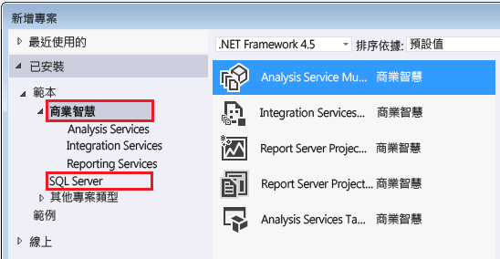

# Analysis Services 中使用的工具和應用程式
  尋找在 Analysis Services 執行個體上建立 Analysis Services 模型和管理關聯資料庫所需的工具與應用程式。  
  
## Analysis Services 模型設計師  
 表格式與多維度模型是從 Visual Studio Shell 內建方案中的專案範本所建立。 專案範本可供設計人員建立組成 Analysis Services 方案的資料表、關聯性、Cube、維度及角色。 此命令介面提供視覺化工作區、屬性頁，以及在其內建立專案的命令架構。 提供命令介面和範本的模型設計工具是免費的 Web 下載項目。  
  
 模型具有相容性層級設定，可決定功能可用性以及哪個版本的 Analysis Services 執行該模型。  是否可以指定給定的相容性層級有一部分是由模型設計工具所決定。  
  
 使用 SQL Server 2016 最新功能的表格式模型 (例如，表格式 JSON 格式的 BIM 檔案以及雙向交叉篩選) 必須在相容性層級 1200 建立 (為與 SQL Server 2016 同時隨附的 SQL Server Data Tools for Visual Studio 2015 版本) (如需下載連結，請參閱下面)。  
  
 如果您需要較低的相容性層級 (可能是因為您想要在舊版 Analysis Services 上部署模型)，則仍然可以使用 SSDT for Visual Studio 2015 中的模型設計工具。 此工具的新版本支援在任何您需要的相容性層級上建立任何模型類型 (表格式或多維度)。 不需要保留舊版工具，只要建立或編輯較舊的模型即可。  
  
### 下載模型設計工具  
 [!INCLUDE[ssBIDevStudio](../includes/ssbidevstudio-md.md)]前稱為 SQL Server Data Tools for Business Intelligence (SSDT-BI)，再之前稱為 Business Intelligence Development Studio (BIDS)，可用來建立 Analysis Services 模型。  
  
||  
|-|  
|**[下載 SSDT for Visual Studio 2015](https://msdn.microsoft.com/mt429383)**|  
  
 建議使用 SQL Server Data Tools for Visual Studio 2015，而不要使用舊版設計工具。 它包含所有 SQL Server 內容類型的專案範本，包括關聯式資料庫、Analysis Services 模型、Reporting Services 報表以及 Integration Services 封裝。  
  
 SSDT 是在 Visual Studio 2015 命令介面中執行。 如果您已經有 Visual Studio 2015，則 SSDT 安裝程式只會新增專案範本。 如果您沒有 Visual Studio 2015，則會同時安裝命令介面和範本。  
  
 如果電腦上已安裝舊版的 SSDT-BI 或 BIDS，較新的版本會與舊版並存安裝。  
  
 安裝 SSDT 之後，您應該會在 [新增專案] 對話方塊中看到商業智慧範本。  
  
   
  
## 系統管理工具  
  
### 下載 SQL Server Management Studio  
 Management Studio 是所有 SQL Server 功能 (包括 Analysis Services) 的主要系統管理工具。 它現在是不同的下載。  
  
||  
|-|  
|**[下載 SQL Server Management Studio](https://msdn.microsoft.com/library/mt238290.aspx)**|  
  
 在 SQL Server 2016 中，Management Studio 包含 Analysis Services 的擴充事件 (xEvents)，並提供用於監視活動以及診斷伺服器問題之 SQL Server Profiler 追蹤的輕量型替代項目。 如需詳細資訊，請參閱[使用 SQL Server 擴充事件監視 Analysis Services](../analysis-services/instances/monitor-analysis-services-with-sql-server-extended-events.md)。  
  
### SQL Server Profiler  
 雖然 SQL Server Profiler 已正式取代為 xEvents，但是它是監視連接、MDX 查詢執行和其他伺服器作業的熟悉方式。 SQL Server Profiler 是預設會安裝的元件。 您可以在 Windows Server 2012 的 [應用程式] 頁面上看到該元件和其他 SQL Server 應用程式。  
  
### PowerShell  
 您可以使用 PowerShell 命令來執行許多系統管理工作。 如需詳細資訊，請參閱 [Analysis Services 中的 PowerShell 指令碼](../analysis-services/instances/powershell-scripting-in-analysis-services.md)。  
  
### 社群與協力廠商工具  
 如需社群程式碼範例，請造訪 [Analysis Services codeplex 頁面](http://sqlsrvanalysissrvcs.codeplex.com/) 。 當您在尋找支援 Analysis Services 之協力廠商工具的建議時，[論壇](http://social.msdn.microsoft.com/Forums/sqlserver/home?forum=sqlanalysisservices)是相當實用的資源。  
  
## 請參閱＜  
 [多維度資料庫的相容性層級 &#40;Analysis Services&#41;](../analysis-services/multidimensional-models/compatibility-level-of-a-multidimensional-database-analysis-services.md)   
 [Analysis Services 中表格式模型的相容性層級](../analysis-services/tabular-models/compatibility-level-for-tabular-models-in-analysis-services.md)  
  
  