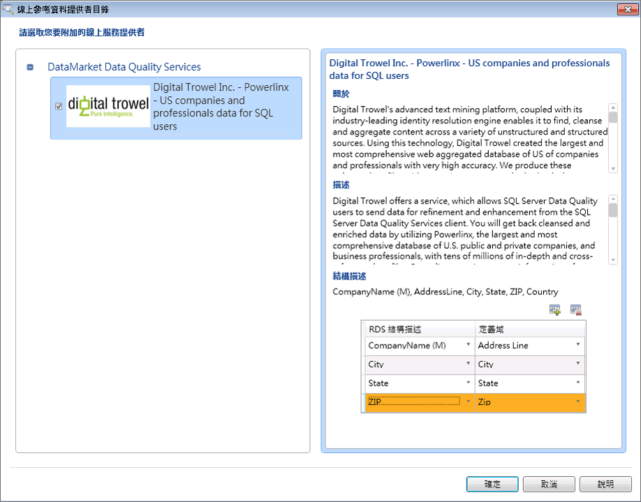

# 將定義域或複合定義域附加至參考資料

[!INCLUDE[appliesto-ss-xxxx-xxxx-xxx-md-winonly](../includes/appliesto-ss-xxxx-xxxx-xxx-md-winonly.md)]

  此主題描述如何將資料品質知識庫中的定義域/複合定義域附加至 Windows Azure Marketplace 中的參考資料服務，以便針對高品質參考資料建立知識。 每一項參考資料服務都包含結構描述 (資料行)。 將定義域或複合定義域附加至參考資料服務之後，您必須將附加的複合定義域內的附加定義域或個別定義域對應至參考資料服務結構描述中的適當資料行。 將複合定義域附加至參考資料服務可讓您只將一個定義域附加至參考資料服務，然後將複合定義域中的個別定義域對應至參考資料服務結構描述中的適當資料行。  

> [!IMPORTANT]
> 本文提到的協力廠商參考資料服務先前可從 Azure DataMarket 取得。 自 2016 年 12 月 31 日起已中止 DataMarket 和資料服務 (例如包含 Melissa 位址資料)。 因此，您再也無法使用從 DataMarket 取得的指定服務來執行本文中的範例。 但您仍然可以使用協力廠商參考資料提供者直接線上提供的參考資料服務。

> [!WARNING]  
>  附加至參考資料服務的複合定義域可在將定義域對應至參考資料服務中的資料行時，於定義域下拉式清單中使用。 不要將複合定義域對應至參考資料服務結構描述中的資料行；您必須只將複合定義域內的個別定義域對應至參考資料服務結構描述中的適當資料行。 否則，它將會導致錯誤。  
  
 參考資料服務結構描述可以擁有強制性資料行，假設您選擇使用此參考資料服務，該資料行必須與適當的定義域對應。 參考資料結構描述中的強制性資料行會使用 "(M)" 來向資料行名稱識別。 例如，**AddressLine** 是 **Melissa Data - Address Data** 中的強制性結構描述資料行，而 **CompanyName** 是 **Digital Trowel Inc. - Us companies and professional data for SQL users**中的強制性結構描述資料行。  
  
 本主題中，我們將建立四個定義域：[地址行]、[縣/市]、[州/省] 和 [郵遞區號]，在複合定義域 [地址驗證]下，將複合定義域附加至 **Melissa Data - Address Check** 參考資料服務，然後將複合定義域內的個別定義域對應至參考資料服務結構描述中適當的資料行。  
  
## 開始之前  
  
###   必要條件  
 您必須已設定 [!INCLUDE[ssDQSnoversion](../includes/ssdqsnoversion-md.md)] (DQS)，才能使用參考資料服務。 請參閱[設定 DQS 使用參考資料](../data-quality-services/configure-dqs-to-use-reference-data.md)。  
  
###   安全性  
  
#### [權限]  
 您必須擁有 DQS_MAIN 資料庫的 dqs_kb_editor 角色，才能將定義域對應至參考資料。  
  
##   將定義域對應至 Melissa Data 中的參考資料  
  
1.  [!INCLUDE[ssDQSInitialStep](../includes/ssdqsinitialstep-md.md)] [執行 Data Quality Client 應用程式](../data-quality-services/run-the-data-quality-client-application.md)。  
  
2.  在 [!INCLUDE[ssDQSClient](../includes/ssdqsclient-md.md)] 首頁畫面的 **[知識庫管理]** 底下，按一下 **[新增知識庫]**。  
  
3.  在 **[新增知識庫]** 畫面中，輸入新知識庫的名稱，並按一下 **[定義域管理]** 活動，然後按一下 **[建立]**。  
  
4.  在 **[定義域管理]** 畫面中，按一下 **[建立定義域]** 圖示建立定義域。 建立以下四個定義域： **[地址行]**、 **[縣/市]**、 **[省/市]** 和 **[郵遞區號]**。  
  
5.  按一下 **[建立複合定義域]** 圖示，建立複合定義域。 在 **[建立複合定義域]** 對話方塊中，於 **[複合定義域名稱]** 方塊中輸入 **地址驗證** ，並在複合定義域中包含步驟 3 所建立的所有定義域。 按一下 [確定] 。  
  
6.  在左邊的 **[定義域]** 窗格中選取複合定義域，方法是按一下 **[地址驗證]**，然後按一下右邊的 **[參考資料]** 索引標籤。  
  
7.  按一下 **[瀏覽]** 圖示。  
  
8.  在 **[線上參考資料提供者目錄]** 對話方塊中：  
  
    1.  在 [DataMarket Data Quality Services]底下，選取 [Melissa Data - 地址檢查] 方塊。  
  
    2.  將 [Melissa Data - Address Check] 參考資料服務與適當的定義域 ([地址行]、[縣/市]、[州/省] 和 [郵遞區號]) 相對應。 若要對應資料行，請在 **[RDS 結構描述]** 資料行中選取參考資料服務資料行，然後在 **[定義域]** 資料行中選取適當的定義域。 若要在資料表中加入其他資料列，請按一下 **[加入結構描述項目]** 圖示。  
  
    3.  按一下 **[確定]** 儲存變更，並關閉 **[線上參考資料提供者目錄]** 對話方塊。  
  
           
  
        > [!NOTE]  
        >  -   在 **[線上參考資料提供者目錄]** 對話方塊中， **[DataMarket Data Quality Services]** 節點會顯示您在 Windows Azure Marketplace 中所訂閱的所有參考資料服務提供者。 如果您已在 DQS 中設定直接線上協力廠商參考資料服務提供者，這些提供者會出現在稱為 **[協力廠商直接上線提供者]** 的另一個節點底下 (現在不會出現這個節點，因為 DQS 中尚未設定直接線上協力廠商參考資料服務提供者)。  
  
9. 您將回到 **[參考資料]** 索引標籤。在 [提供者設定] 區域中，視需要變更以下方塊中的值：  
  
    -   **自動校正臨界值**：如果參考資料服務提供之更正的信賴等級高於這個臨界值，將會自動執行更正。 請使用對應百分比值的十進位表示法來輸入值。 例如，輸入 0.9 表示 90%。  
  
    -   **建議的候選值**：要從參考資料服務中顯示的建議候選值數目。  
  
    -   **最低信賴值**：如果參考資料服務提供之建議的信賴等級低於這個值，將會予以忽略。 請使用對應百分比值的十進位表示法來輸入值。 例如，輸入 0.6 表示 60%。  
  
10. 按一下 **[完成]** ，發行知識庫。 在成功發行知識庫之後，便會出現確認訊息。  
  
 您現在可以使用此知識庫來清理資料品質專案中的活動，以便根據透過 Windows Azure Marketplace 的 Melissa Data 提供的知識來標準化和清理來源資料中的美國地址。  
  
##   後續操作：將定義域對應至參考資料之後  
 建立資料品質專案，並針對包含美國地址的來源資料執行清理活動，方法是將它與本主題建立的知識庫相比較。 請參閱[使用參考資料 &#40;外部&#41; 知識清理資料](../data-quality-services/cleanse-data-using-reference-data-external-knowledge.md)。  
  
## 另請參閱  
 [DQS 中的 Reference Data Services](../data-quality-services/reference-data-services-in-dqs.md)   
 [資料清理](../data-quality-services/data-cleansing.md)  
  
  
