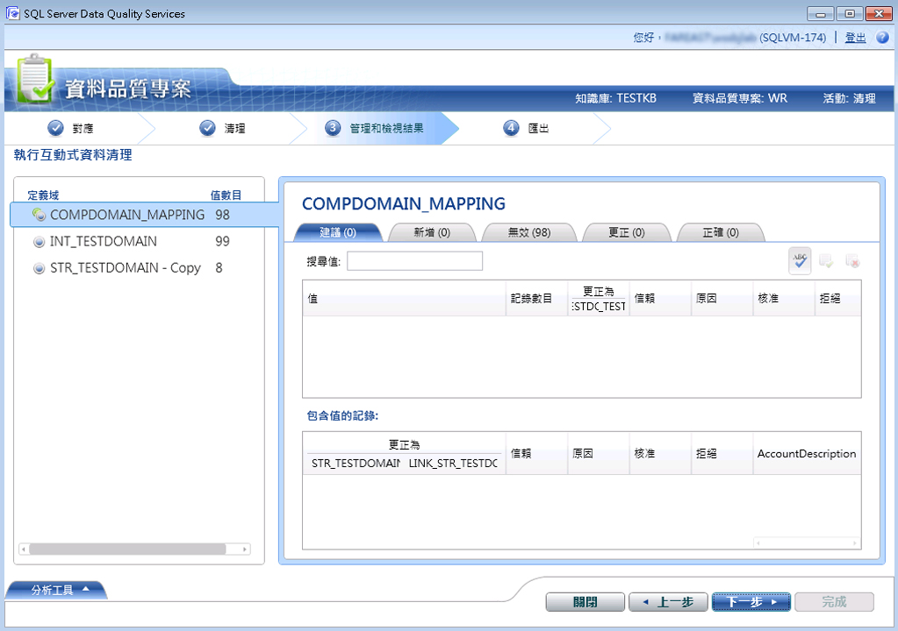

# 使用參考資料 (外部) 知識清理資料

[!INCLUDE[appliesto-ss-xxxx-xxxx-xxx-md-winonly](../includes/appliesto-ss-xxxx-xxxx-xxx-md-winonly.md)]

  本主題描述如何使用參考資料提供者的知識來清理資料。 對於使用參考資料提供者的知識來清理資料而言，雖然執行清理活動的所有步驟仍與[使用 DQS &#40;內部&#41; 知識清理資料](../data-quality-services/cleanse-data-using-dqs-internal-knowledge.md)中所說明的步驟相同，不過本主題將針對在 [!INCLUDE[ssDQSnoversion](../includes/ssdqsnoversion-md.md)] (DQS) 中使用 Reference Data Service 進行資料清理提供特定資訊。  

> [!IMPORTANT]
> 本文提到的協力廠商參考資料服務先前可從 Azure DataMarket 取得。 自 2016 年 12 月 31 日起已中止 DataMarket 和資料服務 (例如包含 Melissa 位址資料)。 因此，您再也無法使用從 DataMarket 取得的指定服務來執行本文中的範例。 但您仍然可以使用協力廠商參考資料提供者直接線上提供的參考資料服務。
 
 當您使用 DQS 中的參考資料服務功能來清理資料時，DQS 清理處理序會以批次要求的形式，將對應的定義域值傳送至參考資料服務提供者。 參考資料服務會使用下列資訊來回應：  
  
-   建議的更正  
  
-   信心  
  
-   有關對應定義域的其他資訊。 參考資料也可以使用其他資料來標準化、剖析或充實來源。 這項資訊是在回應的其他欄位中提供。  
  
 從參考資料服務取得回應之後，DQS 就會在清理活動期間進行下列作業：  
  
-   根據將定義域對應至參考資料服務期間指定的 **[自動校正臨界值]** 和 **[最低信賴值]** 值，依照信賴等級自動更正或建議定義域值。  
  
    > [!NOTE]  
    >  使用參考資料服務中的知識來清理資料時，系統會套用您在將定義域對應至參考資料服務期間指定的臨界值，而非 **[組態]** 區段之 **[一般設定]** 索引標籤中指定的臨界值。 如需有關針對參考資料清理指定閾值的資訊，請參閱[將定義域或複合定義域附加至參考資料](../data-quality-services/attach-domain-or-composite-domain-to-reference-data.md)的步驟 9。  
  
-   定義域值的分類方式如下： **[建議]**、 **[新增]**、 **[無效]**、 **[更正]** 和 **[正確]**。  
  
-   其他資料會附加至來源，而且這項資訊可與清理的資料一起匯出。  
  
## 開始之前  
  
###   必要條件  
 您必須已經將 DQS 知識庫中已對應且必要的定義域對應至適當的參考資料服務。 此外，知識庫必須包含您想要清理之資料類型的相關知識。 例如，如果您想要清理包含美國地址的來源資料，就必須將定義域對應至提供「高品質」美國地址資料的參考資料服務提供者。 如需詳細資訊，請參閱 [將定義域或複合定義域附加至參考資料](../data-quality-services/attach-domain-or-composite-domain-to-reference-data.md)。  
  
###   安全性  
  
####   權限  
 您必須擁有 DQS_MAIN 資料庫的 dqs_kb_editor 或 dqs_kb_operator 角色，才能執行資料清理。  
  
##   使用參考資料知識清理您的資料  
 我們會繼續使用在上個主題中對應的相同定義域範例，使用 Windows Azure Marketplace 的 Melissa Data 服務[將定義域或複合定義域附加至參考資料](../data-quality-services/attach-domain-or-composite-domain-to-reference-data.md)。 現在，我們將會使用相同的定義域來清理一些美國地址樣本。 清理資料的步驟一如[使用 DQS &#40;內部&#41; 知識清理資料](../data-quality-services/cleanse-data-using-dqs-internal-knowledge.md)中所述。 不過，我們會在此程序中視需要吸引您的注意。  
  
1.  建立資料品質專案，然後選取 **[清理]** 活動。 請參閱 [Create a Data Quality Project](../data-quality-services/create-a-data-quality-project.md)。  
  
2.  在 **[對應]** 頁面上，將下列 4 定義域對應至來源資料中的適當資料行： **[地址行]**、 **[縣/市]**、 **[省/市]** 和 **[郵遞區號]**。 按 [下一步] 。  
  
    > [!NOTE]  
    >  因為我們已經對應了 **[地址驗證]** 複合定義域中的所有定義域，所以資料清理現在將針對複合定義域層級進行，而非針對個別定義域層級進行。  
  
3.  在 **[清理]** 頁面上，按一下 **[開始]**，藉以執行電腦輔助的清理處理序。 清理處理序結束之後，請按 **[下一步]**。  
  
    > [!NOTE]  
    >  在 **[清理]** 頁面上，DQS 會以下列兩種方式顯示附加至參考資料服務之定義域的相關資訊：  
    >   
    >  -   在 [開始] 按鈕下方顯示一則訊息：「定義域 \<Domain1>、\<Domain2>、… \<DomainN> 是使用 Reference Data Service 提供者清理的」。 在此範例中，則會顯示下列訊息：「使用參考資料服務提供者清理了網域位址驗證」。  
    > -   圖示 () 會出現在附加至 Reference Data Service 提供者的定義域旁邊的 [分析工具] 區域中。 在此範例中，該圖示會顯示在 **[地址驗證]** 複合定義域旁邊。  
  
4.  在 **[管理和檢視結果]** 頁面上，檢閱您的定義域值。 根據將定義域對應至參考資料服務期間在 **[建議的候選值]** 方塊中指定的最大建議數目，參考資料服務可能會針對一個值顯示多項建議 (如果有的話)。 例如，下列美國地址會顯示兩項建議：  
  
     **原始值：**  
  
    |[地址行]|[縣/市]|[省/市]|[郵遞區號]|  
    |------------------|----------|-----------|---------|  
    |1 msft way|Redmond||98052|  
  
     **建議值：**  
  
    |[地址行]|[縣/市]|[省/市]|[郵遞區號]|  
    |------------------|----------|-----------|---------|  
    |1 Microsoft Way|Redmond|WA|98052|  
    |PO Box 1|Redmond|WA|98073|  
  
       
  
    > [!NOTE]  
    >  若為複合定義域，DQS 也會以不同的色彩反白顯示在電腦輔助清理處理序期間更正的個別定義域。 例如，此本例中， **[地址行]** 和 **[省/市]** 定義域已更正，因此會以青色反白顯示。  
  
5.  完成所有定義域值的檢閱之後，請按 **[下一步]** 匯出資料。  
  
6.  在 **[匯出]** 頁面上，您將會發現除了有關每個定義域之清理活動的一般資訊 (來源、原因、信賴和狀態) 以外，還有 Melissa Data 參考資料服務針對地址資料所提供的其他資訊，例如地址的緯度和經度、國家/地區名稱、地址類型 (大樓、街道) 等等。  
  
7.  將您的資料匯出至所需的目的地 (SQL Server、CSV 或 Excel)，然後按一下 **[完成]** 關閉專案。  
  
    > [!IMPORTANT]  
    >  如果您要使用 64 位元版本的 Excel，就無法將清理的資料匯出到 Excel 檔案，只能匯出到 SQL Server 資料庫或 .csv 檔案。  
  
  
