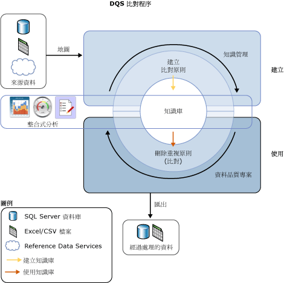

# 資料比對
  [!INCLUDE[ssDQSnoversion](../includes/ssdqsnoversion-md.md)] (DQS) 資料比對程序可讓您減少資料重複，並提高資料來源中的資料精確度。 比對會分析單一資料來源之所有記錄中的重複程度，傳回每一組比較之記錄之間相符的加權機率。 然後您可以決定哪些記錄相符，並針對來源資料採取適當的動作。  
  
 DQS 比對程序的優點如下：  
  
-   比對可讓您消除應該相等之資料值之間的差異，以判斷正確值並減少資料差異可能造成的錯誤。 例如，名稱和地址經常是資料來源的識別資料，特別是客戶資料，但是資料可能會變更，並隨著時間而變質。 執行比對來識別及更正這些錯誤可讓資料的使用及維護變得更輕鬆。  
  
-   比對可讓您確保相等但是以不同格式或樣式輸入的值會以一致的方式轉譯。  
  
-   比對會識別完全相符和大約符合，好讓您在定義資料時移除重複的資料。 您會定義大約相符實際上是相符的點。 您會定義已評估哪些欄位用於比對以及未評估的欄位。  
  
-   DQS 可讓您使用電腦輔助的程序建立比對原則、根據比對結果以互動方式加以修改，並將它加入至可重複使用的知識庫。  
  
-   您可以針對從來源複製到暫存資料表的資料重新建立索引或是不重新建立索引 (根據比對原則和來源資料的狀態)。 不重新建立索引可以提高效能。  
  
 您可以搭配其他資料清理程序來執行比對程序，以改善整體資料品質。 您也可以使用內建在 Master Data Services 中的 DQS 功能來執行資料刪除重複作業。 如需詳細資訊，請參閱 [Master Data Services 概觀 & #40。MDS & #41;](../master-data-services/master-data-services-overview-mds.md)。  
  
 下圖顯示如何在 DQS 中進行資料比對：  
  
   
  
##   如何執行資料比對  
 如果是 DQS 中的其他資料品質程序，執行比對的方式是建立知識庫，並使用以下步驟在資料品質專案中執行比對活動：  
  
1.  在知識庫中建立比對原則  
  
2.  在屬於資料品質專案之一部分的比對活動中執行刪除重複作業程序。  
  
###   建立比對原則  
 準備知識庫來執行比對的方式，是在知識庫中建立比對原則，以定義 DQS 如何指派比對機率。 比對原則是由一個或多個比對規則所組成，這些規則會在 DQS 評估某一筆記錄與另一筆記錄的相符程度時識別將使用哪些定義域，並指定每一個定義域值在比對評估中所佔的加權比重。 您會在規則中指定定義域值是否必須完全相符或者可以類似，以及相似度的程度。 您也會指定定義域比對是否為必要條件。  
  
 [知識庫管理] 精靈中的比對原則活動會分析取樣資料，方法是套用每一個比對規則，一次比較整個記錄範圍中的兩筆記錄。 符合分數大於指定之最小值的記錄會分組在比對結果的叢集中。 這些比對結果不會加入至知識庫；您可以使用這些結果來微調比對規則。 建立比對原則可以是反覆性的程序，在此程序中您會根據比對結果或分析統計資料來修改比對規則。  
  
 您可以為定義域指定，當您將資料來源中的資料載入定義域時，資料字串將會正規化。 這個程序包含使用 null 或空格取代特殊字元，這樣通常會移除兩個字串之間的差異。 這樣會提高比對精確度，而且通常可以讓比對結果超出最低比對臨界值 (在沒有正規化時，將不會超過)。  
  
> [!NOTE]  
>  兩筆記錄之對應欄位中的 Null 值將會被視為相符。  
  
 比對原則是在對應至取樣資料的定義域上執行。 當您執行比對原則時，您可以指定資料是否從資料來源複製到暫存資料表，並重新建立索引。 當建立知識庫及執行比對專案時，您也可以這樣做。 不重新建立索引可能會提高效能。 當下列情況成立時，不需要重新建立索引：比對原則尚未變更，而且您尚未更新資料來源、重新對應此原則、選取新的資料來源，或是對應一個或多個新的定義域。  
  
 在建立每一個比對規則時，該規則都會儲存在知識庫中。 但是，只有在發行知識庫時，才可以在資料品質專案中使用知識庫。 此外在發行知識庫之前，建立者以外的使用者將無法變更其中的比對規則。  
  
###   執行比對專案  
 DQS 執行資料刪除重複作業的方式，是使用知識庫中所定義的比對原則來比較來源資料中的每一個資料列與每一個其他資料列，並產生資料列相符的機率。 這會在比對類型的資料品質專案中執行。 比對是資料品質專案中的其中一個主要步驟。 最好是在資料清理之後執行比對，好讓要比對的資料沒有錯誤。 在執行比對程序之前，您可以將清理專案的結果匯出到資料表或 .csv 檔案中，然後建立比對專案，您會在比對專案中將清理結果對應到定義域。  
  
 資料比對專案是由電腦輔助的程序與互動式程序所組成。 比對專案會將比對原則中的比對規則套用到要評估的資料來源。 這個程序會評估任何兩個資料列在符合分數中相符的可能性。 只有當記錄的符合機率大於資料監管在比對原則中所設定的值時，才會被視為相符的記錄。  
  
 當 DQS 執行比對分析時，它會建立 DQS 視為相符的記錄叢集。 DQS 會將每一個叢集中的其中一筆記錄隨機識別為樞紐記錄或前置記錄。 資料監管會驗證比對結果，並拒絕不是適當叢集相符項目的任何記錄。 然後資料監管會選取存活規則，DQS 將使用此規則來判斷將存活於比對程序中並取代比對記錄的記錄。 存活規則可以是「樞紐記錄」(預設值)、「最完整且最長的記錄」、「最完整的記錄」或「最長的記錄」。 DQS 會根據哪一筆記錄最符合存活規則中的準則，以判斷每一個叢集中的存活者 (前置) 記錄。 如果給定叢集中的多筆記錄符合存活規則，DQS 會隨機選取其中一筆記錄。 DQS 可讓您選擇將擁有共同記錄的叢集顯示為單一叢集，方法是選取 [顯示非重疊的叢集]。 您必須執行比對程序，才能根據這項設定顯示結果。  
  
 您可以將比對程序的結果匯出到 SQL Server 資料表或 .csv 檔案。 您可使用兩種形式匯出比對結果：首先是相符記錄和不相符記錄，然後是只包含叢集存活者記錄和不相符結果的存活記錄。 在存活記錄中，如果將相同記錄識別為多個叢集的存活者，該記錄只會匯出一次。  
  
## 本節內容  
 您可以在 DQS 中執行與比對相關的以下工作：  
  
|||  
|-|-|  
|在比對原則中建立及測試比對規則|[Create a Matching Policy](../data-quality-services/create-a-matching-policy.md)|  
|在資料品質專案中執行比對|[Run a Matching Project](../data-quality-services/run-a-matching-project.md)|  
  
  