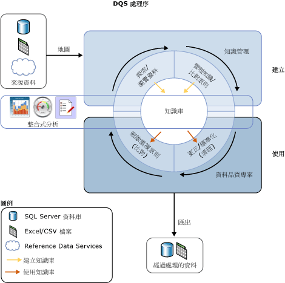

# Data Quality Services 簡介

[!INCLUDE[appliesto-ss-xxxx-xxxx-xxx-md-winonly](../includes/appliesto-ss-xxxx-xxxx-xxx-md-winonly.md)]

  [!INCLUDE[ssDQSnoversion](../includes/ssdqsnoversion-md.md)] (DQS) 提供的資料品質方案可讓資料管理人或 IT 專業人員維護其資料的品質，並確保資料適合其商業用途。 DQS 是知識驅動方案，可同時提供電腦輔助和互動式方法來管理資料來源的完整性和品質。 DQS 可讓您探索、建立以及管理資料的相關知識。 然後您可以使用該知識執行資料清理、比對和分析。 您也可以在 DQS 資料品質專案中使用參考資料提供者的雲端式服務。  
  
##   DQS 的商務需求  
 不正確的資料可能是因為使用者輸入錯誤、傳輸或儲存中損毀、不符的資料字典定義，以及其他資料品質與處理序問題。 從使用不同資料標準的不同來源彙總資料可能會導致資料不一致，因為可以套用任意規則或覆寫歷史資料。 不正確的資料影響企業執行其商務功能及提供客戶服務的能力，導致信譽與營收的損失、客戶不滿，以及符合問題。 自動系統通常不使用不正確的資料，而且不正確的資料會浪費執行手動程序的時間和人力。 不正確的資料可能會對資料分析、報告、資料採礦與倉儲造成破壞。  
  
 高品質資料對於企業和機構的效率都相當重要。 任何規模的組織都可以使用 DQS 提升其資料的資訊值，讓資料更適合其預期用途。 資料品質方案可以使資料更可靠、可存取以及可重複使用。 此方案可改善資料的完整性、精確度、符合度與一致性，解決商業智慧或資料倉儲工作負載以及運作之 OLTP 系統中，不正確的資料所造成的問題。  
  
 DQS 可讓非資料庫專家或程式設計人員的商務使用者、資訊工作者與 IT 專業人員能夠花最少的安裝或準備時間，即可建立、維護及執行其組織的資料品質作業。  
  
##   回應 DQS 的需求  
 資料品質並沒有絕對的定義。 其定義取決於資料是否適合它原本設計的用途。 DQS 會識別可能不正確的資料，並提供您資料實際上不正確之可能性的評估。 DQS 會提供您對於資料語意上的了解，讓您可以決定其適當性。 DQS 可讓您解決與不完整、不符合、不一致、不正確、無效以及資料重複相關的問題。  
  
 DQS 會提供下列功能以解決資料品質問題。  
  
-   **資料清理** ：同時使用電腦輔助程序與互動式程序修改、移除或充實不正確或不完整的資料。 如需詳細資訊，請參閱 [Data Cleansing](../data-quality-services/data-cleansing.md)。  
  
-   **比對** ：在以規則為基礎的程序中識別語意重複，這個程序可讓您判斷構成符合項目的元素，並執行刪除重複作業。 如需詳細資訊，請參閱 [Data Matching](../data-quality-services/data-matching.md)。  
  
-   **Reference Data Services** ：使用參考資料提供者的服務驗證資料的品質。 您可以使用 [Microsoft Azure Marketplace](http://azure.microsoft.com/marketplace/) 的 Reference Data Services 來清理、驗證、比對與充實資料。 如需詳細資訊，請參閱 [Reference Data Services in DQS](../data-quality-services/reference-data-services-in-dqs.md)。  
  
-   **分析** ：分析資料來源，讓您得以深入了解在知識探索、定義域管理、比對以及資料清理程序每個階段的資料品質。 分析在 DQS 資料品質方案中是一個功能強大的工具。 您可以建立資料品質方案，其中分析就如同知識管理、比對或資料清理一樣重要。 如需詳細資訊，請參閱 [Data Profiling and Notifications in DQS](../data-quality-services/data-profiling-and-notifications-in-dqs.md)。  
  
-   **監控** ：追蹤並判斷資料品質活動的狀態。 監控可讓您確認您的資料品質方案如您設計般運作。 如需詳細資訊，請參閱 [DQS Administration](../data-quality-services/dqs-administration.md)。  
  
-   **知識庫** ：Data Quality Services 是一個知識驅動方案，可根據您使用 DQS 建立的知識分析資料。 這可讓您建立資料品質程序，持續增強您資料的相關知識，並藉以提升資料的品質。  
  
 下圖顯示 DQS 程序：  
  
   
  
##   知識驅動方案  
 DQS 知識庫是三種知識類型的儲存機制：現成的知識、 [!INCLUDE[ssDQSServer](../includes/ssdqsserver-md.md)]產生的知識，以及使用者產生的知識。 DQS 可讓您在知識庫中儲存資料的相關知識、新增商務規則並適當地修改知識，然後套用該知識以測試資料的完整性與正確性。 建立知識庫之後，您可以持續改善該資料庫，然後在多個資料品質改善程序中重複使用它。  
  
 知識庫中的知識會識別可能不正確的資料，並建議對資料進行的變更。 它可以尋找資料符合項目，讓您執行刪除重複資料作業。 它可以將來源資料與資料品質提供者所維護和保證的雲端式參考資料做比較。 資料管理人或 IT 專業人員會同時驗證知識庫中的知識以及要進行的資料變更，並執行清理、刪除重複作業，以及 Reference Data Services。  
  
 知識庫會儲存與特定類型資料來源相關的所有知識。 例如，您可以為客戶資料庫維護一個知識庫，並為員工資料庫維護另一個知識庫。 知識包含在一個或多個資料定義域中，其中每個定義域是資料欄位中資料類型的語意表示。 客戶資料庫的知識庫可能會有適用於公司名稱、地址、連絡人、連絡人資訊等等的定義域。 一個定義域包含受信任的值、無效值和錯誤資料的清單。 定義域知識包括同義字關聯、詞彙關聯性、驗證和商務規則，以及比對原則。 以此知識為利器，資料管理人可以針對是否更正定義域中特定值執行個體做出明智決策。  
  
 DQS 可讓您使用知識庫執行匯入和匯出作業。 您可以使用 DQS 檔案匯入或匯出定義域或知識庫。 您可以從 Excel 檔案匯入值或定義域。 您也可以將清理程序根據知識庫所找到的值匯回定義域。 這些作業可讓您持續改善知識庫，以確認透過決策和探索得到的知識會路由傳送回知識庫。  
  
 DQS 知識驅動方案使用兩個基本步驟來清理資料：  
  
-   建立知識庫的 **知識管理** 程序  
  
-   根據知識庫中的知識而建議來源資料變更的 **資料品質專案** 。  
  
 如需詳細資訊，請參閱 [DQS 知識庫與定義域](../data-quality-services/dqs-knowledge-bases-and-domains.md)和[資料品質專案 &#40;DQS&#41;](../data-quality-services/data-quality-projects-dqs.md)。  
  
##   DQS 元件  
 Data Quality Services 包括 [!INCLUDE[ssDQSServer](../includes/ssdqsserver-md.md)] 和 [!INCLUDE[ssDQSClient](../includes/ssdqsclient-md.md)]。 這些元件可讓您與其他 SQL Server 作業分開執行 Data Quality Services。 兩者都是從 SQL Server 安裝程式安裝的。  
  
 [!INCLUDE[ssDQSServer](../includes/ssdqsserver-md.md)] 會當做三個 SQL Server 目錄實作，您可以在 SQL Server Management Studio 中管理並監控這些目錄 (DQS_MAIN、DQS_PROJECTS 和 DQS_STAGING_DATA)。 DQS_MAIN 包含 DQS 預存程序、DQS 引擎和已發行的知識庫。 DQS_PROJECTS 包含知識庫管理和 DQS 專案活動所需的資料。 DQS_STAGING_DATA 提供中繼暫存資料庫，您可以從中複製來源資料以執行 DQS 作業，然後匯出已處理的資料。  
  
 [!INCLUDE[ssDQSClient](../includes/ssdqsclient-md.md)] 是一個獨立應用程式，可讓您執行知識管理、資料品質專案，以及一個使用者介面的管理工作。 此應用程式是同時針對資料管理人和 DQS 管理員所設計。 它是獨立的可執行檔，會執行知識探索、定義域管理、比對原則建立、資料清理、比對、分析、監控和伺服器管理。 [!INCLUDE[ssDQSClient](../includes/ssdqsclient-md.md)] 可以與 [!INCLUDE[ssDQSServer](../includes/ssdqsserver-md.md)] 在同一部電腦上安裝及執行，或在另一部電腦上遠端安裝及執行。 為了易於使用， [!INCLUDE[ssDQSClient](../includes/ssdqsclient-md.md)] 中的許多作業都是精靈驅動的。  
  
##   Integration Services 和 Master Data Services 中的資料品質功能  
 Data Quality Services 提供的資料品質功能會內建到 SQL Server Integration Services (SSIS) 的元件，以及 Master Data Services (MDS) 的功能中，讓您在這些服務中執行資料品質程序。  
  
 **[!INCLUDE[ssDQSCleansingLong](../includes/ssdqscleansinglong-md.md)]**  
  
 [!INCLUDE[ssDQSCleansingLong](../includes/ssdqscleansinglong-md.md)] 可讓您執行資料清理，做為 Integration Services 封裝的一部分。 執行封裝時，會將資料清理當做批次檔案執行。 這是在 [!INCLUDE[ssDQSClient](../includes/ssdqsclient-md.md)] 應用程式中執行清理專案的替代方案。 您可以自動確保資料的品質。 您不必在 [!INCLUDE[ssDQSClient](../includes/ssdqsclient-md.md)] 應用程式中執行資料清理專案的互動式步驟。 您可以在資料流程中，加入包含其他 Integration Services 元件的資料清理程序。 如需詳細資訊，請參閱 [DQS 清理轉換](../integration-services/data-flow/transformations/dqs-cleansing-transformation.md)。  
  
 **Master Data Services 中的資料品質程序**  
  
 Data Quality Services 功能已被整合到 Master Data Services (MDS)，因此您可以在 Microsoft Excel 的 Microsoft SQL Server 2014 Master Data Services 增益集中，針對來源資料和主要資料執行刪除重複作業。 若要執行比對，請將 MDS 管理的資料載入 Excel 工作表中、將該資料與非 MDS 管理的資料結合，然後在 Excel 內執行比對。 [!INCLUDE[ssDQSServer](../includes/ssdqsserver-md.md)] 元件必須使用 MDS 安裝。 如需詳細資訊，請參閱  [適用於 Excel 的 MDS 增益集中的資料品質比對](../master-data-services/microsoft-excel-add-in/data-quality-matching-in-the-mds-add-in-for-excel.md)。  
  
  
