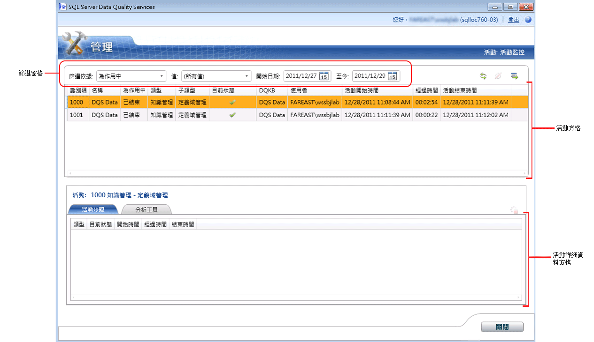

# 監控 DQS 活動
  本主題描述如何在 [!INCLUDE[ssDQSnoversion](../includes/ssdqsnoversion-md.md)] (DQS) 中集中監控下列活動：知識探索、定義域管理、比對原則、資料清理、資料比對和 SSIS 清理。  
  
##   開始之前  
  
###   限制事項  
 只有擁有 DQS_Main 資料庫之 dqs_administrator 角色的使用者能夠終止活動或停止活動中的處理序。  
  
###   安全性  
  
####   Permissions  
  
-   您必須擁有 DQS_MAIN 資料庫的 dqs_kb_editor 或 dqs_kb_operator 角色，才能檢視 DQS 活動。  
  
-   您必須擁有 DQS_MAIN 資料庫的 dqs_administrator 角色，才能終止活動或停止活動中的處理序 (除了檢視 DQS 活動以外)。  
  
##   檢視 DQS 活動  
  
1.  [!INCLUDE[ssDQSInitialStep](../includes/ssdqsinitialstep-md.md)] [執行資料品質用戶端應用程式](../data-quality-services/run-the-data-quality-client-application.md)。  
  
2.  在 [!INCLUDE[ssDQSClient](../includes/ssdqsclient-md.md)] 首頁畫面中，按一下 **[活動監控]**。 [活動監控] 畫面隨即顯示。  
  
       
  
3.  [活動監控] 畫面會在活動方格中顯示每個活動的相關資訊。 活動方格會顯示有關每個 DQS 活動的下列資訊：  
  
     **識別碼**︰ 整數值。 系統為活動監控所產生的唯一活動號碼。  
  
     **名稱**︰ 使用這項活動的知識庫或資料品質專案的名稱。  
  
     **為使用中**︰ 指出活動是否為目前使用中。 其值如下：  
  
    -   **使用中**：活動目前正在執行。  
  
    -   **已結束**：活動已完成。  
  
    -   **已終止**：DQS 系統管理員已經使用 [活動監控] 畫面來終止活動，或者在 [!INCLUDE[ssDQSClient](../includes/ssdqsclient-md.md)]的個別功能區域中執行活動時，使用者已經取消活動。  
  
     **型別**︰ 表示活動的型別。 **次要類型** 表示的活動型別執行特定工作流程。 下列活動類型會受到監視：  
  
    -   **知識管理** 子類型︰  
  
        -   **知識探索**  
  
        -   **定義域管理**  
  
        -   **比對原則**  
  
    -   **DQ 專案** 子類型︰  
  
        -   **清理**  
  
        -   **比對**  
  
    -   **SSIS 清理** 子類型︰  
  
        -   **清理**  
  
     **目前狀態**︰ 表示活動的目前狀態。 活動狀態是由最後一個計算程序所決定。 請注意，一個活動中可以有數個計算程序，例如多次執行探索程序 (在知識探索活動內部)。 因此，狀態可能會在活動存留期間變更許多次。  
  
     **目前狀態** 可以是下列值︰  
  
    -   **執行中**：計算程序正在執行中。  
  
    -   **成功**︰ 計算程序已經執行，而且一次計算之後結束成功處理之前設定此狀態。  
  
    -   **失敗**：計算程序失敗。  
  
    -   **已停止**：計算程序已停止。  
  
     **DQKB**︰ 用於活動的知識庫的名稱。  
  
     **使用者**︰ 起始活動之使用者或處理活動 （如果它們不是相同） 的最後一個使用者的名稱。  
  
     **活動開始時間**︰ 活動開始的時間與日期  
  
     **已耗用時間**︰ 活動啟動後所經過的時間。 以 HH:MM:SS 標記法顯示。  
  
     **活動結束時間**︰ 當活動的結束的時間與日期。  
  
##   篩選 DQS 活動資訊  
 您可以使用 [篩選] 窗格 (**篩選依據**, ，**值**, ，**自**, ，和 **至今**) 在活動監控] 畫面來篩選並檢視特定篩選準則為基礎的必要的活動。 若要篩選活動記錄：  
  
1.  決定篩選準則：您想要根據活動方格內其中一個資料行的值 (以值為基礎)、根據日期範圍，還是根據這兩者篩選活動記錄。  
  
    1.  **值為基礎的篩選**︰ 選取中的篩選準則 **篩選依據** 清單，並接著選取 [篩選依據的適當值 **值** 清單。 在 **[篩選依據]** 清單中選取選項時， **[值]** 清單會依據可能值來更新。 您可以依照活動記錄中的下列欄位來篩選： **[為使用中]**、 **[類型]**、 **[子類型]**、 **[目前狀態]**、 **[DQKB]**和 **[使用者]**。  
  
    2.  **日期範圍為基礎的篩選**︰ 選取適當的日期在 **開始日期** 和 **至今** 日期控制項。 根據預設， **[開始日期]** 中顯示的日期是目前日期的兩天前，而 **[至今]** 中顯示的日期是目前日期。 篩選不是根據「開始」  和「至今」  日期執行，而是依照範圍執行。 這表示選取之日期範圍內執行的每個活動都會顯示。  
  
2.  按一下 **[重新整理活動清單]** 圖示，即可套用篩選，並且僅檢視篩選的 DQS 活動。  
  
##   檢視 DQS 活動詳細資料  
 您可以在 [活動監控] 畫面中檢視 DQS 活動的詳細資訊，例如活動步驟和分析工具資訊。 若要這樣做：  
  
1.  在活動方格 (上方窗格) 中選取 DQS 活動。  
  
2.  下方窗格會在下列 2 個索引標籤底下顯示選取活動的活動詳細資料：  
  
    -   **活動步驟**︰ 顯示計算程序 （活動步驟） 與所選活動相關聯的方格。 此索引標籤底下的活動可能會顯示許多活動步驟。 如果使用者執行了活動中相同的活動步驟許多次，就可能會發生這種情況。 例如，停止並重新啟動活動步驟。 這個索引標籤底下的方格會針對每個與活動相關聯的活動步驟顯示下列資訊： **[類型]**、 **[目前狀態]**、 **[開始時間]**、 **[經過時間]**和 **[結束時間]**。  
  
    -   **分析工具**：顯示目前和歷程記錄活動的分析資訊。 若為目前活動，它會包含部分但一致的資訊。 當您將對應的活動詳細資料匯出至 Excel 檔案時，活動的分析資訊就會匯出至 Excel 檔案。 這項資訊會顯示在匯出之 Excel 檔案的 **[分析工具 - 來源]** 和 **[分析工具 - 欄位]** 工作表中。  
  
##   匯出 DQS 活動詳細資料  
 您可以將監控畫面中活動的活動屬性、活動處理序和分析資訊匯出至 Excel 檔案。 若要這樣做：  
  
1.  在活動方格 (上方窗格) 中選取活動。  
  
2.  按一下 **[將選取的活動匯出至 Excel]** 圖示。 或者，在活動方格中，任何活動上按一下滑鼠右鍵，然後按一下 [ **匯出活動** 快顯功能表中。  
  
3.  此時，系統會提示您指定要儲存之 Excel 檔案的名稱和位置。 匯出的 Excel 檔案包含下列工作表：  
  
    |工作表名稱|說明|  
    |----------------|-----------------|  
    |活動|包含活動的相關資訊 (資料行)，如活動方格所示。|  
    |處理序|包含做為中活動的處理程序的相關資訊 （資料行） **活動步驟** ] 索引標籤。|  
    |分析工具 - 來源|若為 **[清理]** 子類型，就會包含有關活動的下列資訊：[記錄]、[正確記錄]、[更正的記錄] 和 [無效的記錄]。   若為 **[知識探索]**、 **[定義域管理]**、 **[比對原則]**和 **[比對]** 子類型，就會包含有關活動的下列資訊：[記錄]、[總計值]、[新值]、[唯一值] 和 [新的唯一值]。|  
    |分析工具 - 欄位|若為 **[清理]** 和 **[SSIS 清理]** 子類型，就會包含有關活動的下列資訊：[欄位]、[定義域]、[更正的值]、[建議的值]、[完整性] 和 [精確度]。   若為 **[知識探索]**、 **[定義域管理]**、 **[比對原則]**和 **[比對]** 子類型，就會包含有關活動的下列資訊：[欄位]、[定義域]、[新增]、[唯一]、[在定義域中有效] 和 [完整性]。|  
  
##   終止 DQS 活動  
 DQS 系統管理員 （dqs_administrator 角色） 可以終止執行中 （使用） 活動的型別不是 **SSIS 清理**。 終止活動會停止活動中所有執行中的處理序，並且移除與活動相關的一切資訊。 此作業無法復原。 在 [活動監控] 畫面中終止活動就相當於在 **的功能區域中執行活動時按一下** [取消] [!INCLUDE[ssDQSClient](../includes/ssdqsclient-md.md)]，藉以取消個別活動。 若要終止活動：  
  
1.  在活動方格 (上方窗格) 中選取執行中活動。  
  
2.  按一下 **[終止選取的活動]** 圖示。 或者，在活動方格中，活動上按一下滑鼠右鍵，然後按一下 [ **終止活動** 快顯功能表中。  
  
3.  此時，系統會顯示一則確認動作的訊息。 按一下 **[是]**。  
  
##   停止 DQS 活動中的處理序  
 DQS 系統管理員 （dqs_administrator 角色） 可以停止執行中 （使用） 中的處理序的類型不是活動 **SSIS 清理**。 在 [活動監控] 畫面中停止處理序就相當於在 [!INCLUDE[ssDQSClient](../includes/ssdqsclient-md.md)]的功能區域中停止個別活動內的處理序。 例如，停止清理活動內的電腦輔助清理處理序，或是停止比對活動內的比對處理序。 您無法從 [活動監控] 畫面重新啟動已停止的處理序。 您必須從 [!INCLUDE[ssDQSClient](../includes/ssdqsclient-md.md)]的個別功能區域重新啟動處理序。 在此情況下，額外的資料列會加入至 **[活動步驟]** 索引標籤中的處理序方格。 已停止的處理序狀態持續顯示 **[已停止]**。 若要停止處理序：  
  
1.  在活動詳細資料方格 (下方窗格) 中選取執行中處理序。  
  
2.  按一下 **[停止選取的處理序]** 圖示。 或者，以滑鼠右鍵按一下活動方格中的詳細資料，處理程序，然後按一下 [ **停止處理序** 快顯功能表中。  
  
3.  此時，系統會顯示一則確認動作的訊息。 按一下 **[是]**。  
  
  