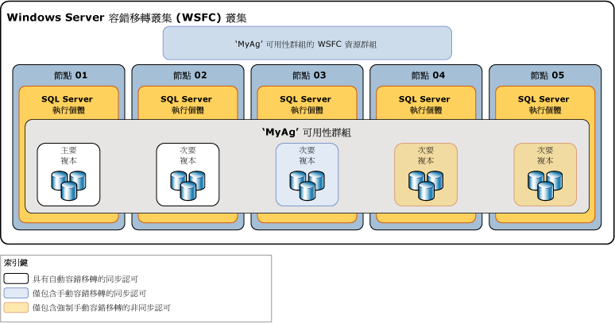

# 可用性模式 (AlwaysOn 可用性群組)
[!INCLUDE[appliesto-ss-xxxx-xxxx-xxx-md](../../../includes/appliesto-ss-xxxx-xxxx-xxx-md.md)]

  在 [!INCLUDE[ssHADR](../../../includes/sshadr-md.md)] 中，「可用性模式」為複本屬性，可判斷給定可用性複本是否可以在同步認可模式下執行。 您必須將每個可用性複本的可用性模式設定為同步認可模式、非同步認可模式或僅限設定模式。  若將主要複本設定為「非同步認可模式」，其便不會等候任何次要複本將內送交易記錄檔記錄寫入磁碟 (「強行寫入記錄」)。 若將給定次要複本設定為非同步認可模式，主要複本便不會等候次要複本強行寫入記錄。 若將主要複本與給定次要複本皆設定為「同步認可模式」，主要複本會等候次要複本確認其已強行寫入記錄 (除非次要複本在主要的「工作階段逾時期限」內無法 Ping 主要複本)。 
  

> [!NOTE]  
>  若次要複本超過主要的工作階段逾時期限，主要複本將會暫時切換為該次要複本的非同步認可模式。 當次要複本與主要複本重新連接時，即會回復成同步認可模式。  
  
 **本主題內容：**  
  
-   [支援的可用性模式](#SupportedAvModes)  
  
-   [Asynchronous-Commit Availability Mode](#AsyncCommitAvMode)  
  
-   [Synchronous-Commit Availability Mode](#SyncCommitAvMode)  
  
-   [相關工作](#RelatedTasks)  
  
-   [相關內容](#RelatedContent)  
  
##   支援的可用性模式  
 [!INCLUDE[ssHADR](../../../includes/sshadr-md.md)] 支援三種可用性模式— 非同步認可模式、同步認可模式和僅設定模=式，如下所示：  
  
-   「非同步認可模式」是一種當可用性複本分散距離相當遠時仍可正常運作的災害復原解決方案。 如果每個次要複本都在非同步認可模式下執行，主要複本就不會等候任何次要複本強行寫入記錄。 而是，將記錄檔記錄寫入本機記錄檔之後，主要複本會立即將交易確認傳送至用戶端。 主要複本會以相對於設定為非同步認可模式之次要複本的最低交易延遲執行。  如果目前主要複本設定為非同步認可的可用性模式，它將會以非同步方式認可所有次要複本的交易，不論其個別可用性模式設定為何。  
  
     如需詳細資訊，請參閱本主題稍後的[非同步認可的可用性模式](#AsyncCommitAvMode)。  
  
-   「同步認可模式」強調的是高可用性而非效能，但是相對地增加了交易延遲。 在同步認可模式下，交易會等候傳送交易確認至用戶端，直到次要複本將記錄強行寫入磁碟為止。 當資料同步處理開始在次要資料庫上執行時，次要複本就會開始套用對應主要資料庫中的內送記錄檔記錄。 一旦強行寫入每個記錄檔記錄之後，次要資料庫就會進入 SYNCHRONIZED 狀態。 此後，在記錄檔記錄寫入本機記錄檔之前，次要複本會先強行寫入每筆新交易。 當給定次要複本的所有次要資料庫都已同步處理時，同步認可模式就會支援手動容錯移轉，並且選擇性地支援自動容錯移轉。  
  
     如需詳細資訊，請參閱本主題稍後的 [同步認可的可用性模式](#SyncCommitAvMode)。  

-   「僅限設定模式」適用於不在 Windows Server 容錯移轉叢集的可用性群組。 僅限設定模式中的複本不會包含使用者資料。 在僅限設定模式中，master 資料庫複本會儲存可用性群組設定中繼資料。 如需詳細資訊，請參閱[使用僅限設定複本的可用性群組](../../../linux/sql-server-linux-availability-group-ha.md)。
  
 下圖顯示包含五個可用性複本的可用性群組。 主要複本和一個次要複本設定為包含自動容錯移轉的同步認可模式。 另一個次要複本則設定為僅包含規劃的手動容錯移轉的同步認可模式，而且兩個次要複本設定為非同步認可模式 (僅支援強制手動容錯移轉，一般稱為「強制容錯移轉」)。  
  
   
  
 兩個可用性複本之間的同步處理和容錯移轉行為取決於兩個複本的可用性模式。 例如，如果要發生同步認可，目前相關的主要複本和次要複本都必須設定成同步認可。 同樣地，若要發生自動容錯移轉，兩個複本都必須設定為自動容錯移轉。 因此，上面所示的部署案例行為可摘要於下表中，該表會探索每個可能主要複本的行為：  
  
|目前的主要複本|自動容錯移轉目標|同步認可模式行為|非同步認可模式行為|自動容錯移轉可行|  
|-----------------------------|--------------------------------|--------------------------------------------|---------------------------------------------|---------------------------------|  
|01|02|02 與 03|04|是|  
|02|01|01 與 03|04|是|  
|03||01 與 02|04|否|  
|04|||01、02 和 03|否|  
  
 一般而言，當做非同步認可複本的節點 04 會部署在災害復原網站中。 節點 01、02 和 03 在容錯移轉至節點 04 之後依然處於非同步認可模式的事實，可避免您的可用性群組中因為兩個網站之間的網路延遲而可能較低效能。  
  
##   Asynchronous-Commit Availability Mode  
 在「非同步認可模式」下，次要複本永遠不會與主要複本同步處理。 雖然給定的次要資料庫可能會趕上對應的主要資料庫，不過任何次要資料庫都可能會在任何時間點落後。 對於主要複本與次要複本相距甚遠、您不希望小錯誤對主要複本造成影響，或是效能勝於同步處理資料保護等災難復原情況下，可以使用非同步認可模式。 此外，因為主要複本不會等候次要複本的確認，所以次要複本的問題永遠不會影響主要複本。  
  
 非同步認可的次要複本會嘗試與主要複本所傳來的記錄檔記錄保持同步。 但非同步認可的次要資料庫一律會保持未同步處理的狀態，而且可能會稍微落後對應的主要資料庫。 非同步認可之次要資料庫與對應之主要資料庫間的差距通常很小。 但裝載次要複本的伺服器若是超過負載或網路太慢，此差距就會變大。  
  
 非同步認可模式唯一支援的容錯移轉形式為強制容錯移轉 (可能會遺失資料)。 強制容錯移轉是最後的方法，當目前的主要複本會有一長段時間無法使用，以及主要資料庫的立即可用性高於遺失資料的潛在風險時，即可使用此方法。容錯移轉目標的複本角色必須處於 SECONDARY 或 RESOLVING 狀態。 容錯移轉目標會轉換成主要角色，而且其資料庫副本會變成主要資料庫。 當剩餘的次要資料庫與先前的主要資料庫恢復其可用性時，系統會暫停這些資料庫，直到您手動一一回復為止。 在非同步認可模式下，所有原始主要複本尚未傳送至先前之次要複本的交易記錄檔皆會遺失。 這表示有部分或全部新主要資料庫可能會缺少最近認可的交易。 如需強制容錯移轉運作方式及使用時之最佳做法的詳細資訊，請參閱 [容錯移轉及容錯移轉模式 &#40;AlwaysOn 可用性群組&#41;](../../../database-engine/availability-groups/windows/failover-and-failover-modes-always-on-availability-groups.md)。  
  
##   Synchronous-Commit Availability Mode  
 在同步認可的可用性模式 (「同步認可模式」) 下聯結至可用性群組之後，次要資料庫會趕上對應的主要資料庫並且進入 SYNCHRONIZED 狀態。 只要資料同步處理繼續進行，次要資料庫就會維持 SYNCHRONIZED 狀態。 這可確保在給定主要資料庫上認可的每筆交易，在對應的次要資料庫上也已獲得認可。 當給定次要複本上的每個次要資料庫都已同步處理時，整個次要複本的同步處理健全狀態就是 HEALTHY。  
  
 **本節內容：**  
  
-   [干擾資料同步處理的因素](#DisruptSync)  
  
-   [次要複本的同步處理運作方式](#HowSyncWorks)  
  
-   [僅包含手動容錯移轉的同步認可模式](#SyncCommitWithManual)  
  
-   [包含自動容錯移轉的同步認可模式](#SyncCommitWithAuto)  
  
###   干擾資料同步處理的因素  
 一旦次要複本的所有資料庫都已同步處理之後，它就會進入 HEALTHY 狀態。 除非發生下列其中一種狀況，否則已同步處理的次要複本將維持狀況良好：  
  
-   網路或電腦延遲或問題導致次要複本與主要複本之間的工作階段逾時。  
  
    > [!NOTE]  
    >  如需可用性複本之工作階段時間屬性的資訊，請參閱 [AlwaysOn 可用性群組概觀 &#40;SQL Server&#41;](../../../database-engine/availability-groups/windows/overview-of-always-on-availability-groups-sql-server.md)。  
  
-   您暫停了次要複本上的次要資料庫。 次要複本會停止同步處理，而且其同步處理健全狀態會標記為 NOT_HEALTHY。 在暫停的次要資料庫恢復並重新同步處理，或從可用性群組中移除暫停的次要資料庫之前，次要複本無法再次變成狀況良好。  
  
-   您將主要資料庫加入至可用性群組。 先前同步處理的次要複本會進入 NOT_HEALTHY 同步處理健全狀態。 這種狀態表示至少有一個資料庫處於 NOT SYNCHRONIZING 同步處理狀態。 在對應的次要資料庫已經在複本上完成準備、已經聯結至可用性群組，而且已經與新的主要資料庫同步處理之前，給定的次要複本無法再次變成 HEALTHY。  
  
-   您將主要複本或次要複本變更為非同步認可的可用性模式。 變更為非同步認可模式之後，只要資料同步處理繼續進行，次要複本將會維持 HEALTHY 同步處理健全狀態。 不過，如果只有主要複本變更為非同步認可模式，同步認可次要複本將會進入 PARTIALLY_HEALTHY 同步處理健全狀態。 這種狀態表示至少有一個資料庫處於 SYNCHRONIZING 同步處理狀態，但是沒有任何資料庫處於 NOT SYNCHRONIZING 狀態。  
  
-   您將任何次要複本變更為同步認可的可用性模式。 這會導致該次要複本標記為處於 PARTIALLY_HEALTHY 同步處理健全狀態， 直到其所有資料庫都處於 SYNCHRONIZED 同步處理狀態為止。  
  
> [!TIP]  
>  若要檢視可用性群組、可用性複本或可用性資料庫的同步處理健康情況，請分別查詢 **sys.dm_hadr_availability_group_states** 、 **sys.dm_hadr_availability_replica_states** 或 [sys.dm_hadr_database_replica_states](../../../relational-databases/system-dynamic-management-views/sys-dm-hadr-availability-group-states-transact-sql.md)的 [synchronization_health](../../../relational-databases/system-dynamic-management-views/sys-dm-hadr-availability-replica-states-transact-sql.md)或 [synchronization_health_desc](../../../relational-databases/system-dynamic-management-views/sys-dm-hadr-database-replica-states-transact-sql.md)資料行。  
  
###   次要複本的同步處理運作方式  
 在同步認可模式下，當次要複本聯結可用性群組並且建立包含主要複本的工作階段之後，次要複本就會將內送記錄檔記錄寫入磁碟 (「強行寫入記錄」) 並將確認訊息傳送至主要複本。 一旦次要資料庫的強行寫入記錄趕上主要資料庫的記錄結尾之後，次要資料庫的狀態就會設定為 SYNCHRONIZED。 同步處理所需的時間主要取決於工作階段開始時，次要資料庫落後主要資料庫的程度 (依照一開始從主要複本收到的記錄檔記錄數目計算)、主要資料庫的工作負載以及裝載次要複本之伺服器執行個體的電腦速度。  
  
 維持同步作業的做法如下：  
  
1.  從用戶端收到交易時，主要複本會將交易的記錄寫入交易記錄，同時將記錄檔記錄傳送至次要複本。  
  
2.  一旦記錄檔記錄寫入主要資料庫的交易記錄之後，只有當此時容錯移轉至沒有收到記錄的次要複本時，才能恢復交易。 主要複本會等候同步認可次要複本的確認。  
  
3.  次要複本會強行寫入記錄並將確認傳回給主要複本。  
  
4.  收到次要複本的確認時，主要複本就會完成認可處理並將確認訊息傳送至用戶端。  
  
    > [!NOTE]  
    >  如果同步認可次要複本逾時，而未確認它是否已強行寫入記錄，主要複本就會將該次要複本標記為失敗。 次要複本的連接狀態會變更為 DISCONNECTED，而且主要複本會停止等候次要複本的確認。 這種行為可確保失敗的同步認可次要複本不會防止強行寫入主要複本的交易記錄。  
  
 同步認可模式會藉由要求同步處理兩地的資料來保護資料，但是相對地稍微增加了交易的延遲。  
  
###  僅包含手動容錯移轉的同步認可模式  
 當這些複本都已連接而且資料庫已同步處理時，就會支援手動容錯移轉。 如果次要複本關閉，主要複本將不受影響。 如果沒有任何 SYNCHRONIZED 複本存在，主要複本會公開執行 (亦即，不會將資料傳送至任何次要複本)。 如果主要複本已遺失，次要複本就會進入 RESOLVING 狀態，但是資料庫擁有者可以強制容錯移轉至次要複本 (可能會遺失資料)。 如需詳細資訊，請參閱本主題稍後的 [容錯移轉及容錯移轉模式 &#40;AlwaysOn 可用性群組&#41;](../../../database-engine/availability-groups/windows/failover-and-failover-modes-always-on-availability-groups.md)。  
  
###   包含自動容錯移轉的同步認可模式  
 自動容錯移轉可確保主要複本遺失之後快速地重新提供資料庫，藉以提供高可用性。 若要將可用性群組設定為自動容錯移轉，您必須將目前的主要複本和至少一個次要複本都設定為包含自動容錯移轉的同步認可模式。 您可以擁有多達三個自動容錯移轉複本。  
  
 此外，為了能夠在給定的時間進行自動容錯移轉，這個次要複本必須與主要複本同步處理 (亦即，次要資料庫都會同步處理)，而且 Windows Server 容錯移轉叢集 (WSFC) 叢集必須具有仲裁。 如果主要複本在這些條件下變得無法使用，就會進行自動容錯移轉。 次要複本會切換成主要角色，而且它會提供其資料庫做為主要資料庫。 如需詳細資訊，請參閱[容錯移轉及容錯移轉模式 &#40;AlwaysOn 可用性群組&#41;](../../../database-engine/availability-groups/windows/failover-and-failover-modes-always-on-availability-groups.md) 主題的＜自動容錯移轉＞一節。  
  
> [!NOTE]  
>  如需 WSFC 仲裁和 [!INCLUDE[ssHADR](../../../includes/sshadr-md.md)] 的資訊，請參閱 [WSFC 仲裁模式和投票組態 &#40;SQL Server&#41;](../../../sql-server/failover-clusters/windows/wsfc-quorum-modes-and-voting-configuration-sql-server.md)。  

### 次要複本上的資料延遲
如果您的唯讀工作負載可以容忍某些資料延遲時，實作次要複本的唯讀存取會很有用。 在無法接受資料延遲的狀況下，請考慮針對主要複本執行唯讀工作負載。

主要複本上會將主要資料庫變更的記錄檔記錄傳送到次要複本。 在每個次要資料庫上，專用的重做執行緒會套用記錄檔記錄。 在讀取存取的次要資料庫上，指定的資料變更不會出現在查詢結果，除非包含變更的記錄檔記錄已套用至次要資料庫，而且已經在主要資料庫認可交易。+

這表示，主要複本和次要複本之間會有一些延遲 (通常只有幾秒鐘)。 但在很少見的情況下 (例如網路問題減少輸送量的狀況下)，延遲可能會比較長。 在發生 I/O 瓶頸和資料移動暫停時，會增加延遲。 若要監視暫停的資料移動，您可以使用 [AlwaysOn 儀表板](../../../database-engine/availability-groups/windows/use-the-always-on-dashboard-sql-server-management-studio.md)或 [sys.dm_hadr_database_replica_states 動態管理檢視](../../../relational-databases/system-dynamic-management-views/sys-dm-hadr-database-replica-states-transact-sql.md)。

如需調查次要複本上重做延遲的詳細資訊，請參閱[針對未反映在次要複本的主要變更進行疑難排解](../../../database-engine/availability-groups/windows/troubleshoot-primary-changes-not-reflected-on-secondary.md)。
  
##   相關工作  
 **若要變更可用性模式與容錯移轉模式**  
  
-   [變更可用性複本的可用性模式 &#40;SQL Server&#41;](../../../database-engine/availability-groups/windows/change-the-availability-mode-of-an-availability-replica-sql-server.md)  
  
-   [變更可用性複本的容錯移轉模式 &#40;SQL Server&#41;](../../../database-engine/availability-groups/windows/change-the-failover-mode-of-an-availability-replica-sql-server.md)  
  
 **若要調整仲裁投票**  
  
-   [檢視叢集仲裁 NodeWeight 設定](../../../sql-server/failover-clusters/windows/view-cluster-quorum-nodeweight-settings.md)  
  
-   [設定叢集仲裁 NodeWeight 設定](../../../sql-server/failover-clusters/windows/configure-cluster-quorum-nodeweight-settings.md)  
  
-   [在無仲裁情況下強制啟動 WSFC 叢集](../../../sql-server/failover-clusters/windows/force-a-wsfc-cluster-to-start-without-a-quorum.md)  
  
 **執行手動容錯移轉**  
  
-   [執行可用性群組的已規劃手動容錯移轉 &#40;SQL Server&#41;](../../../database-engine/availability-groups/windows/perform-a-planned-manual-failover-of-an-availability-group-sql-server.md)  
  
-   [執行可用性群組的強制手動容錯移轉 &#40;SQL Server&#41;](../../../database-engine/availability-groups/windows/perform-a-forced-manual-failover-of-an-availability-group-sql-server.md)  
  
-   [使用容錯移轉可用性群組精靈 &#40;SQL Server Management Studio&#41;](../../../database-engine/availability-groups/windows/use-the-fail-over-availability-group-wizard-sql-server-management-studio.md)  
  
 **若要檢視可用性群組、可用性複本和資料庫狀態**  
  
-   [sys.dm_hadr_availability_group_states &#40;Transact-SQL&#41;](../../../relational-databases/system-dynamic-management-views/sys-dm-hadr-availability-group-states-transact-sql.md)  
  
-   [sys.dm_hadr_availability_replica_states &#40;Transact-SQL&#41;](../../../relational-databases/system-dynamic-management-views/sys-dm-hadr-availability-replica-states-transact-sql.md)  
  
-   [sys.dm_hadr_database_replica_states &#40;Transact-SQL&#41;](../../../relational-databases/system-dynamic-management-views/sys-dm-hadr-database-replica-states-transact-sql.md)  
  
##   相關內容  
  
-   [Microsoft SQL Server AlwaysOn 高可用性和災害復原方案指南](http://go.microsoft.com/fwlink/?LinkId=227600)  
  
-   [SQL Server AlwaysOn 團隊部落格：SQL Server AlwaysOn 官方團隊部落格](https://blogs.msdn.microsoft.com/sqlalwayson/)  
  
## 另請參閱  
 [AlwaysOn 可用性群組概觀 &#40;SQL Server&#41;](../../../database-engine/availability-groups/windows/overview-of-always-on-availability-groups-sql-server.md)   
 [容錯移轉及容錯移轉模式 &#40;AlwaysOn 可用性群組&#41;](../../../database-engine/availability-groups/windows/failover-and-failover-modes-always-on-availability-groups.md)   
 [SQL Server 的 Windows Server 容錯移轉叢集 &#40;WSFC&#41;](../../../sql-server/failover-clusters/windows/windows-server-failover-clustering-wsfc-with-sql-server.md)  
  
  
