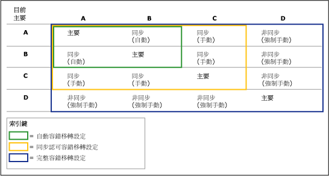
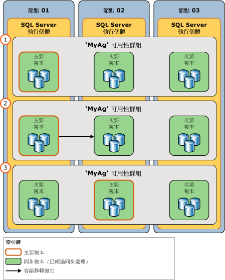

# 容錯移轉及容錯移轉模式 (AlwaysOn 可用性群組)
[!INCLUDE [SQL Server](../../../includes/applies-to-version/sqlserver.md)]

  在可用性群組的內容中，可用性複本的主要角色和次要角色在稱為 *「容錯移轉」* (Failover) 的程序中通常可以互換。 容錯移轉共有三種形式，包括自動容錯移轉 (不會遺失資料)、規劃的手動容錯移轉 (不會遺失資料)，以及強制手動容錯移轉 (可能會遺失資料)，這種形式通常稱為「強制容錯移轉」。 自動及經過規劃的手動容錯移轉會保留您的所有資料。 可用性群組會在可用性複本層級容錯移轉。 亦即可用性群組會容錯移轉至其中一個次要複本 (目前的「容錯移轉目標」)。  
  
> [!NOTE]  
>  資料庫層級問題 (如資料庫因為資料檔案遺失而有問題、資料庫刪除或交易記錄損毀) 並不會造成可用性群組容錯移轉。  
  
 容錯移轉期間，容錯移轉目標會接管主要角色並復原其資料庫，使之上線之後做為新的主要資料庫。 之前的主要複本 (如果可用的話) 會切換到次要角色，而且其資料庫會變成次要資料庫。 原則上，這些角色可以來回切換 (或切換為不同的容錯移轉目標)，以回應多項失敗或達成管理目的。  
  
 指定可用性複本支援的容錯移轉形式是由 [容錯移轉模式] 屬性所指定。 指定可用性複本的可能容錯移轉模式取決於複本的[可用性模式](../../../database-engine/availability-groups/windows/availability-modes-always-on-availability-groups.md)，如下所示：  
  
-   **同步認可複本**支援兩個設定：自動或手動。 「自動」設定同時支援自動容錯移轉和手動容錯移轉。 若要避免資料遺失，自動容錯移轉和已規劃的容錯移轉要求容錯移轉目標必須是同步處理狀態良好的同步認可次要複本 (這表示容錯移轉目標上的每個次要資料庫與對應的主要資料庫同步處理)。 當次要複本不符合上述兩項條件時，只會支援強制容錯移轉。 請注意，在角色處於 RESOLVING 狀態的複本中也支援強制容錯移轉。  
  
-   **非同步認可複本** 僅支援手動容錯移轉模式。 此外，因為它們絕對不會同步處理，所以僅支援強制容錯移轉。  
  
> [!NOTE]  
>  容錯移轉之後，需要存取主要資料庫的用戶端應用程式必須連接至新的主要複本。 若新的次要複本設定為允許唯讀存取，則唯讀用戶端應用程式即可連接至該次要複本。 如需用戶端如何連接到可用性群組的資訊，請參閱[可用性群組接聽程式、用戶端連線及應用程式容錯移轉 &#40;SQL Server&#41;](../../../database-engine/availability-groups/windows/listeners-client-connectivity-application-failover.md)。  
  
 **本主題的章節：**  
  
-   [詞彙和定義](#TermsAndDefinitions)  
  
-   [容錯移轉的概觀](#Overview)  
  
-   [自動容錯移轉](#AutomaticFailover)  
  
-   [已規劃的手動容錯移轉 (不會遺失資料)](#ManualFailover)  
  
-   [強制容錯移轉 (可能會遺失資料)](#ForcedFailover)  
  
-   [相關工作](#RelatedTasks)  
  
-   [相關內容](#RelatedContent)  
  
##   詞彙和定義  
 自動容錯移轉  
 在遺失主要複本時自動發生的容錯移轉。 只有在使用設為 AUTOMATIC 的容錯移轉模式同時設定目前的主要複本和一個次要複本，且次要複本目前已同步處理時，才支援自動容錯移轉。  如果主要或次要複本的容錯移轉模式為 MANUAL，則無法進行自動容錯移轉。  
  
 已規劃的手動容錯移轉 (不會遺失資料)  
 規劃的手動容錯移轉 (或「手動容錯移轉」) 通常是指資料庫管理員基於系統管理目的起始的容錯移轉。 只有在主要複本和次要複本都設定為同步認可模式，而且主要複本和次要複本目前均已同步 (處於 SYNCHRONIZED 狀態) 時，才支援規劃的手動容錯移轉。 當目標次要複本已同步處理時，即使主要複本已經當機，手動容錯移轉 (不會遺失資料) 也是可能的，因為次要資料庫已做好容錯移轉的準備。 資料庫管理員會手動起始手動容錯移轉。  
  
 強制容錯移轉 (可能會遺失資料)  
 如果沒有次要複本與主要複本同步處理 (SYNCHRONIZED) 或主要複本未執行而且沒有任何次要複本已做好容錯移轉的準備，資料庫管理員可起始的容錯移轉。 強制容錯移轉可能造成資料遺失，建議僅限用於災害復原。 強制容錯移轉只能手動起始，因此視為一種強制手動容錯移轉。 這是在同步認可的可用性模式下唯一支援的容錯移轉形式。  
  
 [!INCLUDE[ssFosAutoC](../../../includes/ssfosautoc-md.md)]  
 在特定可用性群組內，是指使用自動容錯移轉 (如果有的話) 設定成同步認可模式的一對可用性複本 (包括目前的主要複本)。 只有在次要複本目前與主要複本 SYNCHRONIZED 時，[!INCLUDE[ssFosAuto](../../../includes/ssfosauto-md.md)] 才會生效。  
  
 [!INCLUDE[ssFosSyncC](../../../includes/ssfossyncc-md.md)]  
 在特定可用性群組內，是指設定成同步認可模式 (如果有) 的一組兩個或三個可用性複本 (包括目前的主要複本)。 只有在次要複本設定成手動容錯移轉模式，而且至少一個次要複本目前與主要複本 SYNCHRONIZED 時， [!INCLUDE[ssFosSync](../../../includes/ssfossync-md.md)]才會生效。  
  
 [!INCLUDE[ssFosEntireC](../../../includes/ssfosentirec-md.md)]  
 在給定的可用性群組中，其操作狀態目前 ONLINE (不管是可用性模式還是容錯移轉模式) 的這組全部的可用性複本。 在目前沒有次要複本與主要複本 SYNCHRONIZED 時， [!INCLUDE[ssFosEntire](../../../includes/ssfosentire-md.md)]會變成相關。  
  
##   容錯移轉的概觀  
 下表摘要說明不同可用性和容錯移轉模式下支援的容錯移轉形式。 對於每個配對，有效的可用性模式和容錯移轉模式是由主要複本模式與一個或多個次要複本模式的交集所決定。  
  
|容錯移轉形式|非同步認可模式|包含手動容錯移轉模式的同步認可模式|包含自動容錯移轉模式的同步認可模式|  
|-------------------------------|---------------------------------------------------------|------------------------------------------------------------|  
|自動容錯移轉|否|否|是|  
|已規劃的手動容錯移轉|否|是|是|  
|強制容錯移轉|是|是|是 **&#42;**|  
  
 **&#42;** 如果您在已同步處理的次要複本上發出強制容錯移轉命令，次要複本的行為會與手動容錯移轉時相同。  
  
 在容錯移轉期間，資料庫無法使用的時間量將依容錯移轉的類型及其原因而定。  
  
> [!IMPORTANT]  
>  為了在容錯移轉之後支援用戶端連接，除了自主資料庫之外，在任何先前的主要資料庫上定義的登入和作業都必須在新的主要資料庫上手動重新建立。 如需詳細資訊，請參閱 [管理可用性群組之資料庫的登入及工作 &#40;SQL Server&#41;](../../../database-engine/availability-groups/windows/logins-and-jobs-for-availability-group-databases.md)(Failover) 的程序中通常可以互換。  
  
### 容錯移轉設定  
 由容錯移轉設定便能理解給定的可用性群組可能進行的容錯移轉形式。 容錯移轉設定是由支援給定容錯移轉形式的主要複本與次要複本所組成，如下所示：  
  
-   **[!INCLUDE[ssFosAutoC](../../../includes/ssfosautoc-md.md)] (選擇性)：** 在特定可用性群組內，是指使用自動容錯移轉 (如果有的話) 設定成同步認可模式的一對可用性複本 (包括目前的主要複本)。 自動容錯移轉設定只有在次要複本目前與主要複本 SYNCHRONIZED 時才會生效。  
  
-   **[!INCLUDE[ssFosSyncC](../../../includes/ssfossyncc-md.md)] (選擇性)：** 在特定可用性群組內，是指設定成同步認可模式 (如果有) 的一組兩個或三個可用性複本 (包括目前的主要複本)。 同步認可容錯移轉設定只有在次要複本設定成手動容錯移轉模式，而且至少一個次要複本目前與主要複本 SYNCHRONIZED 時才會生效。  
  
-   **[!INCLUDE[ssFosEntireC](../../../includes/ssfosentirec-md.md)]：** 在給定的可用性群組中，其操作狀態目前 ONLINE (不管是可用性模式還是容錯移轉模式) 的這組全部的可用性複本。 完整容錯移轉設定會在次要複本目前與主要複本 SYNCHRONIZED 時變成相關。  
  
 當使用自動容錯移轉將可用性複本設定成同步認可時，該可用性複本會變成 [!INCLUDE[ssFosAuto](../../../includes/ssfosauto-md.md)]的一部分。 不過，設定是否生效，取決於目前的主要複本。 實際上在給定時間可能進行的容錯移轉形式取決於目前生效的容錯移轉設定。  
  
 例如，請考慮使用擁有四個可用性複本的可用性群組，如下所示：  
  
|複本|可用性模式與容錯移轉模式設定|  
|-------------|--------------------------------------------------|  
|A|包含自動容錯移轉的同步認可|  
|B|包含自動容錯移轉的同步認可|  
|C|僅包含已規劃的手動容錯移轉的同步認可|  
|D|非同步認可 (僅包含強制容錯移轉)|  
  
 每個次要複本的容錯移轉行為取決於目前是主要複本的可用性複本。 基本上，若是給定的次要複本，容錯移轉行為是最嚴重的目前給定主要複本案例。 下圖說明次要複本的容錯移轉行為如何根據目前主要複本，以及它設定為非同步認可模式 (只使用強制容錯移轉) 或同步認可模式 (不論是否使用自動容錯移轉)，而有所不同。  
  
   
  
##   Automatic Failover  
 自動容錯移轉會使合格的次要複本在主要複本變成無法使用之後，自動移轉到主要角色。 當裝載主要複本的 WSFC 節點是裝載次要複本的本機節點時，最適合使用自動容錯移轉。 這是因為資料同步處理在電腦之間有低度訊息延遲時效果最佳，而且因為用戶端連接可以保持本機狀態。  
  
 **本節內容：**  
  
-   [自動容錯移轉所需的條件](#RequiredConditions)  
  
-   [自動容錯移轉如何運作](#HowAutoFoWorks)  
  
-   [若要啟用自動容錯移轉](#EnableAutoFo)  
  
###   自動容錯移轉所需的條件  
 只有在下列情況下，才會進行自動容錯移轉：  
  
-   自動容錯移轉設定已存在。 此設定是由一併設定成同步認可模式及 AUTOMATIC 容錯移轉的主要複本與次要複本所組成，後者稱為「自動容錯移轉目標」。 如果主要複本設為 MANUAL 容錯移轉，則即使次要複本是設為 AUTOMATIC 容錯移轉，也不會發生自動容錯移轉。  
  
     如需詳細資訊，請參閱 [可用性模式 &#40;AlwaysOn 可用性群組&#41;](../../../database-engine/availability-groups/windows/availability-modes-always-on-availability-groups.md)或 PowerShell，針對 AlwaysOn 可用性群組執行規劃的手動容錯移轉或強制手動容錯移轉 (強制容錯移轉)。  
  
-   自動容錯移轉目標的同步處理狀態良好 (這表示容錯移轉目標上的每一個次要資料庫會與其對應的主要資料庫同步處理)。  
  
    > [!TIP]  
    >  AlwaysOn 可用性群組會監視自動容錯移轉組中兩個複本的健全狀況。 如果任一複本失敗，可用性群組的健全狀態將設為 CRITICAL。 如果次要複本失敗，則因自動容錯移轉目標已無法使用而不可能發生自動容錯移轉。 如果主要複本失敗，可用性群組便會容錯移轉至次要複本。 在原先的主要複本恢復上線之前，並無任何自動容錯移轉目標存在。 不論是哪一種情況，為確保罕見地發生相繼失敗時仍能維持可用性，建議您設定另一個次要複本做為自動容錯移轉目標。  
    >   
    >  如需詳細資訊，請參閱[使用 AlwaysOn 原則檢視可用性群組的健全狀況 &#40;SQL Server&#41;](../../../database-engine/availability-groups/windows/use-always-on-policies-to-view-the-health-of-an-availability-group-sql-server.md) 和[變更可用性複本的容錯移轉模式 &#40;SQL Server&#41;](../../../database-engine/availability-groups/windows/change-the-failover-mode-of-an-availability-replica-sql-server.md)。  
  
-   Windows Server 容錯移轉叢集 (WSFC) 叢集有仲裁。 如需詳細資訊，請參閱 [WSFC 仲裁模式和投票組態 &#40;SQL Server&#41;](../../../sql-server/failover-clusters/windows/wsfc-quorum-modes-and-voting-configuration-sql-server.md)。  
  
-   主要複本已經變成無法使用，而且已經符合您靈活的容錯移轉原則所定義的容錯移轉條件層級。 如需容錯移轉條件層級的資訊，請參閱 [可用性群組自動容錯移轉的彈性容錯移轉原則 &#40;SQL Server&#41;](../../../database-engine/availability-groups/windows/flexible-automatic-failover-policy-availability-group.md)(Failover) 的程序中通常可以互換。  
  
###   自動容錯移轉如何運作  
 自動容錯移轉會起始下列動作順序：  
  
1.  如果裝載目前主要複本的伺服器仍在執行，就會將主要資料庫的狀態變更為 DISCONNECTED，並中斷所有用戶端的連接。  
  
2.  如果在目標次要複本的復原佇列中有任何記錄檔記錄正在等待，次要複本會套用其餘的記錄檔記錄以完成次要資料庫的向前復原。  
  
    > [!NOTE]  
    >  將記錄套用到給定資料庫所需的時間量視系統的速度、最近的工作負載，以及復原佇列中的記錄量而定。  
  
3.  先前的次要複本會轉換成主要角色。 其資料庫會變成主要資料庫。 新的主要複本會盡快回復任何未認可的交易 (復原的恢復階段)。 鎖定隔離這些未認可的交易，讓回復在用戶端使用資料庫時，在背景進行。 此程序不會回復任何未認可的交易。  
  
     在給定次要資料庫已連接之前，它會短暫標示為 NOT_SYNCHRONIZED。 在回復復原啟動之前，次要資料庫可以連接到新的主要資料庫並快速轉換成 SYNCHRONIZED 狀態。 最佳案例通常是在容錯移轉後保持為次要角色的第三個同步認可複本。  
  
4.  之後，當裝載先前主要複本的伺服器執行個體重新啟動時，會辨識另一個可用性複本現在擁有主要角色。 之前的主要複本會轉換到次要角色，且其資料庫會變成次要資料庫。 新的次要複本會連接至目前的主要複本，並盡快讓其資料庫趕上目前的主要資料庫。 只要新的次要複本重新同步處理其資料庫後，就可以再次容錯移轉，但是方向會相反。  
  
###   若要設定自動容錯移轉  
 可用性複本可以設定成在任何時間都支援自動容錯移轉。  
  
 **若要設定自動容錯移轉**  
  
1.  請確認次要複本設定為使用同步認可的可用性模式。 如需詳細資訊，請參閱 [變更可用性複本的可用性模式 &#40;SQL Server&#41;](../../../database-engine/availability-groups/windows/change-the-availability-mode-of-an-availability-replica-sql-server.md)(Failover) 的程序中通常可以互換。  
  
2.  將容錯移轉模式設定為自動。 如需詳細資訊，請參閱 [變更可用性複本的容錯移轉模式 &#40;SQL Server&#41;](../../../database-engine/availability-groups/windows/change-the-failover-mode-of-an-availability-replica-sql-server.md)(Failover) 的程序中通常可以互換。  
  
3.  (選擇性) 變更可用性群組的靈活容錯移轉原則，指定可造成自動容錯移轉的各種失敗狀況。 如需詳細資訊，請參閱 [設定彈性容錯移轉原則以控制自動容錯移轉的條件 &#40;AlwaysOn 可用性群組&#41;](../../../database-engine/availability-groups/windows/configure-flexible-automatic-failover-policy.md) 和 [容錯移轉叢集執行個體的容錯移轉原則](../../../sql-server/failover-clusters/windows/failover-policy-for-failover-cluster-instances.md)(Failover) 的程序中通常可以互換。  
  
##   已規劃的手動容錯移轉 (不會遺失資料)  
 在資料庫管理員在裝載目標次要複本的伺服器執行個體上發出手動容錯移轉命令之後，手動容錯移轉會使同步處理的次要複本轉換成主要角色。 為支援手動容錯移轉，次要複本和目前的主要複本 (如果有) 都必須設定成同步認可模式。 可用性複本上的每個次要資料庫都必須聯結至可用性群組，並與其對應的主要資料庫進行同步處理 (亦即，次要複本必須已經同步處理)。 這可確保在先前主要資料庫上認可的每個交易也已經在新的主要資料庫上認可。 因此，新的主要資料庫與舊的主要資料庫相同。  
  
 下圖說明已規劃的容錯移轉階段：  
  
1.  在容錯移轉之前，主要複本是由 `Node01`上的伺服器執行個體裝載。  
  
2.  資料庫管理員會起始已規劃的容錯移轉。 容錯移轉目標是由 `Node02`上的伺服器執行個體所裝載的可用性複本。  
  
3.  容錯移轉目標 (位於 `Node02`) 將成為新的主要複本。 因為這是已規劃的容錯移轉，之前的主要複本會在容錯移轉期間切換為次要角色，而且會立即使其資料庫變成線上狀態以做為次要資料庫。  
  
   
  
 **本節內容：**  
  
-   [手動容錯移轉所需的條件](#ManualFailoverConditions)  
  
-   [手動容錯移轉如何運作](#ManualFailoverHowWorks)  
  
-   [維護升級期間的可用性](#ManualFailoverDuringUpgrades)  
  
###   手動容錯移轉所需的條件  
 為支援手動容錯移轉，目前的主要複本必須設定成同步認可模式，而且次要複本必須：  
  
-   設定成同步認可模式。  
  
-   目前與主要複本同步處理。  
  
 若要手動容錯移轉可用性群組，您必須連接至即將成為新主要複本的次要複本。  
  
###   規劃的手動容錯移轉如何運作  
 規劃的手動容錯移轉必須在目標次要複本上起始，會起始下列動作順序：  
  
1.  為確保在原始的主要資料庫上不會發生任何新的使用者交易，WSFC 叢集會將要求傳送到主要複本以便離線。  
  
2.  如果在任何次要資料庫的復原佇列中有任何記錄正在等待，次要複本會完成該次要資料庫的向前復原。 所需時間取決於系統的速度、最近的工作負載，以及復原佇列中的記錄量。 若要了解復原佇列的目前大小，請使用 **Recovery Queue** 效能計數器。 如需詳細資訊，請參閱 [SQL Server、資料庫複本](../../../relational-databases/performance-monitor/sql-server-database-replica.md)。  
  
    > [!NOTE]  
    >  容錯移轉時間可以藉由限制復原佇列的大小來調節。 不過，這可能會造成主要複本變慢，以便次要複本能夠跟上。  
  
3.  次要複本會變成新的主要複本，而且先前的主要複本會變成新的次要複本。  
  
4.  新的主要複本會回復任何未認可的交易，並使其資料庫變成與主要資料庫相同的線上狀態。所有次要資料庫都會短暫標示為 NOT SYNCHRONIZED，直到這些資料庫連接並重新與新的主要資料庫同步處理為止。 此程序不會回復任何未認可的交易。  
  
5.  當先前的主要複本回到線上時，會擔任次要角色，而且先前的主要資料庫會變成次要資料庫。 新的次要複本會將新的次要資料庫快速與對應的主要資料庫重新同步處理。  
  
    > [!NOTE]  
    >  只要新的次要複本重新同步處理資料庫後，就可以再次容錯移轉，但是方向會相反。  
  
 容錯移轉之後，用戶端必須重新連接到目前的主要資料庫。 如需詳細資訊，請參閱[可用性群組接聽程式、用戶端連接性及應用程式容錯移轉 &#40;SQL Server&#41;](../../../database-engine/availability-groups/windows/listeners-client-connectivity-application-failover.md)。  
  
###   維護升級期間的可用性  
 升級硬體或軟體時，可用性群組的資料庫管理員可以使用手動容錯移轉維護資料庫可用性。 若要使用可用性群組進行軟體升級，裝載目標次要複本的伺服器執行個體和/或電腦節點必須已經獲得升級。 如需詳細資訊，請參閱 [升級 AlwaysOn 可用性群組複本執行個體](../../../database-engine/availability-groups/windows/upgrading-always-on-availability-group-replica-instances.md)。  
  
##   強制容錯移轉 (可能會遺失資料)  
 強制可用性群組容錯移轉 (可能會遺失資料) 是可將次要複本當做暖待命伺服器使用的災害復原方法。由於強制容錯移轉會面臨可能遺失資料的風險，所以應該小心並謹慎使用。 只有在您必須立即還原可用性資料庫的服務，並且願意承擔遺失資料的風險時，才建議使用強制容錯移轉。 如需強制容錯移轉之必要條件和建議的詳細資訊，以及使用強制容錯移轉從重大錯誤復原的範例案例，請參閱 [執行可用性群組的強制手動容錯移轉 &#40;SQL Server&#41;](../../../database-engine/availability-groups/windows/perform-a-forced-manual-failover-of-an-availability-group-sql-server.md)(Failover) 的程序中通常可以互換。  
  
> [!WARNING]  
>  強制容錯移轉需要 WSFC 叢集有仲裁。 如需設定仲裁和強制仲裁的資訊，請參閱 [SQL Server 的 Windows Server 容錯移轉叢集 &#40;WSFC&#41;](../../../sql-server/failover-clusters/windows/windows-server-failover-clustering-wsfc-with-sql-server.md)(Failover) 的程序中通常可以互換。  
  
 **本節內容：**  
  
-   [強制容錯移轉如何運作](#ForcedFailoverHowWorks)  
  
-   [強制容錯移轉的風險](#ForcedFailoverRisks)  
  
-   [為什麼在強制仲裁之後需要強制容錯移轉](#WhyFFoPostForcedQuorum)  
  
-   [追蹤可能的資料遺失](#TrackPotentialDataLoss)  
  
-   [管理潛在資料遺失](#ForcedFailoverManagingDataLoss)  
  
###   強制容錯移轉如何運作  
 強制容錯移轉會起始將主要角色轉換到角色處於 SECONDARY 或 RESOLVING 狀態的目標複本。 容錯移轉目標會變成新的主要複本，並且立刻將它的資料庫複本提供給用戶端使用。 當之前的主要複本變成可用複本時，會轉換到次要角色，且其資料庫會變成次要資料庫。  
  
 所有次要資料庫 (包括先前的主要資料庫 (當它們變成可用時)) 都處於 SUSPENDED 狀態。 根據已暫停之次要資料庫先前的資料同步處理狀態，它可能適用於搶救該主要資料庫遺失的認可資料。 在設定為唯讀存取的次要複本上，您可以查詢次要資料庫來手動探索遺失的資料。 然後您可以在新的主要資料庫上發出 [!INCLUDE[tsql](../../../includes/tsql-md.md)] 陳述式，進行任何所需的變更。  
  
###   強制容錯移轉的風險  
 您必須了解，強制容錯移轉可能會導致資料遺失。 由於目標複本無法與主要複本進行通訊，因此無法保證兩個資料庫會同步處理，所以可能會遺失資料。 此外，強制容錯移轉會啟動新的復原分岔。 由於原始的主要資料庫和次要資料庫位於不同的復原分岔，因此每個資料庫現在都包含其他資料庫沒有的資料：每個原始的主要資料庫包含尚未從傳送佇列傳送至先前次要資料庫的所有變更 (未傳送記錄)，而先前的次要資料庫則包含強制容錯移轉之後進行的所有變更。  
  
 如果因為主要複本失敗而進行強制容錯移轉，潛在資料遺失就會根據失敗之前是否有任何交易記錄傳送至次要複本而定。 在非同步認可模式下，累積未傳送的記錄永遠是可能的。 在同步認可模式下，只有在次要資料庫同步處理後才會發生這種情況。  
  
 下表摘要說明在強制容錯移轉的目標複本上特定資料庫遺失資料的可能性。  
  
|次要複本的可用性模式|資料庫已同步處理？|可能會遺失資料？|  
|--------------------------------------------|-------------------------------|----------------------------|  
|同步認可|是|否|  
|同步認可|否|是|  
|非同步認可|否|是|  
  
 次要資料庫僅追蹤兩個復原分岔，因此，如果您執行多個強制容錯移轉，沒有開始與先前的強制容錯移轉同步處理的所有次要資料庫可能都無法繼續。 如果發生這個情況，無法繼續的任何次要資料庫必須從可用性群組移除，還原到正確的時間點，然後重新聯結至可用性群組。 可能會在此情況中觀察到錯誤 1408，其狀態為 103 (錯誤：1408，嚴重性：16，狀態：103)。 還原無法跨多個復原分岔運作，因此在執行一個以上的強制容錯移轉之後，務必執行記錄備份。  
  
###   為什麼在強制仲裁之後需要強制容錯移轉  
 在 WSFC 叢集上強制進行仲裁之後 (「強制仲裁」)，您需要在每個可用性群組上執行強制容錯移轉 (可能會遺失資料)。 強制容錯移轉是必要的，因為 WSFC 叢集值的實際狀態可能已遺失。 必須避免在強制仲裁之後進行正常容錯移轉，因為未同步處理的次要複本有可能像是已在重新設定的 WSFC 叢集上同步處理。  
  
 例如，假設有一個 WSFC 叢集在三個節點上裝載可用性群組：節點 A 裝載主要複本、節點 B 和節點 C 各裝載次要複本。 當本機次要複本同步處理 (SYNCHRONIZED) 時，節點 C 會中斷與 WSFC 叢集的連接。  但是，節點 A 和節點 B 都會保留狀況良好的仲裁，而且可用性群組依然在線上。 在節點 A 上，主要複本會繼續接受更新，而在節點 B 上，次要複本會繼續與主要複本同步處理。 節點 C 上的次要複本會變成未同步處理的狀態，而且越來越落後主要複本。 不過，因為節點 C 已中斷連接，因此複本依然錯誤地處於 SYNCHRONIZED 狀態。  
  
 如果遺失仲裁然後在節點 A 上強制仲裁，WSFC 叢集上可用性群組的同步處理狀態應該是正確的，而節點 C 上的次要複本則顯示為 UNSYNCHRONIZED 的狀態。 不過，如果在節點 C 上強制仲裁，可用性群組的同步處理會不正確。 叢集上的同步處理狀態將會還原為節點 C 已中斷連接 (而且節點 C 上的次要複本「不正確地」顯示為 SYNCHRONIZED) 的狀態。 因為已規劃的手動容錯移轉會保證資料的安全，因此不允許它們在強制仲裁之後讓可用性群組恢復上線。  
  
###   追蹤可能的資料遺失  
 當 WSFC 叢集有狀況良好的仲裁時，您可以評估目前資料庫上發生資料遺失的可能性。 如果是給定的次要複本，目前資料遺失的可能性取決於本機次要資料庫落後於對應的主要資料庫的程度。 因為落後的程度會隨時間而不同，我們建議您定期追蹤未同步處理之次要資料庫的潛在資料遺失。 追蹤落後程度牽涉到針對每個主要資料庫及其次要資料庫比較上次認可 LSN 和上次認可時間，如下所示：  
  
1.  連接到主要複本。  
  
2.  查詢 **sys.dm_hadr_database_replica_states** 動態管理檢視的 **last_commit_lsn** (上次認可交易的 LSN) 和 [last_commit_time](../../../relational-databases/system-dynamic-management-views/sys-dm-hadr-database-replica-states-transact-sql.md) (上次認可的時間) 資料行。  
  
3.  比較每一個主要資料庫和其每個次要資料庫所傳回的值。 兩者的上次認可 LSN 之間的差異表示落後的程度。  
  
4.  當一個資料庫或一組資料庫的落後程度超過給定期間的所需落後最大值時，您可以觸發警示。 例如，可由每分鐘在每個主要資料庫上執行的作業來執行查詢。 如果主要資料庫及其任何次要資料庫之間的 **last_commit_time** 差異已經超過上一次執行作業之後的復原點目標 (RPO) (例如 5 分鐘)，則此作業可能會引發警示。  
  
> [!IMPORTANT]  
>  當 WSFC 叢集缺乏仲裁或已經強制仲裁時， **last_commit_lsn** 和 **last_commit_time** 為 NULL。 如需如何在強制仲裁之後可能避免資料遺失的相關資訊，請參閱 [執行可用性群組的強制手動容錯移轉 &#40;SQL Server&#41;](../../../database-engine/availability-groups/windows/perform-a-forced-manual-failover-of-an-availability-group-sql-server.md)(Failover) 的程序中通常可以互換。  
  
###   管理潛在資料遺失  
 強制容錯移轉之後，就會暫停所有次要資料庫。 這包括舊的主要資料庫，在舊的主要複本再次上線之後會發現它現在是次要複本。 您必須以手動方式在每個次要複本上個別繼續每個暫停的資料庫。  
  
 一旦先前的主要複本可以使用，假設其資料庫未損毀，您就可以嘗試管理潛在資料遺失。 管理潛在資料遺失的可用方法會根據原始的主要複本是否已連接至新的主要複本而定。 假設原始的主要複本可以存取新的主要執行個體，就會自動且透明地進行重新連接。  
  
#### 原始的主要複本已重新連接  
 一般而言，在發生故障後，當原始的主要複本重新啟動時，它就會迅速重新連接至其夥伴。 重新連接後，原始的主要複本會變成次要複本。 其資料庫會變成次要資料庫，並進入 SUSPENDED 狀態。 除非您繼續新的次要資料庫，否則它們不會回復。  
  
 不過，暫停的資料庫無法存取，因此您無法檢查這些資料庫來評估繼續給定資料庫時哪些資料會遺失。 所以，要繼續還是移除次要資料庫的決定取決於您是否願意接受任何資料遺失，如下所示：  
  
-   如果您無法接受遺失任何資料，就應該從可用性群組移除資料庫以便搶救資料。  
  
     資料庫管理員現在可以復原先前的主要資料庫，並嘗試復原已經遺失的資料。 不過，當先前的主要資料庫變成線上狀態時，該資料庫與目前的主要資料庫不同，因此，資料庫管理員需要讓用戶端無法存取移除的資料庫或目前的主要資料庫，以避免資料庫進一步的分歧，並防止用戶端容錯移轉問題。  
  
-   如果您的商務目標接受遺失資料，可以繼續次要資料庫。  
  
     繼續新的次要資料庫會使其回復至同步處理資料庫的第一個步驟。 如果發生故障時，有任何記錄檔記錄正在傳送佇列中等候，就會遺失對應的交易，即使這些交易已認可也一樣。  
  
#### 原始的主要複本尚未重新連接  
 如果您可以暫時防止原始的主要複本透過網路重新連接至新的主要複本，就可以檢查原始的主要資料庫，以便評估繼續進行時哪些資料會遺失。  
  
-   如果可以接受潛在資料遺失  
  
     允許原始的主要複本重新連接至新的主要複本。 重新連接會導致新的次要資料庫暫停。 若要在資料庫上開始資料同步處理，只需繼續它。 新的次要複本會卸除該資料庫原始的復原分岔，並遺失從未傳送至先前次要複本或由先前次要複本接收的任何交易。  
  
-   如果無法接受資料遺失  
  
     如果原始的主要資料庫包含繼續暫停之資料庫後便會遺失的重要資料，您可以從可用性群組移除該資料庫，以便將這些資料保留在原始的主要資料庫上。 這會使資料庫進入 RESTORING 狀態。 此時，建議您嘗試備份移除之資料庫記錄的結尾。 接著，您可以從原始的主要資料庫匯出要搶救的資料，再將它匯入目前的主要資料庫中，以便更新目前的主要 (先前的次要資料庫)。 建議您儘快建立更新之主要資料庫的完整資料庫備份。  
  
     然後，在裝載新次要複本的伺服器執行個體上，您可以刪除暫停的次要資料庫，然後使用 RESTORE WITH NORECOVERY 還原此備份 (以及至少一個後續的記錄備份) 以建立新的次要資料庫。 建議在繼續對應的次要資料庫之前，延遲目前主要資料庫的其他記錄備份。  
  
> [!WARNING]  
>  只要有任何次要資料庫暫停，主要資料庫上的交易記錄截斷就會延遲。 另外，只要任何本機資料庫持續暫停狀態，同步認可次要複本的同步健全狀態就無法轉換成 HEALTHY。  
  
##   相關工作  
 **若要設定容錯移轉行為**  
  
-   [變更可用性複本的可用性模式 &#40;SQL Server&#41;](../../../database-engine/availability-groups/windows/change-the-availability-mode-of-an-availability-replica-sql-server.md)  
  
-   [變更可用性複本的容錯移轉模式 &#40;SQL Server&#41;](../../../database-engine/availability-groups/windows/change-the-failover-mode-of-an-availability-replica-sql-server.md)  
  
-   [設定彈性容錯移轉原則以控制自動容錯移轉的條件 &#40;AlwaysOn 可用性群組&#41;](../../../database-engine/availability-groups/windows/configure-flexible-automatic-failover-policy.md)  
  
 **若要執行手動容錯移轉**  
  
-   [執行可用性群組的已規劃手動容錯移轉 &#40;SQL Server&#41;](../../../database-engine/availability-groups/windows/perform-a-planned-manual-failover-of-an-availability-group-sql-server.md)  
  
-   [執行可用性群組的強制手動容錯移轉 &#40;SQL Server&#41;](../../../database-engine/availability-groups/windows/perform-a-forced-manual-failover-of-an-availability-group-sql-server.md)  
  
-   [使用容錯移轉可用性群組精靈 &#40;SQL Server Management Studio&#41;](../../../database-engine/availability-groups/windows/use-the-fail-over-availability-group-wizard-sql-server-management-studio.md)  
  
-   [管理可用性群組之資料庫的登入及工作 &#40;SQL Server&#41;](../../../database-engine/availability-groups/windows/logins-and-jobs-for-availability-group-databases.md)  
  
 **若要設定 WSFC 仲裁設定**  
  
-   [設定叢集仲裁 NodeWeight 設定](../../../sql-server/failover-clusters/windows/configure-cluster-quorum-nodeweight-settings.md)  
  
-   [檢視叢集仲裁 NodeWeight 設定](../../../sql-server/failover-clusters/windows/view-cluster-quorum-nodeweight-settings.md)  
  
-   [在無仲裁情況下強制啟動 WSFC 叢集](../../../sql-server/failover-clusters/windows/force-a-wsfc-cluster-to-start-without-a-quorum.md)  
  
##   相關內容  
  
-   [Microsoft SQL Server AlwaysOn 高可用性和災害復原方案指南](https://go.microsoft.com/fwlink/?LinkId=227600)  
  
-   [SQL Server Always On 小組部落格：官方 SQL Server Always On 小組部落格](https://blogs.msdn.microsoft.com/sqlalwayson/)  
  
## 另請參閱  
 [AlwaysOn 可用性群組概觀 &#40;SQL Server&#41;](../../../database-engine/availability-groups/windows/overview-of-always-on-availability-groups-sql-server.md)   
 [可用性模式 &#40;AlwaysOn 可用性群組&#41;](../../../database-engine/availability-groups/windows/availability-modes-always-on-availability-groups.md)   
 [SQL Server 的 Windows Server 容錯移轉叢集 &#40;WSFC&#41;](../../../sql-server/failover-clusters/windows/windows-server-failover-clustering-wsfc-with-sql-server.md)   
 [AlwaysOn 可用性群組和資料庫鏡像的跨資料庫交易和分散式交易 &#40;SQL Server&#41;](../../../database-engine/availability-groups/windows/transactions-always-on-availability-and-database-mirroring.md)   
 [容錯移轉叢集執行個體的容錯移轉原則](../../../sql-server/failover-clusters/windows/failover-policy-for-failover-cluster-instances.md)   
 [可用性群組自動容錯移轉的彈性容錯移轉原則 &#40;SQL Server&#41;](../../../database-engine/availability-groups/windows/flexible-automatic-failover-policy-availability-group.md)  
  
  
