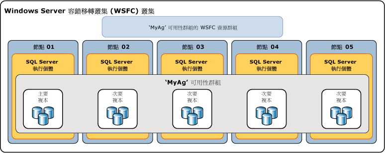

# 什麼是 Always On 可用性群組？
[!INCLUDE[appliesto-ss-xxxx-xxxx-xxx-md](../../../includes/appliesto-ss-xxxx-xxxx-xxx-md.md)]

 此主題介紹在 [!INCLUDE[ssHADR](../../../includes/sshadr-md.md)] 中設定與管理一個或多個可用性群組的 [!INCLUDE[ssCurrent](../../../includes/sscurrent-md.md)]中心概念。 如需可用性群組所提供的優點摘要以及 [!INCLUDE[ssHADR](../../../includes/sshadr-md.md)] 術語的概觀，請參閱 [AlwaysOn 可用性群組 &#40;SQL Server&#41;](../../../database-engine/availability-groups/windows/always-on-availability-groups-sql-server.md)。  
  
 「可用性群組」  支援一組離散使用者資料庫 (稱為「可用性資料庫」  ) 的複寫環境。 您可以建立可用性群組的高可用性 (HA) 或讀取級別。 HA 可用性群組是一組可一起進行容錯移轉的資料庫。 讀取級別可用性群組是針對唯讀工作負載複製至其他 SQL Server 執行個體的一組資料庫。 可用性群組支援一組主要資料庫，以及一到八組對應的次要資料庫。 次要資料庫「並非」  備份。 請持續定期備份您的資料庫及其交易記錄。  
  
> [!TIP]  
>  您可為主要資料庫建立任何類型的備份。 或者，您亦可為次要資料庫建立記錄備份和僅限複製的完整備份。 如需詳細資訊，請參閱[使用中次要：在次要複本上備份 &#40;Always On 可用性群組&#41;](../../../database-engine/availability-groups/windows/active-secondaries-backup-on-secondary-replicas-always-on-availability-groups.md)。   

 每一組可用性資料庫都是由 *「可用性複本」* (Availability Replica) 主控。 有兩種類型的可用性複本：單一 *「主要複本」* (Primary Replica)， 以及一到八個「次要複本」  (Secondary Replica)。前者裝載主要資料庫，後者各裝載一組次要資料庫，而且可以當做可用性群組的潛在容錯移轉目標。 可用性群組會在可用性複本層級容錯移轉。 可用性複本僅會針對某個可用性群組中一組資料庫提供資料庫層級的備援。 資料庫問題，例如資料庫因為資料檔案遺失而變得可疑或交易記錄損毀，並不會造成容錯移轉。  
  
 主要複本提供主要資料庫，以供用戶端讀寫連接使用。 主要複本會將每個主要資料庫的交易記錄檔記錄傳送到每個次要資料庫。 這個稱為「資料同步處理」  的程序是在資料庫層級發生。 每個次要複本都會快取交易記錄檔記錄 (「強行寫入」  記錄檔)，然後將它們套用到對應的次要資料庫。 資料同步處理在主要資料庫和每個連接的次要資料庫之間發生，與其他資料庫無關。 因此，次要資料庫可以暫停或失敗，而不影響其他次要資料庫，主要資料庫也可以暫停或失敗，而不影響其他主要資料庫。  
  
 或者，您可以設定一個或多個次要複本以支援對次要資料庫的唯讀存取，而且您可以設定任何次要複本以允許在次要資料庫上進行備份。  

 SQL Server 2017 引進兩個不同的可用性群組架構。 *AlwaysOn 可用性群組*提供高可用性、災害復原和讀取級別平衡。 這些可用性群組需要叢集管理員。 在 Windows 中，容錯移轉叢集提供叢集管理員。 在 Linux 中，您可以使用 Pacemaker。 另一個架構是「讀取級別可用性群組」  。 讀取級別可用性群組針對唯讀工作負載提供複本，但未針對高可用性。 在讀取級別可用性群組，沒有叢集管理員。 
 
 在 Windows 上針對 HA 部署 [!INCLUDE[ssHADR](../../../includes/sshadr-md.md)]，需要 Windows Server 容錯移轉叢集 (WSFC)。 給定可用性群組的每個可用性複本都必須位在相同 WSFC 的不同節點上。 唯一的例外狀況是在移轉至另一個 WSFC 叢集期間，可用性群組可以暫時跨兩個叢集。 

 >[!NOTE]
 >如需 Linux 上的可用性群組相關資訊，請參閱 [Always On availability group for SQL Server on Linux](../../../linux/sql-server-linux-availability-group-overview.md) (Linux 上 SQL Server 的 AlwaysOn 可用性群組)。 

 在 HA 組態中，對於您建立的每個可用性群組，系統都會建立一個叢集角色。 WSFC 叢集會監視此角色，以評估主要複本的健全狀況。 [!INCLUDE[ssHADR](../../../includes/sshadr-md.md)] 的仲裁會以 WSFC 叢集中的所有節點為基礎，而不論給定叢集節點是否裝載任何可用性複本。 相較於資料庫鏡像， [!INCLUDE[ssHADR](../../../includes/sshadr-md.md)]沒有見證角色。  
  
> [!NOTE]  
>  如需 WSFC 叢集的 SQL Server AlwaysOn 元件關聯性相關資訊，請參閱 [SQL Server 的 Windows Server 容錯移轉叢集 &#40;WSFC&#41;](../../../sql-server/failover-clusters/windows/windows-server-failover-clustering-wsfc-with-sql-server.md)。  
  
 下圖顯示可用性群組，其中包含一個主要複本和四個次要複本。 最多可支援八個次要複本，包括一個主要複本和兩個同步認可次要複本。  
  
   
  
##  可用性資料庫  
 若要將資料庫加入可用性群組，該資料庫必須是存在於裝載主要複本之伺服器執行個體的線上讀寫資料庫。 當您加入資料庫時，該資料庫會加入可用性群組做為主要資料庫，同時仍然可以供用戶端使用。 在新主要資料庫的備份還原到裝載次要複本的伺服器執行個體 (使用 RESTORE WITH NORECOVERY) 之前，不會存在任何對應的次要資料庫。 新的次要資料庫在加入可用性群組之前，處於 RESTORING 狀態。 如需詳細資訊，請參閱 [於 AlwaysOn 次要資料庫啟動資料移動 &#40;SQL Server&#41;](../../../database-engine/availability-groups/windows/start-data-movement-on-an-always-on-secondary-database-sql-server.md)。  
  
 加入時，會將次要資料庫置於 ONLINE 狀態，並起始對應主要資料庫的資料同步處理。 *「資料同步處理」* (Data Synchronization) 是將主要資料庫的變更重現在次要資料庫上的程序。 資料同步處理涉及主要資料庫將交易記錄檔記錄傳送到次要資料庫。  
  
> [!IMPORTANT]  
>  可用性資料庫有時候在 [!INCLUDE[tsql](../../../includes/tsql-md.md)]、PowerShell 和 SQL Server 管理物件 (SMO) 名稱中會稱為「資料庫複本」  。 例如，在 AlwaysOn 動態管理檢視名稱中就使用了「資料庫複本」一詞，這個檢視會傳回可用性資料庫的相關資訊：**sys.dm_hadr_database_replica_states** 和 **sys.dm_hadr_database_replica_cluster_states**。 但在《SQL Server 線上叢書》中，「複本」一詞通常是指可用性複本。 例如「主要複本」與「次要複本」一律指可用性複本。  
  
##  可用性複本  
 每個可用性群組都會定義一組兩個或多個容錯移轉夥伴，稱為可用性複本。 *「可用性複本」* (Availability Replica) 是可用性群組的元件。 每個可用性複本都會在可用性群組中裝載一個可用性資料庫的副本。 對於給定的可用性群組而言，可用性複本必須由位於某個 WSFC 叢集中不同節點上的個別 [!INCLUDE[ssNoVersion](../../../includes/ssnoversion-md.md)] 執行個體所裝載。 這些伺服器執行個體每一個都必須啟用 AlwaysOn。  
  
 給定的執行個體只能裝載每個可用性群組的一個可用性複本。 但是，每一個執行個體都可以用於多個可用性群組。 給定的執行個體可以是獨立執行個體或 [!INCLUDE[ssNoVersion](../../../includes/ssnoversion-md.md)] 容錯移轉叢集執行個體 (FCI)。 如果您需要伺服器層級的備援性，請使用容錯移轉叢集執行個體。  
  
 每個可用性複本都會獲指派一個初始角色，即「主要角色」  或「次要角色」  ，這個角色是由該複本的可用性資料庫所繼承。 給定複本的角色會決定所裝載的是讀寫資料庫還是唯讀資料庫。 其中一個複本 (也就是所謂的「主要複本」  ) 會獲指派主要角色並裝載讀寫資料庫，也就是「主要資料庫」  。 至少有一個其他複本 (也就是所謂的 「次要複本」  ) 會獲指派次要角色。 次要複本會裝載唯讀資料庫，也就是次要資料庫。  
  
> [!NOTE]  
>  當可用性複本的角色未定 (例如在容錯移轉期間) 時，其資料庫會暫時處於 NOT SYNCHRONIZING 狀態。 在可用性複本的角色解析之前，會將其角色設為 RESOLVING。 如果可用性複本解析為主要角色，其資料庫會變成主要資料庫。 如果可用性複本解析為次要角色，其資料庫會變成次要資料庫。  
  
##  可用性模式

可用性模式是每個可用性複本的屬性。 可用性模式會決定在給定次要複本將交易記錄寫入至磁碟 (儲存記錄) 之前，主要複本是否等待認可資料庫上的交易。 [!INCLUDE[ssHADR](../../../includes/sshadr-md.md)]支援兩個可用性模式：「非同步認可模式」  和「同步認可模式」  。  
  
-   **非同步認可模式**  
  
     使用此可用性模式的可用性複本就是所謂的「非同步認可複本」(Asynchronous-Commit Replica)  。 在非同步認可模式下，主要複本會認可交易，而不等候確認非同步認可次要複本已經強行寫入記錄。 非同步認可模式會將次要資料庫上的交易延遲降至最低，但允許這些資料庫落後主要資料庫，因此可能會發生資料遺失。  
  
-   **同步認可模式**  
  
     使用此可用性模式的可用性複本就是所謂的「同步認可複本」  。 在同步認可模式下認可交易之前，同步認可主要複本會等候同步認可次要複本確認它已完成強行寫入記錄。 同步認可模式可確定，一旦給定次要資料庫與主要資料庫同步處理之後，認可的交易就會受到完整保護。 這種保護是以增加交易延遲做為代價。  
  
 如需詳細資訊，請參閱 [可用性模式 &#40;AlwaysOn 可用性群組&#41;](../../../database-engine/availability-groups/windows/availability-modes-always-on-availability-groups.md)或 PowerShell，針對 AlwaysOn 可用性群組執行規劃的手動容錯移轉或強制手動容錯移轉 (強制容錯移轉)。  
  
##  容錯移轉的類型  
 在主要複本與次要複本之間的工作階段內容中，主要和次要角色在程序中可能可以互換，稱為 *「容錯移轉」* (Failover)。 在容錯移轉期間，目標次要複本會轉換到主要角色，變成新的主要複本。 新的主要複本會將其資料庫變成線上狀態做為主要資料庫，而且用戶端應用程式可以連接至這些資料庫。 當先前的主要複本可以使用時，會轉換到次要角色，變成次要複本。 先前的主要資料庫就會變成次要資料庫，而且資料同步處理會繼續。  
  
 容錯移轉的形式共有三種：自動、手動和強制 (有遺失資料的可能)。 給定次要複本支援的容錯移轉形式取決於其可用性模式，而且針對同步認可模式，則取決於主要複本和目標次要複本上的容錯移轉模式，如下所示。  
  
-   如果目標次要複本目前與主要複本同步處理，則同步認可模式支援兩種容錯移轉形式：「規劃的手動容錯移轉」  和「自動容錯移轉」  。 這些容錯移轉形式的支援取決於容錯移轉夥伴上的 *「容錯移轉模式屬性」* (Failover Mode Property) 設定。 如果容錯移轉模式在主要或次要複本上設為「手動」，則只支援該次要複本的手動容錯移轉。 如果容錯移轉模式在主要和次要複本上都設為「自動」，則在該次要複本上同時支援自動和手動容錯移轉。  
  
    -   **已規劃的手動容錯移轉** (不會遺失資料)  
  
         在資料庫管理員發出容錯移轉命令，並使同步處理的次要複本轉換到主要角色 (擁有資料保護保證)，而主要複本轉換到次要角色之後，會發生手動容錯移轉。 手動容錯移轉要求主要複本和目標次要複本都在同步認可模式下執行，而且次要複本必須已經經過同步處理。  
  
    -   **自動容錯移轉** (不會遺失資料)  
  
         自動容錯移轉的發生，是為了回應造成同步處理的次要複本轉換到主要角色 (擁有資料保護保證) 的失敗。 當先前的主要複本變成可以使用時，會轉換到次要角色。 自動容錯移轉要求主要複本和目標次要複本都在同步認可模式下執行，而且容錯移轉模式設為「自動」。 此外，次要複本必須已經過同步處理、擁有 WSFC 仲裁，而且符合可用性群組之 [具彈性的容錯移轉原則](../../../database-engine/availability-groups/windows/flexible-automatic-failover-policy-availability-group.md)所指定的條件。  
  
        > [!IMPORTANT]  
        >  SQL Server 容錯移轉叢集執行個體 (FCI) 不支援依照可用性群組進行自動容錯移轉，因此任何由 FCI 裝載的可用性複本只能設定為手動容錯移轉。  
  
    > [!NOTE]  
    >  請注意，如果您在已同步處理的次要複本上發出強制容錯移轉命令，次要複本的行為會與規劃的手動容錯移轉相同。  
  
-   在非同步認可模式下，容錯移轉的唯一形式為強制手動容錯移轉 (可能會遺失資料)，通常稱為「強制容錯移轉」  。 強制容錯移轉只能手動起始，因此視為一種手動容錯移轉。 強制容錯移轉是一個災難復原選項。 它是目標次要複本沒有與主要複本同步處理時，唯一可行的容錯移轉形式。  
  
 如需詳細資訊，請參閱本主題稍後的 [容錯移轉及容錯移轉模式 &#40;AlwaysOn 可用性群組&#41;](../../../database-engine/availability-groups/windows/failover-and-failover-modes-always-on-availability-groups.md)。  
  
##  用戶端連接  
 您可以建立可用性群組接聽程式，以便將用戶端連接提供給給定可用性群組的主要複本。 *「可用性群組接聽程式」* (Availability Group Listener) 會將連接至給定可用性群組的一組資源提供給適當可用性複本的直接用戶端連接。  
  
 可用性群組接聽程式與當做虛擬網路名稱 (VNN)、一個或多個虛擬 IP 位址 (VIP)，以及 TCP 通訊埠編號的唯一 DNS 名稱相關聯。 如需詳細資訊，請參閱[可用性群組接聽程式、用戶端連接性及應用程式容錯移轉 &#40;SQL Server&#41;](../../../database-engine/availability-groups/windows/listeners-client-connectivity-application-failover.md)。  
  
> [!TIP]  
>  如果可用性群組只有兩個可用性複本，而且未設定為允許以唯讀方式存取次要複本，則用戶端可以使用 [資料庫鏡像連接字串](../../../database-engine/database-mirroring/connect-clients-to-a-database-mirroring-session-sql-server.md)連接到主要複本。 在您將資料庫從資料庫鏡像移轉到 [!INCLUDE[ssHADR](../../../includes/sshadr-md.md)]之後，這個方法可能暫時很實用。 在您加入其他次要複本之前，您需要為可用性群組建立可用性群組接聽程式，並更新您的應用程式使用此接聽程式的網路名稱。  
  
##  使用中次要複本  
 [!INCLUDE[ssHADR](../../../includes/sshadr-md.md)] 支援使用中次要複本。 使用中次要複本功能提供下列支援：  
  
-   **對次要複本執行備份作業**  
  
     次要複本可以備份記錄以及完整資料庫、檔案或檔案群組的 [只複製](../../../database-engine/availability-groups/windows/active-secondaries-backup-on-secondary-replicas-always-on-availability-groups.md) 備份。 您可以設定可用性群組來指定應該執行備份之處的喜好設定。 請務必了解，喜好設定並不是由 SQL Server 強制施行，所以它對於隨選備份沒有任何影響。 這個喜好設定的解譯取決於您在給定可用性群組之每個資料庫的備份作業中所編寫的邏輯 (如果有的話)。 對於各個可用性複本，您可以指定此複本與同一個可用性群組中之其他複本的備份優先權。 如需詳細資訊，請參閱[使用中次要：在次要複本上備份 &#40;Always On 可用性群組&#41;](../../../database-engine/availability-groups/windows/active-secondaries-backup-on-secondary-replicas-always-on-availability-groups.md)。  
  
-   **對一個或多個次要複本進行唯讀存取 (可讀取的次要複本)**  
  
     您可以將任何可用性複本設定為允許對其本機資料庫進行唯讀存取，但不一定支援某些作業。 這會防止對次要複本的讀寫連線嘗試。 您也可以只允許讀寫存取以防止「主要」  複本上的唯讀工作負載。 這會防止對主要複本進行唯讀連線。 如需詳細資訊，請參閱[使用中次要：可讀取的次要複本 &#40;Always On 可用性群組&#41;](../../../database-engine/availability-groups/windows/active-secondaries-readable-secondary-replicas-always-on-availability-groups.md)。  
  
     若可用性群組目前擁有可用性群組接聽程式及一或多個可讀取的次要複本，[!INCLUDE[ssNoVersion](../../../includes/ssnoversion-md.md)] 會將讀取意圖的連接要求路由至其中一個複本 (「唯讀路由」  )。 如需詳細資訊，請參閱[可用性群組接聽程式、用戶端連接性及應用程式容錯移轉 &#40;SQL Server&#41;](../../../database-engine/availability-groups/windows/listeners-client-connectivity-application-failover.md)。  
  
##  工作階段逾時期限  
 工作階段逾時期限是可用性複本屬性，它決定在連接關閉之前，與另一個可用性複本的連接保持非使用中的時間。 主要與次要複本會彼此 Ping，表示它們仍在使用中。 在逾時期限內從另一個複本接收到 Ping，表示連接仍為開啟狀態，且伺服器執行個體正在進行通訊。 接收到 Ping 時，可用性複本會重設它在該連接上的工作階段逾時計數器。  
  
 工作階段逾時期限防止複本無限期地等候從另一個複本接收 Ping。 如果在工作階段逾時期限內未收到另一個複本的 Ping，則複本會逾時。它的連接會關閉，而逾時的複本則進入 DISCONNECTED 狀態。 即使中斷連接的複本設定成同步認可模式，交易仍不會等候該複本重新連接及重新同步處理。  
  
 每個可用性複本的預設工作階段逾時期限為 10 秒。 此值是使用者可設定的，最小值為 5 秒。 通常我們建議您讓逾時期限保持在 10 秒或更久。 將這個值設定為小於 10 秒，可能會使負荷重的系統宣告假性失敗。  
  
> [!NOTE]  
>  在解析角色中，工作階段逾時期限不適用，因為不會發生 Ping。  
  
##  自動修復頁面  
 每個可用性複本都會嘗試解決阻止讀取資料頁面的特定類型錯誤，以便從本機資料庫上的損毀頁面自動復原。 如果次要複本無法讀取某個頁面，此複本會向主要複本要求一個全新頁面副本。 如果主要複本無法讀取某個頁面，此複本會向所有次要複本廣播全新副本的要求，並先取得頁面以回應。 如果這個要求成功，無法讀取的頁面就會使用副本取代，這通常會解決錯誤。  
  
 如需詳細資訊，請參閱[自動修復頁面 &#40;可用性群組：資料庫鏡像&#41;](../../../sql-server/failover-clusters/automatic-page-repair-availability-groups-database-mirroring.md)。  
  
##  Related tasks  
  
-   [開始使用 AlwaysOn 可用性群組 &#40;SQL Server &#41;](../../../database-engine/availability-groups/windows/getting-started-with-always-on-availability-groups-sql-server.md)  
  
##  Related content  
  
-   **部落格：**  
  
     [Always On - HADRON Learning Series:Worker Pool Usage for HADRON Enabled Databases](https://blogs.msdn.com/b/psssql/archive/2012/05/17/Always%20On-hadron-learning-series-worker-pool-usage-for-hadron-enabled-databases.aspx) (Always On - HADRON 學習系列：已啟用 HADRON 功能的資料庫背景工作集區使用方式)  
  
     [SQL Server Always On 小組部落格：官方 SQL Server Always On 小組部落格](https://blogs.msdn.microsoft.com/sqlalwayson/)  
  
     [CSS SQL Server 工程師部落格](https://blogs.msdn.com/b/psssql/)  
  
-   **影片：**  
  
     [Microsoft SQL Server Code-Named "Denali" Always On Series,Part 1:Introducing the Next Generation High Availability Solution](https://channel9.msdn.com/Events/TechEd/NorthAmerica/2011/DBI302) (Microsoft SQL Server Code-Named "Denali" Always On 系列第 1 部分：新一代高可用性解決方案簡介)  
  
     [Microsoft SQL Server Code-Named "Denali" Always On Series,Part 2:Building a Mission-Critical High Availability Solution Using Always On](https://channel9.msdn.com/Events/TechEd/NorthAmerica/2011/DBI404) (Microsoft SQL Server Code-Named "Denali" Always On 系列第 2 部分：使用 Always On 建立關鍵任務的高可用性解決方案)  
  
-   **白皮書：**  
  
     [Microsoft SQL Server AlwaysOn 高可用性和災害復原方案指南](https://go.microsoft.com/fwlink/?LinkId=227600)  
  
     [Microsoft 的 SQL Server 2012 白皮書](https://msdn.microsoft.com/library/hh403491.aspx)  
  
     [SQL Server 客戶諮詢團隊白皮書](https://techcommunity.microsoft.com/t5/DataCAT/bg-p/DataCAT/)  
  
## 另請參閱  
 [可用性模式 &#40;AlwaysOn 可用性群組&#41;](../../../database-engine/availability-groups/windows/availability-modes-always-on-availability-groups.md)   
 [容錯移轉及容錯移轉模式 &#40;AlwaysOn 可用性群組&#41;](../../../database-engine/availability-groups/windows/failover-and-failover-modes-always-on-availability-groups.md)   
 [AlwaysOn 可用性群組的 Transact-SQL 陳述式概觀 &#40;SQL Server&#41;](../../../database-engine/availability-groups/windows/transact-sql-statements-for-always-on-availability-groups.md)   
 [AlwaysOn 可用性群組的 PowerShell Cmdlet 概觀 &#40;SQL Server&#41;](../../../database-engine/availability-groups/windows/overview-of-powershell-cmdlets-for-always-on-availability-groups-sql-server.md)   
 [記憶體內部 OLTP 資料庫的高可用性支援](../../../relational-databases/in-memory-oltp/high-availability-support-for-in-memory-oltp-databases.md)   
 [AlwaysOn 可用性群組的必要條件、限制和建議 &#40;SQL Server&#41;](../../../database-engine/availability-groups/windows/prereqs-restrictions-recommendations-always-on-availability.md)   
 [建立及設定可用性群組 &#40;SQL Server&#41;](../../../database-engine/availability-groups/windows/creation-and-configuration-of-availability-groups-sql-server.md)   
 [使用中次要：可讀取的次要複本 &#40;Always On 可用性群組&#41;](../../../database-engine/availability-groups/windows/active-secondaries-readable-secondary-replicas-always-on-availability-groups.md)   
 [使用中次要：在次要複本上備份 &#40;Always On 可用性群組&#41;](../../../database-engine/availability-groups/windows/active-secondaries-backup-on-secondary-replicas-always-on-availability-groups.md)   
 [可用性群組接聽程式、用戶端連線及應用程式容錯移轉 &#40;SQL Server&#41;](../../../database-engine/availability-groups/windows/listeners-client-connectivity-application-failover.md)  
  
   
