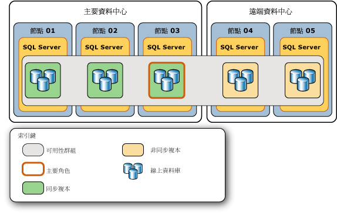
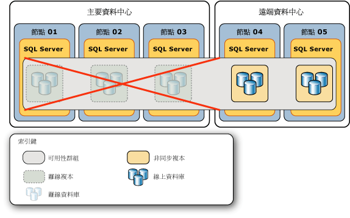
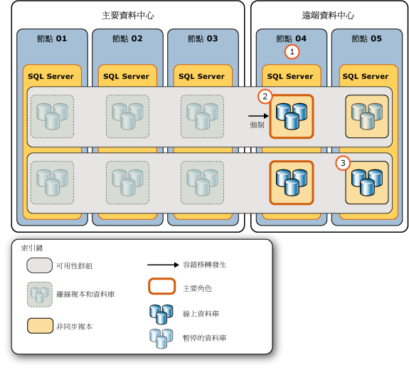
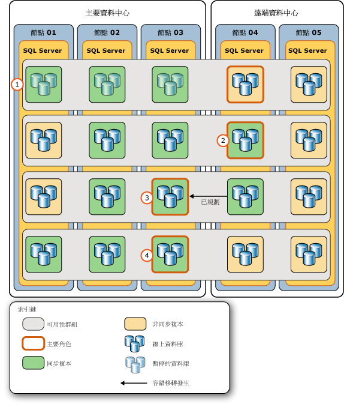

# <a name="perform-a-forced-manual-failover-of-an-always-on-availability-group-sql-server"></a>執行 Always On 可用性群組的強制手動容錯移轉 (SQL Server)
[!INCLUDE[appliesto-ss-xxxx-xxxx-xxx-md](../../../includes/appliesto-ss-xxxx-xxxx-xxx-md.md)]
  本主題描述如何使用 [!INCLUDE[ssManStudioFull](../../../includes/ssmanstudiofull-md.md)]、 [!INCLUDE[tsql](../../../includes/tsql-md.md)]或 [!INCLUDE[ssCurrent](../../../includes/sscurrent-md.md)]中的 PowerShell，在 AlwaysOn 可用性群組上執行強制容錯移轉 (可能會遺失資料)。 強制容錯移轉是一種手動容錯移轉形式，嚴格限於 [已規劃的手動容錯移轉](../../../database-engine/availability-groups/windows/perform-a-planned-manual-failover-of-an-availability-group-sql-server.md) 不可行時用來進行災難復原。 如果您強制容錯移轉至非同步的次要複本，有些資料可能會遺失。 因此，強烈建議您只有在主要複本不再執行、而且您願意承擔遺失資料的風險以還原可用性群組中對資料庫的存取時，才進行強制容錯移轉。  
  
 強制容錯移轉之後，可用性群組進行容錯移轉的容錯移轉目標會變成新的主要複本。 剩餘次要複本中的次要資料庫會暫停，而且必須以手動方式繼續。 當之前的主要複本變成可用複本時，會轉換為次要角色，造成之前的主要資料庫變成次要資料庫並轉換到 SUSPENDED 狀態。 在繼續執行給定的次要資料庫之前，您或許可以從該資料庫復原遺失的資料。 不過須注意，只要有任何次要資料庫暫停，給定主要資料庫上的交易記錄截斷就會延遲。  
  
> [!IMPORTANT]  
>  在次要資料庫恢復之前，將不會進行與主要資料庫的資料同步處理。 如需繼續次要資料庫的資訊，請參閱本文稍後的[後續操作：強制容錯移轉後的重要工作](#FollowUp)。  
  
 在下列緊急情況中，必須執行強制容錯移轉：  
  
-   在 WSFC 叢集上強制進行仲裁之後 (「強制仲裁」(Forced Quorum)  )，您需要強制容錯移轉每個可用性群組 (可能會遺失資料)。 強制容錯移轉是必要的，因為 WSFC 叢集值的實際狀態可能已遺失。 不過，您能夠在強制仲裁之前，在裝載主要複本的伺服器執行個體上強制容錯移轉，或是在強制仲裁之前容錯移轉至同步處理的次要複本，則可以避免資料遺失。 如需詳細資訊，請參閱本主題稍後的 [避免在強制仲裁之後遺失資料的可能方式](#WaysToAvoidDataLoss)。  
  
    > [!IMPORTANT]  
    >  如果仲裁透過自然而不是強制的方式重新取得，則可用性複本會進行一般復原。 如果在重新取得仲裁之後主要複本仍然無法使用，您可以執行規劃的手動容錯移轉至同步處理的次要複本。  
  
     如需強制仲裁的資訊，請參閱 [透過強制仲裁執行 WSFC 災害復原 &#40;SQL Server&#41;](../../../sql-server/failover-clusters/windows/wsfc-disaster-recovery-through-forced-quorum-sql-server.md)中的 PowerShell，在 AlwaysOn 可用性群組上執行強制容錯移轉 (可能會遺失資料)。 如需為何要在強制仲裁之後強制容錯移轉的資訊，請參閱 [容錯移轉及容錯移轉模式 &#40;AlwaysOn 可用性群組&#41;](../../../database-engine/availability-groups/windows/failover-and-failover-modes-always-on-availability-groups.md)中的 PowerShell，在 AlwaysOn 可用性群組上執行強制容錯移轉 (可能會遺失資料)。  
  
-   如果主要複本在 WSFC 叢集擁有狀況良好的仲裁時變成無法使用，您可以強制容錯移轉 (可能會遺失資料) 至其角色為 SECONDARY 或 RESOLVING 狀態的任何複本。 如有可能的話，在主要複本已遺失時，強制容錯移轉至已同步處理的同步認可次要複本。  
  
    > [!TIP]  
    >  當 WSFC 叢集擁有狀況良好的仲裁時，如果您在已同步處理的次要複本上發出強制容錯移轉命令，則複本會實際執行規劃的手動容錯移轉。  
  
> [!NOTE]  
>  如需強制容錯移轉之必要條件和建議的詳細資訊，以及使用強制容錯移轉從重大錯誤復原的範例案例，請參閱本主題稍後的[範例案例：使用強制容錯移轉從重大錯誤復原](../../../database-engine/availability-groups/windows/perform-a-forced-manual-failover-of-an-availability-group-sql-server.md#ExampleRecoveryFromCatastrophy)。  
  
  
##  <a name="Restrictions"></a> 限制事項  
  
-   唯一無法執行強制容錯移轉的情況，是 Windows Server 容錯移轉叢集 (WSFC) 缺少仲裁時。  
  
-   在可用性群組的強制容錯移轉期間，可能會發生資料遺失。 此外，如果主要複本在您起始強制容錯移轉時正在執行，用戶端可能仍然會連接至先前的主要資料庫。 因此，我們強烈建議您只有在主要複本不再執行、而且您願意承擔遺失資料的風險以還原可用性群組中對資料庫的存取時，才進行強制容錯移轉。  
  
-   當次要資料庫處於 REVERTING 或 INITIALIZING 狀態時，強制容錯移轉會導致資料庫無法當做主要資料庫啟動。 如果資料庫處於 INTIAILIZGING 狀態，您需要從資料庫備份套用遺失的記錄檔記錄，或從頭完全還原資料庫。 如果資料庫處於 REVERTING 狀態，您就必須從備份完全還原資料庫。  
  
-   只要容錯移轉目標接受了命令，就會傳回容錯移轉命令。 不過，在可用性群組完成容錯移轉之後，會以非同步方式復原資料庫。  
  
-   容錯移轉時，可能不會保留可用性群組內跨資料庫的一致性。  
  
    > [!NOTE]  
    >  跨資料庫和分散式交易的支援會因 SQL Server 和作業系統版本而不同。 如需詳細資訊，請參閱[資料庫鏡像或 AlwaysOn 可用性群組不支援跨資料庫交易 &#40;SQL Server&#41;](../../../database-engine/availability-groups/windows/transactions-always-on-availability-and-database-mirroring.md)。  
  
##  <a name="Prerequisites"></a> 必要條件  
  
-   WSFC 叢集具有仲裁。 如果叢集缺少仲裁，請參閱 [透過強制仲裁執行 WSFC 災害復原 &#40;SQL Server&#41;](../../../sql-server/failover-clusters/windows/wsfc-disaster-recovery-through-forced-quorum-sql-server.md)中的 PowerShell，在 AlwaysOn 可用性群組上執行強制容錯移轉 (可能會遺失資料)。  
  
-   您必須能夠連接到裝載複本的伺服器執行個體，而該複本的角色為 SECONDARY 或 RESOLVING 狀態。  
  
##  <a name="Recommendations"></a> 建議  
  
-   主要複本仍在執行時，不要強制容錯移轉。  
  
-   可能的話，只強制容錯移轉至次要資料庫為 NOT SYNCHRONIZED、SYNCHRONIZED 或 SYNCHRONIZING 狀態的容錯移轉目標。 如需有關次要資料庫處於 INTIAILIZGING 或 REVERTING 狀態時強制容錯移轉之含意的資訊，請參閱本主題前面的 [限制事項](#Restrictions)。  
  
-   相對於主要資料庫，通常在不同的非同步認可次要複本上的給定次要資料庫延遲應該類似。 不過，強制容錯移轉時，資料遺失會是一項重要考量。 因此，請花點時間決定不同次要複本上資料庫副本的相對延遲。 若要決定哪一個指定次要資料庫副本的延遲最少，請比較它們的記錄檔結束 LSN。 記錄檔結束 LSN 越高，表示延遲越少。  
  
    > [!TIP]  
    >  若要比較記錄檔結束 LSN，請輪流連接到每一個線上次要複本，並且查詢 [sys.dm_hadr_database_replica_states](../../../relational-databases/system-dynamic-management-views/sys-dm-hadr-database-replica-states-transact-sql.md) 中每個本機次要資料庫的 **end_of_log_lsn** 值。 然後，比較每個資料庫之不同副本的記錄檔結束 LSN。 請注意，不同的資料庫在不同的次要複本上可能擁有最高的 LSN。 在此情況下，最適合的容錯移轉目標取決於您在不同資料庫中之資料的相對重要性。 也就是說，在這些資料庫中，您想要將哪些資料遺失的可能性降到最低？  
  
-   如果用戶端能夠連接到原始的主要複本，強制容錯移轉會產生核心分裂行為的某些風險。 在您強制容錯移轉之前，強烈建議您防止用戶端存取原始的主要複本。 否則，在強制容錯移轉之後，原始的主要資料庫和目前的主要資料庫可能會各自獨立更新。  
  
##  <a name="WaysToAvoidDataLoss"></a> 避免在強制仲裁之後遺失資料的可能方式  
 在某些失敗情況下遺失仲裁之後，您可以避免遺失資料，如下所示：  
  
-   **如果原始主要複本上線**  
  
     如果仲裁遺失且強制 WSFC 仲裁還原裝載可用性群組主要複本的叢集節點，則您可以防止這個可用性群組的資料遺失。 連接到主要複本並執行強制容錯移轉 (FAILOVER_ALLOW_DATA_LOSS)。 這樣會讓主要複本重新上線。 由於您執行強制容錯移轉至原始主要複本，因此資料不會遺失。  
  
-   **如果已同步處理的同步認可次要複本上線**  
  
     如果仲裁遺失且強制 WSFC 仲裁還原裝載可用性群組之已同步處理次要複本的叢集節點，則您應該能夠防止這個可用性群組的資料遺失。 如果還原的節點在遺失仲裁時為運作狀態，您可以藉由查詢 **sys.dm_hadr_database_replica_cluster_states** 動態管理檢視的 [is_failover_ready](../../../relational-databases/system-dynamic-management-views/sys-dm-hadr-database-replica-cluster-states-transact-sql.md) 資料行，判斷給定資料庫上是否可能發生資料遺失。 例如，針對名為 `sql108w2k8r22`的伺服器執行個體，發出下列查詢：  
  
    ```  
    SELECT * FROM sys.dm_hadr_database_replica_cluster_states  
       WHERE replica_id=(SELECT replica_id FROM sys.availability_replicas   
          WHERE replica_server_name ='sql108w2k8r22')  
    ```  
  
    > [!CAUTION]  
    >  如果還原的節點在遺失仲裁時並未運作，則 **is_failover_ready** 不一定會反映主要複本離線時叢集的實際狀態。 因此， **is_failover_ready** 值只有在主機節點失敗時才有效。 如需詳細資訊，請參閱 [容錯移轉及容錯移轉模式 &#40;AlwaysOn 可用性群組&#41;](../../../database-engine/availability-groups/windows/failover-and-failover-modes-always-on-availability-groups.md)中的 PowerShell，在 AlwaysOn 可用性群組上執行強制容錯移轉 (可能會遺失資料)。  
  
     如果 **is_failover_ready** = 1，資料庫在叢集中會標示為已同步處理，並且準備好進行容錯移轉。 如果在給定次要複本的每個資料庫上 **is_failover_ready** = 1，您可以執行強制容錯移轉 (FORCE_FAILOVER_ALLOW_DATA_LOSS)，而且這個次要複本的資料不會遺失。 同步處理的次要複本會在主要角色中變成線上，也就是成為新的主要複本，而且所有資料都保持不變。  
  
     如果 **is_failover_ready** = 0，資料庫在叢集中不會標示為已同步處理，並且「尚未」  準備好進行規劃的手動容錯移轉。 如果您強制容錯移轉至主控次要複本，則這個資料庫中的資料將會遺失。  
  
    > [!NOTE]  
    >  當您強制容錯移轉至次要複本時，遺失的資料量將取決於容錯移轉目標落後於主要複本的距離。 不幸的是，當 WSFC 叢集缺少仲裁或已強制仲裁時，您就無法評估可能遺失的資料量。 不過請注意，一旦 WSFC 叢集重新取得狀況良好的仲裁，您就可以開始追蹤可能的資料遺失。 如需詳細資訊，請參閱 [容錯移轉及容錯移轉模式 &#40;AlwaysOn 可用性群組&#41;](../../../database-engine/availability-groups/windows/failover-and-failover-modes-always-on-availability-groups.md)中的 PowerShell，在 AlwaysOn 可用性群組上執行強制容錯移轉 (可能會遺失資料)。  
  
  
##  <a name="Permissions"></a> 權限  
 需要可用性群組的 ALTER AVAILABILITY GROUP 權限、CONTROL AVAILABILITY GROUP 權限、ALTER ANY AVAILABILITY GROUP 權限或 CONTROL SERVER 權限。  
  
##  <a name="SSMSProcedure"></a> 使用 SQL Server Management Studio  
 **若要強制容錯移轉 (可能會遺失資料)**  
  
1.  在 [物件總管] 中，連接到裝載需要容錯移轉之可用性群組中，其角色為 SECONDARY 或 RESOLVING 狀態之複本的伺服器執行個體，然後展開伺服器樹狀目錄。  
  
2.  依序展開 [Always On 高可用性]  節點和 [可用性群組]  節點。  
  
3.  以滑鼠右鍵按一下要容錯移轉的可用性群組，然後選取 [容錯移轉]  命令。  
  
4.  這會啟動「容錯移轉可用性群組精靈」。 如需詳細資訊，請參閱本主題稍後的 [使用容錯移轉可用性群組精靈 (SQL Server Management Studio)](../../../database-engine/availability-groups/windows/use-the-fail-over-availability-group-wizard-sql-server-management-studio.md)中的 PowerShell，在 AlwaysOn 可用性群組上執行強制容錯移轉 (可能會遺失資料)。  
  
5.  強制可用性群組容錯移轉之後，完成必要的後續追蹤步驟。 如需詳細資訊，請參閱本主題稍後的[後續操作：強制容錯移轉後的重要工作](#FollowUp)。  
  
##  <a name="TsqlProcedure"></a> 使用 Transact-SQL  
 **若要強制容錯移轉 (可能會遺失資料)**  
  
1.  連線到裝載複本的伺服器執行個體，而在需要容錯移轉的可用性群組中，複本的角色為 SECONDARY 或 RESOLVING 狀態。  
  
2.  使用 [ALTER AVAILABILITY GROUP](../../../t-sql/statements/alter-availability-group-transact-sql.md) 陳述式，如下所示：  
  
     ALTER AVAILABILITY GROUP *group_name* FORCE_FAILOVER_ALLOW_DATA_LOSS  
  
     其中 *group_name* 是可用性群組的名稱。  
  
     下列範例會將 `AccountsAG` 可用性群組強制容錯移轉到本機次要複本。  
  
    ```  
    ALTER AVAILABILITY GROUP AccountsAG FORCE_FAILOVER_ALLOW_DATA_LOSS;  
    ```  
  
3.  強制可用性群組容錯移轉之後，完成必要的後續追蹤步驟。 如需詳細資訊，請參閱本主題稍後的[後續操作：強制容錯移轉後的重要工作](#FollowUp)。  
  
##  <a name="PowerShellProcedure"></a> 使用 PowerShell  
 **若要強制容錯移轉 (可能會遺失資料)**  
  
1.  將目錄 (**cd**) 變更為裝載複本的伺服器執行個體，而其角色在需要容錯移轉的可用性群組中具有 SECONDARY 或 RESOLVING 狀態。  
  
2.  以下列其中一種形式，搭配 **AllowDataLoss** 參數使用 **Switch-SqlAvailabilityGroup** Cmdlet：  
  
    -   **-AllowDataLoss**  
  
         依預設， **-AllowDataLoss** 參數會使 **Switch-SqlAvailabilityGroup** 提示您注意強制容錯移轉可能會導致未認可交易遺失，並要求確認。 若要繼續，請輸入 **Y**；若要取消操作，請輸入 **N**。  
  
         以下範例會針對名稱為 `MyAg` 之伺服器執行個體上的次要複本，執行可用性群組 `SecondaryServer\InstanceName`的強制容錯移轉 (可能會遺失資料)。 您將會收到確認此作業的提示。  
  
        ```  
        Switch-SqlAvailabilityGroup `  
           -Path SQLSERVER:\Sql\SecondaryServer\InstanceName\AvailabilityGroups\MyAg `  
           -AllowDataLoss  
        ```  
  
    -   **-AllowDataLoss-Force**  
  
         若要在不確認的情況下起始強制容錯移轉，請同時指定 **-AllowDataLoss** 和 **-Force** 參數。 如果您要在指令碼中加入命令，並在沒有使用者介入的情況之下執行它，這相當實用。  使用 **-Force** 選項時請小心，因為強制容錯移轉可能會導致資料從參與可用性群組的資料庫中遺失。  
  
         以下範例會針對名稱為 `MyAg` 的伺服器執行個體，執行可用性群組 `SecondaryServer\InstanceName`的強制容錯移轉 (可能會遺失資料)。 **-Force** 選項會隱藏此作業的確認。  
  
        ```  
        Switch-SqlAvailabilityGroup `  
           -Path SQLSERVER:\Sql\SecondaryServer\InstanceName\AvailabilityGroups\MyAg `  
           -AllowDataLoss -Force  
        ```  
  
    > [!NOTE]  
    >  若要檢視 Cmdlet 的語法，請在 **PowerShell 環境中使用** Get-Help [!INCLUDE[ssNoVersion](../../../includes/ssnoversion-md.md)] Cmdlet。 如需詳細資訊，請參閱 [Get Help SQL Server PowerShell](../../../relational-databases/scripting/get-help-sql-server-powershell.md)。  
  
3.  強制可用性群組容錯移轉之後，完成必要的後續追蹤步驟。 如需詳細資訊，請參閱本主題稍後的[後續操作：強制容錯移轉後的重要工作](#FollowUp)。  
  
 **若要設定和使用 SQL Server PowerShell 提供者**  
  
-   [SQL Server PowerShell 提供者](../../../relational-databases/scripting/sql-server-powershell-provider.md)  
  
##  <a name="FollowUp"></a> 後續操作：強制容錯移轉後的重要工作  
  
1.  強制容錯移轉之後，您容錯移轉的目標次要複本會變成新的主要複本。 不過，若要讓該可用性複本可供用戶端存取，您可能需要重新設定 WSFC 仲裁，或調整可用性群組的可用性模式組態，如下所示：  
  
    -   **如果您容錯移轉到 [!INCLUDE[ssFosAuto](../../../includes/ssfosauto-md.md)] 外部：** 調整 WSFC 節點的仲裁投票，以反映您的新可用性群組設定。 如果裝置目標次要複本的 WSFC 節點沒有 WSFC 仲裁投票，可能需要強制 WSFC 仲裁。  
  
        > [!NOTE]  
        >  只有在使用自動容錯移轉將兩個可用性複本 (包括先前的主要複本) 設定成同步認可模式時， [!INCLUDE[ssFosAuto](../../../includes/ssfosauto-md.md)] 才會存在。  
  
         **若要調整仲裁投票**  
  
        -   [檢視叢集仲裁 NodeWeight 設定](../../../sql-server/failover-clusters/windows/view-cluster-quorum-nodeweight-settings.md)  
  
        -   [設定叢集仲裁 NodeWeight 設定](../../../sql-server/failover-clusters/windows/configure-cluster-quorum-nodeweight-settings.md)  
  
        -   [在無仲裁情況下強制啟動 WSFC 叢集](../../../sql-server/failover-clusters/windows/force-a-wsfc-cluster-to-start-without-a-quorum.md)  
  
    -   **如果您容錯移轉到 [!INCLUDE[ssFosSync](../../../includes/ssfossync-md.md)] 外部：** 建議您考慮針對新主要複本和剩餘的次要複本調整可用性模式與容錯移轉模式，以反映您需要的同步認可及自動容錯移轉設定。  
  
        > [!NOTE]  
        >  只有在目前的主要複本設定成同步認可模式， [!INCLUDE[ssFosSync](../../../includes/ssfossync-md.md)] 才會存在。  
  
         **若要變更可用性模式與容錯移轉模式**  
  
        -   [變更可用性複本的可用性模式 &#40;SQL Server&#41;](../../../database-engine/availability-groups/windows/change-the-availability-mode-of-an-availability-replica-sql-server.md)  
  
        -   [變更可用性複本的容錯移轉模式 &#40;SQL Server&#41;](../../../database-engine/availability-groups/windows/change-the-failover-mode-of-an-availability-replica-sql-server.md)  
  
2.  強制容錯移轉之後，就會暫停所有次要資料庫。 這包括舊的主要資料庫，在舊的主要複本再次上線之後會發現它現在是次要複本。 您必須以手動方式在每個次要複本上個別繼續每個暫停的資料庫。  
  
     次要資料庫繼續時，會起始與對應主要資料庫的資料同步處理。 次要資料庫會回復新的主要資料庫上從未認可過的任何記錄檔記錄。 因此，如果您擔心容錯移轉後的主要資料庫可能會發生遺失資料，則應該嘗試在其中一個同步認可的次要資料庫上，對暫停的資料庫建立資料庫快照集。  
  
    > [!IMPORTANT]  
    >  只要有任何次要資料庫暫停，主要資料庫上的交易記錄截斷就會延遲。 另外，只要任何本機資料庫持續暫停狀態，同步認可次要複本的同步健全狀態就無法轉換成 HEALTHY。  
  
     **若要建立資料庫快照集**  
  
    -   [建立資料庫快照集 &#40;Transact-SQL&#41;](../../../relational-databases/databases/create-a-database-snapshot-transact-sql.md)  
  
     **若要繼續可用性資料庫**  
  
    -   [繼續可用性資料庫 &#40;SQL Server&#41;](../../../database-engine/availability-groups/windows/resume-an-availability-database-sql-server.md)  
  
    > [!CAUTION]  
    >  繼續所有次要資料庫之後，請等待下一個容錯移轉目標上的每個次要資料庫進入 SYNCHRONIZING 狀態，然後再嘗試容錯移轉群組。 如果有任何資料庫還未 SYNCHRONIZING，該資料庫將無法跟主要資料庫一樣上線，而且重新建立資料庫的資料同步處理可能需要還原交易記錄、還原完整的資料庫備份，或容錯移轉回先前的主要複本。  
  
3.  如果失敗的可用性複本無法返回可用性複本，或是太晚返回，讓您無法延遲新主要資料庫上的交易記錄截斷，請考慮從可用性群組移除失敗的複本，以避免記錄檔的磁碟空間用盡。  
  
     **若要移除次要複本**  
  
    -   [將次要複本從可用性群組移除 &#40;SQL Server&#41;](../../../database-engine/availability-groups/windows/remove-a-secondary-replica-from-an-availability-group-sql-server.md)  
  
4.  如果您在強制容錯移轉之後進行一個或多個額外的強制容錯移轉，請在此系列中每一個額外的強制容錯移轉之後執行記錄備份。 如需此作業原因的詳細資訊，請參閱 [容錯移轉及容錯移轉模式 &#40;AlwaysOn 可用性群組&#41;](../../../database-engine/availability-groups/windows/failover-and-failover-modes-always-on-availability-groups.md)中的 PowerShell，在 AlwaysOn 可用性群組上執行強制容錯移轉 (可能會遺失資料)。  
  
     **若要執行記錄備份**  
  
    -   [備份交易記錄 &#40;SQL Server&#41;](../../../relational-databases/backup-restore/back-up-a-transaction-log-sql-server.md)  
  
##  <a name="ExampleRecoveryFromCatastrophy"></a> 範例案例：使用強制容錯移轉從重大錯誤復原  
 如果主要複本失敗且沒有可用的已同步次要複本，則強制可用性群組進行容錯移轉可能會是適當的反應。 強制容錯移轉是否恰當取決於：(1) 您是否預期主要複本離線的時間超過服務等級合約 (SLA) 容忍範圍，以及 (2) 您是否願意承擔資料可能遺失的風險，而讓主要資料庫盡快恢復可用。 如果您決定可用性群組需要強制容錯移轉，實際的強制容錯移轉只不過是多步驟程序中的一個步驟。  
  
 為了說明使用強制容錯移轉從重大錯誤復原所需的步驟，本主題會介紹一個可能的災害復原案例。 範例案例會考慮原始拓撲是由主控三個同步認可可用性複本 (包括主要複本) 的主要資料中心，以及主控兩個非同步認可次要複本的遠端資料中心所組成的可用性群組。 下圖說明此範例可用性群組的原始拓撲。 可用性群組是由多重子網路 WSFC 叢集所主控，其中三個節點位於主要資料中心 (**節點 01**、 **節點 02**和 **節點 03**)，兩個位於遠端資料中心 (**節點 04** 和 **節點 05**)。  
  
   
  
 主要資料中心意外關閉。 其三個可用性複本離線，而且其資料庫變成不可用。 下圖說明此錯誤對可用性群組拓撲的影響。  
  
   
  
 資料庫管理員 (DBA) 判斷可能的最佳回應是強制可用性群組容錯移轉至其中一個遠端非同步認可次要複本。 此範例說明強制可用性群組容錯移轉至遠端複本，以及最後恢復可用性群組的原始拓撲所包含的一般步驟。  
  
 這裡顯示的錯誤回應包括兩個階段：  
  
-   [回應主要資料中心的重大錯誤](#FailureResponse)  
  
-   [讓可用性群組恢復其原始拓撲](#ReturnToOrigTopology)  
  
###  <a name="FailureResponse"></a> Responding to the Catastrophic Failure of the Main Data Center  
 下圖說明為了回應主要資料中心的重大錯誤，在遠端資料中心執行的一系列動作。  
  
   
  
 此圖中的步驟會指出下列步驟：  
  
|步驟|動作|連結|  
|----------|------------|-----------|  
|**1.**|DBA 或網路管理員確認 WSFC 叢集擁有狀況良好的仲裁。 在此範例中，需要強制仲裁。|[WSFC 仲裁模式和投票組態 &#40;SQL Server&#41;](../../../sql-server/failover-clusters/windows/wsfc-quorum-modes-and-voting-configuration-sql-server.md)<br /><br /> [透過強制仲裁執行 WSFC 災害復原 &#40;SQL Server&#41;](../../../sql-server/failover-clusters/windows/wsfc-disaster-recovery-through-forced-quorum-sql-server.md)|  
|**2.**|DBA 連接到延遲最少的伺服器執行個體，(在 **節點 04**上)，並執行強制手動容錯移轉。 強制容錯移轉會將此次要複本轉換成主要角色，並且暫停其餘次要複本上的次要資料庫 (在 **節點 05**上)。|[sys.dm_hadr_database_replica_states &#40;Transact-SQL&#41;](../../../relational-databases/system-dynamic-management-views/sys-dm-hadr-database-replica-states-transact-sql.md) (查詢 **end_of_log_lsn** 資料行。 如需詳細資訊，請參閱本主題前面的 [建議](#Recommendations))。|  
|**3.**|DBA 手動繼續其餘次要複本上的每個次要資料庫。|[繼續可用性資料庫 &#40;SQL Server&#41;](../../../database-engine/availability-groups/windows/resume-an-availability-database-sql-server.md)|  
  
###  <a name="ReturnToOrigTopology"></a> 讓可用性群組恢復其原始拓撲  
 下圖說明主要資料中心再次上線且 WSFC 節點重新建立與 WSFC 叢集的通訊之後，將可用性群組恢復為原始拓撲的一系列動作。  
  
> [!IMPORTANT]  
>  如果已強制執行 WSFC 叢集仲裁，那麼如果下列兩項條件都存在時，離線節點可能會在重新啟動時形成新的仲裁：(a) 強制仲裁集中任何節點之間都沒有網路連線，且 (b) 重新啟動節點佔叢集節點的大多數。 這樣會導致「核心分裂」的情況，這種情況下可用性群組會擁有兩個獨立的主要複本，每個資料中心各擁有一個。 在強制仲裁建立少數仲裁集之前，請參閱 [透過強制仲裁執行 WSFC 災害復原 &#40;SQL Server&#41;](../../../sql-server/failover-clusters/windows/wsfc-disaster-recovery-through-forced-quorum-sql-server.md)中的 PowerShell，在 AlwaysOn 可用性群組上執行強制容錯移轉 (可能會遺失資料)。  
  
   
  
 此圖中的步驟會指出下列步驟：  
  
||步驟|連結|  
|-|----------|-----------|  
|**1.**|主要資料中心的節點再次上線，並且重新建立與 WSFC 叢集之間的通訊。 其可用性複本會做為含有暫停資料庫的次要複本重新上線，而 DBA 將需要盡快手動繼續每個資料庫。|[繼續可用性資料庫 &#40;SQL Server&#41;](../../../database-engine/availability-groups/windows/resume-an-availability-database-sql-server.md)<br /><br /> 提示：如果您擔心容錯移轉後的主要資料庫可能會遺失資料，就應該嘗試在其中一個同步認可的次要資料庫上，建立暫停資料庫的資料庫快照集。 務必記得，只要有任何次要資料庫暫停，主要資料庫上的交易記錄截斷就會延遲。 另外，只要任何本機資料庫持續暫停狀態，同步認可次要複本的同步健全狀態就無法轉換成 HEALTHY。|  
|**2.**|資料庫繼續之後，DBA 會暫時將新的主要複本變更為同步認可模式。 這包含兩個步驟：<br /><br /> 1) 將一個離線可用性複本變更為非同步認可模式。<br /><br /> 2) 將新的主要複本變更為同步認可的模式。 注意:此步驟可讓繼續的同步認可次要資料庫變成 SYNCHRONIZED。|[變更可用性複本的可用性模式 &#40;SQL Server&#41;](../../../database-engine/availability-groups/windows/change-the-availability-mode-of-an-availability-replica-sql-server.md)|  
|**3.**|一旦 **節點 03** (原始主要複本) 上的同步認可次要複本進入 HEALTHY 同步狀態，DBA 就會對該複本執行規劃的手動容錯移轉，使其再次成為主要複本。 **節點 04** 上的複本會恢復為次要複本。|[sys.dm_hadr_database_replica_states &#40;Transact-SQL&#41;](../../../relational-databases/system-dynamic-management-views/sys-dm-hadr-database-replica-states-transact-sql.md)<br /><br /> [使用 AlwaysOn 原則檢視可用性群組的健全狀況 &#40;SQL Server&#41;](../../../database-engine/availability-groups/windows/use-always-on-policies-to-view-the-health-of-an-availability-group-sql-server.md)<br /><br /> [執行可用性群組的已規劃手動容錯移轉 &#40;SQL Server&#41;](../../../database-engine/availability-groups/windows/perform-a-planned-manual-failover-of-an-availability-group-sql-server.md)|  
|**4.**|DBA 連接到新的主要複本，並且：<br /><br /> 1) 將舊的主要複本 (位於遠端中心) 變更回非同步認可模式。<br /><br /> 2) 將主要資料中心中的非同步認可次要複本變更回同步認可模式。|[變更可用性複本的可用性模式 &#40;SQL Server&#41;](../../../database-engine/availability-groups/windows/change-the-availability-mode-of-an-availability-replica-sql-server.md)|  
  
##  <a name="RelatedTasks"></a> 相關工作  
 **若要調整仲裁投票**  
  
-   [檢視叢集仲裁 NodeWeight 設定](../../../sql-server/failover-clusters/windows/view-cluster-quorum-nodeweight-settings.md)  
  
-   [設定叢集仲裁 NodeWeight 設定](../../../sql-server/failover-clusters/windows/configure-cluster-quorum-nodeweight-settings.md)  
  
-   [在無仲裁情況下強制啟動 WSFC 叢集](../../../sql-server/failover-clusters/windows/force-a-wsfc-cluster-to-start-without-a-quorum.md)  
  
 **已規劃的手動容錯移轉：**  
  
-   [執行可用性群組的已規劃手動容錯移轉 &#40;SQL Server&#41;](../../../database-engine/availability-groups/windows/perform-a-planned-manual-failover-of-an-availability-group-sql-server.md)  
  
-   [使用容錯移轉可用性群組精靈 (SQL Server Management Studio)](../../../database-engine/availability-groups/windows/use-the-fail-over-availability-group-wizard-sql-server-management-studio.md)  
  
 **若要疑難排解：**  
  
-   [疑難排解 AlwaysOn 可用性群組組態 &#40;SQL Server&#41;](../../../database-engine/availability-groups/windows/troubleshoot-always-on-availability-groups-configuration-sql-server.md)  
  
-   [疑難排解失敗的加入檔案作業 &#40;AlwaysOn 可用性群組&#41;](../../../database-engine/availability-groups/windows/troubleshoot-a-failed-add-file-operation-always-on-availability-groups.md)  
  
##  <a name="RelatedContent"></a> 相關內容  
  
-   **部落格：**  
  
     [SQL Server Always On 小組部落格：官方 SQL Server Always On 小組部落格](https://blogs.msdn.microsoft.com/sqlalwayson/)  
  
     [CSS SQL Server 工程師部落格](https://blogs.msdn.com/b/psssql/)  
  
-   **白皮書：**  
  
     [Microsoft SQL Server AlwaysOn 高可用性和災害復原方案指南](https://go.microsoft.com/fwlink/?LinkId=227600)  
  
     [Microsoft 的 SQL Server 2012 白皮書](https://msdn.microsoft.com/library/hh403491.aspx)  
  
     [SQL Server 客戶諮詢團隊白皮書](https://techcommunity.microsoft.com/t5/DataCAT/bg-p/DataCAT/)  
  
## <a name="see-also"></a>另請參閱  
 [AlwaysOn 可用性群組概觀 &#40;SQL Server&#41;](../../../database-engine/availability-groups/windows/overview-of-always-on-availability-groups-sql-server.md)   
 [可用性模式 &#40;AlwaysOn 可用性群組&#41;](../../../database-engine/availability-groups/windows/availability-modes-always-on-availability-groups.md)   
 [容錯移轉及容錯移轉模式 &#40;AlwaysOn 可用性群組&#41;](../../../database-engine/availability-groups/windows/failover-and-failover-modes-always-on-availability-groups.md)   
 [關於可用性複本的用戶端連線存取 &#40;SQL Server&#41;](../../../database-engine/availability-groups/windows/about-client-connection-access-to-availability-replicas-sql-server.md)   
 [監視可用性群組 &#40;SQL Server&#41;](../../../database-engine/availability-groups/windows/monitoring-of-availability-groups-sql-server.md)   
 [SQL Server 的 Windows Server 容錯移轉叢集 &#40;WSFC&#41;](../../../sql-server/failover-clusters/windows/windows-server-failover-clustering-wsfc-with-sql-server.md)  
  
  
